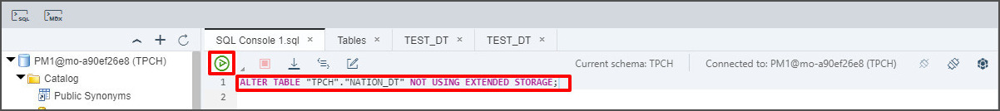
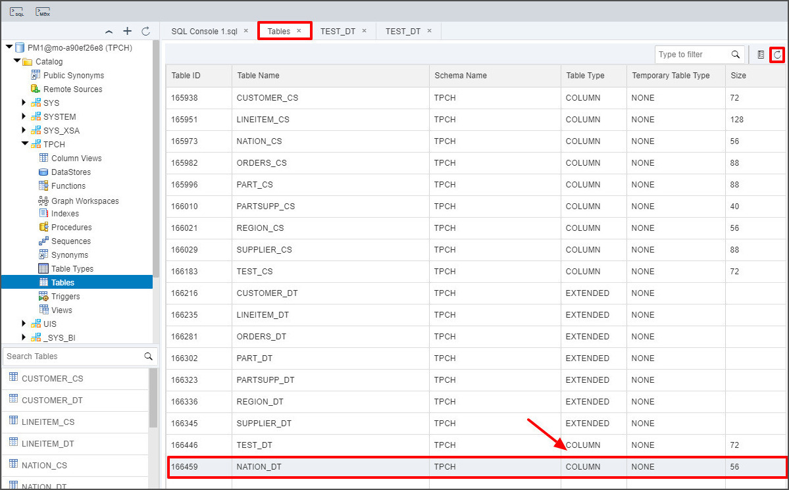
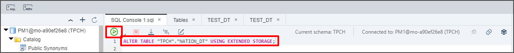
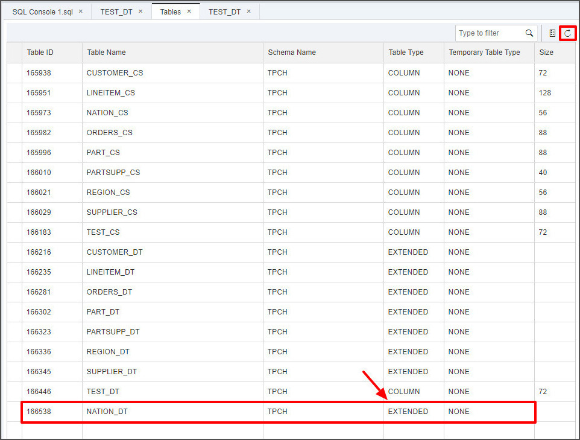
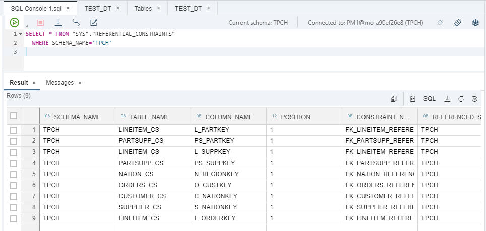

## Prerequisites  
 - **Proficiency:** Beginner
 - **Tutorials:** [Create Tables and Import Data](https://developers.sap.com/tutorials/hana-webide-dt-getting-started-3.html)

## Next Steps
 - **Tutorials:** [Selectively Move Data Between In-Memory and Extended Tables](https://developers.sap.com/tutorials/hana-webide-dt-getting-started-5.html)

## Details
### You will learn  
* How to convert an in-memory column store table to an extended table and vice versa.

### Time to Complete
**15 Min**

---

[ACCORDION-BEGIN [Step 1: ](Convert to an in-memory table using SQLScript)]
Right-click on your database, and select **Open SQL Console**. You can also use the shortcut **Ctrl + Alt + C** or the SQL button under the navigation menu.


Copy and paste the script below into the console, and press then green play button to execute the script.

```SQL
ALTER TABLE "TPCH"."NATION_DT" NOT USING EXTENDED STORAGE
```



Go back to the **Tables** tab and click the **refresh** icon. You should see that the `NATION_DT` table is no longer an `EXTENDED` table, and is now an in-memory table.



[DONE]

[ACCORDION-END]

[ACCORDION-BEGIN [Step 2: ](Convert to an extended table using SQLScript)]
Open a new SQL console and paste the script below into the console. Then press the play button to execute and run the script.

```SQL
ALTER TABLE "TPCH"."NATION_DT" USING EXTENDED STORAGE
```
> Notice that the difference between the "`ALTER TABLE`" statement here and the previous section is the removal of "`NOT`".



Go back and **refresh** the **Tables** tab. You should see that the `NATION_DT` table is no longer an in-memory database, as it has the `EXTENDED` attribute.



[DONE]

[ACCORDION-END]

[ACCORDION-BEGIN [Step 3: ](Foreign key considerations)]
In SAP HANA 2.0, dynamic tiering tables do not support foreign keys between two extended tables or between an extended table and an in-memory table. This means that if an in-memory table is part of a foreign key relationship, then it cannot be converted to an extended table in dynamic tiering until the foreign key relationship has been dropped.

Since dynamic tiering tables do not support foreign keys yet, the change from an extended table to in-memory is always possible (because extended tables would not have any foreign key attached to them), but in-memory to extended storage might be restricted due to foreign key constraints.

You can verify which tables in the `TPCH` schema are part of a foreign key constraint by executing the following statement in a SQL Console:

```SQL
SELECT * FROM "SYS"."REFERENTIAL_CONSTRAINTS"
  WHERE SCHEMA_NAME='TPCH'
```



You can look at the columns: `TABLE_NAME`, `REFERENCED_TABLE_NAME` and `CONSTRAINT_NAME` to identify which tables have the foreign key constraint on them and what the constraint is. Examples of tables that hold a foreign key constraint in this schema are `ORDERS_CS`, `CUSTOMER_CS`, `SUPPLIER_CS`, `LINEITEM_CS`, and `NATION_CS`. Therefore, these tables cannot be converted to extended tables, unless the foreign key is dropped.

[VALIDATE_1]

[ACCORDION-END]

