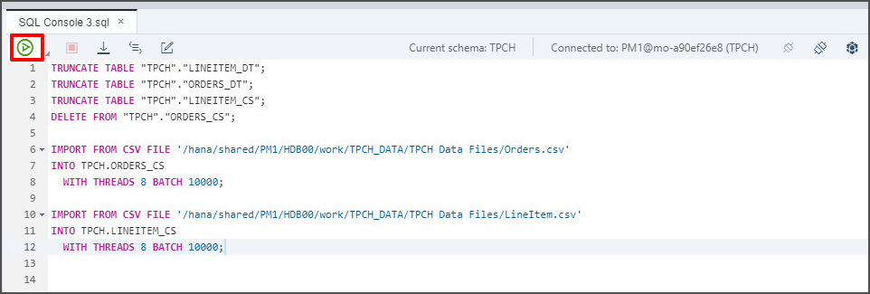
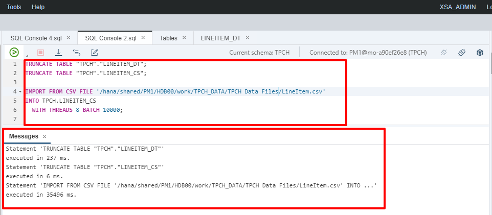
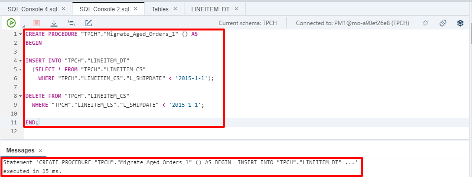
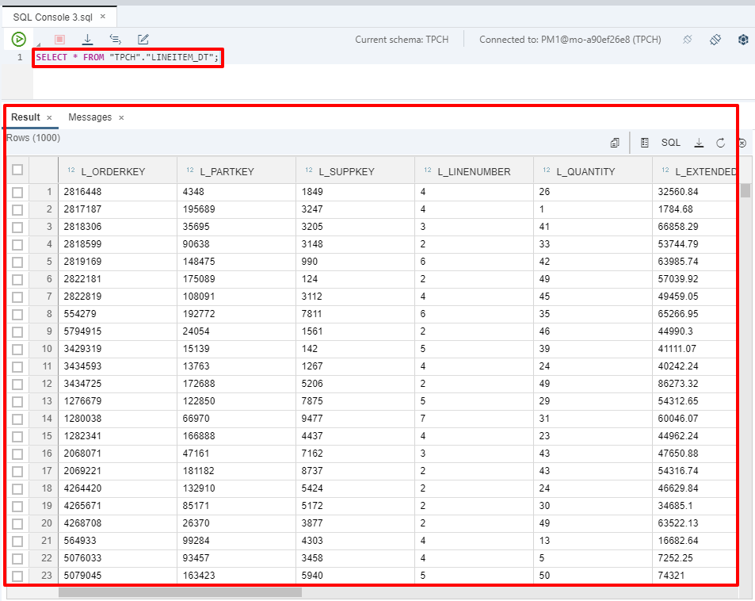
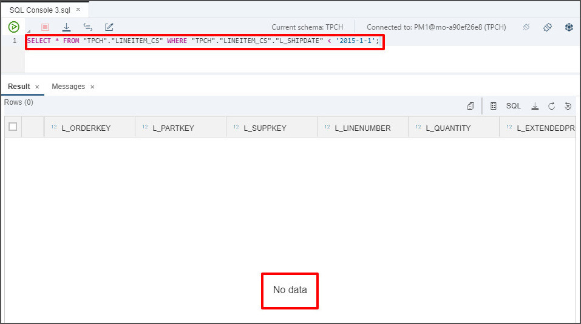
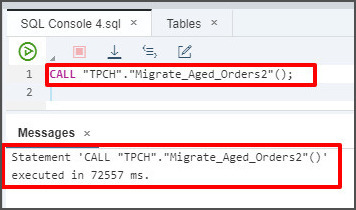
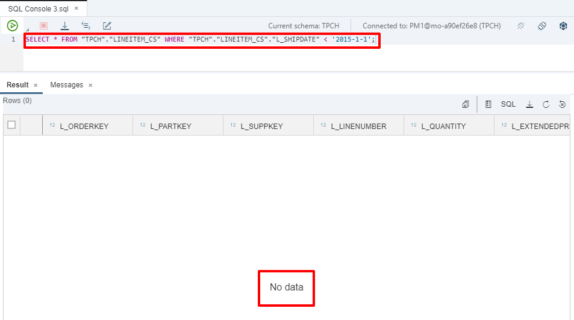

## Prerequisites  
 - **Proficiency:** Beginner
 - **Tutorials:** [Selectively Move Data Between In-Memory and Extended Tables](https://developers.sap.com/tutorials/hana-webide-dt-getting-started-4.html)

## Next Steps
 - **Tutorials:** [View Data Across Both In-Memory and dynamic tiering Tables Using a SQL View](https://developers.sap.com/tutorials/hana-webide-dt-getting-started-6.html)

## Details
### You will learn  
 - How to create a stored procedure to migrate records in related tables as a single transaction.
 - How to call a stored procedure.

### Time to Complete
**20 Min**

---

[ACCORDION-BEGIN [Step 1: ](Prepare data)]
In order to ensure that the migration script runs correctly, we will start by refreshing the data in the tables that will be used in this tutorial section. Run the script below to restore data. Replace "`<SID>`" with your system's System Id.

``` SQL
TRUNCATE TABLE "TPCH"."LINEITEM_DT";
TRUNCATE TABLE "TPCH"."ORDERS_DT";
TRUNCATE TABLE "TPCH"."LINEITEM_CS";
DELETE FROM "TPCH"."ORDERS_CS";

IMPORT FROM CSV FILE '/hana/shared/<SID>/HDB00/work/TPCH_DATA/Orders.csv'
INTO TPCH.ORDERS_CS
  WITH THREADS 8 BATCH 10000;

IMPORT FROM CSV FILE '/hana/shared/<SID>/HDB00/work/TPCH_DATA/LineItem.csv'
INTO TPCH.LINEITEM_CS
  WITH THREADS 8 BATCH 10000;
```

> `ORDERS_CS` cannot be truncated unlike the other tables due to foreign key constraints. Therefore a "`DELETE`" statement is used instead.



Verify everything executed correctly.


[DONE]

[ACCORDION-END]

[ACCORDION-BEGIN [Step 2: ](Migrate data between tables)]
Observe the script below. This script copies records older than 2015-1-1 from the in-memory `LINEITEM_CS` table to the extended table `LINEITEM_DT` in dynamic tiering. Next, it will delete the moved records from the `LINEITEM_CS` table to free up storage space in-memory now that the data has been copied to dynamic tiering. The "WHERE" statement in the script is used to selectively choose data. In this script specifically, the "WHERE" statement is used to select data from the `LINEITEM_CS` table whose `L_SHIPDATE` is before January 1st, 2015.

```SQL
INSERT INTO "TPCH"."LINEITEM_DT"
  (SELECT * FROM "TPCH"."LINEITEM_CS"
    WHERE "TPCH"."LINEITEM_CS"."L_SHIPDATE" < '2015-1-1');

DELETE FROM "TPCH"."LINEITEM_CS"
  WHERE "TPCH"."LINEITEM_CS"."L_SHIPDATE" < '2015-1-1';
```

Copy and paste the script above into the SQL console. Press the Execute button to execute the migration.

> **IMPORTANT**: Though this works as intended there can be unintended consequences. Since the "INSERT" and "DELETE" operations occur as **separate transactions**, if data is manipulated **between** the transactions, we may see unexpected results.
Take this scenario for example: we run the script which copies records prior to January 1st, 2015 from the CS table into the DT table. Then, someone adds a record before January 1st, 2015 into the CS table, after which the "DELETE" operation deletes all records from the CS table prior to January 1st, 2015.
In this case, that added record is lost as it gets deleted before being moved into the DT table.   

[DONE]

[ACCORDION-END]

[ACCORDION-BEGIN [Step 3: ](Auto-Commit and isolation levels)]
The hazard of executing an "INSERT" and "DELETE" operation as separate transactions is outlined in the previous step. To combat this issue, we must take a look at commits and isolation.

By default, SQL Console connections from HANA Web IDE to your HANA system are created with the Auto Commit option turned "On". The Auto Commit option automatically issues a commit after each statement that is executed against the server. We will use a stored procedure to execute two statements as a single atomic transaction.

Similarly, database isolation levels determine how the database server handles concurrency when multiple users may be reading and writing to the database at the same time. The default isolation level is "READ COMMITTED" which ensures that any given statement only sees committed records. The "READ COMMITTED" isolation level does not ensure consistency between statements even within a single transaction.

Since the process of migrating data between in-memory and extended tables requires both an insert and a delete statement, we must create (and then call) a stored procedure using Web IDE to ensure consistency across multiple statements within a single transaction.

[DONE]

[ACCORDION-END]

[ACCORDION-BEGIN [Step 4: ](Create a simple migration stored procedure)]
Now we will properly accomplish the previous task of migrating aged records from an in-memory table to a DT table. Since we already altered the LINEITEM tables, we must reset them for this task by using the script below (fill in your SID). Copy, paste, and execute the script, making sure it executes successfully.

```SQL
TRUNCATE TABLE "TPCH"."LINEITEM_DT";
TRUNCATE TABLE "TPCH"."LINEITEM_CS";

IMPORT FROM CSV FILE '/hana/shared/<SID>/HDB00/work/TPCH_DATA/LineItem.csv'
INTO TPCH.LINEITEM_CS
  WITH THREADS 8 BATCH 10000;
```



Next, we will create the **stored procedure**. Copy and paste the script below into an SQL console. The script creates a stored procedure, which, when called, executes the entire procedure as one transaction - avoiding the commit issues explained previously.

``` SQL
CREATE PROCEDURE "TPCH"."Migrate_Aged_Orders_1" () AS
BEGIN

INSERT INTO "TPCH"."LINEITEM_DT"
  (SELECT * FROM "TPCH"."LINEITEM_CS"
    WHERE "TPCH"."LINEITEM_CS"."L_SHIPDATE" < '2015-1-1');

DELETE FROM "TPCH"."LINEITEM_CS"
  WHERE "TPCH"."LINEITEM_CS"."L_SHIPDATE" < '2015-1-1';

END;
```



[DONE]

[ACCORDION-END]

[ACCORDION-BEGIN [Step 5: ](Call the migration stored procedure)]
Now that the store procedure is created, you can execute the stored procedure by calling it using the script below. Run the script below in a SQL console and make sure it executed correctly.

``` SQL
CALL "TPCH"."Migrate_Aged_Orders_1"();
```


Verify that the data has been inserted into the **`LINEITEM_DT`** table either by executing the query below or by right clicking on the table in the catalogue and choosing **Open Data**.

``` SQL
 SELECT * FROM "TPCH"."LINEITEM_DT";
```


Verify that the data has been deleted from the **`LINEITEM_CS`** table by executing the query below and confirming that no records are returned.

``` SQL
SELECT * FROM "TPCH"."LINEITEM_CS" WHERE "TPCH"."LINEITEM_CS"."L_SHIPDATE" < '2015-1-1';
```



[DONE]

[ACCORDION-END]

[ACCORDION-BEGIN [Step 6: ](Create a more complex migration stored procedure)]
Now that we've created a simple procedure to accomplish the task of migrating aged data past a specified date, we will build on this by creating a more complex procedure.

First, we must refresh the "ORDERS" and "LINEITEM" in-memory and DT tables using the script below. Replace "<SID>" with your system's System Id, run it and ensure it executes successfully.

```SQL
TRUNCATE TABLE "TPCH"."LINEITEM_DT";
TRUNCATE TABLE "TPCH"."ORDERS_DT";
TRUNCATE TABLE "TPCH"."LINEITEM_CS";
DELETE FROM "TPCH"."ORDERS_CS";

IMPORT FROM CSV FILE '/hana/shared/<SID>/HDB00/work/TPCH_DATA/Orders.csv'
INTO TPCH.ORDERS_CS
  WITH THREADS 8 BATCH 10000;

IMPORT FROM CSV FILE '/hana/shared/<SID>/HDB00/work/TPCH_DATA/LineItem.csv'
INTO TPCH.LINEITEM_CS
  WITH THREADS 8 BATCH 10000;
```


> `ORDERS_CS` cannot be truncated unlike the other tables due to foreign key constraints. Therefore a "DELETE" statement is used instead.

Next, we will create the `Migrate_Aged_Orders2` stored procedure. In this procedure, we will use a **variable** to migrate data older than a year from the in-memory tables over to the dynamic tiering tables. The `Migrate_Aged_Orders2()` stored procedure migrates historical data from **both** the in-memory `ORDERS_CS` and `LINEITEM_CS` tables to the dynamic tiering tables `ORDERS_DT` and `LINEITEM_DT` respectively. Copy and paste the script below into a SQL console. Then press the green execute button to create the procedure and verify it executed correctly.

``` SQL
CREATE PROCEDURE "TPCH"."Migrate_Aged_Orders2" () AS
BEGIN

DECLARE varAgedDate DATE := ADD_YEARS(CURRENT_DATE, -1);

INSERT INTO "TPCH"."ORDERS_DT"
    ( SELECT * FROM "TPCH"."ORDERS_CS"
    WHERE "TPCH"."ORDERS_CS"."O_ORDERDATE" < :varAgedDate );

INSERT INTO "TPCH"."LINEITEM_DT"
    SELECT "LINEITEM_CS".* FROM "TPCH"."LINEITEM_CS", "TPCH"."ORDERS_CS"
    WHERE "TPCH"."ORDERS_CS"."O_ORDERDATE" < :varAgedDate
    AND "LINEITEM_CS"."L_ORDERKEY" = "TPCH"."ORDERS_CS"."O_ORDERKEY";

DELETE FROM "TPCH"."LINEITEM_CS"
    WHERE "TPCH"."LINEITEM_CS"."L_ORDERKEY" IN
      ( SELECT "TPCH"."LINEITEM_CS"."L_ORDERKEY" FROM "TPCH"."LINEITEM_CS", "TPCH"."ORDERS_CS"
        WHERE "TPCH"."ORDERS_CS"."O_ORDERDATE" < :varAgedDate
        AND "LINEITEM_CS"."L_ORDERKEY" = "TPCH"."ORDERS_CS"."O_ORDERKEY" );

DELETE FROM "TPCH"."ORDERS_CS"
    WHERE "TPCH"."ORDERS_CS"."O_ORDERDATE" < :varAgedDate;

END;
```

> The declaration of `varAgedDate` at the beginning dynamically gives a year prior to today's date. As well, it ensures that each data modification statement is referencing the same date value and does not change through out the execution of the stored procedure. Otherwise, an execution during midnight might produce unexpected results.
The `INSERT` and `DELETE` statements are executed in a **specific order** to comply with the declared foreign key relationship between the in-memory `ORDERS_CS` and `LINEITEM_CS` tables.


[DONE]

[ACCORDION-END]

[ACCORDION-BEGIN [Step 7: ](Call the more complex migration stored procedure)]
Now that the store procedure is created. You can execute the stored procedure by calling it. Run the script below in a SQL console and make sure it executed correctly.

```SQL
CALL "TPCH"."Migrate_Aged_Orders2"();
```

As mentioned previously, the stored procedure is a single statement, resulting in the entire store procedure executing as a single atomic transaction even-though the procedure itself contains multiple statements.



Verify that the data has been inserted into the **`LINEITEM_DT`** table either by executing the query below or by right clicking on the table in the catalogue and choosing **Open Data**.

``` SQL
 SELECT * FROM "TPCH"."LINEITEM_DT";
```


Verify that the data has been deleted from the **`LINEITEM_CS`** table by executing the query below and confirming that no records are returned.

``` SQL
SELECT * FROM "TPCH"."LINEITEM_CS" WHERE "TPCH"."LINEITEM_CS"."L_SHIPDATE" < '2015-1-1';
```



You can run the same tests on both the `ORDERS_CS` and `ORDERS_DT` tables.

[VALIDATE_1]

[ACCORDION-END]


