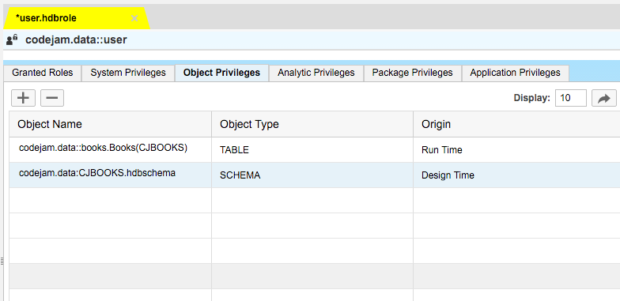

## Prerequisites  
- [Access your first data in a SAP HANA XSC Application](http://go.sap.com/developer/tutorials/hana-data-access-authorizations.html)

## Next Steps
- [Consume XSODATA in your SAP HANA XSC Application](http://go.sap.com/developer/tutorials/hana-consume-xsodata.html)
 
## Details

### You will learn  
1. How to create a simple xsodata service.

### Time to Complete
Beginners might take **10 minutes** to execute this tutorial.


### Open the Web-based Development Workbench

#### Using the SAP HANA Developer Edition or SAP HANA Cloud Platform
The workbench allows you to develop on HANA without the need to set up a local development environment.

Login to the [HANA Cloud Cockpit](https://account.hanatrial.ondemand.com/cockpit) with your free developer edition account.


Choose Databases and Schemas, and choose then the instance that you created in the previous tutorials. From here you can access the Workbench.


You are now in the Editor and can immediately start developing in HANA.

#### Using HANA on Amazon AWS or Microsoft Azure

Access the web page of your HANA server using the IP address of your server.  Enter the address ```http://XXX.XXX.XXX.XXX``` to the address bar of your browser. (Replace ```XXX.XXX.XXX.XXX``` with the IP address of your server.)

On the web page, there is a link in the middle column for **Web-Based Development Workbench**.  Click this link to start the workbench.

### Create a sub package for your data

`Hello World` is great and all but let's put some real meat into your first application. To get started you will need to create a new sub package called `data` to hold our new data objects.


This is where you will add a few objects to generate a table and add some data into it.

The first item you will need is a `.hdbschema` object which will define a Schema for our application objects, you can also use an existing Schema as well.


```
schema_name="CJBOOKS";
```

### Create a table

The next item will be a `.hdbdd` object, this will hold the table definition. To start create a new file definition called `books.hdbdd`

```
namespace codejam.data;

@Schema: 'CJBOOKS'
context books {
 	type SString : String(40);
 	type LString : String(800);
    type tt_error {
         HTTP_STATUS_CODE: Integer;
         ERROR_MESSAGE: String(100);
         DETAIL: String(200);
    };
    type tt_book{   
        NAME: LString; 
        GENRE: SString;
    };
 	
 	@Catalog.tableType : #COLUMN
 	Entity Books {
        key BOOK_ID: SString; 
        NAME: LString;
        GENRE: SString;
    };	

}; 
```

### Import data to your table

Now that you have a table it is time to add data to it. To accomplish that you will create two new files, the first is a `.csv` file for your data and a `.hdbti` file for the automatic import of the of the CSV data.

The content of your `books.csv` file is the following.

```
1,The History of SAP HANA, Technology
2,Path to Recognition,History
3,PHP Developers Guide to SAP,Technology
4,Wonderful world of Tech,Travel
```

Once the CSV file is saved you will need to create the `books.hdbti` file to define the auto import. Once this file is saved and activated the import will automatically happen, provided of course that the CSV data is correct.

```
import	= 	[ 
    			{ 
					cdstable  =	"codejam.data::books.Books";
					file = "codejam.data:books.csv"; 	     
					header = false;		
    			} 
     		];
```

### Create a sub package for your services

Now that you have a table with data in it, you need to be able to access the data and for that you will need to create and `.xsodata` file which defines an OData service. To start create a new sub package for your services.


### Create a xsodata service

Next create a new file `library.xsodata` and add the following code to it.

```
service namespace "codejam.services" {
	"codejam.data::books.Books" as "library"; 
}
```

Now before you can access your newly create service you will need to give your user access to it. This can be accomplished in one of two ways, the first is to just give your user direct access to the new objects and the second which is a bit more scalable is to create a role that allows your user access.

### Create a role

Under your data sub package create a new file called `user.hdbrole`, once you create it the role wizard will launch. 



Here you will add your schema and table. From here you will then load the `security` console and add the role to your user.


### Access your xsodata service

At this point you should be able to launch your XSODATA file in your browser or right click and choose the `OData Explorer` to view and see the data from your table.


Congratulations: You have just enabled a simple REST interface for your application.


### Optional: Related Information
[SAP HANA Development Information - Official Documentation](http://help.sap.com/hana_platform#section6)


*This tutorial is part of the SAP HANA and SAP HANA Cloud Platform tutorials set.*
