## Prerequisites  
- **Proficiency:** Beginner
- **Tutorials:** [Testing API Business Hub APIs with Curl](https://www.sap.com/developer/tutorials/hcp-abh-test-locally.html)


## Next Steps
 - This is the end of this tutorial series. Select a tutorial from the [Tutorial Navigator](http://www.sap.com/developer/tutorial-navigator.html) or the [Tutorial Catalog](http://www.sap.com/developer/tutorials.html)

## Details
### You will learn  
In this tutorial, you will build a basic UI5 application that uses data from the SAP Success Factors API, that you test in the SAP Business Hub, to populate a set of tiles. Each User will have a tile that displays relevant information about that person.

> It is important to note that in UI5, it is recommended to use an `ODataModel` with an `OData` service, which is what the Success Factors APIs provided in the API Business Hub are, as UI5 will optimize the data parsing for you. This tutorial uses the pre-generated AJAX REST call available in the code snippets section of the API Business Hub. Using an `ODataModel` is the best practice for UI5 applications but it is not covered in this tutorial. You can find more information about `ODataModels` in the [UI5 Demo Kit](https://sapui5.hana.ondemand.com/#docs/guide/6c47b2b39db9404582994070ec3d57a2.html).

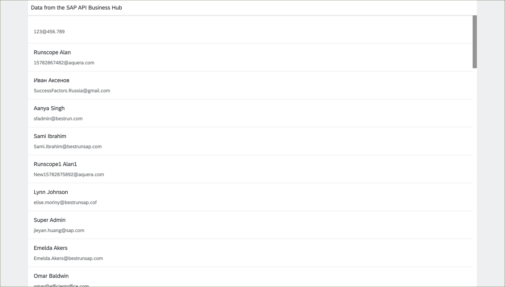

### Time to Complete
**20 Min**

---

[ACCORDION-BEGIN [Step 1: ](Create a basic UI5 application)]
In your Web IDE, create a new application from template by selecting **File** > **New** > **Project from Template**.

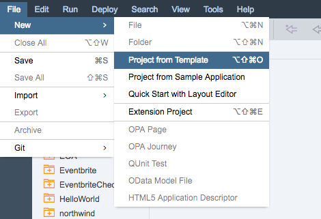

Select the **SAPUI5 Application** template. Click **Next**.

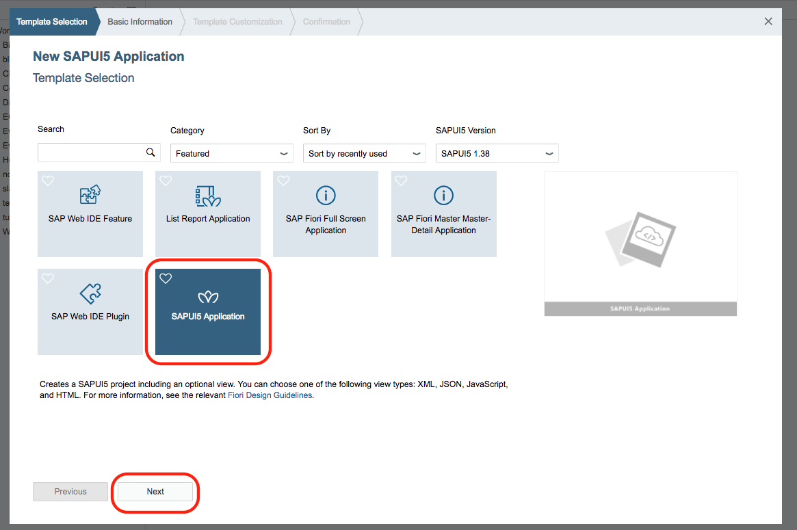

**Name the application.** You should use a descriptive name.

| Project Name | `APIHubTutorial` |

You can leave the namespace blank to use the default one. Click **Next**.

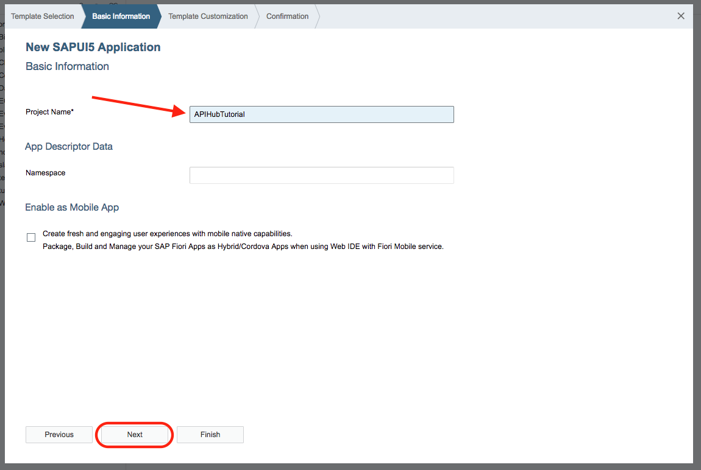

If you want, go ahead and rename the initial view.

| View Name | Main |

Leave the View Type as XML. Click **Finish**.


Open the initial controller by selecting `APIHubTutorial` > `webapp` > `controller` > `Main.controller.js` and double clicking the file name.

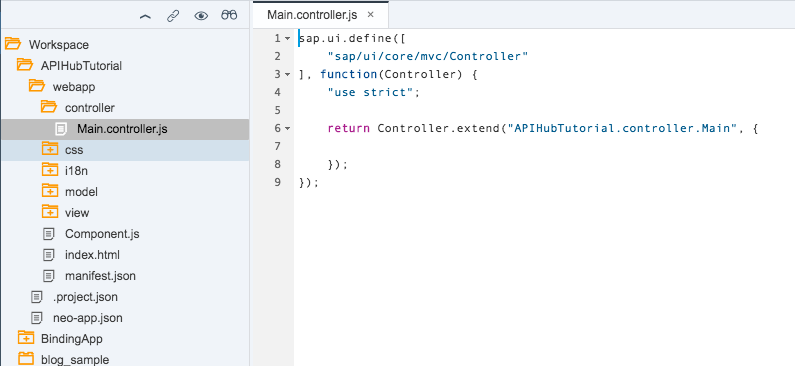

Add an `onInit` function to the controller and **SAVE** your changes.

```javascript
onInit: function() {

}
```

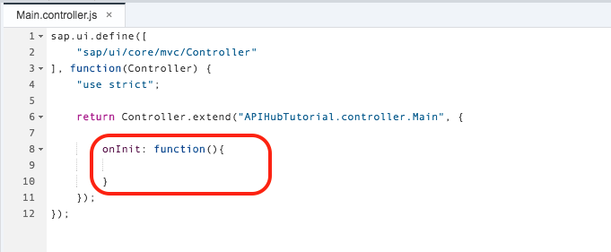

[DONE]
[ACCORDION-END]

[ACCORDION-BEGIN [Step 2: ](Get Javascript pre-generated code)]
In the [API Business Hub](https://api.sap.com), click **APIs** and on the Discover page, go to **All**. Search for the **Success Factors** from the Discover APIs page. Find the **SAP Success Factors** API package and select it.

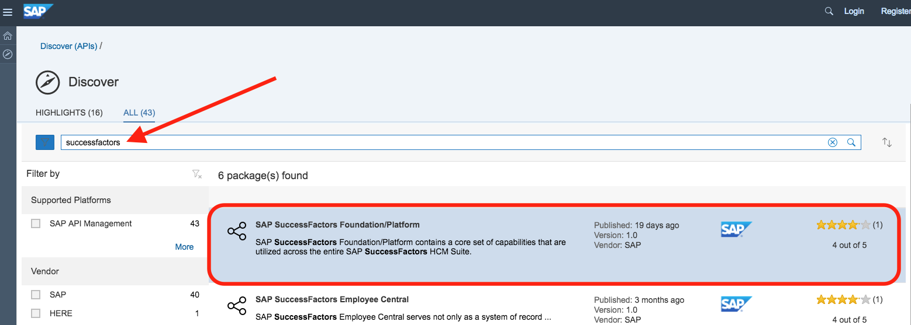

Once on the API package documentation, select **Artifacts** to see all the APIs available. Find the **User Information** API in the listing. Select the API to open the documentation.

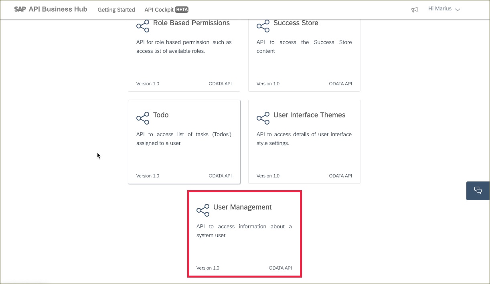

On the documentation, select **Resource** to find the methods. Find the `GET /User` method and click the **Generate Code** link.

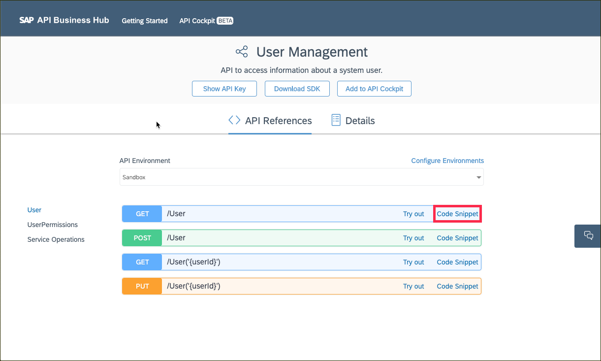

Pick the **JavaScript** tab and then click the **Copy to Clipboard** button.

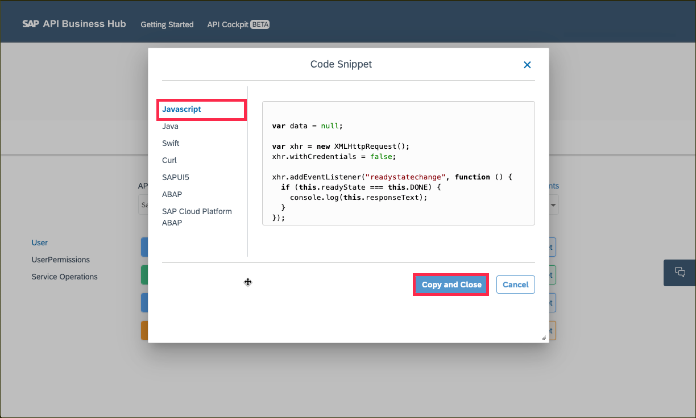

[DONE]
[ACCORDION-END]

[ACCORDION-BEGIN [Step 3: ](Use the API in your application)]
Back in your Web IDE, in the controller file, **add the copied code from the API Business Hub to your `onInit` function**.

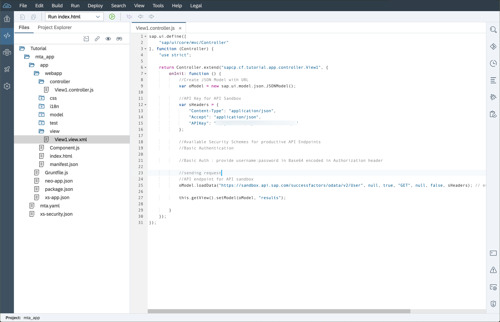

> Make sure to update the `<API_KEY>` to your Application Key from the API Business Hub. It is found at the top of the API Documentation page by clicking the Key icon.

**Comment out the `xhr.withCredentials` line**. You can a single line comment by adding a double slash `//` to the beginning of a line. To add a comment block (multiple lines), use `/*  */` around the code to remove.

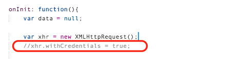

**SAVE** your changes.

[DONE]
[ACCORDION-END]

[ACCORDION-BEGIN [Step 4: ](Run your application)]
**Run** your application by right clicking on your project name and selecting **Run** > **Run as** > **Web Application**.

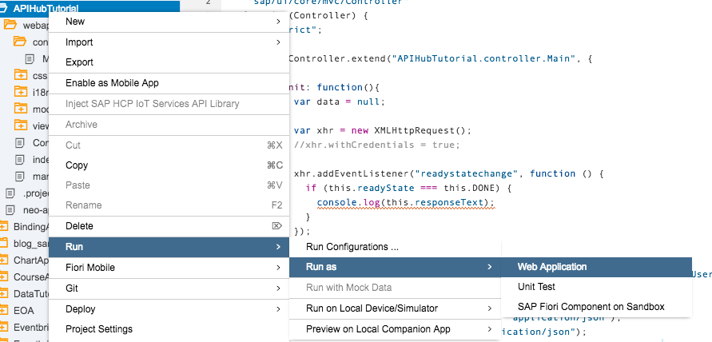

You should see a blank application with a title of **Title**. The pre-generated put the results of the API in the developer console. To find the results, take a look at the console. To get there, in your browser menu, go to **View** > **Developer Tools** > **JavaScript Console**.

>The path to get to the developer tools might be slightly different on your computer based on your browser and operating system.


If you API call was successful, you should see the JSON in your JavaScript console.


[DONE]
[ACCORDION-END]

[ACCORDION-BEGIN [Step 5: ](Add query parameters in the controller)]
Back in your controller, **add in your query parameters to the URL** so that the results only return the top 5 results and just the User's first and last name and job title. Remember to URL encode your parameters.

```javascript
+
"?%24top=5&%24select=firstName%2ClastName%2CjobTitle"
```

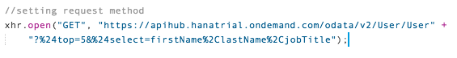

**SAVE** your changes and **RUN** your application. Looking in the console, you should only see 5 results with a much smaller data set for each result.

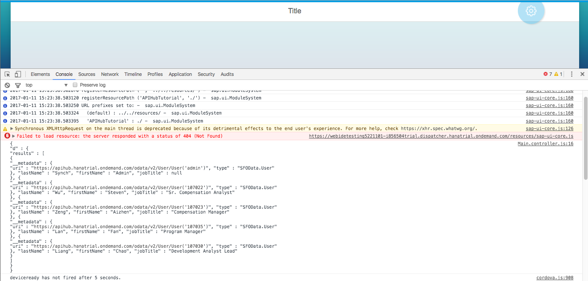

[DONE]
[ACCORDION-END]

[ACCORDION-BEGIN [Step 6: ](Display your results in the view)]
Open up your main view. It can be found in the `view` folder under the `webapp` folder.

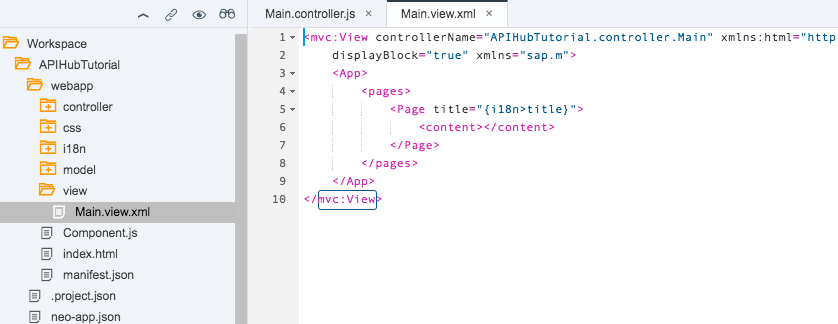

The results from the API call being displayed in the console is not very helpful to the end user. You need to create a holder in the main view file to display the results. Add a `TileContainer` with a `StandardTile` in between the `<content>` tags.

```xml
<TileContainer
  id="userTiles">
  <StandardTile
    title="First Last"
    info="Job Title"
    icon="sap-icon://person-placeholder" />
</TileContainer>
```


**SAVE** your changes and **RUN** your application. A single tile should appear on the screen.

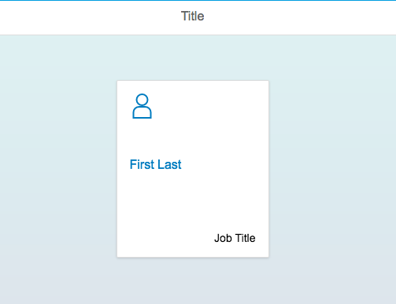

Back in the view, update your title to use **results** model data instead of hard coded values. **Set the title to be the first name and last name of the user and the info to be the user's job title.** Update the `<StandardTile>` definition. Leave the placeholder as the icon.

```xml
<StandardTile
  title="{results>firstName} {results>lastName}"
  info="{results>jobTitle}"
  icon="sap-icon://person-placeholder" />
```

To have a tile appear for each user in the **results** model data, you need to define the aggregation for the `<TileContainer>`. Set the aggregation property _tiles_ to be the `"{results>/data}"`.

```xml
<TileContainer
  id="userTiles"
  tiles="{results>/data}">
```

The updated code should look like this.

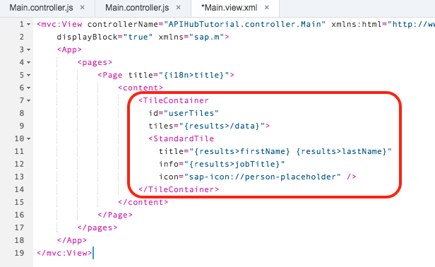

**SAVE** your changes.

[DONE]
[ACCORDION-END]

[ACCORDION-BEGIN [Step 7: ](Set your data model)]
Back in your main controller file, you will need to define the model used in the view. You will need to add the `JSONModel` library to your controller. In the **define** at the top of the controller, add the `JSONModel` library by adding `"sap/ui/model/json/JSONModel"`. Also, define the `JSONModel` in the controller function.

```javascript
sap.ui.define([
	"sap/ui/core/mvc/Controller",
	"sap/ui/model/json/JSONModel"
], function(Controller, JSONModel)
```

In `onInit` function, you will need to create a new `JSONModel` to house your **results** model data. After the definition of the **data** variable, add a new variable called `userResults`. Give it one property called **data**.

```javascript
var userResults = new JSONModel({"data": {}});
```

Additionally, you will need to save the current version of **this** so that you can access the view associated with controller in your API call response. To say **this** current reference, define a new variable called **self** and set it to **this**.

```javascript
var self = this;
```

To bind the `userResults` `JSONModel` to the view to use it as the **results** model in the view, you need to set the model for the view and name it **results**.

```javascript
self.getView().setModel(userResults, "results");
```

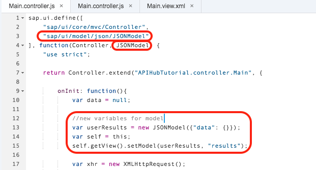

Once data is returned from the API call, you can bind it to the **results** model. In the `xhr.addEventListener` function, you can process the data and set it to the model. **The response from the API is coming back as text, so you will need to parse it to JSON.** To do that, use the `JSON.parse()` method. As you saw in the console previous, the actual data you would like to display is inside the _results_ array in the response. To get to that array, you will need to index out the _d_ property first.

```javascript
var jsonResults = JSON.parse(this.response).d.results;
```

Finally, set the parsed response to be the **data** property in the **results** model by using the `setProperty` method. This is where the preservation of **this** is important as it has changed since you entered the listener function. Using **self** allows you access to the original controller and its view.

```javascript
self.getView().getModel("results").setProperty("/data", jsonResults);
```

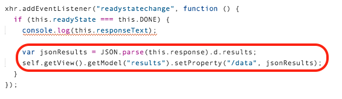

**SAVE** your changes.

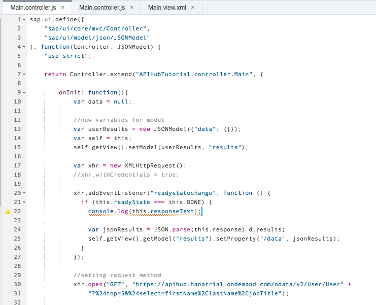

[DONE]
[ACCORDION-END]

[ACCORDION-BEGIN [Step 8: ](Run your application)]
**RUN** your application. You should now see 5 tiles with the name of the first 5 users and their job titles. As you change the query parameters in the URL, you would be able to see more users or adjust the details displayed on the title. For example, if a user profile picture was an available field, you could additionally select that field and replace the hard-coded icon with that user's picture. You are just getting started with the SAP API Business Hub. Stayed tuned for more of it's cool features!


[DONE]
[ACCORDION-END]


## Next Steps
- This is the end of this tutorial series. Select a tutorial from the [Tutorial Navigator](http://www.sap.com/developer/tutorial-navigator.html) or the [Tutorial Catalog](http://www.sap.com/developer/tutorials.html)
