## Details
### You will learn
- How to build UI5 app using data from SAP SuccessFactors API

In this tutorial, you will build a basic UI5 application that uses data from the SAP SuccessFactors API, that you test in the SAP Business Hub, to populate a list. Each User will have a list item that displays relevant information about that person.

> It is important to note that in UI5, it is recommended to use an `ODataModel` with an `OData` service, which is what the SuccessFactors APIs provided in the API Business Hub are, as UI5 will optimize the data parsing for you. This tutorial uses the pre-generated SAPUI5 JSON model from the code snippets section of the API Business Hub. Using an `ODataModel` is the best practice for UI5 applications, but it is not covered in this tutorial. You can find more information about `ODataModels` in the [UI5 Demo Kit](https://sapui5.hana.ondemand.com/#docs/guide/6c47b2b39db9404582994070ec3d57a2.html).


---

[ACCORDION-BEGIN [Step : ](Create destinations to the SAP API Business Hub)]


Create the following two destinations in the SAP Cloud Platform cockpit. You can create these destinations manually or download and import them from these files:
[sandbox_destination.txt](https://raw.githubusercontent.com/SAPDocuments/Tutorials/master/tutorials/hcp-abh-api-ui5-app/sandbox_destination.txt) and [catalog_destination.txt](https://raw.githubusercontent.com/SAPDocuments/Tutorials/master/tutorials/hcp-abh-api-ui5-app/catalog_destination.txt)

1. !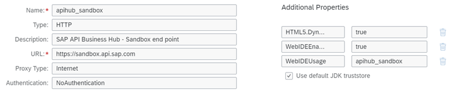
2. !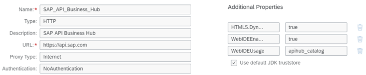


> Check out [this tutorial](cp-cf-create-destination) if you are not sure how to create destinations.


[DONE]
[ACCORDION-END]

[ACCORDION-BEGIN [Step : ](Open the Fiori dev space)]


**Start** a dev space of kind *SAP Fiori* and **open** it by clicking its name.

!

> Have a look at [this tutorial](appstudio-devspace-fiori-create) if you are unsure how to get here or how to create a dev space.


[DONE]
[ACCORDION-END]
[ACCORDION-BEGIN [Step : ](Connect to a Cloud Foundry endpoint)]

Make sure you are connected to a Cloud Foundry endpoint to which you will deploy the SAPUI5 application later.

1. Click on the bottom-left corner of the screen to start the connection flow.

    !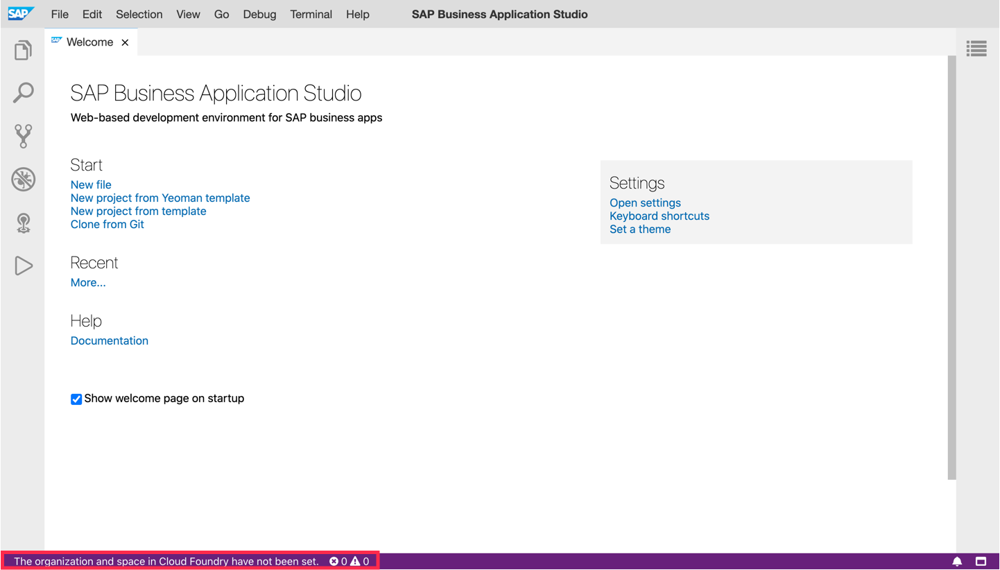

2. Enter the Cloud Foundry endpoint you want to connect with. If your environment runs in the EU10-region, this is `https://api.cf.eu10.hana.ondemand.com`. Enter your email and your password to proceed.

    !

3. Next, you need to select the Cloud Foundry Organization and space you want to use. You will see that you are connected to the endpoint once these prompts have been answered.

    !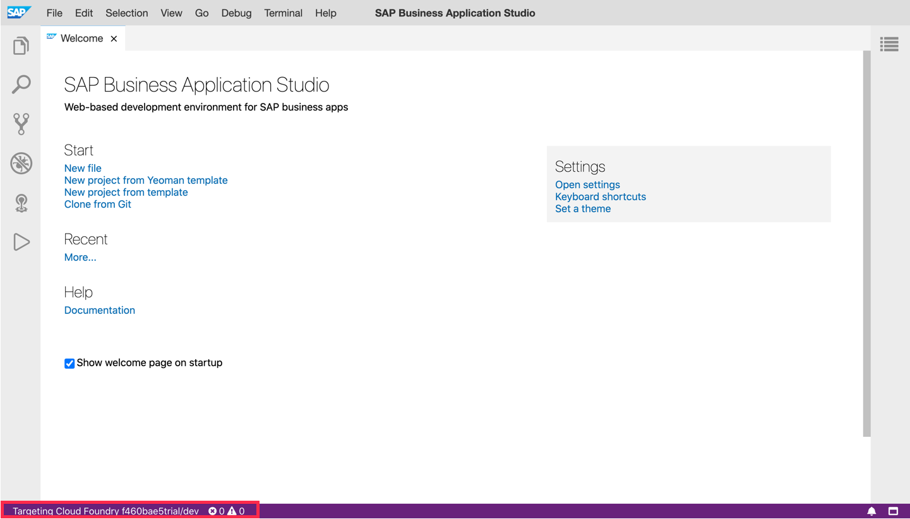


[DONE]
[ACCORDION-END]

[ACCORDION-BEGIN [Step : ](Create a new project)]
1. Click on the link **New project From template** on the *Welcome* screen.

    !

2. Select **Fiori Project** as the template category you want to use and click **Next**.

    !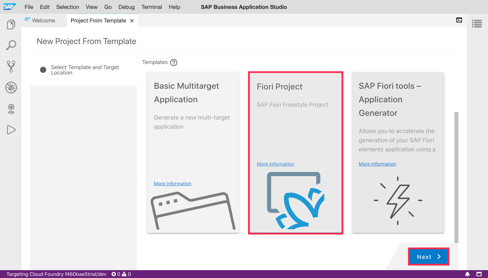

3. Specify the target environment ( **Cloud Foundry** ) and the template ( **SAPUI5 Application** ) and go to the **Next** screen.

    !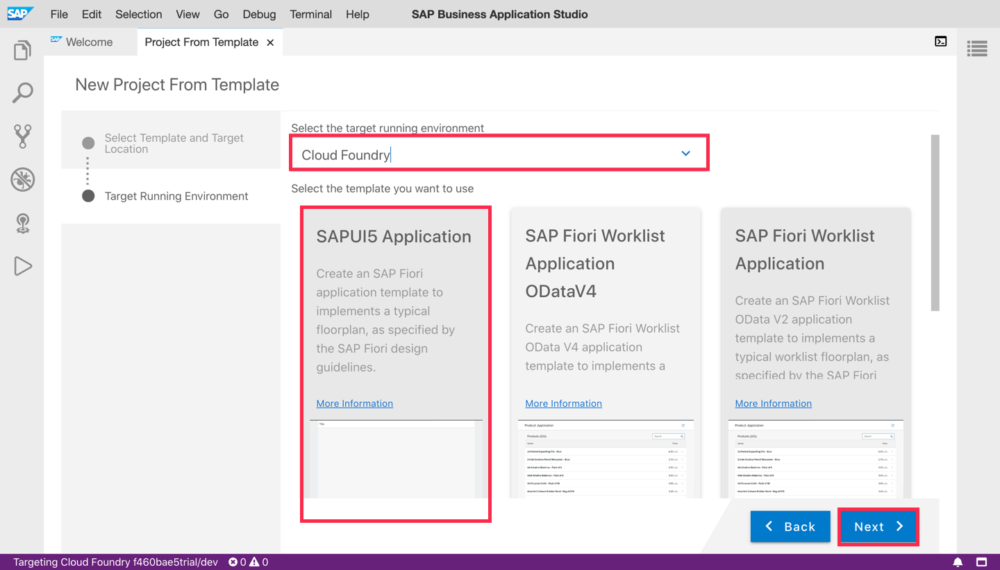

4. Name the project **`tutorial`** and proceed by clicking **Next**.

    !

4. Choose **Standalone Approuter** for the runtime and click **Next**.

    !

4.  Name of the module  **`webapp`** and the namespace **`sap.cp`** and turn authentication off. Go to the **Next** screen.

    !

4. Keep the default view name and add a data service on this screen. Click **Next** to go forward.

    !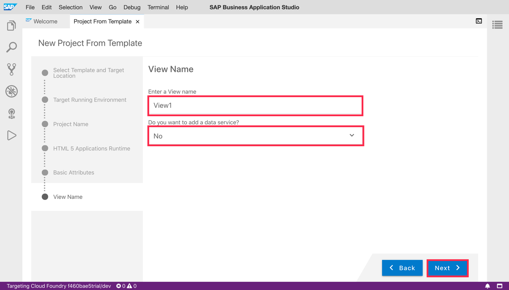

4.  Select the **SAP API Business Hub**  as the source system and select as the API. **Enter your SAP credentials** to access the metadata of the selected API service. Click **Next** to create the new project.

    !


4. Once the project has been created, the Business Application Studio will prompt you to open the project in a new workspace. Click **Open in New Workspace**.


    !

> **About the "User Management" API**

> In the [API Business Hub](https://api.sap.com), search for the **SuccessFactors** from the Discover APIs page. Find the **SAP SuccessFactors Foundation** API package and select it.

> 

> 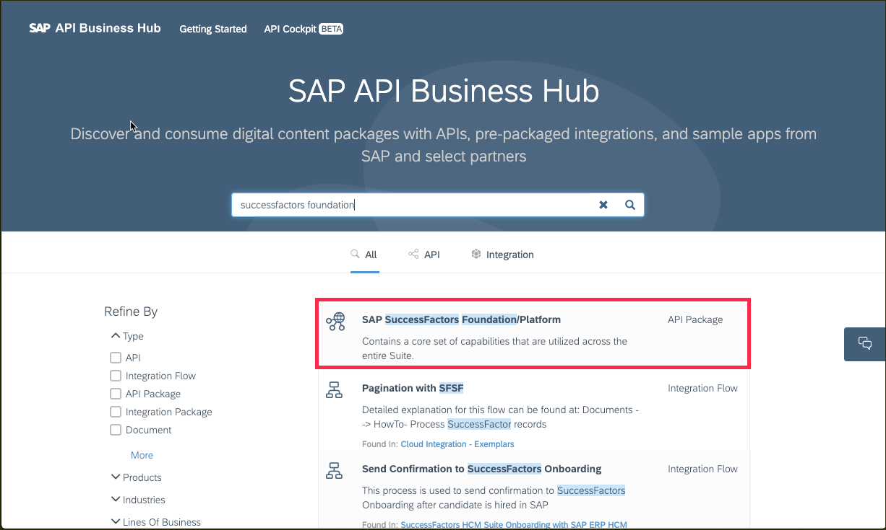

> Once on the API package documentation, find the **User Management** API in the listing. Select the API to open the documentation.

> 


[DONE]
[ACCORDION-END]
[ACCORDION-BEGIN [Step : ](Redirect incoming traffic to the SAPUI5 app)]


The generated code comes ready-to-deploy. By default, the web app will be available at `https://<approuter-url>/<app/id>` and the application router will not redirect traffic that hits the root URL. In this step, you will change this.

1. **Open** the file `webapp/webapp/manifest.json` and find the property `sap.app>id`. The value of this property should be `sap.cp.webapp` but can vary depending on the names you choose in the previous step.

    !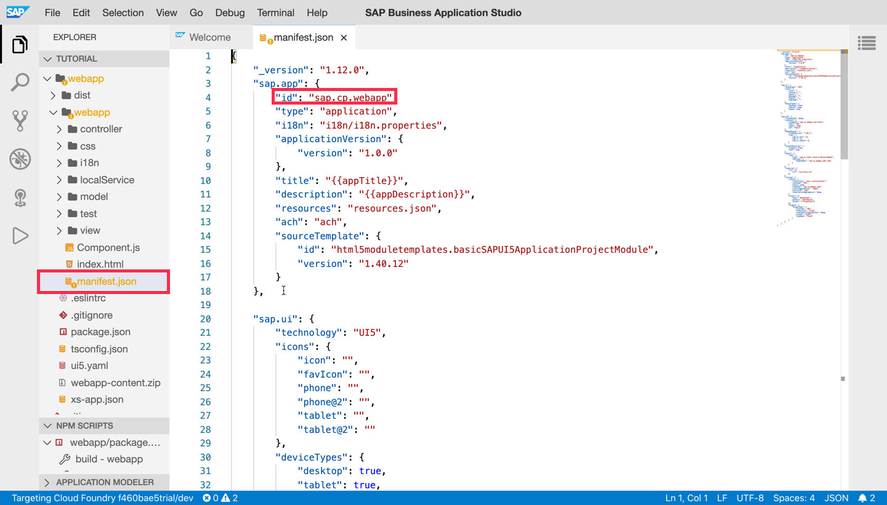

2. **Open** the file `tutorial-approuter/xs-app.json` and add a new property to define the redirect.

    !


[DONE]
[ACCORDION-END]
[ACCORDION-BEGIN [Step: ](Add a list)]

1. **Open** the file `webapp/webapp/manifest.json` and find the property `sap.ui5>models`. Here you can see that the default model is connected to the `mainService` from `sap.app>dataSources`. This is the model you need to user to the data binding in the next sub-step.
2. **Replace** the existing `<Page>` element in the view file `webapp/webapp/view/View1.view.xml` with the following snippet:
    ```XML[5-11]
    <mvc:View controllerName="sap.cp.webapp.controller.View1" xmlns:mvc="sap.ui.core.mvc" displayBlock="true" xmlns="sap.m">
      <Shell id="shell">
    		<App id="app">
    			<pages>
    				<Page id="page" title="Data from the SAP API Business Hub">
    				    <content>
    				          <List items="{/User}">
    				              <StandardListItem title="{firstName} {lastName}" description="{email}"/>
    				          </List>
    				    </content>
    				</Page>
    			</pages>
    		</App>
    	</Shell>
    </mvc:View>
    ```
3. **Save** your changes.


[DONE]
[ACCORDION-END][ACCORDION-BEGIN [Step: ](Create a new run configuration)]

Create a run configuration to be able to run the web app. This configuration needs to be created only once.

1. To run the UI module, switch to the **Run Configuration** panel on the left-hand bar. Click on the **+** icon to add a new run configuration.  In the prompt, select the UI module **`webapp`** as the app you want to run.

    !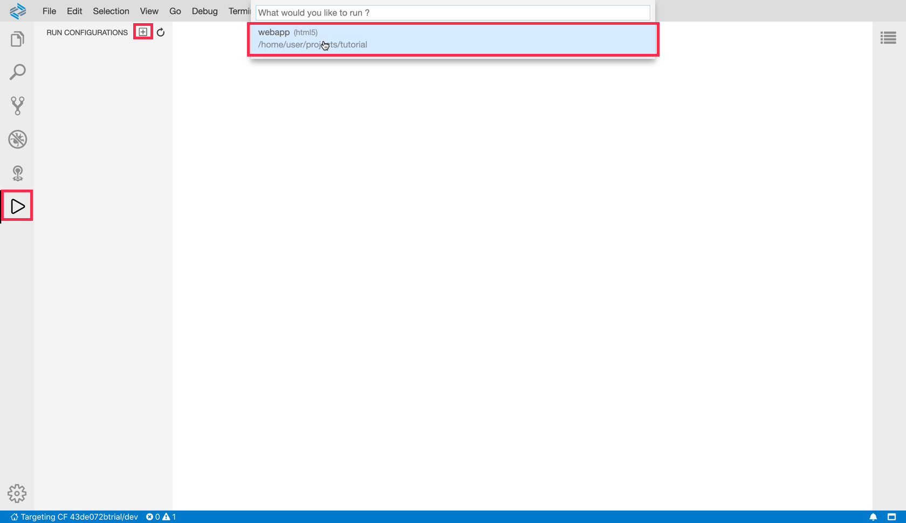

2.  Then, select **index.html** to add a new run configuration for your app.

    !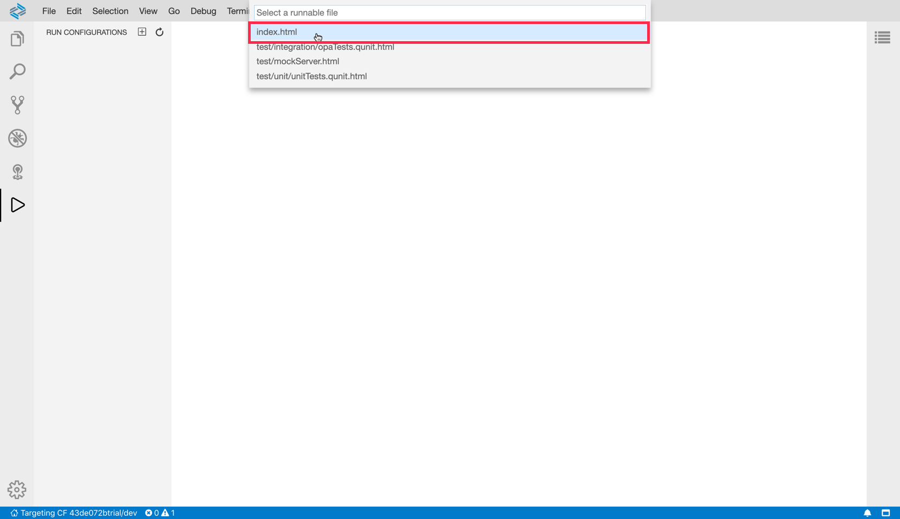

3. Choose the latest UI5 version.

    !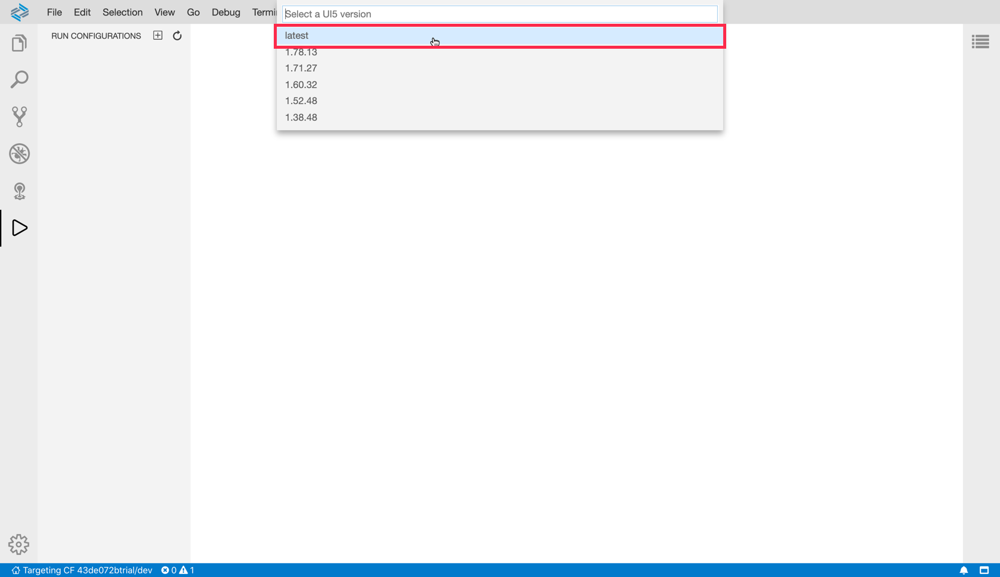

3. Choose **`Run tutorial-webapp`** as the name of the configuration to create the configuration.

    !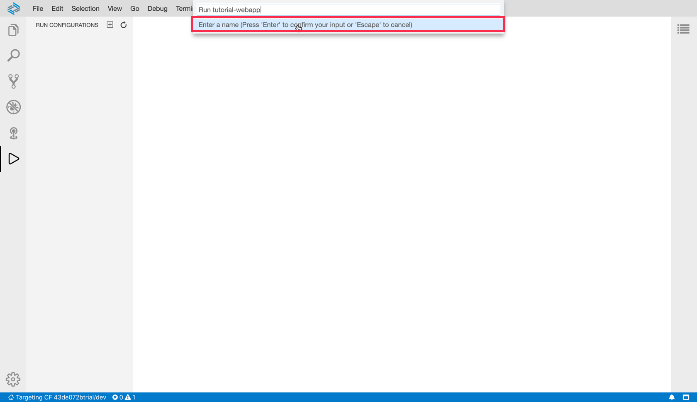

3. You can see the configuration on the left side now. Expand it to view the *Data Source (Destination)* dependency and click on it to connect the run configuration to the data source.

    !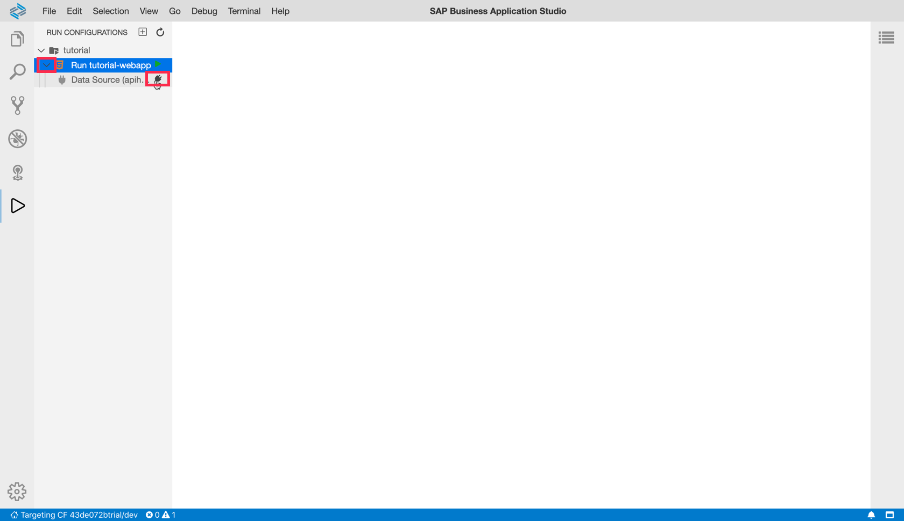

3. Select the **`apihub_sandbox`** data source from the list.

    !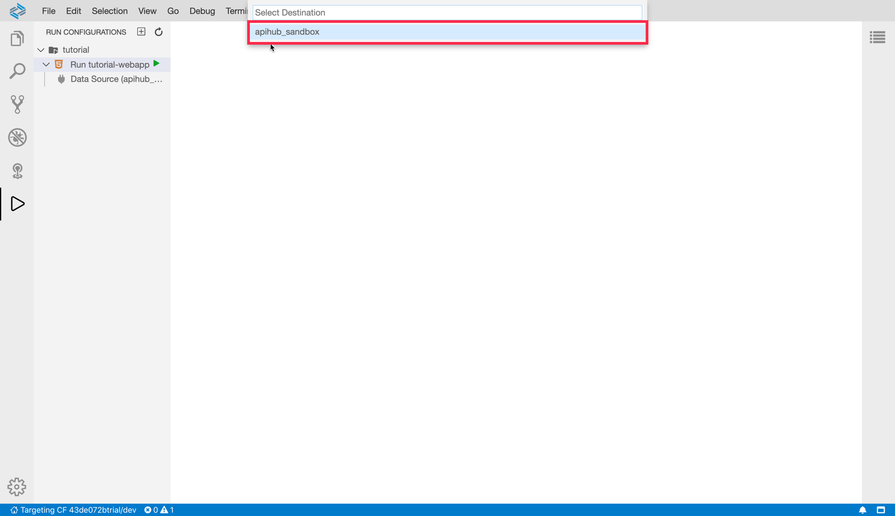

3. You are not asked to **enter your credentials** again.

    !


[DONE]
[ACCORDION-END]
[ACCORDION-BEGIN [Step: ](Run the web app)]

Running your application has several advantages over deploying it. Among others, it's faster, doesn't require a "build" step and won't minify your JavaScript codebase.

1. Run the configuration you just created.

    !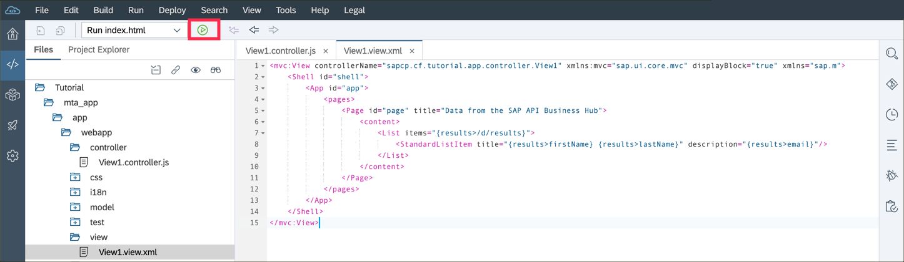


2. Now the SAP Business Application Studio will start the app. When promoted, selected **Expose and open** to making the local port accessible for testing and debugging. Choose any description for this port.

    !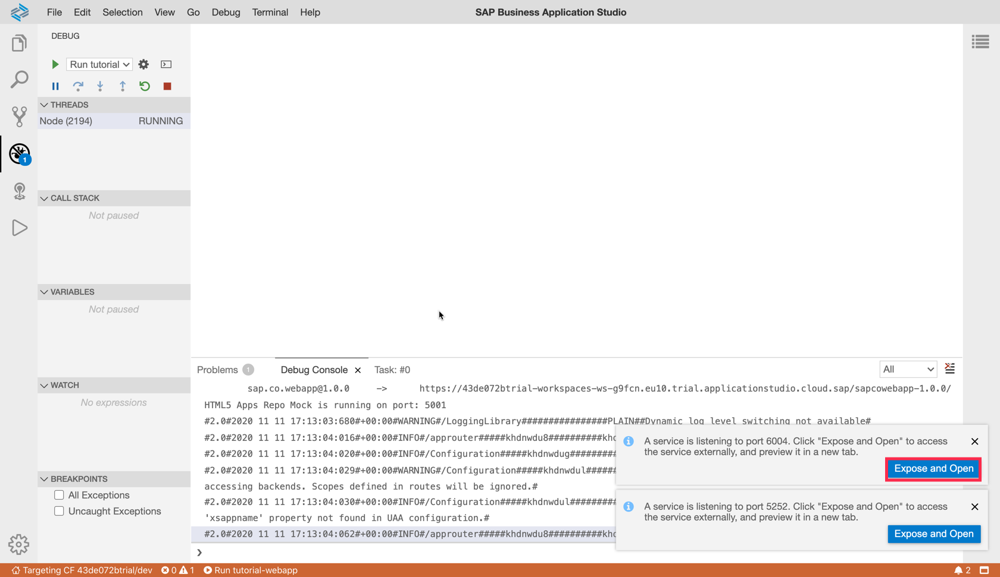


    > In case you run into a "Attribute 'program' does not exist" error, fix it by running the following command in a **Terminal|New Terminal**:

    > ```Terminal
    cd tutorial-approuter/
    npm install
    ```

3. You should now see the web app open in a new tab:

    !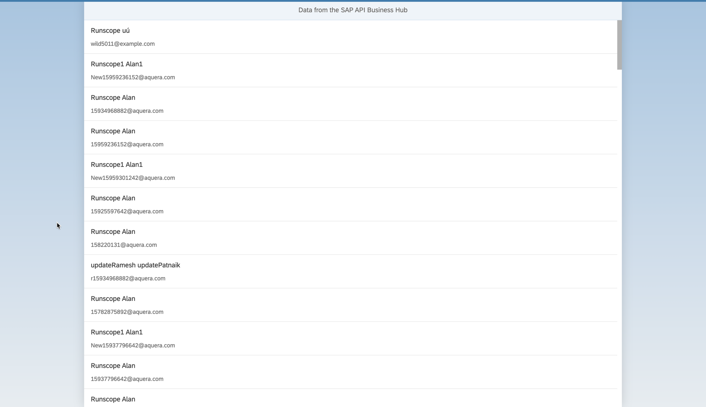

[DONE]
[ACCORDION-END]
[ACCORDION-BEGIN [Step : ](Prepare the application for deployment)]

The run configuration automatically pulled your API Key from the SAP API Business Hub. Now you need to find this key and insert it in the application router to make this project deployable.

1. To find the variable `API_Key`, look for an `.env[number]` file in `webapp/` and **open** it:

    !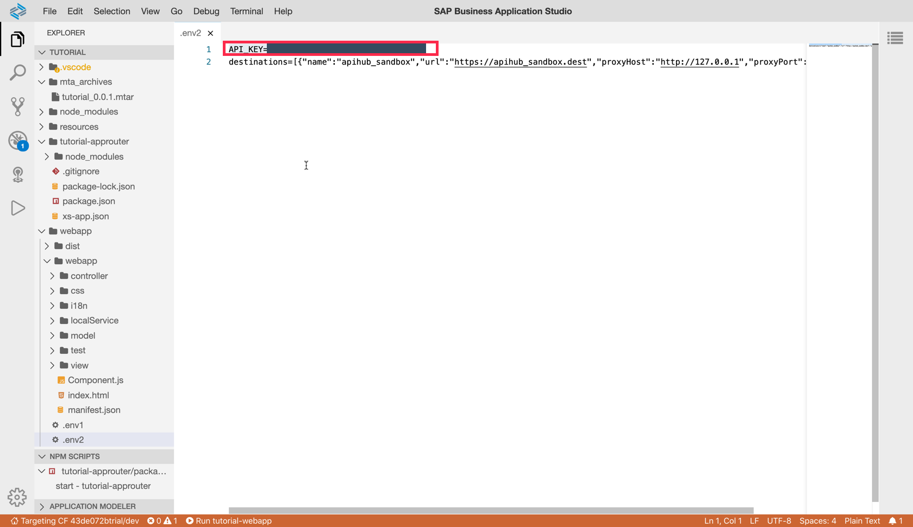

1. We need a custom application router to attach the API key to all incoming requests to make sure the SAP API Business Hub accepts the forwarded requests. Create a new file `tutorial-approuter/approuter.js` to extend the default application router and **replace** the placeholder with the key from the previous sub-step.

    ```JavaScript
    const approuter = require('@sap/approuter');
    require('@sap/xsenv').loadEnv();

    const ar = approuter();

    ar.beforeRequestHandler.use(function (req, _res, next) {
    	req.headers.apikey = <INSERT API KEY>;
    	next();
    });
    ar.start();
    ```

1. Replace the default application router with extended on in the `tutorial-approuter/package.json` module descriptor.

    ```JavaScript[14]
    {
    	"name": "approuter",
    	"description": "Node.js based application router service for html5-apps",
    	"engines": {
    		"node": "^8.0.0 || ^10.0.0"
    	},
    	"dependencies": {
    		"@sap/approuter": "8.5.1"
    	},
    	"devDependencies": {
    		"@sap/html5-repo-mock": "1.6.0"
    	},
    	"scripts": {
    		"start": "node approuter.js",
    		"start-local": "node node_modules/@sap/html5-repo-mock/index.js"
    	}
    }
    ```

[VALIDATE_2]
[ACCORDION-END]
[ACCORDION-BEGIN [Step : ](Build the application)]

Build (aka package) the project to a `mtar` archive to deploy it to Cloud Foundry.  

1. Right-click on the `mta.yaml` file and select **Build MTA** to trigger this process.

    !

2. Check the console output to make sure the process started.

    !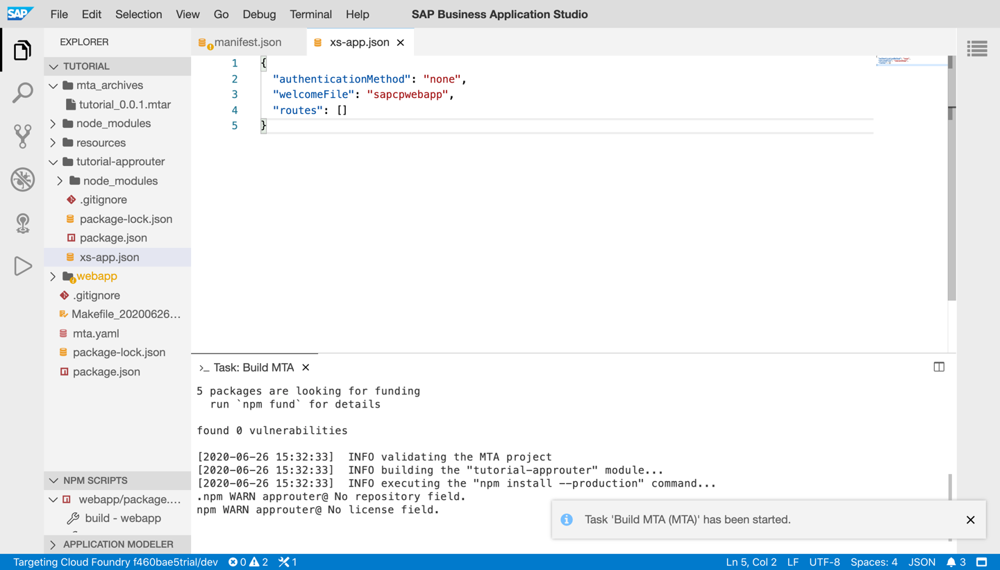

3. Once the build is complete, you can see a message in the log. You will see the generated `mtar` archive in the project tree.


[DONE]
[ACCORDION-END]
[ACCORDION-BEGIN [Step : ](Deploy the archive to Cloud Foundry)]

Now that you created a `mtar` archive, you are all set to deploy the application.

1. Right-click on the `mtar` file and select **Deploy** and **Deploy MTA Archive**.

    !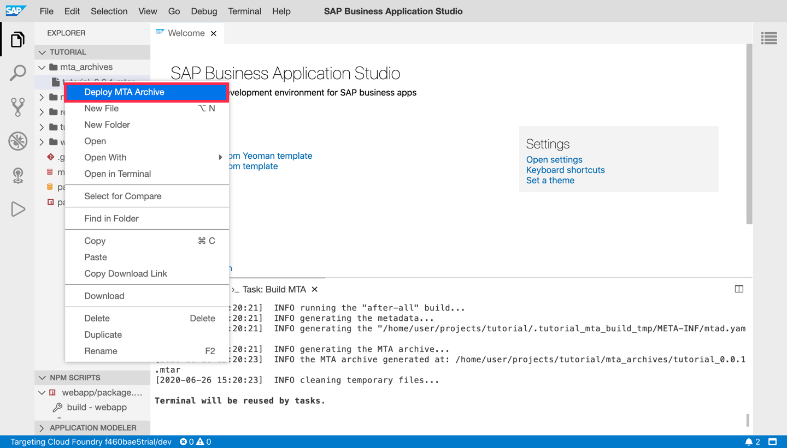

2. Check the console output to make sure the process started.

3. You will see a success message and the URL of the app in the log once the deployment finished. Open this URL in your browser to start the application.

    !

> You can also see the URL of the deployed app when running `cf apps` in a new terminal session.
    !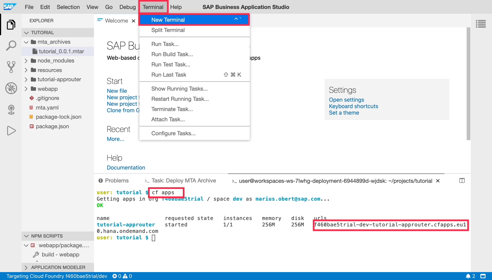

[DONE]
[ACCORDION-END]

[ACCORDION-BEGIN [Step : ](Test to the application)]

1. **Open** the started application in your browser. You might need to log in with your SAP ID (the same credentials you use for the SAP Cloud Platform Cockpit).


2.  You should now see a list of the names and email addresses of the users.

    


> Feel free to add filters to the URL that you specified in the controller to display only a subset of the users. You can also change the bound properties in the view of you instead want to show other attributes of the users. You are just getting started with the SAP API Business Hub.

[DONE]
[ACCORDION-END]
