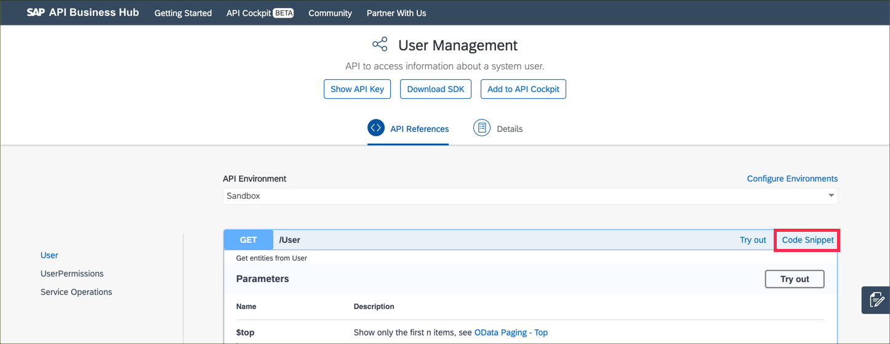
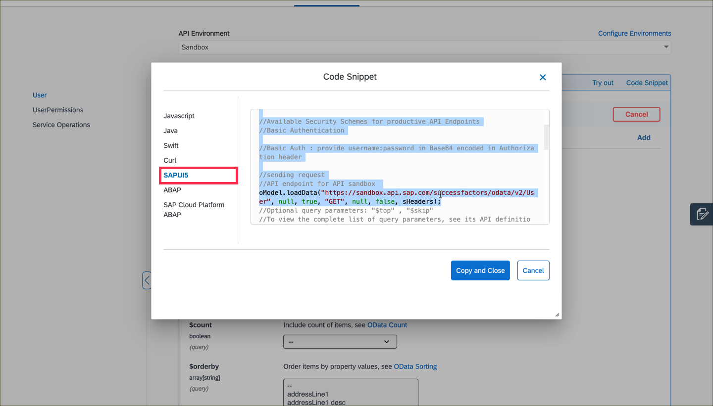
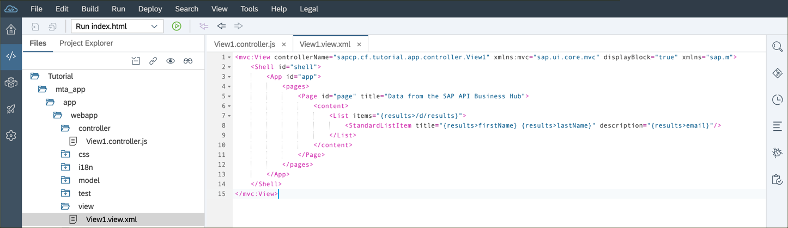

## Details
### You will learn  
In this tutorial, you will build a basic UI5 application that uses data from the SAP Success Factors API, that you test in the SAP Business Hub, to populate a list. Each User will have a list item that displays relevant information about that person.

> It is important to note that in UI5, it is recommended to use an `ODataModel` with an `OData` service, which is what the Success Factors APIs provided in the API Business Hub are, as UI5 will optimize the data parsing for you. This tutorial uses the pre-generated SAPUI5 JSON model from the code snippets section of the API Business Hub. Using an `ODataModel` is the best practice for UI5 applications but it is not covered in this tutorial. You can find more information about `ODataModels` in the [UI5 Demo Kit](https://sapui5.hana.ondemand.com/#docs/guide/6c47b2b39db9404582994070ec3d57a2.html).


---


[ACCORDION-BEGIN [Step : ](Open the project wizard)]

> Please double check that your subaccount lives in the eu10 region. If not, please follow [this tutorial](cp-ui5-webide-new-app) to create the project instead. Don't forget the use the module name and name space mentioned here.

Select **File** --> **New** --> **Project From Template**


[DONE]
[ACCORDION-END]

[ACCORDION-BEGIN [Step : ](Select a Cloud Foundry SAPUI5 project)]
Filter the tiles **`sapui5`** and make sure the environment is set to **Cloud Foundry**. Select the tile called **SAPUI5 Application**, then click **Next**.

Leave the **SAPUI5 Versions** select box on *SAPUI5 Innovation*.


[DONE]
[ACCORDION-END]

[ACCORDION-BEGIN [Step : ](Configure the UI module )]

Fill in the form as follows:

| -----------------------------------------:| ------------------------- |
| **Module Name**                           | **`app`**              |
| **Name Space**                            | **`sapcp.cf.tutorial`**   |


[DONE]
[ACCORDION-END]
[ACCORDION-BEGIN [Step : ](Create the project)]

Keep the default values and click **Finish**.


[DONE]
[ACCORDION-END]

[ACCORDION-BEGIN [Step : ](Get the pre-generated SAPUI5 snippet)]
In the [API Business Hub](https://api.sap.com), search for the **Success Factors** from the Discover APIs page. Find the **SAP Success Factors Foundation** API package and select it.


Once on the API package documentation, find the **User Management** API in the listing. Select the API to open the documentation.


On the documentation, find the `GET /User` method and click the **Code Snippet** link.



Pick the **SAPUI5** tab and then copy the entire code up to the `oModel.loadData` call (we won't need the rest).



[VALIDATE_2]
[ACCORDION-END]
[ACCORDION-BEGIN [Step: ](Call the API from your application)]
Back in your Web IDE, open the controller file `mta_app/app/webapp/controller/View1.controller.js`.

1. **Paste** the copied code from the API Business Hub to your `onInit` function. This code will load the data from the API Business Hub in a JSON model.
2. Add the following line after the code you pasted to use the created model in the view.
    ```JavaScript
    this.getView().setModel(oModel, "results");
    ```
3. **Save** your changes and compare the controller to this file:

    

> You'll get a warning that hard-coded URL should not be used in JavaScript files (rule `sap-no-hardcoded-url`). As this is a tutorial, we can ignore it and disable the warning by adding the following comment in the respective line:

> `// eslint-disable-line sap-no-hardcoded-url`


[DONE]
[ACCORDION-END]
[ACCORDION-BEGIN [Step: ](Add a list)]

1. Open the view file `mta_app/app/webapp/controller/View1.controller.js`.
2. **Replace** the existing `<Page>` element with the following snippet to change the title and include a list that is bound to the model.
    ```XML
    <Page id="page" title="Data from the SAP API Business Hub">
    	<content>
    		<List items="{results>/d/results}">
    			<StandardListItem title="{results>firstName} {results>lastName}" description="{results>email}"/>
    		</List>
    	</content>
    </Page>
    ```
3. **Save** your changes and compare the controller to this file:

    

[DONE]
[ACCORDION-END]
[ACCORDION-BEGIN [Step 8: ](Run your application)]
1. Click the green **run** icon to start your application.

    

2. A new tab will open. Log on with your SAP user to see your running app.

    

3. You should now see a list with the name and email address of the users.

    

> Feel free to add filters to the URL that you specified in the controller to display only a subset of the users. You can also change the bound properties in the view of you rather want to display other attributes of the users. You are just getting started with the SAP API Business Hub.

[DONE]
[ACCORDION-END]
