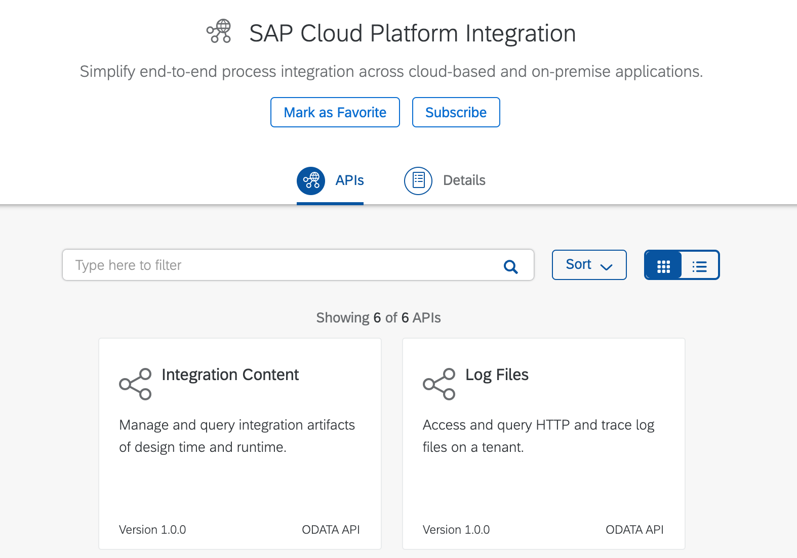
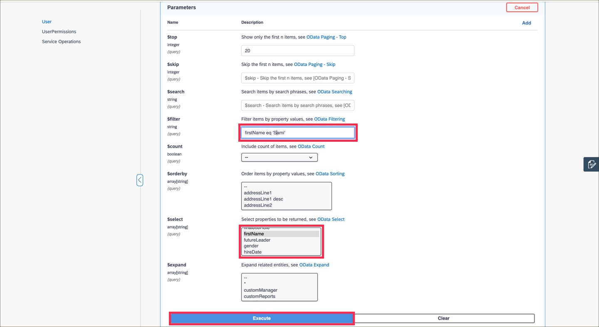
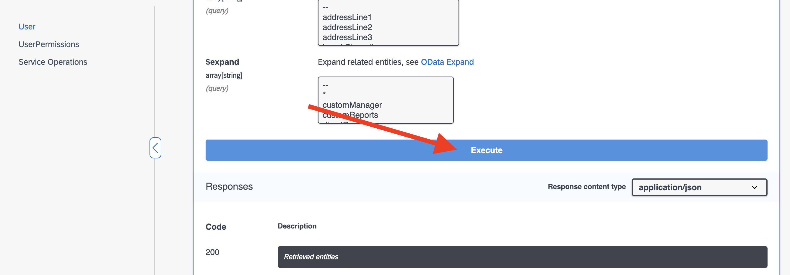

## Details
### You will learn
- How to get started with SAP API Business Hub

Want to learn more about the new SAP API Business Hub? Not sure where to get started? Find more about how to find and enable the SAP API Business Hub in your SAP Cloud Platform instance.

Once you are in the SAP API Business Hub, start learning about and testing one of the many available APIs.

---

[ACCORDION-BEGIN [Step: 1](Navigate to the SAP API Business Hub)]
Follow the link to the [SAP API Business Hub](https://api.sap.com/).

The SAP API Business Hub (henceforth referred to as the Hub) contains valuable information on APIs of course, but there is other content also available, such as Business Processes, Events, CDS Views and more.

[DONE]
[ACCORDION-END]

[ACCORDION-BEGIN [Step : 2](Explore API content)]
On the SAP API Business Hub homepage, select **Content Types > APIs** to see the available API content.

This will take you to the APIs section on the homepage. Select **View More** to see all available APIs and packages.

!

This will take you to the API content listing on the SAP API Business Hub.

Pay particular attention to the icons used here - there are API packages denoted by one particular icon, and individual APIs within a package, denoted by a different icon. Select an API package from the list to see both icons in use. For example, selecting the **SAP Cloud Platform Integration** API package reveals individual APIs within.

[DONE]
[ACCORDION-END]
[ACCORDION-BEGIN [Step : ](Search for an API)]

As an alternative to exploring and navigating the content on the Hub, there is a search facility on the homepage. Use the "SAP API Business Hub" link in the very top left of the page to return to the homepage where you'll see the search box. Search for **`SuccessFactors`** to find all the SuccessFactors related content.

This will bring up all the Hub content relating to SuccessFactors, including APIs and API packages. You may wish to experiment with refining the search results using the checkboxes on the left hand side to specify **API** and **API Package** types only.

Find and select the **SAP SuccessFactors Foundation/Platform** API package.

This will bring up the SAP SuccessFactors Foundation/Platform API package detail, showing the APIs available.

Let's drill down one level further and select a particular API in this package - the **User Management** API.

[DONE]
[ACCORDION-END]

[ACCORDION-BEGIN [Step : ](Explore the API)]

An API package contains one or more APIs, and an API itself can contain one or more endpoints (also known as resources), organised into groups. Take a look at the endpoints in the User Management API you've just selected, and you'll see that there are three groups of endpoints - User, User Permissions and Service Operations - shown on the left hand side.

> The API page will most likely have opened displaying the expanded detail of the first operation / endpoint combination in the first group, in this case the `GET` operation on the `/User` endpoint. While exploring all the endpoints you may wish to collapse the information, which you can do by selecting the `GET` operation to toggle the display. The screenshot above shows the collapsed endpoints within the **User** group.

Take a minute to explore the API and understand how endpoints are organized into groups, and what operations are available on which endpoints.

[DONE]
[ACCORDION-END]

[ACCORDION-BEGIN [Step : ](Test an API endpoint)]

The Hub offers a test facility for APIs. In order to take advantage of this, you need to log on. Select **Log On** at the top of the page.

Once logged on, when looking at the details for an operation / endpoint combination, you will see a **Try Out** button.

Selecting this will open any parameters in that section for input. Make sure you select the `GET /Users` operation / endpoint to try out within the User Management API.

Calling the `GET` operation on the `/User` endpoint will return a list of users from SuccessFactors. The `$top` parameter can be used to retrieve only the first _n_ results once all the other filtering is done. Specify a value of **20** for this parameter.

We can use the `$select` parameter to restrict the properties returned. Select `firstName`, `jobTitle` and `lastName` from the list.

> Use the _control_ key on Windows, or the _command_ key on macOS to be able to select multiple entries.

Finally, use the `$filter` parameter to include an [OData filter expression](http://docs.oasis-open.org/odata/odata/v4.0/odata-v4.0-part1-protocol.html#_Toc445374625) to limit the results - specify `firstName eq 'Amy'`.

When you're ready, select **Execute** at the bottom of the documentation for that method.

Below the **Execute** button, you will see details of the call that was made on your behalf. This includes the entire URL of the request, along with the response headers and body. The SuccessFactors system used in this particular test is a sandbox system with a limited amount of data.

Feel free to explore other endpoints in this User Management API.

[VALIDATE_4]
[ACCORDION-END]

Congratulations, you've just taken your first steps with the SAP API Business Hub, and should now be able to navigate it and the content within, in confidence.
