## Prerequisites  
 - **Proficiency:** Beginner

## Next Steps
 - [Testing API Business Hub APIs with Curl](https://www.sap.com/developer/tutorials/hcp-abh-test-locally.html)

## Details
### You will learn  
Want to learn more about the new SAP API Business Hub? Not sure where to get started? Find more about how to find and enable the SAP API Business Hub in your SAP Cloud Platform instance. Once you are in the SAP API Business Hub, start learning about and testing one of the many available APIs.

### Time to Complete
**15 Min**.

---

[ACCORDION-BEGIN [Step 1: ](Open SAP Cloud Platform Services)]
Open your [SAP Cloud Platform Cockpit](https://account.hanatrial.ondemand.com/cockpit). If you do not have an account yet, sign up for a free trial account first.

In your SAP Cloud Platform account, select **Services** from the side menu.

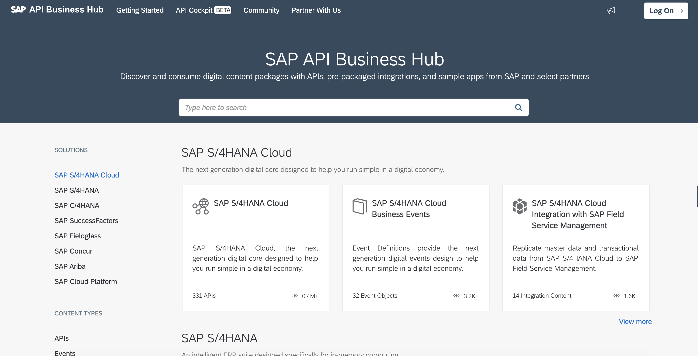

[DONE]
[ACCORDION-END]

[ACCORDION-BEGIN [Step 2: ](Open SAP API Business Hub)]
In the **Services** catalog, search for _SAP API_. You should see 2 results. The SAP API Business Hub is the service you are looking for.

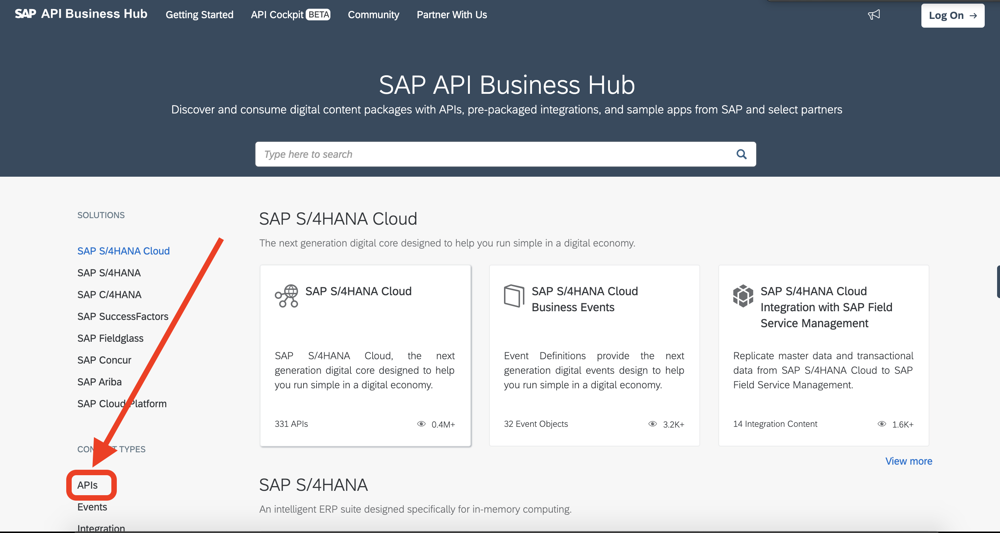

Select the **SAP API Business Hub** service. If it is not already enabled, do so on the service page.

Once the service is enabled, select **Go to Service**.

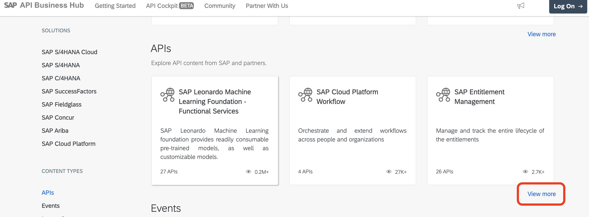

This will direct you to the homepage for the SAP API Business Hub.

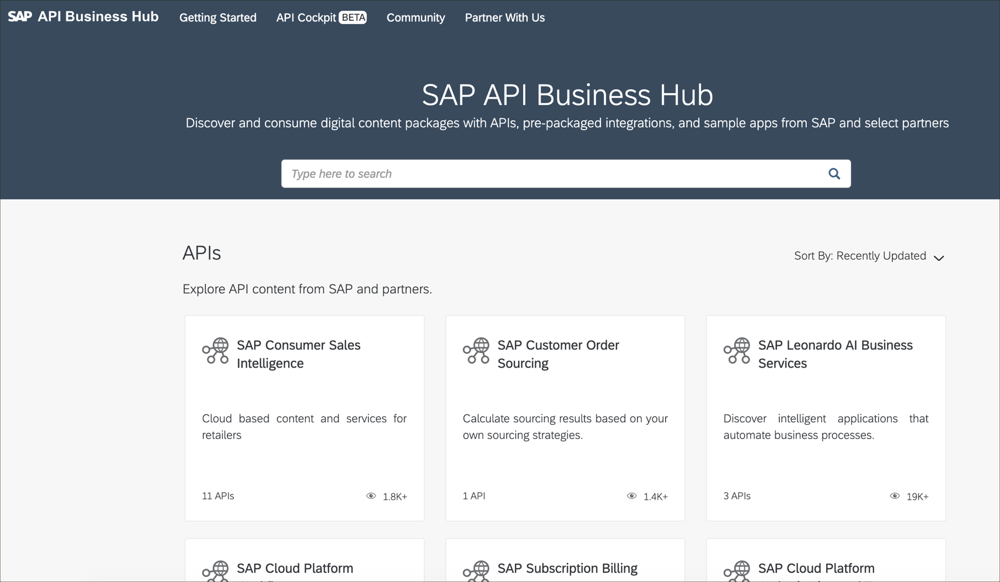

You can access the SAP API Business hub through SAP Cloud Platform or by just visiting their website by going to <http://api.sap.com>.

[DONE]
[ACCORDION-END]

[ACCORDION-BEGIN [Step 3: ](Find an API Package in the Hub)]
On the SAP API Business Hub homepage, select **APIs** to see the available packages in the API Business Hub.

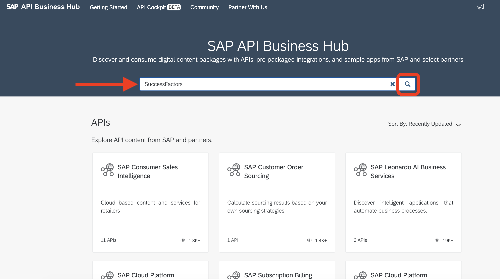

This will take you to the discover APIs page. Select the **All** tab.

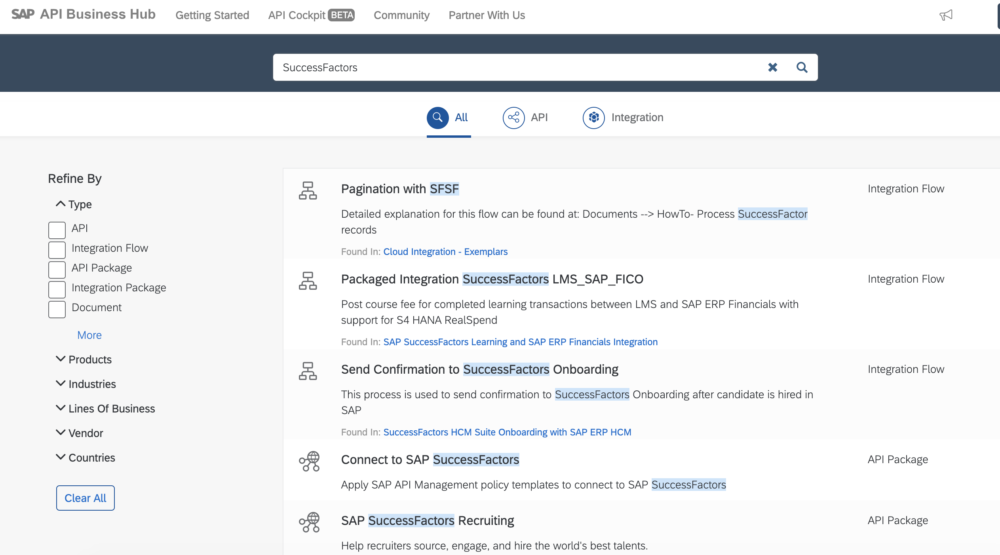

In the search box, type `SuccessFactors` to find the Success Factors API package. Click on the SAP Success Factors package.

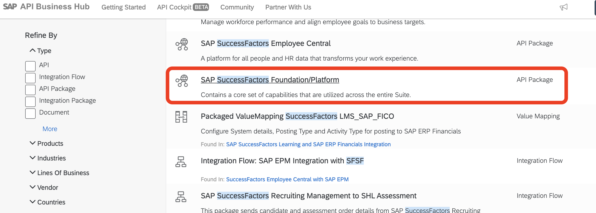

This will bring you to the API documentation and overview. Select the **Artifacts** tab.

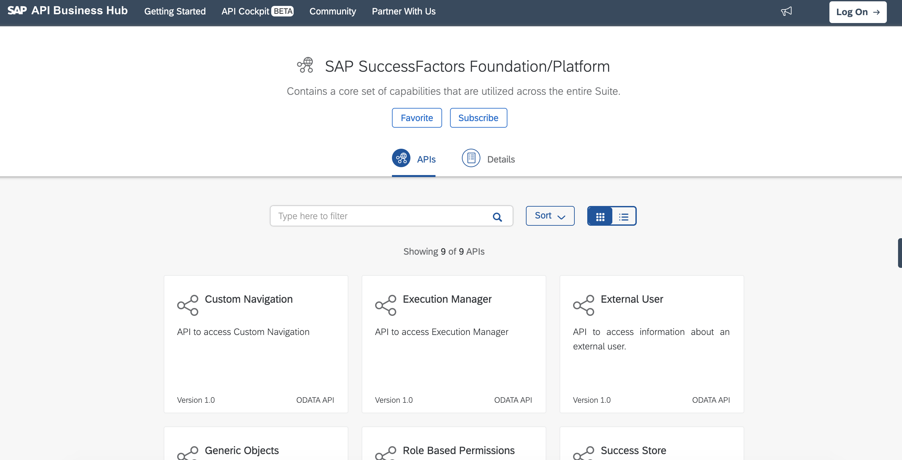

The Success Factors contains 14 APIs that can be used. APIs are grouped into Business Packages so they are easier to find.

[DONE]
[ACCORDION-END]

[ACCORDION-BEGIN [Step 4: ](Select an API to use)]
In the Success Factors artifacts, look for the **User Information** API. It may be the last item in the artifacts list.

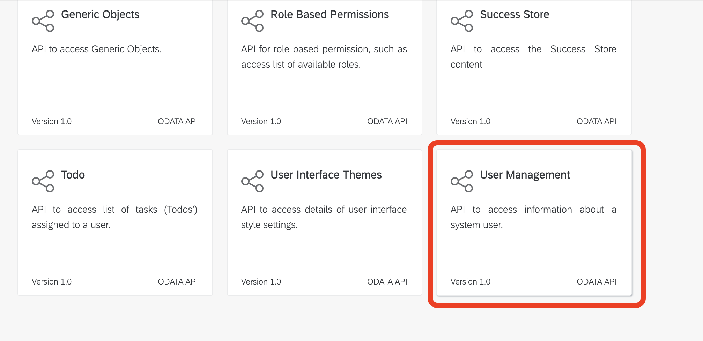

Select this API.

Once you click the API, you will see all the available methods for the API. In the User Information API, you have 4 methods. Click on the first **Get** method, `GET /User`.

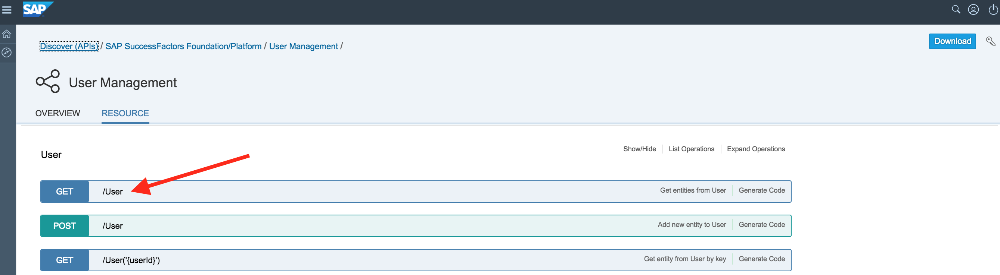

When you click the method, you are able to see all the query parameters and their corresponding documentation, such as what data type is expected and what the parameter is used for.

[DONE]
[ACCORDION-END]

[ACCORDION-BEGIN [Step 5: ](Test the API in the Hub)]
In order to test the API in the API Business Hub, you need to login. Click the **Login** icon at the top of the page to do so.

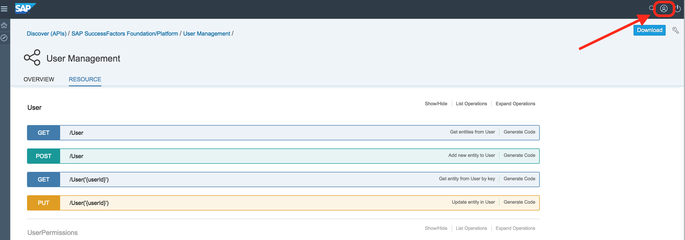

When you look at the API Documentation again for the `GET /User` method, you will see that the value field has become an editable field. You can test different query parameters by providing a value in the input of the specified data type for that parameter.

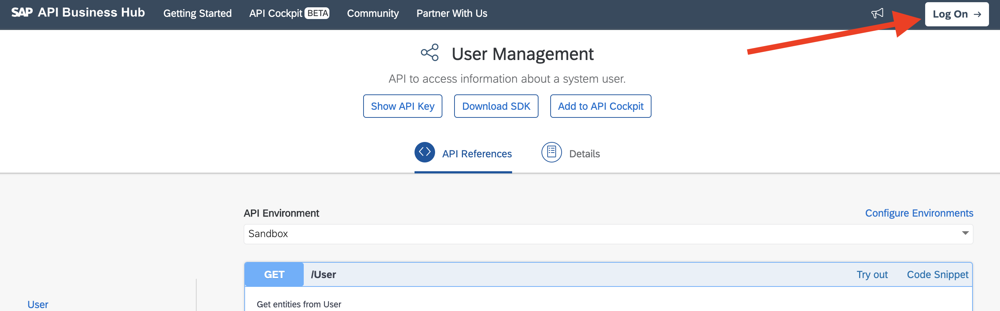

The `GET /User` method will return a list of users from Success Factors. That could be a long list, so set the `$top` parameter to **5**. The top parameter tells the query to retrieve only the top _n_ results once all the other filtering is done. In the `$select` parameter, using the _control_ key for Windows or _command_ key for Macs, select `firstName`, `lastName`, and `jobTitle`. This will limit the data set returned to this 3 fields for the matching results. If you don't need to see all a users data, only select data points, you can use the `$select` parameter to pick the data you want. This will help reduce the size of the resulting data set if performance is an issue.

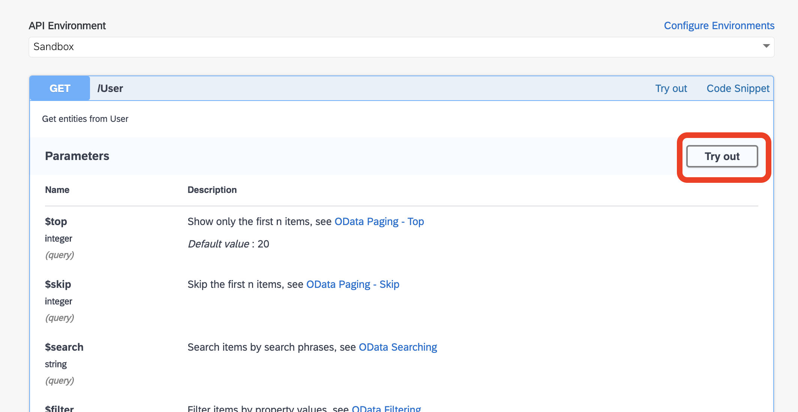

Once your parameters are all set, click the **Try it out** button at the bottom of the documentation for that method.

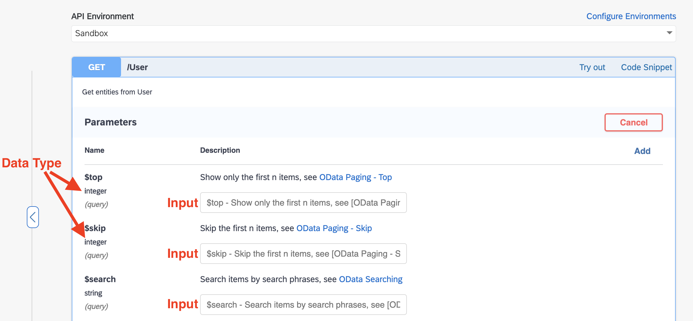

If there aren't any issues, you will see the resulting request URL and the response body (in `JSON`) on your page.

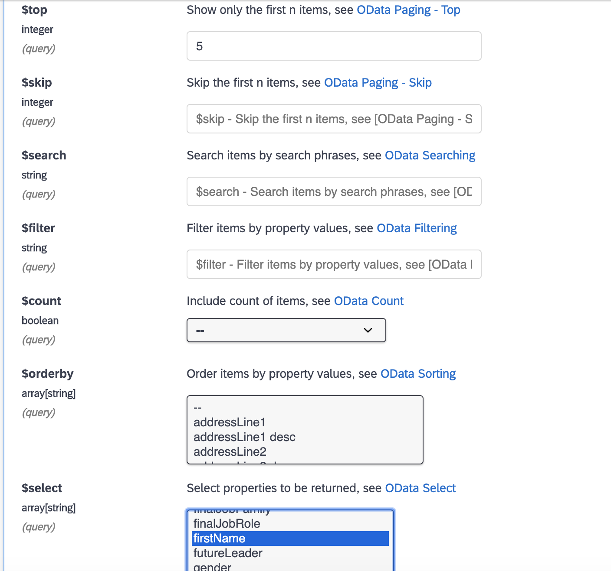

Feel free to keep playing around in the SAP API Business Hub to better understand the methods available in the User Information API.

[DONE]
[ACCORDION-END]

## Next Steps
 - [Testing API Business Hub APIs with Curl](https://www.sap.com/developer/tutorials/hcp-abh-test-locally.html)
