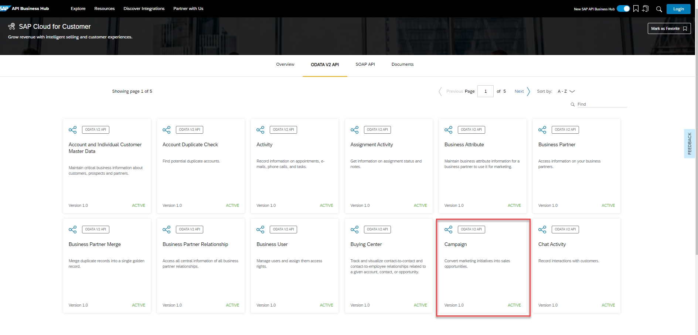
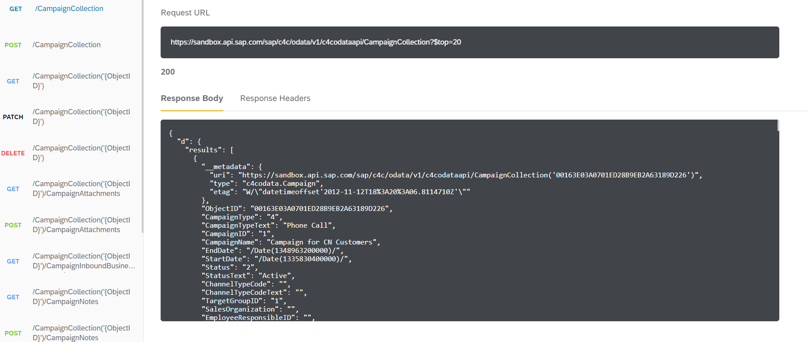

## Details
### You will learn
- How to get started with SAP API Business Hub 

SAP API Business Hub is a website to discover, explore, and test APIs from various SAP products such as SAP S/4HANA, SAP SuccessFactors, SAP Customer Experience, SAP BTP, and selected partners. Apart from various product APIs, you can find detailed information on Business Processes and Partner Content. The new workspace feature enables you to consume integration content.

Want to learn more about the new SAP API Business Hub? Not sure where to get started? Find more about how to find and enable the SAP API Business Hub in your SAP BTP instance.

Once you are in the SAP API Business Hub, start learning about and testing one of the many available APIs.

---

[ACCORDION-BEGIN [Step: 1](Navigate to the SAP API Business Hub)]
In your browser, open [SAP API Business Hub](https://api.sap.com/).

!

You can explore Products, Business Processes, Content Categories, Partner Content, and Featured	 Content.
Click Explore on top for quick access to detailed information.

[DONE]
[ACCORDION-END]

[ACCORDION-BEGIN [Step : 2](Explore API content)]
On the SAP API Business Hub homepage, select **Content Categories > APIs** to see the available API content.

!

Pay particular attention to the icons used here - there are API packages denoted by one particular icon, and individual APIs within a package, denoted by a different icon.

[DONE]
[ACCORDION-END]
[ACCORDION-BEGIN [Step : 3](Search for an API)]

Choose APIs. You can browse through different types of APIs such as REST, ODATA, and SOAP in the content listing.

!

You may wish to explore the API either by selecting a type of an API or by selecting an API package. An API package contains one or more APIs. Let us get started by choosing one of the API packages-**`SAP Cloud for Customer`** to find all the Cloud for Customer related content.

Search for the API package **SAP Cloud for Customer** in the search box on top right of the API page.

!

This will bring up all the Hub content relating to SAP Cloud for Customer package.

[DONE]
[ACCORDION-END]

[ACCORDION-BEGIN [Step : ](Explore the API)]

On choosing the **SAP Cloud for Customer** package, you can view the available APIs in the package.

!

Select the **Campaign** API to explore in detail. The **`Overview`** section briefs you about the API. The **`API References`** section provides information and functions that are offered to consume the API. The API can contain one or more endpoints which are organized into groups. On the left-hand side of selected API - Campaign, you can see six groups of endpoints.

!

Various HTTP methods of API are used to address the functionality of endpoints. While exploring the endpoints, you may wish to collapse the information by selecting on `GET` operation row. You can explore the available endpoints for the API to understand in detail.

Take a minute to explore the API and understand how endpoints are organized into groups, and what operations are available on which endpoints.

[DONE]
[ACCORDION-END]

[ACCORDION-BEGIN [Step : 5](Test an API endpoint)]

The SAP API Business Hub allows you to test APIs. To take advantage of this, you need to log on. Select `Login` at the top of the page.

!

Once logged on, you will see a `Try Out` button in the **`Overview`** section. Selecting this will open the **`Test View`**. Make sure you select the `GET /CampaignCollection` operation for the Campaign API.

!

Calling the `GET` operation on the `/CampaignCollection` endpoint will return a list of entities from Campaign Collection. The `$top` parameter can be used to retrieve only the first _n_ results once all the other filtering is done. Specify a value of **20** for this parameter.

!

You can select the `$orderby` to sort the display order based on `Object ID`, `Object ID description`, `Campaign Type`, and so on.

Once the required inputs are entered, click `Execute` at the top right corner to view the response. The response section displays various entities fetched calling the `GET` method. Sandbox environment is used to test the Campaign API.

!

> Use the _control_ key on Windows, or the _command_ key on macOS to be able to select multiple entries.

Feel free to explore other endpoints in this User Management API.

[VALIDATE_4]
[ACCORDION-END]

Congratulations, you've just taken your first steps with the SAP API Business Hub, and should now be able to navigate it and the content within, in confidence.
