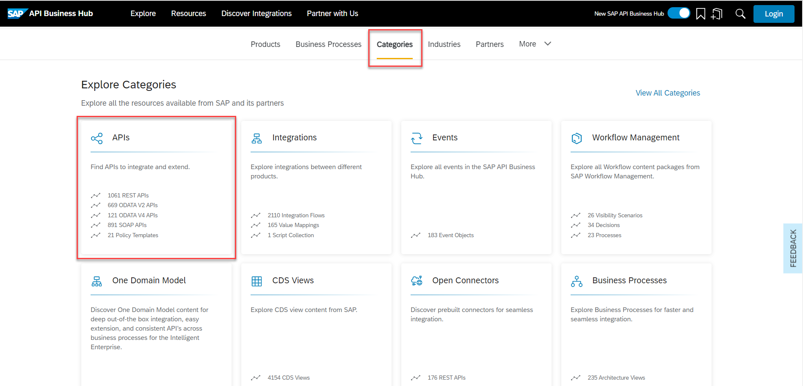
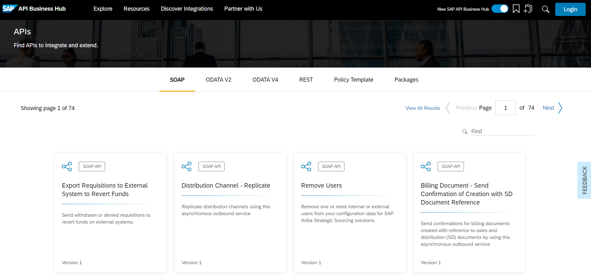
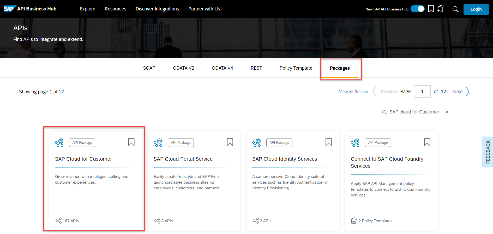
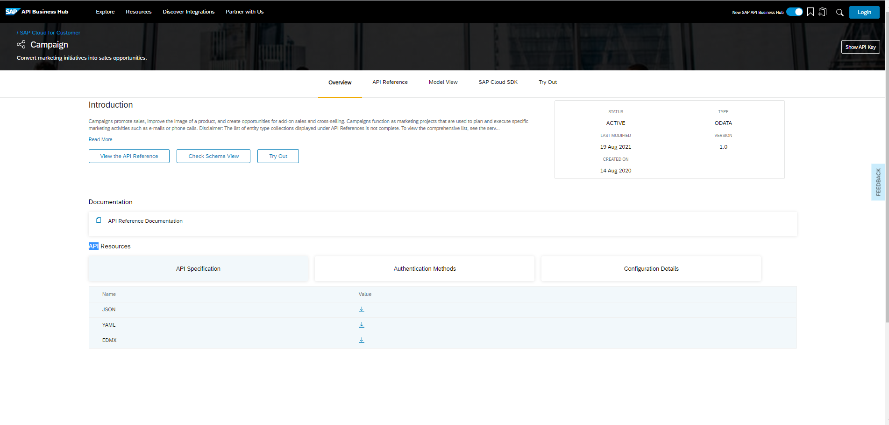
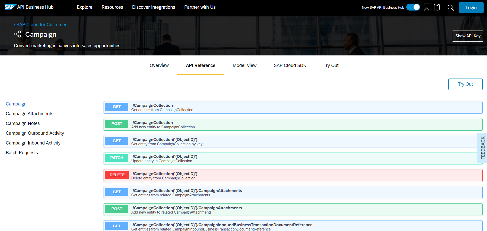
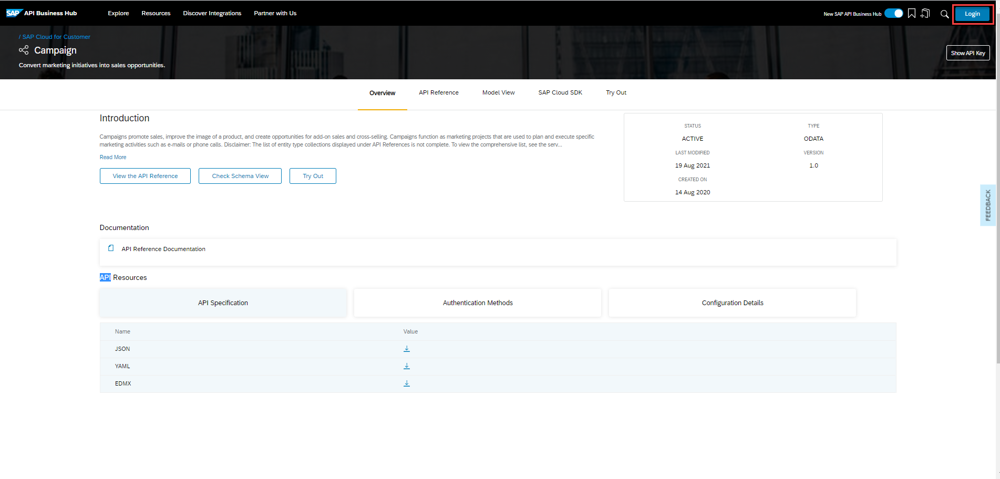
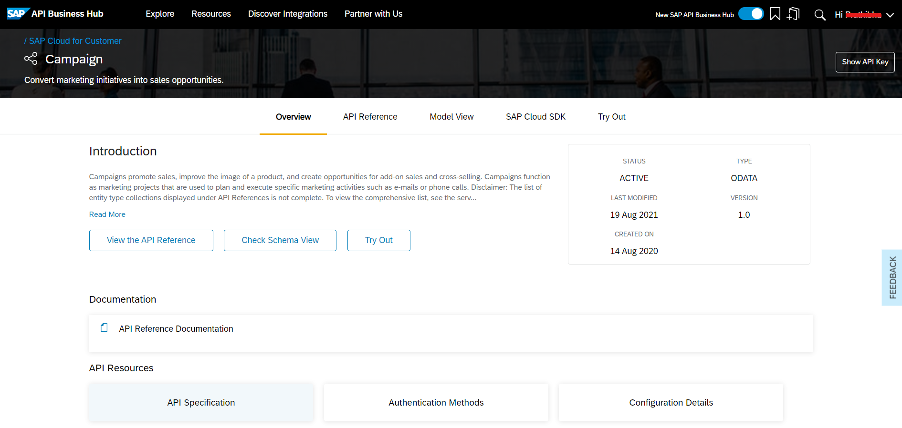
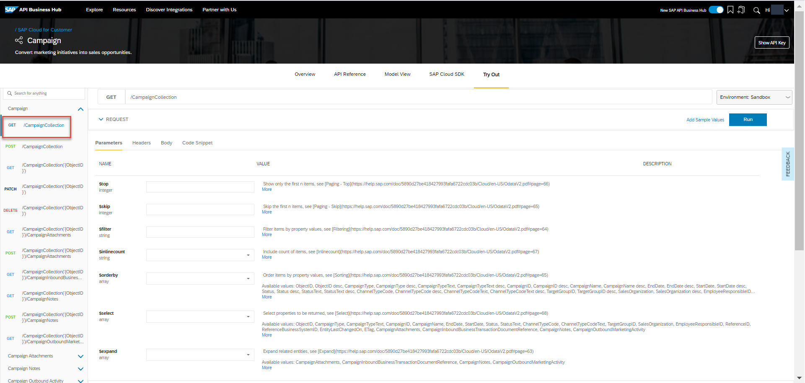

## Details
### You will learn
- How to get started with SAP API Business Hub

SAP API Business Hub is a website to discover, explore, and test APIs from various SAP products such as SAP S/4HANA, SAP SuccessFactors, SAP Customer Experience, SAP BTP, and selected partners. Apart from various product APIs, you can find detailed information on business processes and partner assets. The new workspace feature also enables you to consume integration and workflow content.

Want to learn more about the new SAP API Business Hub? Not sure where to get started? Go to [api.sap.com] (https://api.sap.com), and begin your journey.

---

[ACCORDION-BEGIN [Step: 1](Go to the SAP API Business Hub)]
In your browser, open [SAP API Business Hub](https://api.sap.com/).

!

You can explore products, business processes, as well as different categories of assets, along with partner and featured content. Choose Explore for quick access to the various sections of the SAP API Business Hub.

[DONE]
[ACCORDION-END]

[ACCORDION-BEGIN [Step : 2](Explore API content)]
On the SAP API Business Hub homepage, choose **Categories**.

!

Choose APIs from the different categories available.

!

[DONE]
[ACCORDION-END]
[ACCORDION-BEGIN [Step : 3](Search for an API)]

Different APIs, policy templates, and API packages are available under the API category. An API package contains one or more APIs. You can browse through different types of APIs such as REST, OData, and SOAP APIs.

!

You can explore APIs either by selecting a type of an API or by selecting an API package. Navigate to the Packages tab. You can choose any package for testing.

!

For the purpose of this tutorial, we are going to choose the `SAP Cloud for Customer` package (find it using the search facility).

!

[DONE]
[ACCORDION-END]

[ACCORDION-BEGIN [Step : ](Explore the API)]

On choosing the **SAP Cloud for Customer** package, you can view the available APIs in the package. Select the Campaign API to explore it in detail.

!

The **`Overview`** section briefs you about the API. From here you can download the API reference file, view the documentation available, and check for the API version.

The **`API Reference`** section provides information and functions that are offered to consume the API.

!

The API can contain one or more endpoints which are organized into groups. On the left-hand side of selected API - **Campaign**, you can see six groups of endpoints.

!

Various HTTP methods of API are used to address the functionality of endpoints. While exploring the endpoints, you may wish to collapse the information by selecting the `GET` operation row. You can explore the available endpoints for the API to understand it in detail.

[DONE]
[ACCORDION-END]

[ACCORDION-BEGIN [Step : 5](Test an API endpoint)]

The SAP API Business Hub allows you to test APIs. A sandbox environment is provided to test the Campaign API. To take advantage of this, ensure you are logged on. Select Login at the top of the page.

!

Once logged on, choose the Try Out button in the **`Overview`** section.

!

Selecting this will open the Try Out View.

For the purpose of this tutorial the **`GET /CampaignCollection`** operation has been selected for testing.

!

Calling the `GET` operation on the `/CampaignCollection` endpoint will return a list of entities from Campaign Collection. The `$top` parameter can be used to retrieve only the first _n_ results once all the other filtering is done. Specify a value of **20** for this parameter.

!

You can also select the `$orderby` to sort the display order based on `Object ID`, `Object ID description`, `Campaign Type`, and so on.

Once the required inputs are entered, Choose `Run` at the top right corner to view the response.

!

The response section displays various entities fetched calling the `GET` method.

!

Feel free to explore other endpoints in this Campaign API.

[VALIDATE_4]
[ACCORDION-END]

Congratulations, you have just taken your first steps with the SAP API Business Hub and should now be able to navigate it and the content within, confidently.
