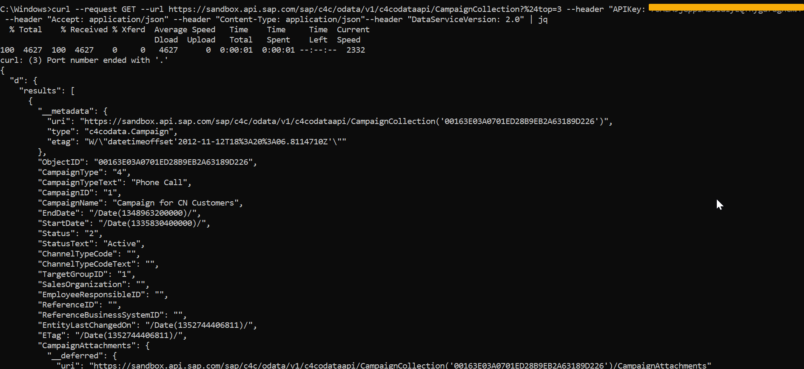

## Prerequisites  
 - Make sure you have the command line tools Curl and jq installed.
 - Windows instructions: [Curl](https://chocolatey.org/packages/Curl) and [jq ](https://chocolatey.org/packages/jq)
 - MacOS/Unix instructions: [jq ](https://stedolan.github.io/jq/download/) (Curl should already be available)

## Details
### You will learn  
- How to use command line tools like Curl and jq REST/ODATA APIs locally.

You have already discovered the SAP API Business Hub and accomplished testing an API on the website. In this tutorial, you will learn how to use command-line tools like Curl and jq to test REST/ODATA APIs locally on your machine.

---

[ACCORDION-BEGIN [Step : ](Navigate to the User Management API)]

Go to <https://api.sap.com> and navigate to the [Campaign](https://api.sap.com/api/campaign/overview) API.


[DONE]
[ACCORDION-END]
[ACCORDION-BEGIN [Step : ](Generate sample API call code)]

Select `GET/CampaignCollection` method under **API Reference**. Glance through the `GET/CampaignCollection` to understand the parameters. The SAP API Business Hub provides you with starter code in a variety of languages and tools for each API.  


Choose **Try Out** to proceed further.


The API call starter code is available in various languages like JavaScript and Swift. You will be using the Curl code in this example.
Choose **Code Snippet** and select **Curl** to view the generated code. This personalized snippet already includes your unique API key.


Copy the highlighted Curl code to the clipboard.


[DONE]
[ACCORDION-END]
[ACCORDION-BEGIN [Step : ](Run sample API call code)]

Paste the content of the clipboard in a terminal or command line window.
Hit **Enter** to run the command. It may take a few seconds before data is seen on your screen.

> You can use `CTRL+C` to stop the command from running.


You'll notice that the output is not formatted. For this, you can pipe the output of Curl to jq to format it.


The formatted output data displays the parameters for GET method.


[DONE]
[ACCORDION-END]
[ACCORDION-BEGIN [Step : ](Limit the number of results)]
You can limit the number of results to be displayed by adding the `$top` value provided in the *Parameter* section of the `GET/CampaignCollection` method. As `$` is not allowed in the URL, it is encoded as `%24` as per URL encoding.


```Shell
--url https://sandbox.api.sap.com/sap/c4c/odata/v1/c4codataapi/CampaignCollection?%24top=3 \
```

After your command line prints out 3 results, it should stop running.



> If you get a *Curl: no match* error, try wrapping your URL in single quotes.

> It may be easier to make edits to your Curl code in the text editor rather than directly in the command line.

[DONE]
[ACCORDION-END]
[ACCORDION-BEGIN [Step : ](Add multiple parameters to the API call)]
Besides the `$top` parameter, you can add multiple parameters to the [Query String](https://en.wikipedia.org/wiki/Query_string) of your API call.
Now add in the 2nd parameter for `$select`. You only want the `StatusText` and `Status`  for the top 3 users. You can delaminate values in the select array using a comma(,). However, a comma is not a character allowed in a URL. The ASCII encoded value is `%2C`.

This changes the second line of the command to.
```Shell
--url "https://sandbox.api.sap.com/sap/c4c/odata/v1/c4codataapi/CampaignCollection?%24top=3&%24select=StatusText%2CStatus" \
```

> The `&` character indicates to the command line that a new command in coming. You need the command line to interpret the `&` as part of the URL.

**Run** the assembled command in the terminal.


You have now learnt how to use code snippets productively.


[VALIDATE_5]
[ACCORDION-END]
