## Prerequisites  
 - **Proficiency:** Beginner
 - **Tutorials:** [Getting Started with the SAP API Business Hub](http://www.sap.com/developer/tutorials/hcp-abh-getting-started.html)

## Next Steps
 - [Add API Business Hub API to a UI5 Application](https://www.sap.com/developer/tutorials/hcp-abh-api-ui5-app.html)
 - [Using ABAP with the SAP API Business Hub](https://www.sap.com/developer/tutorials/hcp-abh-abap.html)

## Details
### You will learn  
You have already discovered what the API Business Hub is and learned how to test it on their site. In this tutorial, you will learn how to use Curl to test REST APIs locally on your machine.


### Time to Complete
**20 Min**.

---

[ACCORDION-BEGIN [Step 1: ](Get an API Key in API Hub)]
If you ever need to get back to the API Business Hub and can't remember how to get there from SAP Cloud Platform, you can always just go to `api.sap.com`.

To use one of the APIs outside of the API Hub, you will need to get an application key. The SAP API Business Hub provides you with a default key to test against their sandbox. To get to your API key, find the key icon in the top right corner of the page. **Click on the key icon.**

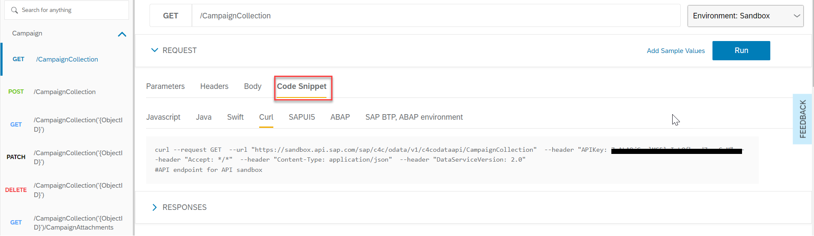

In the pop-up window, you will find your API Key. Click the **Copy to Clipboard** button.

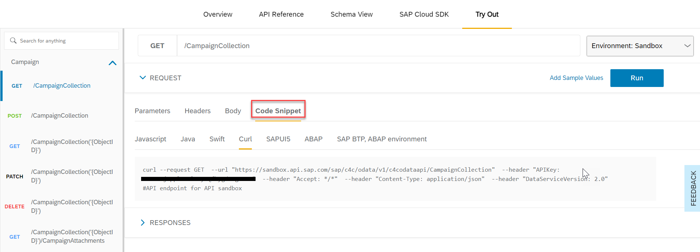

**Copy you application key into a text editor.** You will need it later. Close the API key window once you have your API key.

[DONE]
[ACCORDION-END]

[ACCORDION-BEGIN [Step 2: ](Generate sample API call code)]
In the User Information API, view the details of the `GET /User` method. The SAP API Business Hub provides you with some starter code in a variety of languages for each API. Click the **Generate Code** button at the top of the method definition.

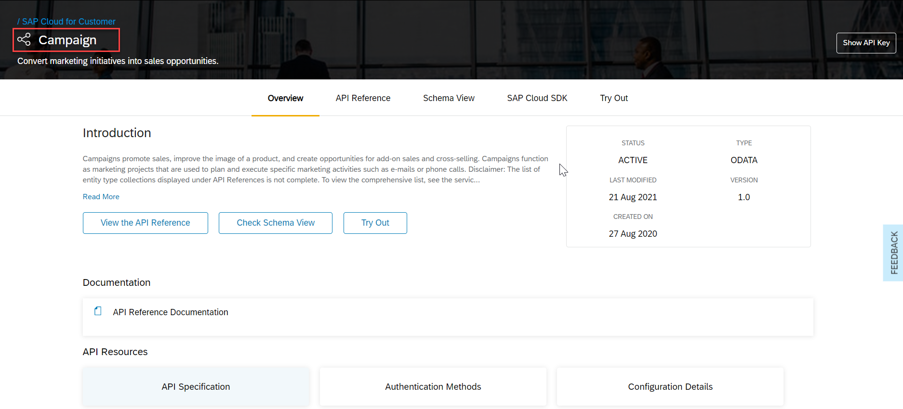

A pop-up window will appear. The API call starter code is available in a couple different languages like JavaScript and Swift. You will be using the Curl code in the this example.

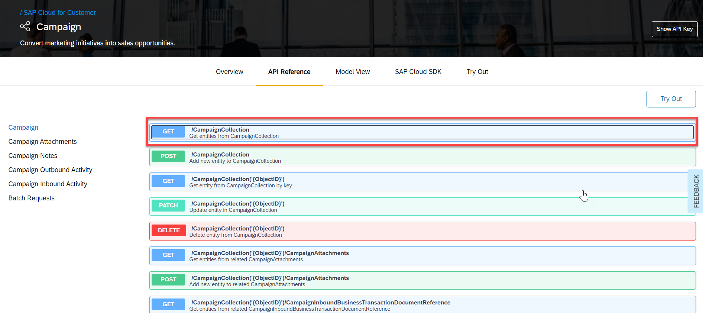

Select **Curl** and then **Copy to Clipboard**.

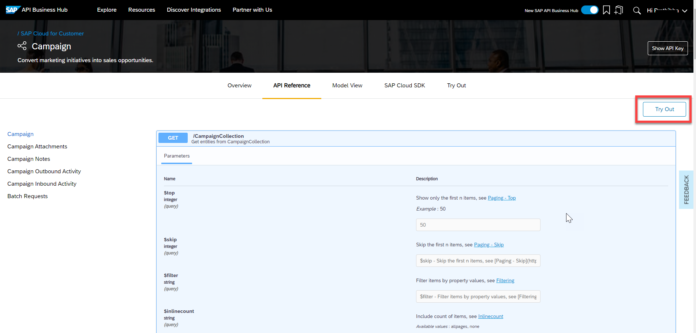

[DONE]
[ACCORDION-END]


[ACCORDION-BEGIN [Step 3: ](Run sample API call code)]
In same text editor where your API key is located, paste in the sample Curl code. There is a space to add in your API Key to the generated code. Replace `<API_KEY>` with your API key.

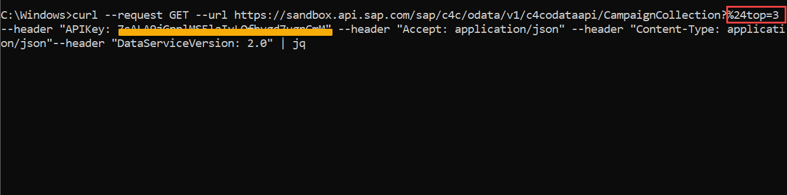

**Copy the updated code. In a terminal or command line window, paste in the code.**

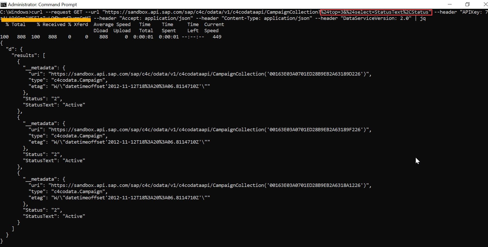

Hit **Enter** to run the command. It may take a few seconds before data is seen on your screen. If this is successful, it will return a data set of about 650 users. Use the `CTRL+C` to stop the command from running.

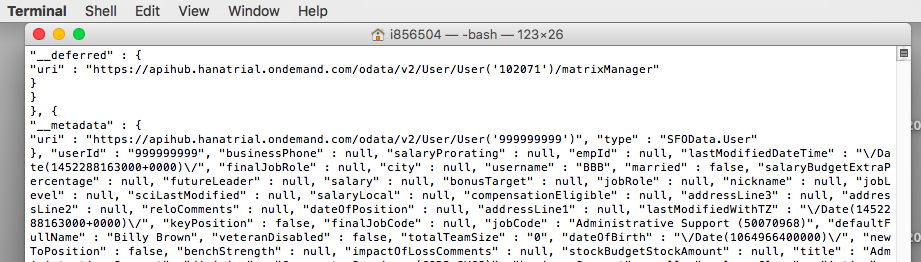

> **New to Curl?**: If you are new to Curl or are running into issues where your command line is saying the command curl does not exist, please visit the [Curl website](https://curl.haxx.se/). The Curl website contains documentation about client-side URL transfers and how to install it on your machine.   

[DONE]
[ACCORDION-END]

[ACCORDION-BEGIN [Step 4: ](Try adding a parameter to the API call)]
Remember the parameters you set when testing in the API Business Hub? Try adding in the `$top` parameter here. It's a good thing to note that `$` is not allowed in a URL and can be encoded with `%24`

> NOTE: It may be easier to make edits to your Curl code in the text editor rather than directly in the command line.


**Stuck?** Move on to the next step.

[DONE]
[ACCORDION-END]

[ACCORDION-BEGIN [Step 5: ](Add multiple parameters to the API call)]
To add the `$top` parameter to your API call, at the end of the URL, add the following code.

```url
?%24top=5
```

As mentioned earlier, the `$` character is not allowed in URLs. You need to use the ASCII encoded version of the character.

**Copy the updated code from your text editor and run it in your command line.**

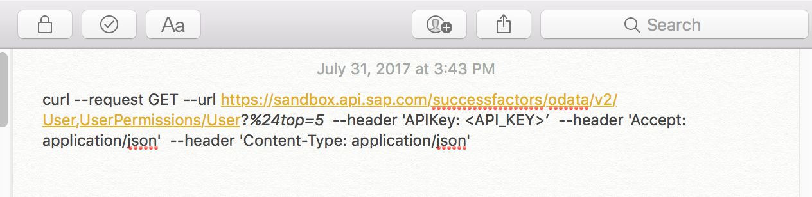

After your command line prints out 5 results, it should stop running.

> If you get a *curl: no match* error, try wrapping your URL in single quotes.

Now add in the 2nd parameter for `$select`. You only want the `firstName`, `lastName`, and `jobTitle` for the top 5 users. You can delaminate values in the select array using a comma(,). However, a comma is not a character allowed in a URL. The ASCII encoded value is `%2C`.

The encoding for the second, select parameter would look like the following.

```url
&%24select=firstName%2ClastName%2CjobTitle
```

If you just add in the above line and try to run the code, you will find it does not return the expected result. The `&` character indicates to the command line that a new command in coming. You need the command line to interpret the `&` as part of the URL. To do so, **you need to add single quotes(') around the URL**.

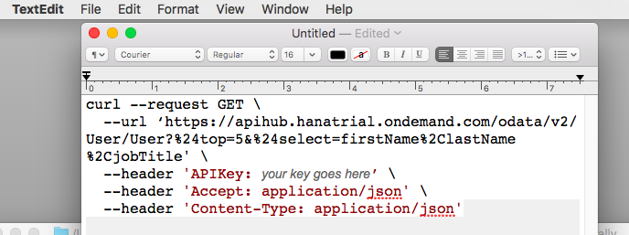

**Copy and run the updated code.** If you updated you code successfully, you should see only 5 results with only 3 fields shown for each result.

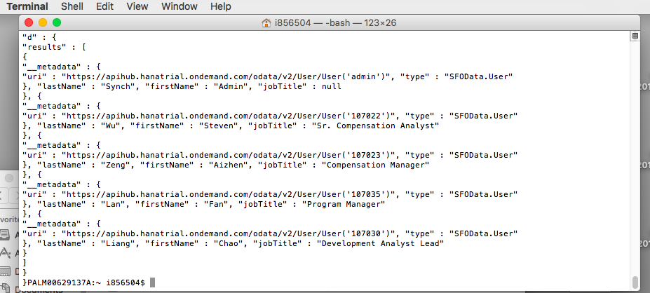

[DONE]
[ACCORDION-END]


## Next Steps
 - [Add API Business Hub API to a UI5 Application](https://www.sap.com/developer/tutorials/hcp-abh-api-ui5-app.html)
 - [Using ABAP with the SAP API Business Hub](https://www.sap.com/developer/tutorials/hcp-abh-abap.html)
