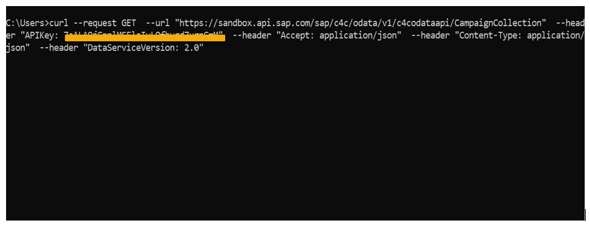
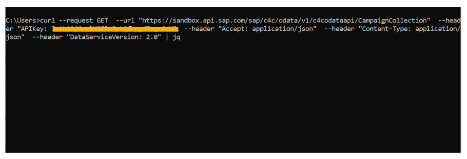
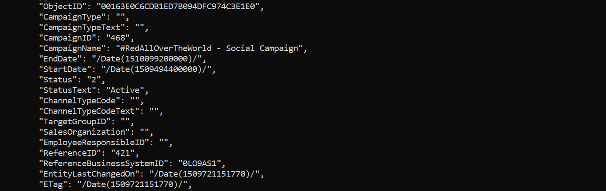

# Test SAP Business Accelerator Hub APIs with curl
<!-- description --> Try out an SAP API locally on your machine.

## Prerequisites
 - Make sure you have the command line tools curl and jq installed.
 - Windows instructions: [curl](https://chocolatey.org/packages/Curl) and [jq](https://chocolatey.org/packages/jq)
 - MacOS/Unix instructions: [jq](https://stedolan.github.io/jq/download/) (curl should already be available)

## You will learn
- How to use command line tools like curl and jq with REST / OData APIs locally.

## Intro
You have already discovered the SAP Business Accelerator Hub and accomplished testing an API on the website. In this tutorial, you will learn how to use command-line tools like curl and jq to test REST and OData APIs locally on your machine.

---

### Navigate to the User Management API

Go to <https://api.sap.com> and navigate to the [Campaign](https://api.sap.com/api/campaign/overview) API.


### Generate sample API call code

Select `GET/CampaignCollection` method under **API Reference**. Glance through the `GET/CampaignCollection` to understand the parameters. The SAP Business Accelerator Hub provides you with starter code in a variety of languages and tools for each API.


Choose **Try Out** to proceed further.


The API call starter code is available in various languages like JavaScript and Swift. You will be using the curl code in this example.
Choose **Code Snippet** and select **the Curl section** to view the generated code. This personalized snippet already includes your unique API key.


Copy the highlighted curl code to the clipboard.


### Run sample API call code

Paste the content of the clipboard in a terminal or command line window. Hit **Enter** to run the command. Please note that it may take a few seconds before data is seen on your screen.

>**Important:** In a Windows command prompt/terminal, you must use double-quotes ("") for your entire payload and escape any other double-quotes(\") inside the payload.

>Also, if `revocation function error` occurs, pass `-k` or `--insecure` as parameter to bypass this check in Windows system.

>You can use `CTRL+C` to stop the command from running.



You'll notice that the output is not formatted. For this, you can pipe the output of curl to jq to format it.



The formatted output represents the results of a simple call to the Campaign Collection API endpoint.



### Limit the number of results
You can limit the number of results retrieved with the `$top` value provided in the *Parameter* section of the `GET/CampaignCollection` method. Switch back for a moment from the Code Snippet section to the Parameters section in the [Try Out](https://api.sap.com/api/campaign/tryout) area and modify the value of the `$top` parameter to request just 3 results.

You can then switch back to the Code Snippet section, and copy the updated code from the Curl section to paste it into your terminal. When you execute the curl command, and pipe the output into jq again, you should see a nicely formatted list of three campaigns.

### Add multiple parameters to the API call
Besides the `$top` parameter, you can add multiple parameters to the [Query String](https://en.wikipedia.org/wiki/Query_string) of your API call.
Now add in a second parameter for `$select`. You only want the `StatusText` and `Status` for the top 3 users. Use the same approach as before - switch to the Parameters section, specify the two values for the `$select` parameter using the drop down menu, then switch back to the Code Snippet section and copy the Curl content again. It should look something like this:

```bash
curl --request GET \
  --url 'https://sandbox.api.sap.com/sap/c4c/odata/v1/c4codataapi/CampaignCollection?%24select=Status%2CStatusText&%24top=3' \
  --header 'APIKey: your-api-key-here' \
  --header 'Accept: application/json' \
  --header 'DataServiceVersion: 2.0' \

#API endpoint for API sandbox
```

Notice how the parameters are [encoded](https://en.wikipedia.org/wiki/Percent-encoding) in the query string.

Paste the entire command into your terminal again. This time the output is vastly reduced:


You have now learnt how to use code snippets productively.

