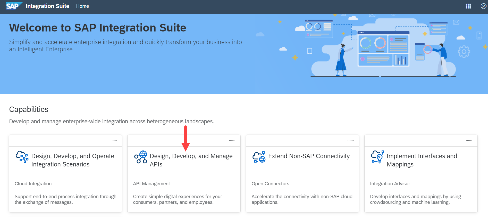
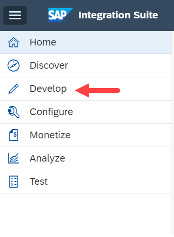
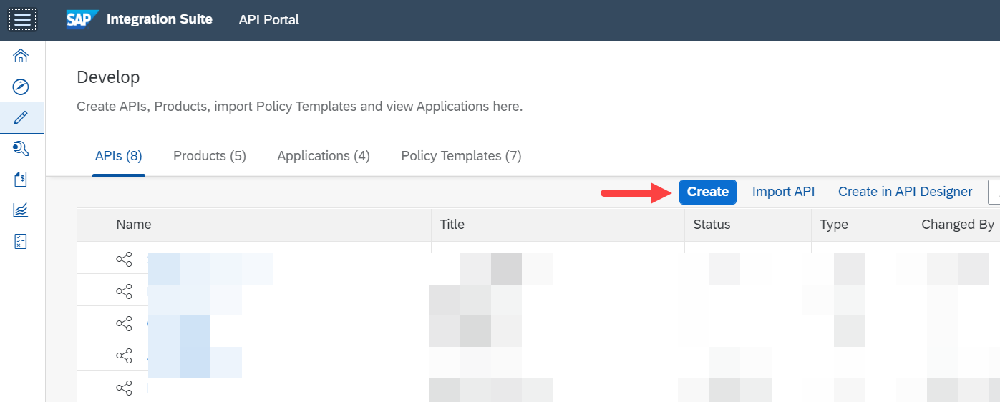
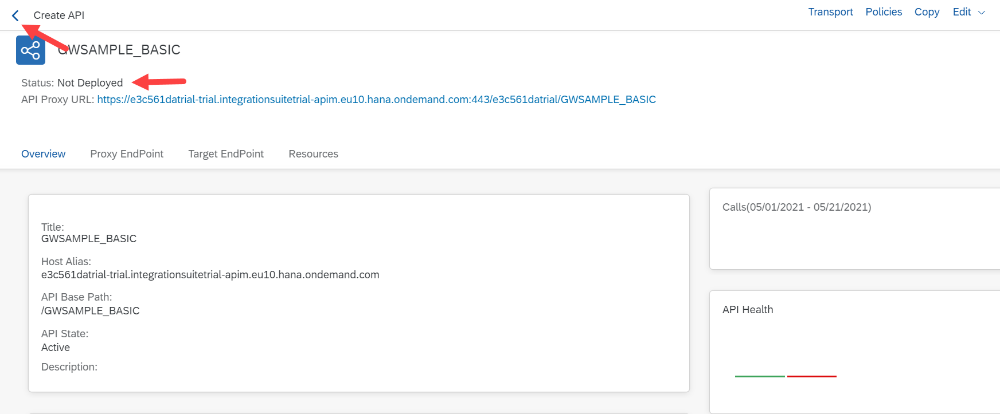
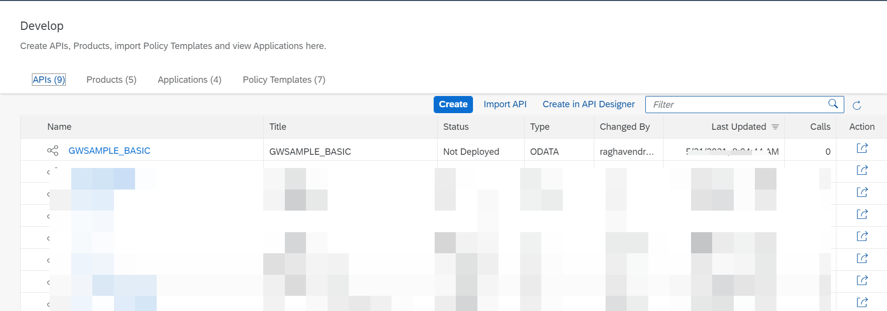
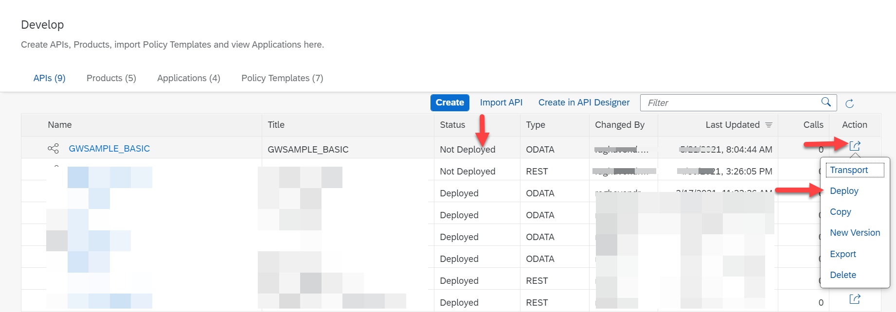

# Create an API Proxy
<!-- description --> Learn how SAP Integration Suite, API Management can leverage the OData catalog service to retrieve relevant information from a SAP Gateway system and pre-populate required information for an API proxy.

## Prerequisites  
- **Tutorials:**  [Create an API Provider System](hcp-apim-create-provider)

## You will learn  
SAP Integration Suite, API Management uses three main components to expose APIs.
- The API Provider is used to abstract the connection to the backend / target system
- The API Proxy is the actual API which contains the logic to connect to the target system. Here you can model the flow, add security policies, transform the incoming message or look for content injections
- The API Product which bundles one or more API Proxies before they are exposed in the API Business Hub Enterprise so they can be consumed by a developer

## Intro
In this tutorial you will learn how to create an API Proxy based on the API Provider created in the previous step. You will learn how SAP Integration Suite, API Management can leverage the OData catalog service to retrieve relevant information from a SAP Gateway system and pre-populate required information for the API Proxy

---

### Learn about creating API proxy and Policy Editor

[Create an API proxy](https://blogs.sap.com/2016/06/22/part-6-overview-of-api-proxy-policies/) and take a look at the Policy Editor. You will start to look into the details of building an API Proxy that contains some real life functionality.

### Access the API Proxies

Open the **Integration Suite** and choose **Design Develop, and Manage APIs**.

### View and create APIs

To view your APIs that you have previously created, select from the **Hamburger Menu** in the upper left corner, choose **Configure** and select **APIs**.

This will open the list of previously created APIs.

To create a new API from this page, click **Create**.

### Select API provider

From the drop-down select the `SAPDeveloperSystemES5` API Provider created in the previous tutorial.

### Discover the services

Click on **Discover**.

### Select the services

Select the `GWSAMPLE_BASIC` services by using the search bar to search for _sample_.

> You can use the Search to narrow down the list.

Click on **OK**.

The remaining fields from the API Proxy creation screen are populated. Click **Create**.

> In the trial version, there is only 1 option for the Host Alias which is your default trial account. Leave this as is.

### Save your API

Click on **Save**.

### View APIs created

Status of the API Proxy is **Not Deployed** as we have not deployed the API

Click on the arrow next to **Create API** to go back to the overview page

A new API Proxy has been created

### Deploy Created API Proxy

Click on action button from right side and select **Deploy**

API proxy is deployed.

### Test your API Proxy

To Test your API proxy, navigate to **Test** from navigation bar and select **APIs**.

Select your API and provide the user name and password and click **OK**.

Click on Send.

You should get the response.

