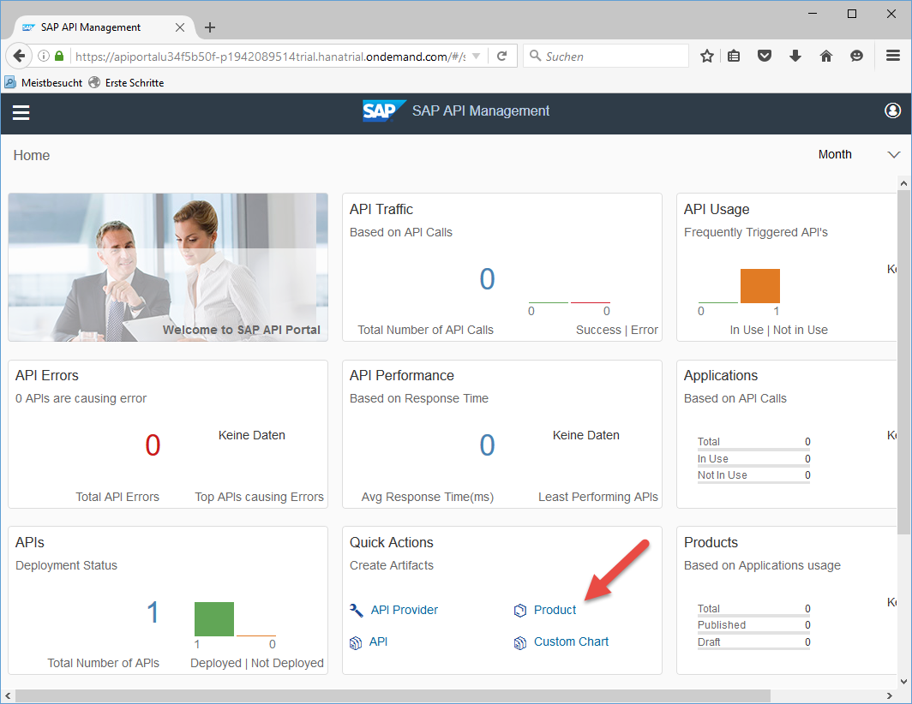
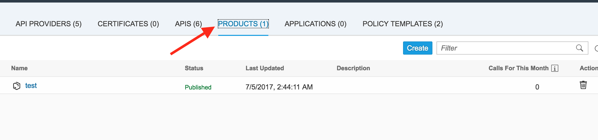
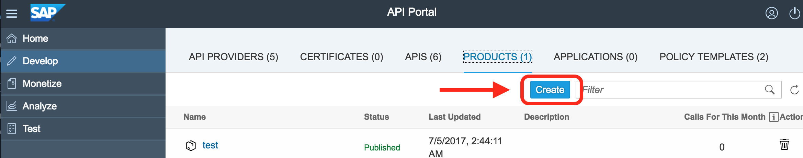
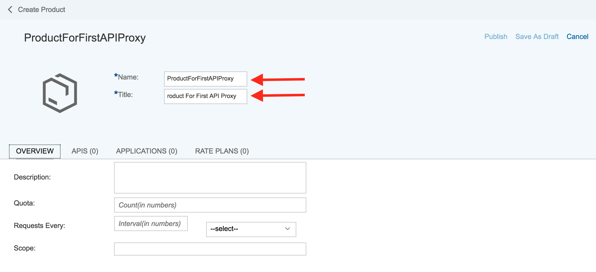
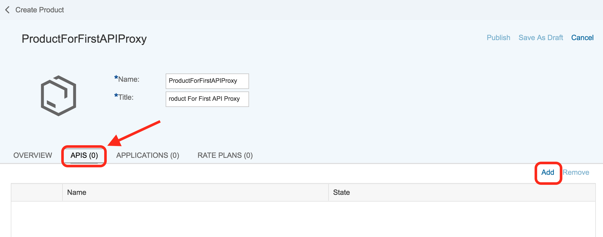
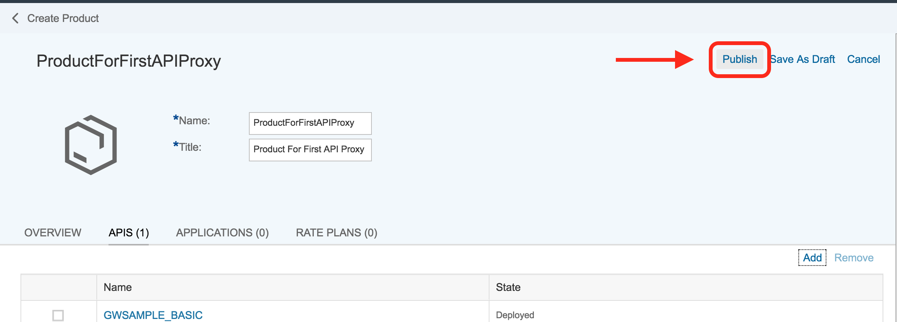
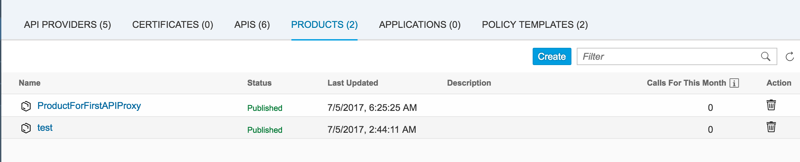

## Prerequisites  
- **Proficiency:** Beginner
- **Tutorials:** [Create an API Proxy](https://developers.sap.com/tutorials/hcp-apim-create-api.html)

## Next Steps
- [Protect your API Proxy by adding an Application Key Verification](https://developers.sap.com/tutorials/hcp-apim-verify-api.html)

## Details
### You will learn  
SAP Cloud Platform, API Management uses three main components to expose APIs.
- The API Provider is used to abstract the connection to the backend / target system
- The API Proxy is the actual API which contains the logic to connect to the target system. Here you can model the flow, add security policies, transform the incoming message or look for content injections
- The API Product which bundles one or more API Proxies before they are exposed in the API Developer portal so they can be consumed by a developer

In SAP Cloud Platform, API Management, API Proxies are grouped and exposed as so called Products. In this tutorial you will create a new product and assign the previously created API Proxy to it

### Time to Complete
**15 Min**.

---

[ACCORDION-BEGIN [Step 1: ](Open the SAP API Management API Portal)]

Open the SAP API Management API Portal (you can get the URL from Enable the SAP Cloud Platform, API Management Service).

[DONE]
[ACCORDION-END]

[ACCORDION-BEGIN [Step 2: ](Quick start a product creation)]

From the Home screen,  click on **Product** under the Quick Actions tile.

[DONE]
[ACCORDION-END]

[ACCORDION-BEGIN [Step 3: ](View current products)]

To access the list of Products, select the **Hamburger Menu** in the upper left corner and click on **Develop**

Select **Products** from the tab menu. This will bring up the list of previously created products.

[DONE]
[ACCORDION-END]

[ACCORDION-BEGIN [Step 4: ](Create a new product)]

On the **Products** tab, click on **Create** to start the new product wizard.

[DONE]
[ACCORDION-END]

[ACCORDION-BEGIN [Step 5: ](Add name and title)]

On the Overview page, Enter the values for *Name* and *Title*.

**Field** | **Value**
---- | ----
Name |`ProductForFirstAPIProxy`
Title | Product For First API Proxy

[DONE]
[ACCORDION-END]

[ACCORDION-BEGIN [Step 6: ](Select the API Proxy)]

In the tab menu, select **API**. This is were you can add and remove APIs and API Proxies from the product.

Click the **Add** button.

The list of API Proxies is populated from the APIs you have created. Select the API Proxy `GWSAMPLE_BASIC` that you created in the previous tutorial. Click **OK**.

[VALIDATE_6]
[ACCORDION-END]

[ACCORDION-BEGIN [Step 7: ](Click Publish)]

Click on **Publish**.

One Product is now available.

[DONE]
[ACCORDION-END]

