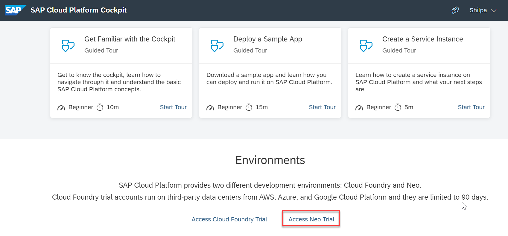
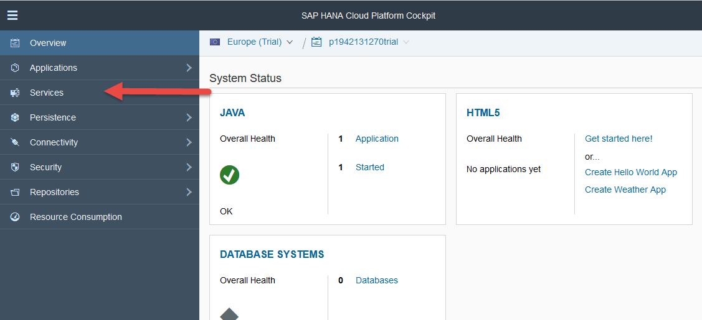
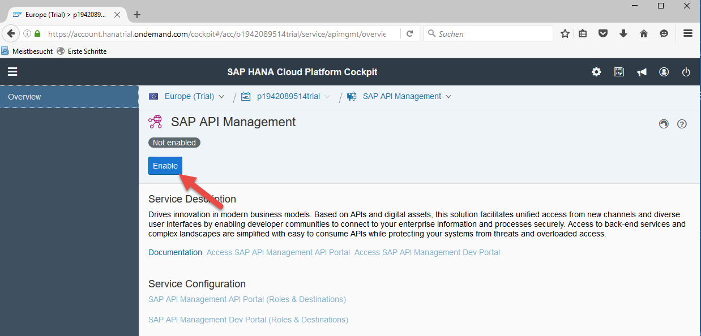
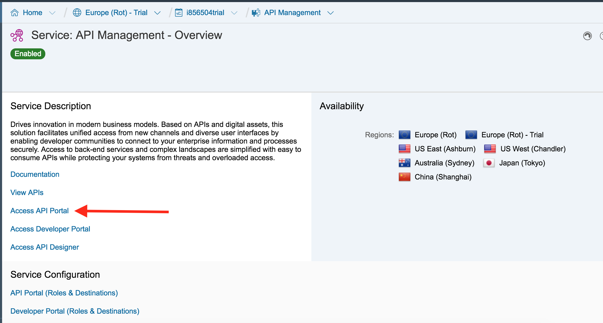
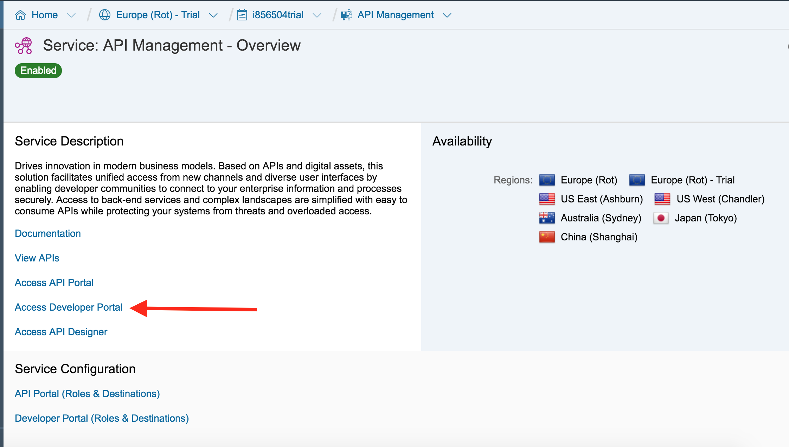

## Prerequisites  
- **Proficiency:** Beginner
- **Tutorials:** [Sign up for an account on SAP Cloud Platform](https://developers.sap.com/tutorials/hcp-create-trial-account.html)

## Next Steps
- Create a user in the SAP Gateway Developer System: [Create an account on the Gateway Demo system](https://developers.sap.com/tutorials/gateway-demo-signup.html)
- [Continue in SAP Cloud Platform, API Management by creating an API Provider](https://developers.sap.com/tutorials/hcp-apim-create-provider.html)

## Details
### You will learn  
With your SAP Cloud Platform Trial account you have access to several services which are available for free on a trial and testing basis. In this tutorial you will learn how to enable SAP Cloud Platform, API Management on the SAP Cloud Platform Trial Environment.

With this SAP API Management service you have your own instance of SAP API Management which allows you to create APIs, connect them to your systems (both SAP and non-SAP) and "play" with the available features.

### Time to Complete
**5 Min**.

---

[ACCORDION-BEGIN [Step 1: ](Learn about API Management as a tool)]

[What is API Management?](https://blogs.sap.com/2016/06/17/part-1-introduction-to-api-management/) Take a moment to read these blog posts at the beginning of each tutorial to learn more about what you are doing inside the API Management tool. A thorough understanding of the tool and actions you are taking to crucial to getting a solid grasp on how to properly configure an API Proxy. The blogs by Chris Whealy will take you through the theory and process behind the tech. Once you have taken some time to learn about API Management's features, come back to the tutorial steps to go through the technical execution. Some tutorials make feature multiple blogs at the beginning, while others may only have 1 or none. Read the blogs that are linked as they correspond with the tech you are about to configure, enable, or build with.

[VALIDATE_1]
[ACCORDION-END]

[ACCORDION-BEGIN [Step 2: ](Select Services in SAP Cloud Platform cockpit)]

Navigate to [SAP Cloud Platform Cockpit](https://cockpit.hanatrial.ondemand.com/cockpit), select **Access Neo Trial**.

From the **SAP Cloud Platform cockpit**, select **Services**.

[DONE]

[ACCORDION-END]

[ACCORDION-BEGIN [Step 3: ](Enable SAP API Management Portal)]

In the **Integration** section click on **SAP API Management**

Click on **Enable**

[DONE]

[ACCORDION-END]

[ACCORDION-BEGIN [Step 4: ](Access the SAP API Management Portals)]

You now have access to the SAP API Management API Portal

and the SAP API Management Dev Portal

[DONE]

[ACCORDION-END]
