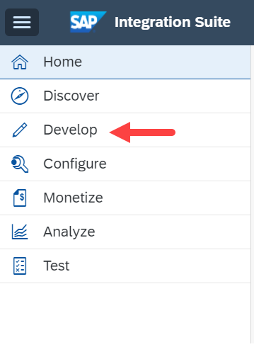
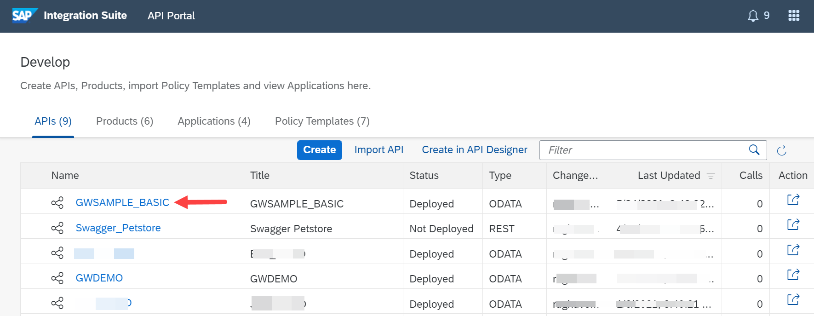
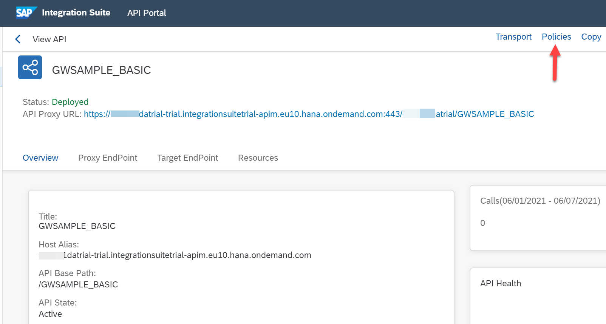
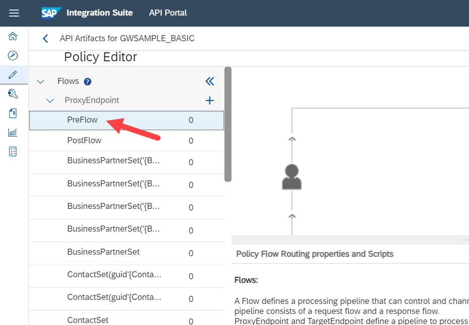
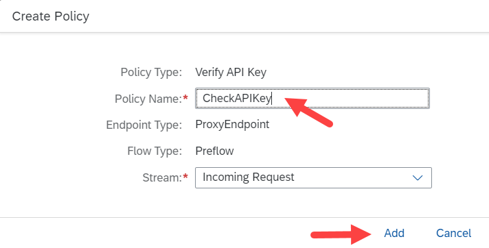
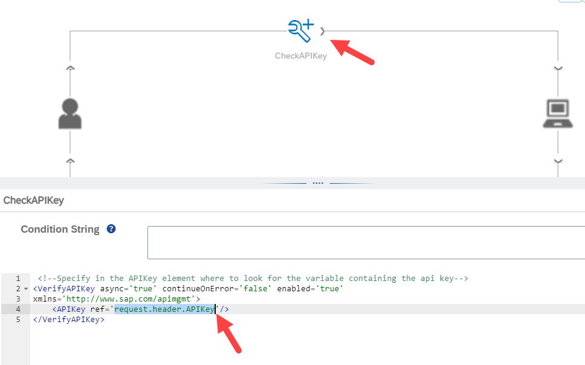
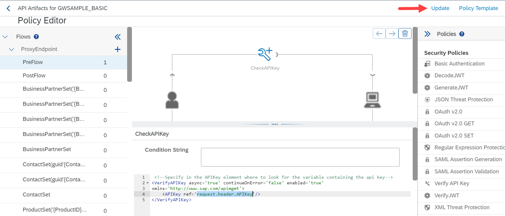
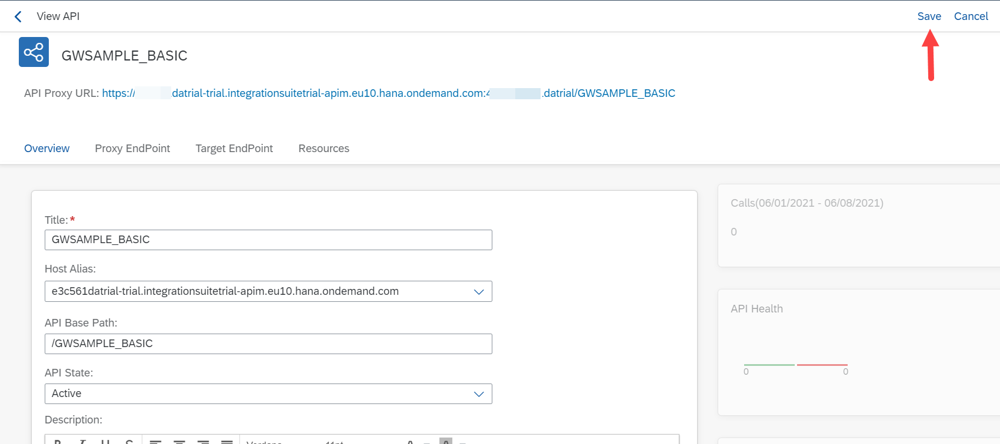

# Protect Your API Proxy by Adding Application Key Verification
<!-- description --> Protect your API Proxy with a first simple policy -- the Verify API Key policy.

## Prerequisites  
- **Tutorials:** [Add the API Proxy to a product](hcp-apim-create-product)

## You will learn  
SAP Integration Suite, API Management offers several out of the box policies which help you protect, model and "work" with your APIs. One of the security related Policies is the "Verify API Key" Policy.

## Intro
In this tutorial you will learn how to protect your API Proxy with the "Verify API Key" Policy. This policy allows you to add a simple protection via a so called API Key. Only calls which send a valid API Key along with the main request will be allowed to call the API Proxy.

---

### Learn about the API call flow

It is important to [understanding the API policy flow](https://blogs.sap.com/2016/06/22/part-7-understanding-api-policy-flow-routing/) so you gain an understanding of why a policy is applied at a certain time in the flow. For instance, access policies should be verified before the API call to reduce using resources unnecessarily. The entire request/response cycle is divided up, first into segments, then within each segment, into processing stages.

### Learn about the Policy Editor

When creating a policy, you will need to know how the information is available in the policy and policy editor. [Understand how the Policy Designer accesses the proxy flow](https://blogs.sap.com/2016/06/23/part-8-understanding-the-api-policy-designer/) by reading this blog post.

### Learn about how to assign a policy to a proxy

[Edit a policy and assign it to your proxy flow](https://blogs.sap.com/2016/06/23/part-9-assigning-policies-to-an-api-proxy/). This blog will ensure you know how to identify the proper stage to add a policy, as well as how to assign a policy to the flow.

### Learn about assigning multiple policies

You will look at [assigning multiple policies to various processing stages](https://blogs.sap.com/2016/06/24/part-10-assigning-multiple-policies-to-an-api-proxy/), and how the outcome of one policy can be used to influence the behavior of another policy.

### Access the SAP API Management API Portal

Open the SAP API Management API Portal (you can get the URL from Enable the SAP Integration Suite, API Management Service).

### View created APIs

From the **Hamburger Menu** in the upper left corner and click on **Develop**.

### Select an API

Select the API `GWSAMPLE_BASIC` created in a previous step in the this tutorial series.

### View API Policies

In the upper right corner click on **Policies** to open the policy information for the API.

### Open the edit page for policies

In the Policy Editor, click on **Edit**.

### Edit the PreFlow policies

Select the `PreFlow` from the `ProxyEndpoint` on the left hand side.

### Add Verify API Key policy

On the right hand, find the **Security Policies** section under the _Policies_ pane. Find the **Verify API Key** policy and click the **+** next to the policy name.

### Enter policy name

Enter the Policy Name `CheckAPIKey` and click on **Add**.

### Update API Key tag

In the **Code Editor** found in the bottom pane, look for the `<APIKey ... />` tag. Replace the string `variable_containing_api_key` with `request.header.APIKey`.

### Update and save changes

Click on **Update** to apply the new policies.

Click on **Save** to save the changes to the API and enforce the new policies.

### Optional
- When you now open the API Proxy in a browser you will get an error message stating that you need to pass an API Key in the header `APIKey`.
