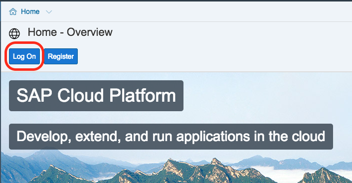
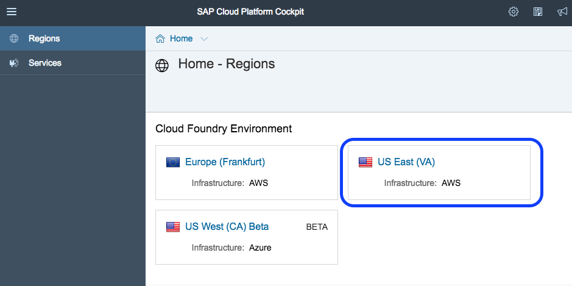
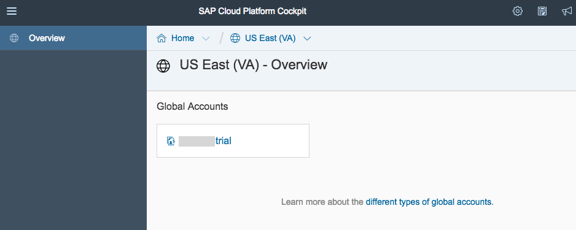
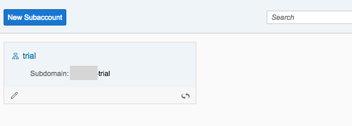
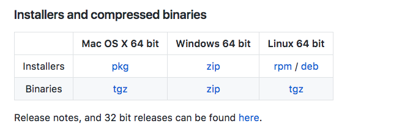
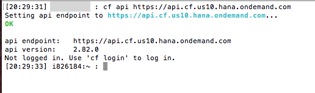

## Prerequisites  
 - **Proficiency:** Beginner | Intermediate | Advanced
 - **Tutorials:** [Do this tutorial first](http://www.sap.com/developer/tutorials/hcp-create-trial-account.html)

## Next Steps
 - Select a tutorial group from the [Tutorial Navigator](http://www.sap.com/developer/tutorial-navigator.html) or the [Tutorial Catalog](https://www.sap.com/developer/tutorial-navigator.tutorials.html)

## Details
### You will learn  
Describe what the user will learn from your tutorial and what the outcome will be.

### Time to Complete
**15 Min**

---

[ACCORDION-BEGIN [Step 1: ](Log in to the SAP Cloud Platform)]

Start by [logging in to the SAP Cloud Platform](https://account.hanatrial.ondemand.com/).

> **Note**: If you don't have an account on SAP Cloud Platform yet, go to the [Sign up for a free trial account](https://www.sap.com/developer/tutorials/hcp-create-trial-account.html) tutorial, and then come back to this step.

[DONE]
[ACCORDION-END]

[ACCORDION-BEGIN [Step 2: ](Select a Region)]

In the SAP Cloud Platform cockpit, choose _Home_ at the top of the screen.

This will lead you to the __Home-Regions__ screen.  Choose one of the _Cloud Foundry_ environments (these should be
at the top of the list).  

> Note:  Do not choose a `Neo` environment, as this is different from Cloud Foundry.

This tutorial will use the US East (VA) region.  You can use this region, but it is best to choose the region closest to you.

[DONE]
[ACCORDION-END]

[ACCORDION-BEGIN [Step 3: ](Select the Global Account and Sub-Account)]

Select the Global account that matches your login.

Next, select the `trial` sub-account.  

[DONE]
[ACCORDION-END]

[ACCORDION-BEGIN [Step 4: ](Download and install the Command Line interface)]

Download the latest Command Line Interface (CLI) from the Cloud Foundry web site.  Use the following URL:  [https://github.com/cloudfoundry/cli#downloads](https://github.com/cloudfoundry/cli#downloads).

On the Cloud Foundry website, choose either the command line installer (if you are set up to use one), or the binary from the table below.  If you don't know which to use, choose the installer (not the binary) for your Operating System from the table.

Open the installer on your computer, and follow the installation instructions.

> **Note**:  For more help with the CLI installation, look at the [Cloud Foundry CLI installation documentation](http://docs.cloudfoundry.org/cf-cli/install-go-cli.html).

[DONE]
[ACCORDION-END]

[ACCORDION-BEGIN [Step 5: ](Connect the CLI to the cloud region)]

First, find the correct API URL for your Region.  Select the correct region from this table.

| Region                            | URL                                     |
| --------------------------------- | --------------------------------------- |
| US East (VA) running on AWS       | `https://api.cf.us10.hana.ondemand.com` |
| US West (CA) running on Azure     | `https://api.cf.us20.hana.ondemand.com` |
| Europe (Frankfurt) running on AWS | `https://api.cf.eu10.hana.ondemand.com` |

> **Note**:  If your term is not listed, check the [additional region and host URL's](https://help.sap.com/viewer/65de2977205c403bbc107264b8eccf4b/Cloud/en-US/350356d1dc314d3199dca15bd2ab9b0e.html).

Next, open a command line prompt on your computer.  In the command line screen, type in the following:

    cf api [Region URL]

Replace the [Region URL] section with the URL you selected from the table.

[DONE]
[ACCORDION-END]

[ACCORDION-BEGIN [Step 6: ](Log in using the CLI)]

In the same command prompt (from the previous step) type in the following command:

    cf login

When prompted, enter your username and password.  Once you are logged in, you should see your API endpoint, user, org, and space as shown in the screenshot.

[DONE]
[ACCORDION-END]

---

You are now set up to use the Cloud Foundry systems on SAP Cloud Platform.

---

For more information on the Command Line Interface (CLI), go to the Cloud Foundry [Getting Started with the CLI](http://docs.cloudfoundry.org/cf-cli/getting-started.html) website.

## Next Steps
- Select a tutorial from the [Tutorial Navigator](http://www.sap.com/developer/tutorial-navigator.html) or the [Tutorial Catalog](http://www.sap.com/developer/tutorials.html)
