## Prerequisites  
- **Proficiency:** Intermediate
- **Tutorials:** [Sign up for an account on SAP Cloud Platform](https://www.sap.com/developer/tutorials/hcp-create-trial-account.html)
- You should also review the [system requirements for the cloud connector](https://help.sap.com/viewer/cca91383641e40ffbe03bdc78f00f681/Cloud/en-US/e23f776e4d594fdbaeeb1196d47bbcc0.html)

## Next Steps
- Select a tutorial from the [Tutorial Navigator](https://www.sap.com/developer/tutorial-navigator.html) or the [Tutorial Catalog](https://www.sap.com/developer/tutorials.html)

## Details
### You will learn  
You will learn how to setup and configure the SAP Cloud Platform cloud connector (briefly, cloud connector) which is the recommended way to connect applications running on SAP Cloud Platform with on-premise systems.

The cloud connector is a software component, which runs as an on-premise agent in the on-premise network and acts as a reverse invoke proxy between the customer network and SAP Cloud Platform. For more details on the cloud connector, please refer to the [online documentation](https://help.sap.com/viewer/cca91383641e40ffbe03bdc78f00f681/Cloud/en-US/e6c7616abb5710148cfcf3e75d96d596.html).

### Time to Complete
**20 Min**.

---

[ACCORDION-BEGIN [Step 1: ](Download the cloud connector)]

Before you begin, please check the [Prerequisites](https://help.sap.com/viewer/cca91383641e40ffbe03bdc78f00f681/Cloud/en-US/e23f776e4d594fdbaeeb1196d47bbcc0.html) section in the cloud connector documentation, to see if your hardware and software is capable of running the cloud connector.

After verifying the compatibility, you need to download the cloud connector binaries for your operating system from the SAP Cloud Platform tools page: https://tools.hana.ondemand.com/#cloud

For Windows and Linux there is a normal (installer) and a portable version available. Please check the documentation, if you're not familiar with the differences of the two version or need help making your decision: https://help.sap.com/viewer/cca91383641e40ffbe03bdc78f00f681/Cloud/en-US/57ae3d62f63440f7952e57bfcef948d3.html

> This tutorial uses Windows as operating system and thus focus on the usage of the Windows MSI installer of the cloud connector. If you want to install the cloud connector on one of the other supported operating systems, please refer to the documentation how to install it on other operating systems.

[ACCORDION-END]

[ACCORDION-BEGIN [Step 2: ](Begin installation)]

Start the installation by double-clicking the `.msi` file, and the installer welcome screen will appear.

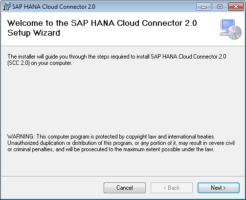

Choose an installation folder for the cloud connector. The default is `C:\SAP\scc20`. If you prefer a different location, simply adjust this value.

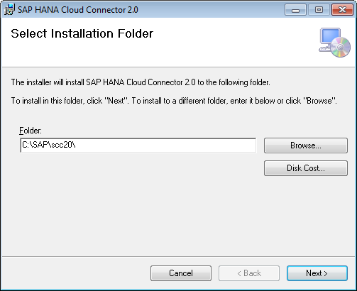

[ACCORDION-END]

[ACCORDION-BEGIN [Step 3: ](Choose a port)]

Thereafter you're requested to define the administration port of the cloud connector. Don't change the default value 8443, unless the port is already blocked by some other server. In this case simply choose an arbitrary port that is still available.

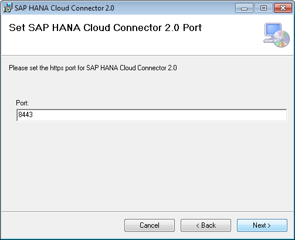

[ACCORDION-END]

[ACCORDION-BEGIN [Step 4: ](Finishing the installation)]

Decide whether the cloud connector shall be started after the installation has finished. In case this is desired by you, leave the check box marked, as we do it in this tutorial and press **Next**. You can also start and stop the cloud connector at an arbitrary time, how to achieve this is described in the next step of this tutorial.

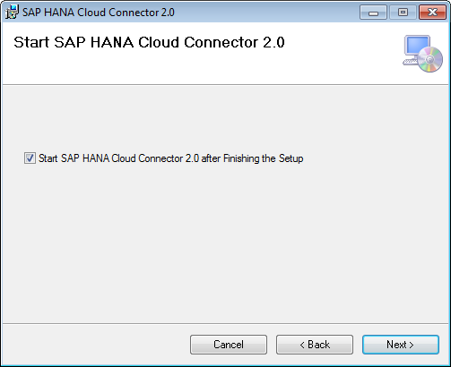

Confirm that you really want to install the cloud connector.  As soon as the installation has finished successfully, you can press the **Finish** button to complete the installation.

[ACCORDION-END]

[ACCORDION-BEGIN [Step 5: ](Check cloud connector status)]
As the cloud connector is registered and started as a Windows Service, you can check its status within the **Administrative Tools/Services** administration tool in Windows as shown in the screenshot. Look for the service named **SAP Cloud Connector** and make sure it's running. You can also start, restart or stop the cloud connector service in the same tool whenever that is needed.

> Pro-Tip: A quick way to lunch the Services administration tool is pressing the Windows-Key and R, which will open the run dialog, and entering `services.msc`.

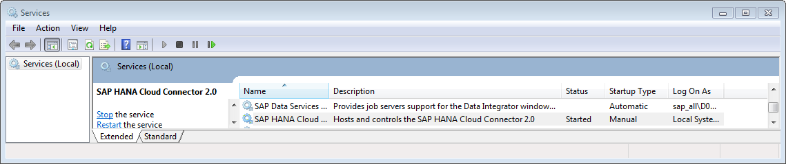

[ACCORDION-END]

[ACCORDION-BEGIN [Step 6: ](Verify connection)]

To establish the connection to your SAP Cloud Platform developer account, log on to the cloud connector administration UI by invoking the URL <https://localhost:8443> (you might have to substitute the port by the one you selected during the installation) in a Web browser.

Your browser will warn you that an untrusted certificate is used for the HTTPS connection. This is the case as the cloud connector is delivered with a self-signed `X.509` certificate. The documentation on how to configure a certificate that is trusted by your browser can be found in the Connectivity Service [online documentation](https://help.sap.com/viewer/65de2977205c403bbc107264b8eccf4b/Cloud/en-US/bcd5e113c9164ae8a443325692cd5b12.html). In this tutorial, we accept the untrusted certificate. The cloud connector logon screen then is shown in the browser. As user and password, use the pre-defined credentials:

Field          | Value
:------------- | :-------------
User Name      | `Administrator`
Password       | `manage`

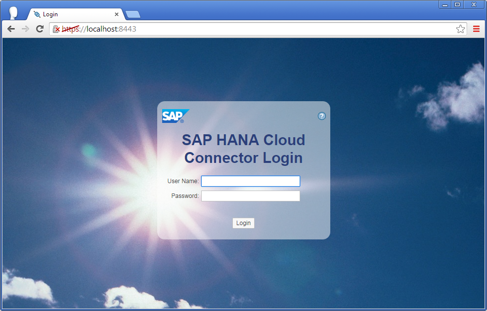

[ACCORDION-END]

[ACCORDION-BEGIN [Step 7: ](Initial Configuration)]

When logging in the first time, the cloud connector asks for two things:

- **Changing the initial password**: Choose a strong password that cannot be guessed easily.
- **The installation type of the cloud connector**: Choose `Master (Primary Installation)`. The other choice `Shadow (Backup Installation)` is used for a high availability installation of the cloud connector and is not used in this tutorial.

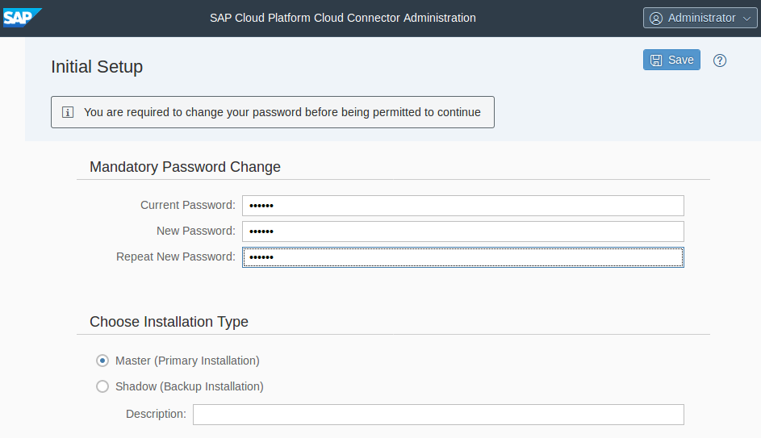

[ACCORDION-END]

[ACCORDION-BEGIN [Step 8: ](Define Account)]

To connect to cloud connector to your SAP CP account, select `hanatrial.ondemand.com` as Landscape Host, and specify your free developer account as Account Name (e.g. `p12345678trial`).

For the User Name and Password, use your SAP Cloud Platform account user (e.g. `p12345678`) and your SAP Cloud Platform password. In case your cloud connector is located within a corporate network that allows connectivity to internet resources only via a proxy, also specify the HTTPS proxy settings and click **Save**.

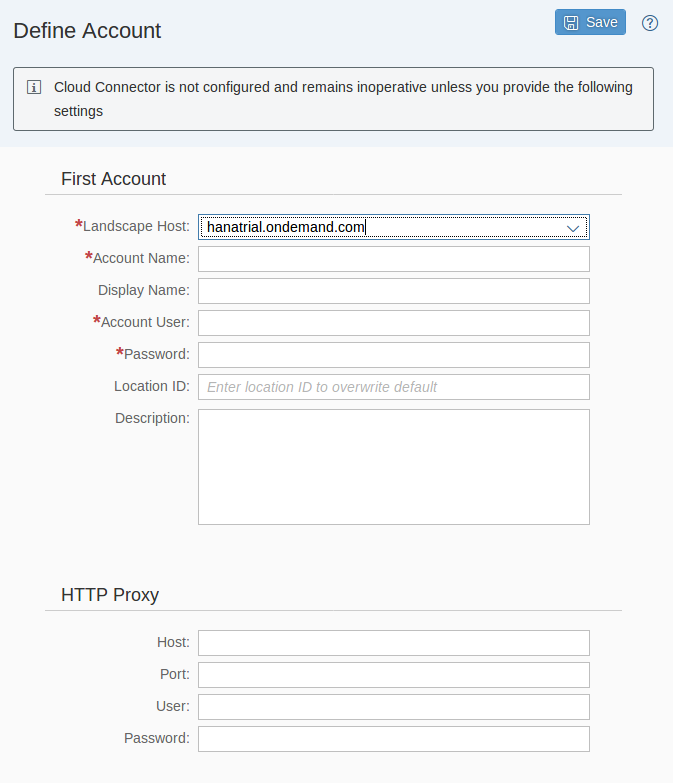

[ACCORDION-END]

[ACCORDION-BEGIN [Step 9: ](Check connection state)]

The main page of the cloud connector administration UI will appear. If the connection succeeded, you will see the **Status** with a yellow indicator as shown in the screenshot below. This indicates that you have a persistent SSL connection to your cloud account and are ready to use this connection in your cloud applications.
Click on the little arrow highlighted in the screenshot below to navigate into the account details.

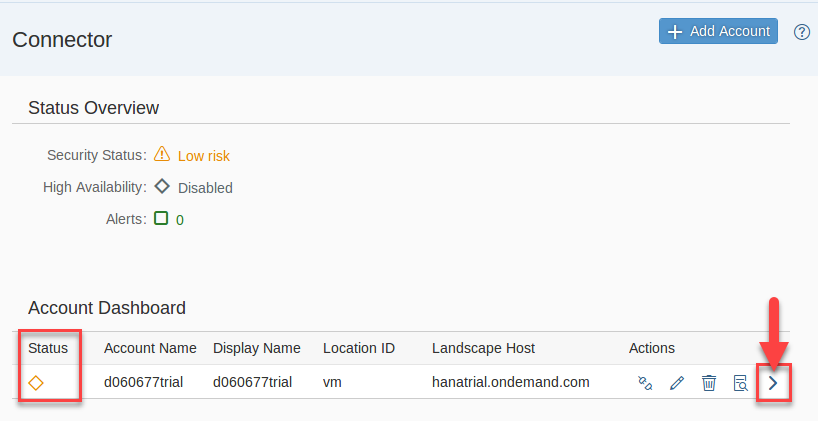

[ACCORDION-END]

[ACCORDION-BEGIN [Step 10: ](Configure on-premise resources)]

Now that you have connected the cloud connector to your cloud account, you still need to configure the on-premise resources that will be made accessible to the applications running in your cloud account. By default, **none** of the on-premise systems and resources are available after the installation of the cloud connector.

To configure available resources, navigate to the **Cloud To On-Premise** > **Access Control** view in the cloud connector.

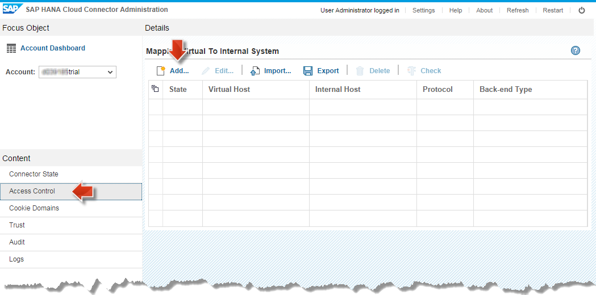

To add the on-premise systems click the **+** button in the Mapping Virtual to Internal System area.

[ACCORDION-END]

[ACCORDION-BEGIN [Step 11: ](Add system mapping)]

In the **Add System Mapping** dialog box, you can configure a physical on-premise system and map it to a virtual host and port. The virtual host and port are the names which must be used in the cloud applications in order to address the respective system. Besides this, you need to configure the protocol that shall be used to access the related system. Currently, HTTP(S) and RFC are supported.

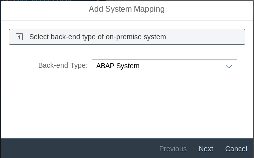
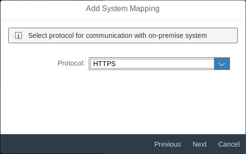
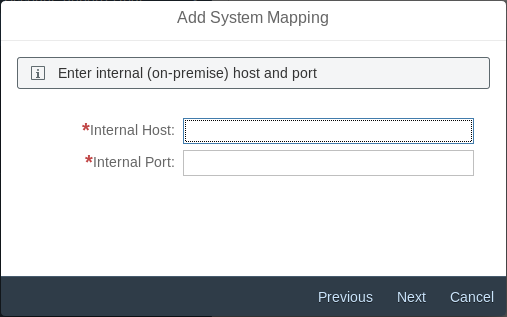

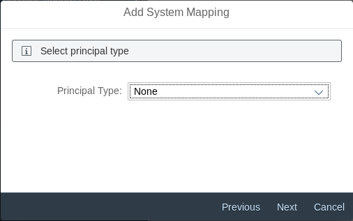
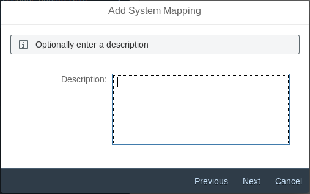
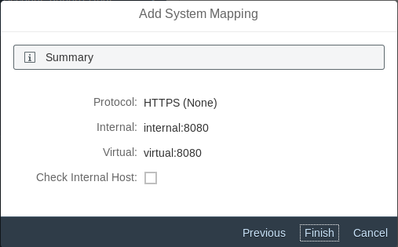

[ACCORDION-END]

[ACCORDION-BEGIN [Step 12: ](Expose resources to SAP Cloud Platform)]

After a system has been added, you can configure the resources on that system to be exposed to SAP Cloud Platform. To add a resource, select the system in the upper table, and then click the **+** button in the resources table on the lower part of the view.

For HTTP resources, the dialog box displayed will look like the screenshot below. Note that you can configure also the base path of a group of services, and use the Path and all sub-paths radio button to enable all sub-paths at once. However, use this option with care, as it might cover more HTTP services than desired.

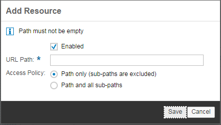

For more information on how to configure HTTP or RFC resources, see [Configure HTTP resource in Cloud Connector](https://help.sap.com/viewer/cca91383641e40ffbe03bdc78f00f681/Cloud/en-US/e7d4927dbb571014af7ef6ebd6cc3511.html) and [Configure RFC resource in Cloud Connector](https://help.sap.com/viewer/cca91383641e40ffbe03bdc78f00f681/Cloud/en-US/ca5868997e48468395cf0ca4882f5783.html).

[ACCORDION-END]

### Notes
This tutorial has described the minimum steps required to install the cloud connector. For productive use of the cloud connector, you should also follow the [recommendations regarding secure setup](https://help.sap.com/viewer/cca91383641e40ffbe03bdc78f00f681/Cloud/en-US/e7ea82a4bb571014a4ceb61cb7e3d31f.html) in the online documentation, and read the [cloud connector operator's guide](https://help.sap.com/viewer/cca91383641e40ffbe03bdc78f00f681/Cloud/en-US/2dded649c62c4fd8a65933f497042f14.html).

### Optional

Review some related materials online:

- [SAP Cloud Platform Cloud Connector](https://help.sap.com/viewer/cca91383641e40ffbe03bdc78f00f681/Cloud/en-US/e6c7616abb5710148cfcf3e75d96d596.html)
- [SAP Cloud Platform Cloud Connector installation](https://help.sap.com/viewer/cca91383641e40ffbe03bdc78f00f681/Cloud/en-US/57ae3d62f63440f7952e57bfcef948d3.html)
- [SAP Cloud Platform Cloud Connector operator's guide](https://help.sap.com/viewer/cca91383641e40ffbe03bdc78f00f681/Cloud/en-US/2dded649c62c4fd8a65933f497042f14.html)
- [Configure HTTP resource in Cloud Connector](https://help.sap.com/viewer/cca91383641e40ffbe03bdc78f00f681/Cloud/en-US/e7d4927dbb571014af7ef6ebd6cc3511.html)
- [Configure RFC resource in Cloud Connector](https://help.sap.com/viewer/cca91383641e40ffbe03bdc78f00f681/Cloud/en-US/ca5868997e48468395cf0ca4882f5783.html)

## Next Steps
- Select a tutorial from the [Tutorial Navigator](https://www.sap.com/developer/tutorial-navigator.html) or the [Tutorial Catalog](https://www.sap.com/developer/tutorials.html)
