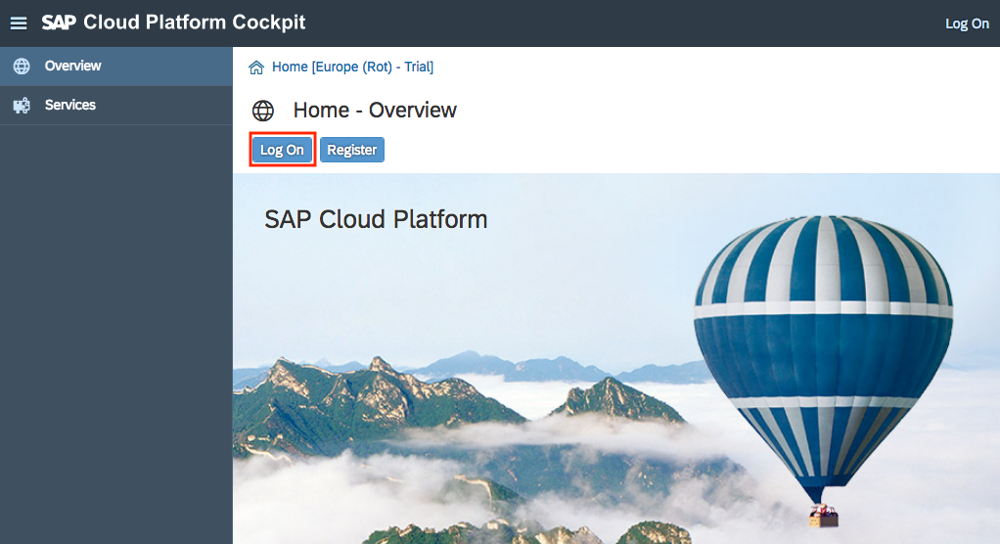
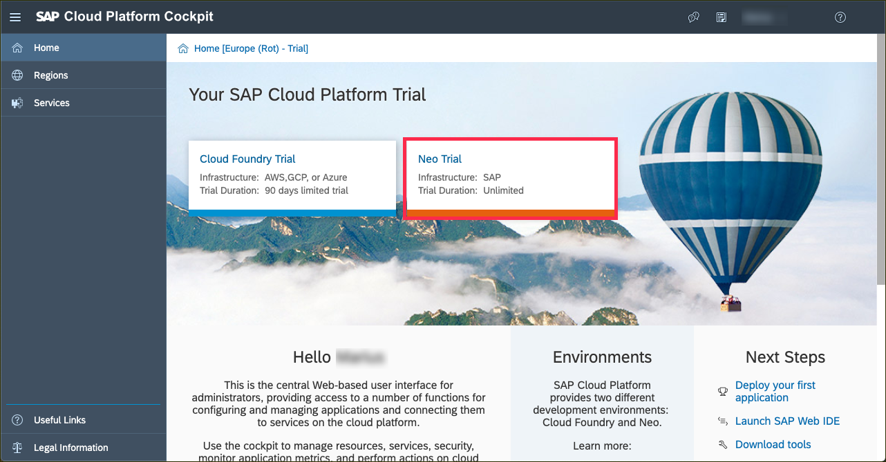
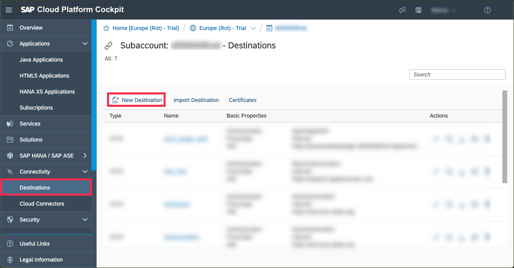
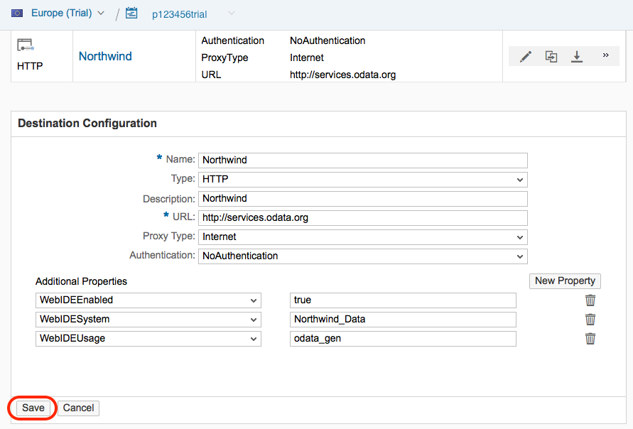
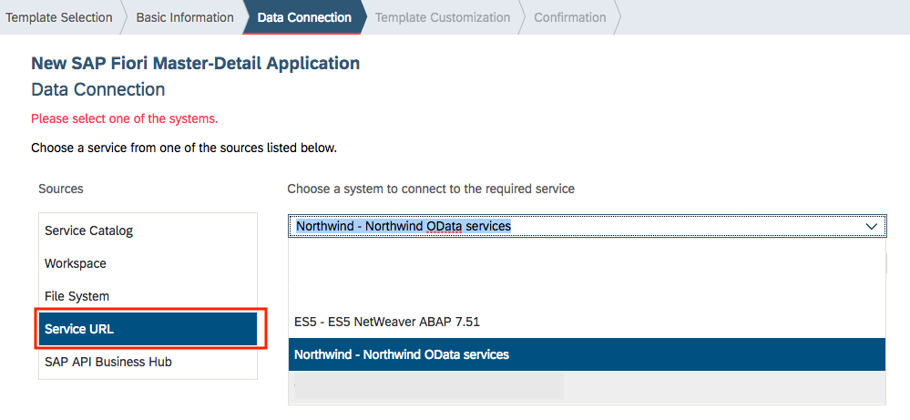
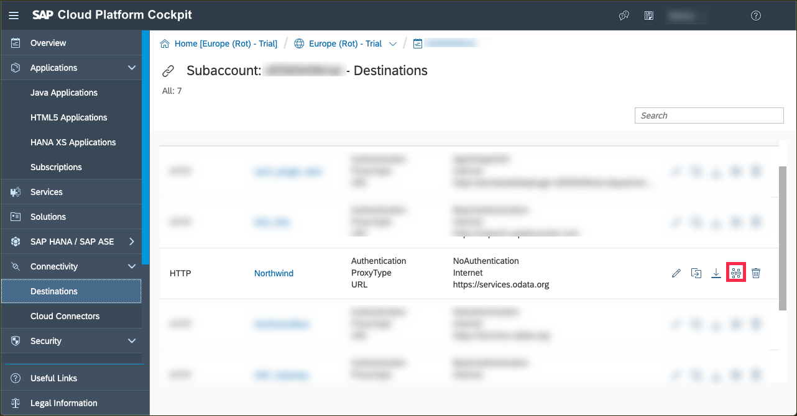

## Details
### You will learn
- How to configure a basic destination in the Neo environment
- What some of the Web IDE specific properties are
- How to specify the Web IDE usage parameter for a generic OData service

Destinations are key building blocks in the SAP Cloud Platform Connectivity service, and are used to define connections for outbound communication from your application to remote systems. These remote systems can be on-premises or in the cloud.

A destination has a name, a URL, authentication details, and some other configuration details.

The destination you will define here is for the set of [OData](http://www.odata.org) services known as the "Northwind" services, which are publicly available and hosted by OASIS at <https://services.odata.org>.

The Northwind OData services comes in several versions.  The tutorials currently use either V2 (<https://services.odata.org/V2/Northwind/Northwind.svc/>) or V4 (<https://services.odata.org/V4/Northwind/Northwind.svc/>).  To support both versions, and other versions that may be added later, you will create a generic connection to the Northwind service.  The exact path - and exact version - will be configured in later tutorials.

---

[ACCORDION-BEGIN [Step : ](Log into SAP Cloud Platform)]

Go to <https://account.hanatrial.ondemand.com> and log in to your SAP Cloud Platform cockpit.

[DONE]
[ACCORDION-END]

[ACCORDION-BEGIN [Step : ](Enter the Neo Environment)]

Scroll down the page and click on **Access Neo Trial** to enter the Neo environment.

[DONE]
[ACCORDION-END]

[ACCORDION-BEGIN [Step : ](Create new destination)]

Select the **Destinations** tab on the left side, and then click **New Destination** to open a new destination configuration form.

[DONE]
[ACCORDION-END]

[ACCORDION-BEGIN [Step : ](Confirm data)]

Enter/confirm all fields in the destination configuration section with the information below.

Field Name     | Value
:------------- | :-------------
Name           | `Northwind`
Type           | `HTTP`
Description    | `Northwind OData services`
URL            | `https://services.odata.org`
Proxy Type     | `Internet`
Authentication | `NoAuthentication`

> Do **not** use the entire path for the URL.  The URL should only be `https://services.odata.org`

When you specify a URL with the HTTPS scheme, a checkbox **Use default JDK truststore** will appear. Ensure that this is checked.

[DONE]
[ACCORDION-END]

[ACCORDION-BEGIN [Step : ](Add properties and save)]

Add three **Additional Properties** by clicking on the **New Property** button once for each property.

Field Name       | Value
:--------------- | :-------------
`WebIDEEnabled`  | `true`
`WebIDESystem`   | `Northwind_Data`
`WebIDEUsage`    | `odata_gen`

> Values for the `WebIDEUsage` property determine how the SAP Web IDE interprets the destination definition & presents it to you for connection and consumption. The value `odata_gen` signifies that the destination represents generic OData services (as opposed to OData services that are hosted on an SAP Gateway system, for example) and that the full, specific OData service URL specification is to be provided in the SAP Web IDE **New Project** wizard, specifically via the **Service URL** data connection source, as shown in this example scenario:

> 

> Find out more about the possible values for the `WebIDEUsage` property in the SAP Help Portal, in the [Connect to ABAP Systems](https://help.sap.com/viewer/825270ffffe74d9f988a0f0066ad59f0/Cloud/en-US/5c3debce758a470e8342161457fd6f70.html) section.

When you're done, finish by saving the destination with **`Save`**.

[DONE]
[ACCORDION-END]

[ACCORDION-BEGIN [Step : ](Check the connection)]

Click on the `Check Connection` icon on the newly created Destination to see if everything works.

[VALIDATE_4]
[ACCORDION-END]
