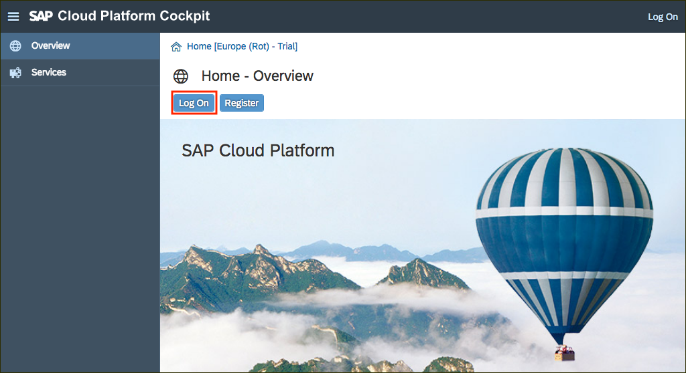
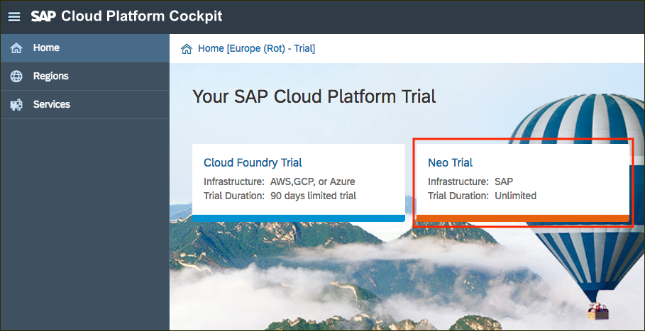
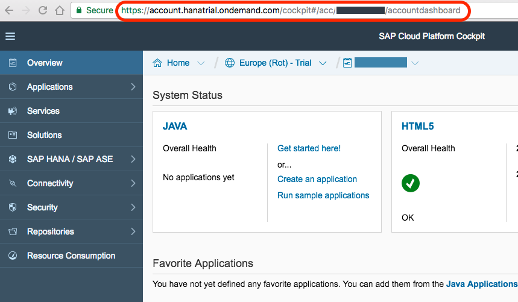

## Prerequisites
 - **Proficiency:** Beginner

## Details
### You will learn  
You will register with the SAP website and then "upgrade" your account (at no cost) for the SAP Cloud Platform trial.

### Time to Complete
**5 mins**
---

[ACCORDION-BEGIN [Step 1: ](Log into the SAP website)]

At the upper-right corner of this tutorial page (or any page on <a href="https://www.sap.com" target="new"><b>`www.sap.com`</b></a>), click the **Log On** icon. If you have an account on <a href="https://www.sap.com" target="new"><b>`www.sap.com`</b></a> (e.g. an S, C, D or I number) you can enter it or the associated email along with your password.

If you don't have an account yet, you can select one of the other login methods or click **Register** to create an account.

[DONE]
[ACCORDION-END]

[ACCORDION-BEGIN [Step 2: ](Register at sap.com)]
If you clicked **Register** in the previous step, you will see a **Register dialog**. Fill in the required fields, and click **Register**.

You will get a message that an activation link has been sent to you.

[DONE]
[ACCORDION-END]

[ACCORDION-BEGIN [Step 3: ](Activate your account)]

Once again in the upper-right corner of this tutorial page (or any page on <a href="https://www.sap.com" target="new"><b>`www.sap.com`</b></a>) click on the **Log On** button.

Enter the same credentials you used to log into the `SAP.com` website.

If you have just registered in the step above you may get a log-in error until you activate your account via the email link sent.

After activating your account, you will see the following screen. Click continue.

[DONE]
[ACCORDION-END]

[ACCORDION-BEGIN [Step 4: ](Upgrade your SAP.com registration)]

After activation, or if you already had an SAP account, go to the <a href="https://account.hanatrial.ondemand.com/" target="new"><b>SAP Cloud Platform Trial</b></a> (<https://account.hanatrial.ondemand.com/>) page and click on the **Log On** button.

Assuming you don't already have a SAP Cloud Platform trial account, you will see an **Upgrade your account for SAP.com** dialog. If so, fill out all fields and click **Register**. This simply adds the SAP.com registration to your login account on SAP Cloud Identity. There is no cost associated with this registration.

[DONE]
[ACCORDION-END]

[ACCORDION-BEGIN [Step 5: ](Access the SAP Cloud Platform cockpit)]

Once you have accepted the Terms and Conditions and registered, the SAP Cloud Platform Regions page will load.

Click on the ***Neo Trial*** tile to access your free personal trial account.

You can then review the latest ***News and Announcements***.

[DONE]
[ACCORDION-END]

[ACCORDION-BEGIN [Step 6: ](Validate the SAP Cloud Platform cockpit URL)]

Close the **News and Announcements** dialog box.

Copy the URL for your SAP Cloud Platform **Personal Trial Account** cockpit, and paste it in the text field below then click on **Validate**.

[VALIDATE_6]
[ACCORDION-END]
