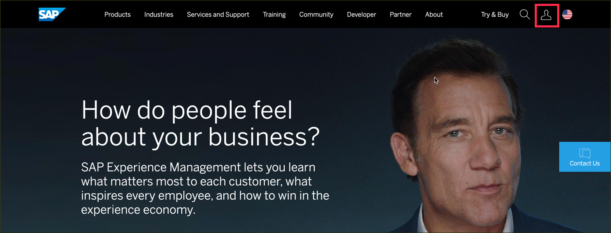
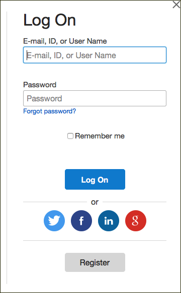
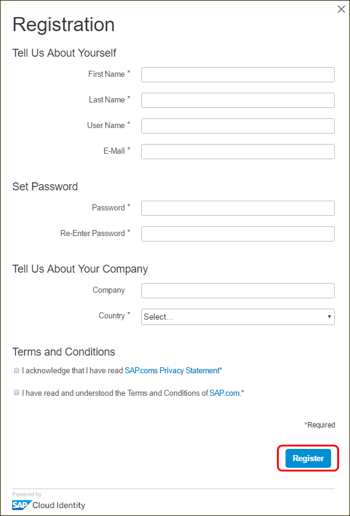
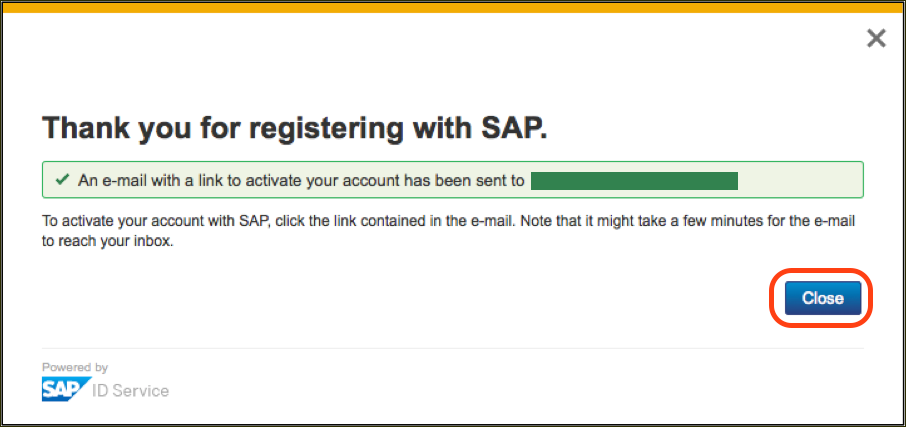
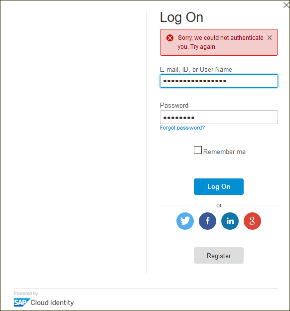
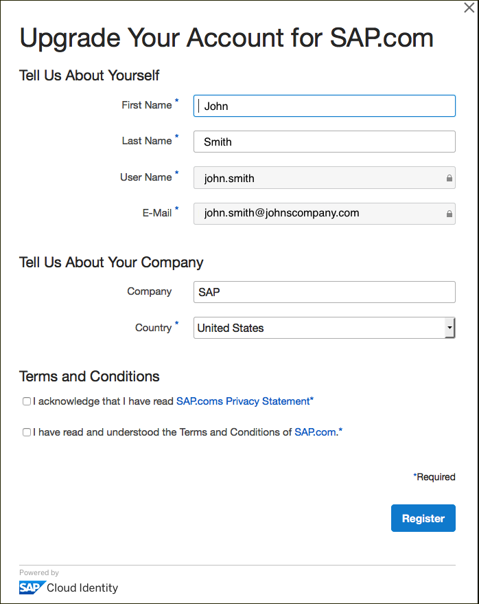
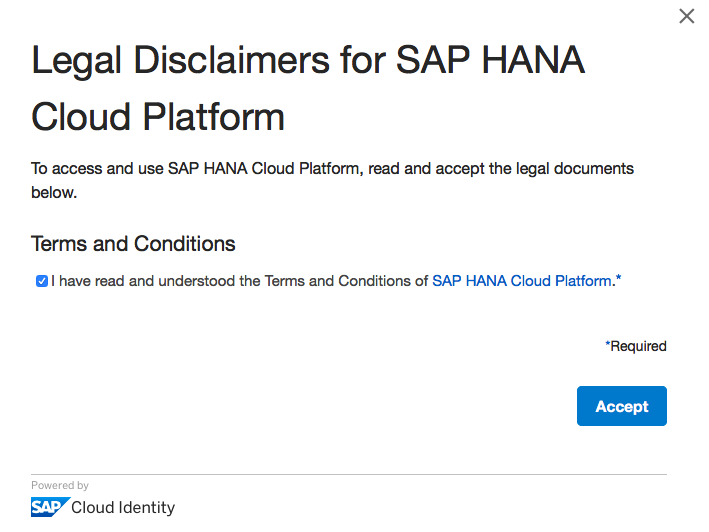
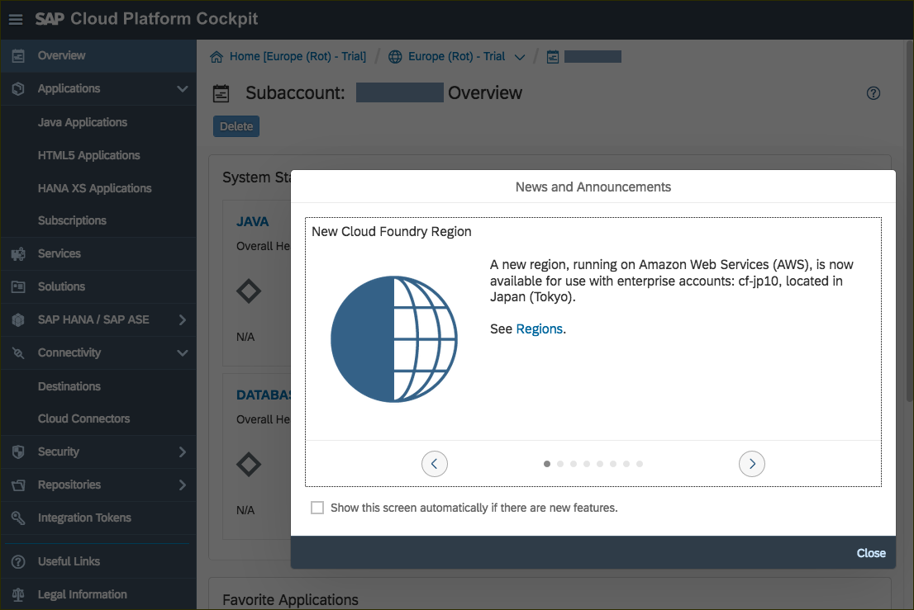

## Prerequisites
 - **Proficiency:** Beginner

## Next Steps
 - Go to the [AppSpace landing](http://www.sap.com/developer/app-space.html) page
 - For SAP HANA development: [SAP HANA XSC basic development](http://www.sap.com/developer/tutorials/hana-web-development-workbench.html)
 - For Mobile development [Create and deploy an app in the cloud series](http://www.sap.com/developer/tutorials/hcp-create-destination.html)
 - For SAP Cloud Platform predictive services development: [Create a new HANA MDC instance](http://www.sap.com/developer/tutorials/hcpps-hana-create-mdc-instance.html)
 - Select a tutorial from the [Tutorial Navigator](http://www.sap.com/developer/tutorial-navigator.html) or the [Tutorial Catalog](http://www.sap.com/developer/tutorials.html)

## Details
### You will learn  
You will register with the SAP website and then "upgrade" your account (at no cost) for the SAP Cloud Platform trial.

### Time to Complete
**5 mins**
---

[ACCORDION-BEGIN [Step 1: ](Log into the SAP website)]

At the upper-right corner of this tutorial page (or any page on `www.sap.com` ), click the **Log On** icon. If you have an account on `www.sap.com` (e.g. an S, C, D or I number) you can enter it or the associated email along with your password.

If you don't have an account yet, you can select one of the other login methods or click **Register** to create an account.

[DONE]
[ACCORDION-END]

[ACCORDION-BEGIN [Step 2: ](Register at sap.com)]
If you clicked **Register** in the previous step, you will see a **Register dialog**. Fill in the required fields, and click **Register**.

You will get a message that an activation link has been sent to you.

[DONE]
[ACCORDION-END]

[ACCORDION-BEGIN [Step 3: ](Activate your account)]

Once again in the upper-right corner of this tutorial page (or any page on `www.sap.com`) click on the **Log On** button.

Enter the same credentials you used to log into the `SAP.com` website.

If you have just registered in the step above you may get a log-in error until you activate your account via the email link sent.

After activating your account, you will see the following screen. Click continue.

[DONE]
[ACCORDION-END]

[ACCORDION-BEGIN [Step 4: ](Add the SAP.com registration to your SAP Cloud Identity account)]

After activation, or if you already had an SAP account, go to the [SAP Cloud Platform Trial](https://account.hanatrial.ondemand.com/) (<https://account.hanatrial.ondemand.com/>) page and click on the **Log On** button.

Assuming you don't already have a SAP Cloud Platform trial account, you will see an **Upgrade your account for SAP.com** dialog. If so, fill out all fields and click **Register**. This simply adds the SAP.com registration to your login account on SAP Cloud Identity. There is no cost associated with this registration.

[DONE]
[ACCORDION-END]
<!--
[ACCORDION-BEGIN [Step 4: ](Verify you are logged in)]

The icon in the upper-right corner of this tutorial page (or any page on `www.sap.com` ), will update to show a generic profile symbol, or an avatar image if you've uploaded one.

[DONE]
[ACCORDION-END]

[ACCORDION-BEGIN [Step 5: ](Log into SAP Cloud Platform Trial system)]

Go to the [SAP Cloud Platform Trial](https://account.hanatrial.ondemand.com/) (<https://account.hanatrial.ondemand.com/>) page and click on the **Log On** button.

Enter the same credentials you used to log into the `SAP.com` website.

[DONE]
[ACCORDION-END]

[ACCORDION-BEGIN [Step 5: ](Accept trial terms and conditions)]

You will be prompted with the legal disclaimer dialog box;  check the box and click **Accept** to continue.

[DONE]
[ACCORDION-END] -->

[ACCORDION-BEGIN [Step 5: ](SAP Cloud Platform cockpit)]

Once you have accepted the Terms and Conditions and registered, the SAP Cloud Platform cockpit will load.

[DONE]
[ACCORDION-END]

## Next Steps
 - Go to the [AppSpace landing](http://www.sap.com/developer/app-space.html) page
 - For SAP HANA development: [SAP HANA XSC basic development](http://www.sap.com/developer/tutorials/hana-web-development-workbench.html)
 - For Mobile development [Create and deploy an app in the cloud series](http://www.sap.com/developer/tutorials/hcp-create-destination.html)
 - For SAP Cloud Platform predictive services development: [Create a new HANA MDC instance](http://www.sap.com/developer/tutorials.html?link=hcpps-hana-create-mdc-instance.html)
 - Select a tutorial from the [Tutorial Navigator](http://www.sap.com/developer/tutorial-navigator.html) or the [Tutorial Catalog](http://www.sap.com/developer/tutorials.html)
