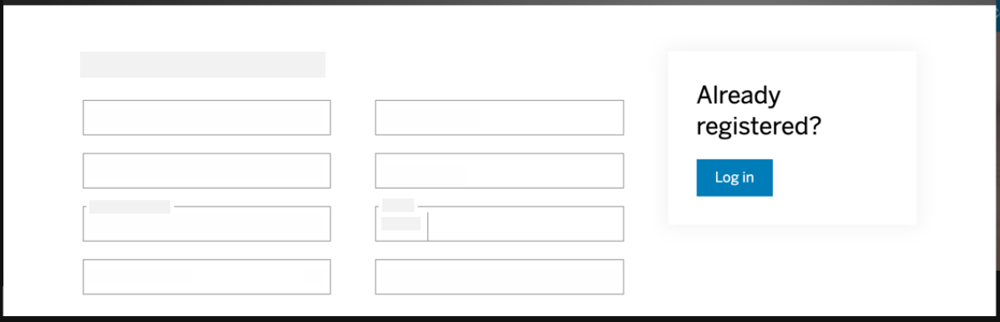
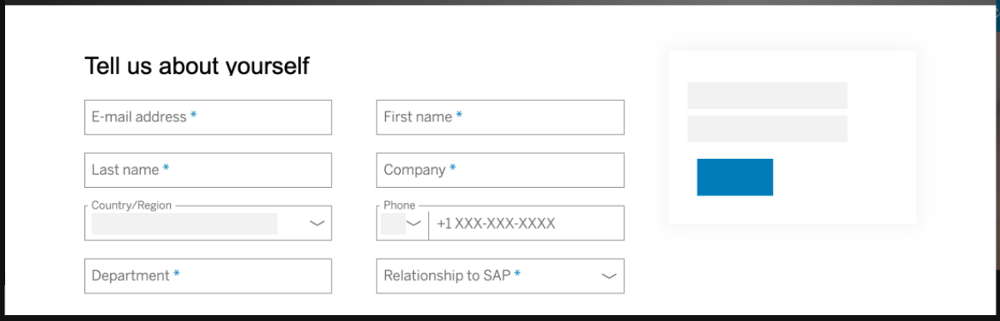
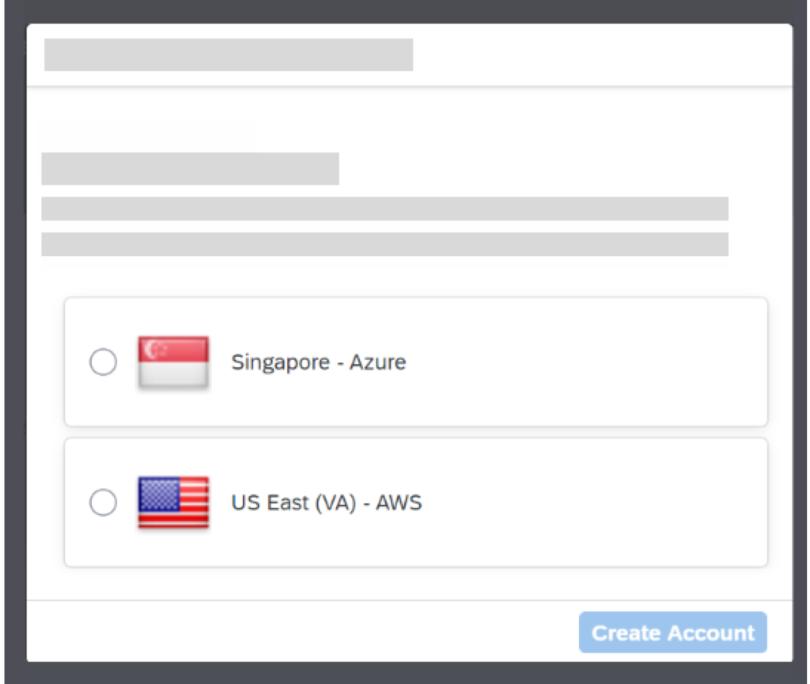
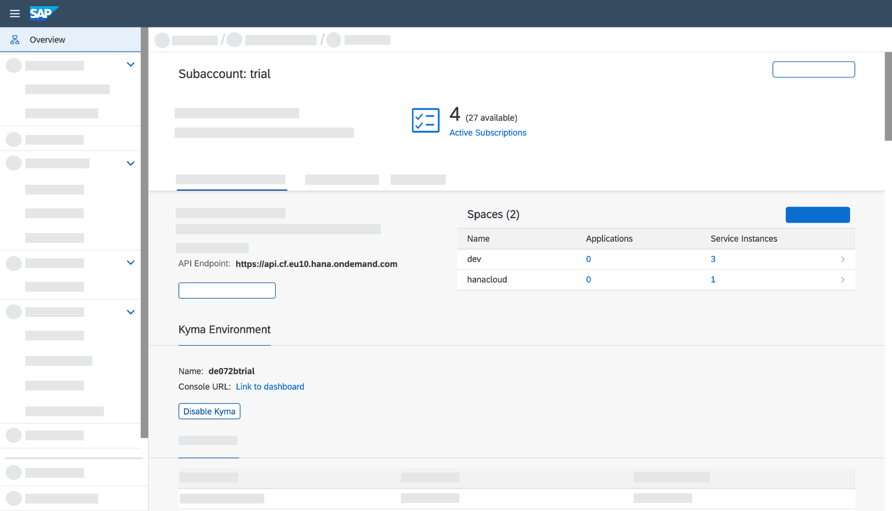
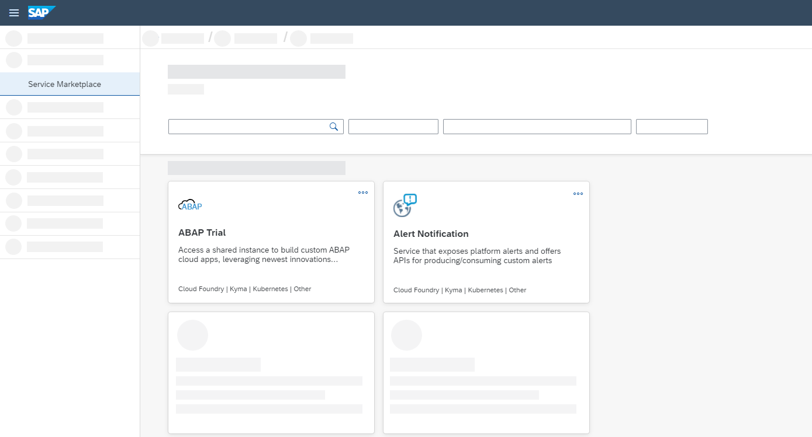

## Details
### You will learn  
  - How to register on the SAP website
  - How to start your SAP BTP Trial
  - How to navigate to your sub-account and space
  - Where to find information on three important Cloud Foundry areas:  Applications, Service Marketplace, and Service Instances

---

[ACCORDION-BEGIN [Step : ](Log into the SAP website)]

Visit <https://www.sap.com> and click the **Log On** icon in the upper-right corner.

**If you have an account** on <a href="https://www.sap.com" target="new"><b>`www.sap.com`</b></a> (e.g. a P, S, C, D or I number) you can enter it or the associated email along with your password. If you don't have an account yet, you can select one of the other login methods or click **Register** to create an account.

!

If you don't need to register with sap.com, you can skip to Step 4. Make sure to make all steps as _DONE_ to get credit for completing this tutorial.

[DONE]
[ACCORDION-END]

[ACCORDION-BEGIN [Step : ](Register at sap.com)]
**If you don't have an account** you will see a **register dialog** on the left-hand side of the dialog. Fill in the required fields, and click **Submit**.

!

You will see a message that an activation link has been sent to you.

[DONE]
[ACCORDION-END]

[ACCORDION-BEGIN [Step : ](Activate your account)]

Check your emails to find the activation button **Click to activate your account**.

!

You will see a success message after activating your account.

[DONE]
[ACCORDION-END]

[ACCORDION-BEGIN [Step : ](Log on to SAP BTP Trial)]

After activation, or if you already had an SAP account, go to the <a href="https://account.hanatrial.ondemand.com/" target="new"><b>SAP BTP Trial</b></a> page and click **Log On**.

You will see an dialog to confirm the terms and condition for the SAP BTP Trial. **Check the check boxes** and click **Accept**. This simply adds the SAP.com registration to your login account on SAP Cloud Identity.

[DONE]
[ACCORDION-END]

[ACCORDION-BEGIN [Step ](Verify your account)]

1. You will see a message that you need to verify your account with a phone number. Click **Verify your phone number** to trigger that flow.

    !

2. Enter your phone number and click **New Code** to retrieve a code.

3. Please enter this code as well and click **Continue** to verify your account. After the verification, you will be logged off automatically.

[DONE]
[ACCORDION-END]
[ACCORDION-BEGIN [Step](Access the welcome screen)]

Click on **Log on** to log on to your verified account.

You will see one main button on the welcome screen of the SAP BTP Cockpit. Click on **Enter Your Trial Account** to navigate to your global account.

 !

> Bookmark the link for fast and quick access to the cockpit.  

[DONE]
[ACCORDION-END]
[ACCORDION-BEGIN [Step](Navigate to the subaccount)]

1. Here, you can now create a subaccount that lives in a geographic region. **Choose any region** from this list and click **Create Account** to trigger the provisioning process.

    

2. You will then see a dialog box while the account is set up.  When complete, click **Continue** to close to popup and to navigate to the new account.

3. The global trial account contains **one** subaccount and space. Navigate to subaccount by clicking on the tile named **trial** (this name may vary if you created the subaccount manually).

    !

4. This page will display the current state of the subaccount. You can manage your subscriptions and jump into the different runtime environments. It also shows you fundamental; information of the Cloud Foundry environment, such as the API endpoint and the available spaces.

    !

[DONE]
[ACCORDION-END]
[ACCORDION-BEGIN [Step](Learn about the service marketplace)]

In the service marketplace you can find all services that are available on  **any** of the environments. Select **Service Marketplace** on the left to see all available services and a filter bar to find the one you are looking for. From here you can specify a service plan to provision service instances.

!

[VALIDATE_1]
[ACCORDION-END]

 

Give us 55 seconds of your time to help us improve

