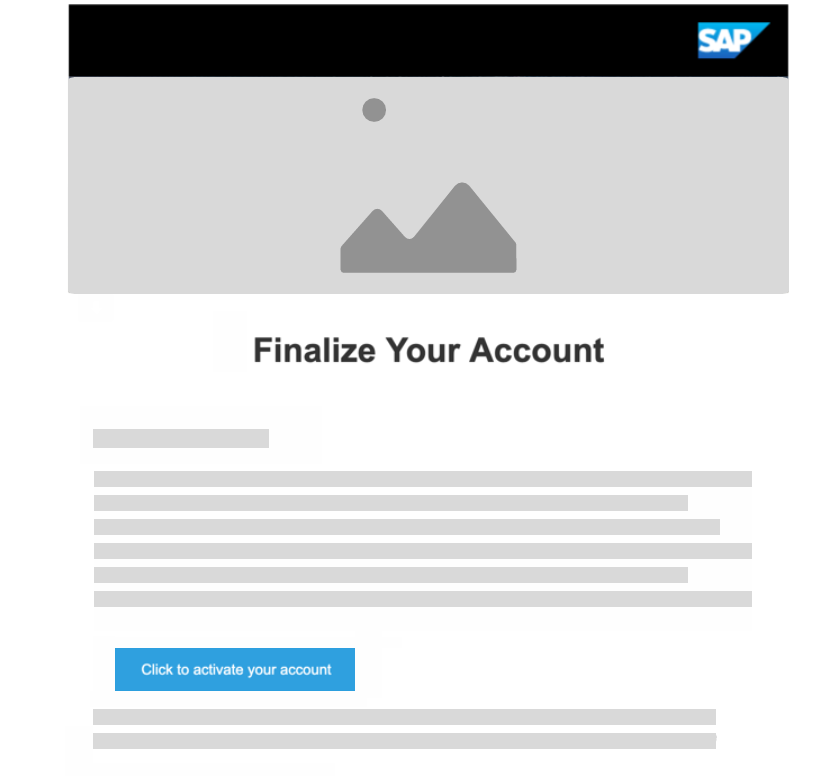

## Details
### You will learn  
  - How to register on the SAP website
  - How to "upgrade" your account (at no cost) for the SAP Cloud Platform trial

---

[ACCORDION-BEGIN [Step 1: ](Log into the SAP website)]

Visit <https://www.sap.com> and click the **Log On** icon in the upper-right corner.

**If you have an account** on <a href="https://www.sap.com" target="new"><b>`www.sap.com`</b></a> (e.g. an S, C, D or I number) you can enter it or the associated email along with your password. If you don't have an account yet, you can select one of the other login methods or click **Register** to create an account.

If you don't need to register with sap.com, you can skip to Step 4. Make sure to make all steps as _DONE_ to get credit for completing this tutorial.

[DONE]
[ACCORDION-END]

[ACCORDION-BEGIN [Step 2: ](Register at sap.com)]
**If you don't have an account** you will see a **register dialog** on the left-hand side of the dialog. Fill in the required fields, and click **Submit**.

You will get a message that an activation link has been sent to you.

[DONE]
[ACCORDION-END]

[ACCORDION-BEGIN [Step 3: ](Activate your account)]

Check your emails to find the activation button **Click to activate your account**.

After activating your account, you will see the following screen.

[DONE]
[ACCORDION-END]

[ACCORDION-BEGIN [Step 4: ](Log on to SAP Cloud Platform)]

After activation, or if you already had an SAP account, go to the <a href="https://account.hanatrial.ondemand.com/" target="new"><b>SAP Cloud Platform Trial</b></a>  page and click **Log On**.

You will see an dialog to confirm the terms and condition for the SAP Cloud Platform Developer Edition. Check the check boxes and click **Accept**. This simply adds the SAP.com registration to your login account on SAP Cloud Identity. There is no cost associated with this upgrade.

[DONE]
[ACCORDION-END]

[ACCORDION-BEGIN [Step 5: ](Access the SAP Cloud Platform cockpit)]

Now you can see the SAP Cloud Platform Cockpit. The first screen should prompt you for the [environment](https://help.sap.com/viewer/65de2977205c403bbc107264b8eccf4b/Cloud/en-US/ab512c3fbda248ab82c1c545bde19c78.html) you want to use.

Click the ***Neo Trial*** tile to access your free trial account.

[DONE]
[ACCORDION-END]

[ACCORDION-BEGIN [Step 6: ](Validate the SAP Cloud Platform cockpit URL)]

Close the **News and Announcements** dialog box.

Copy the URL for your SAP Cloud Platform **Personal Trial Account** cockpit, and paste it in the text field below, and then click **Validate**.

[VALIDATE_6]
[ACCORDION-END]
