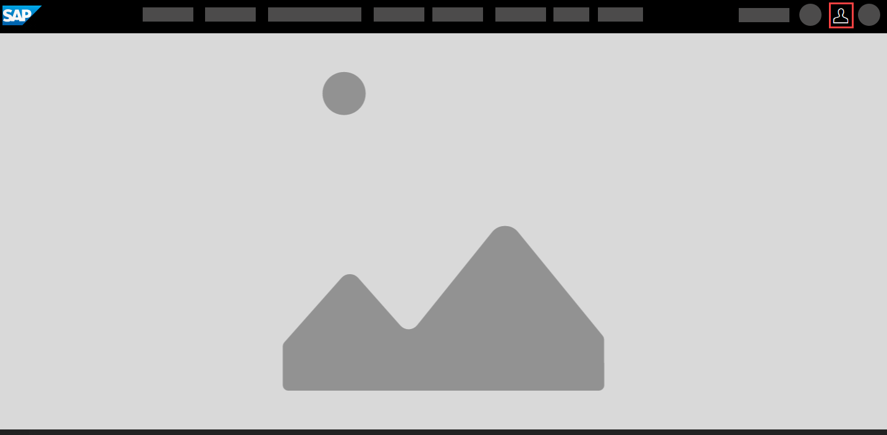
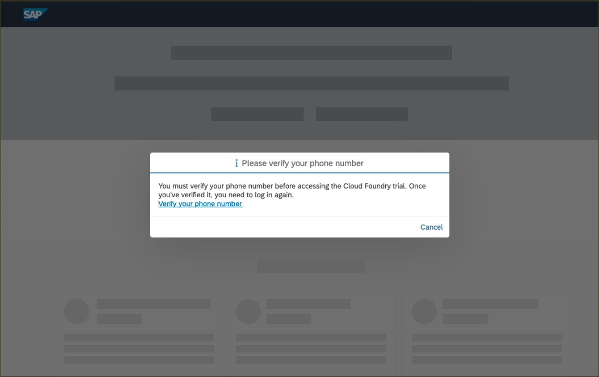

## Details
### You will learn  
  - How to register on the SAP website
  - How to start your SAP Cloud Platform trial
  - How the 90-day trial works
  - How to navigate to your sub-account and space
  - Where to find information on three important Cloud Foundry areas:  Applications, Service Marketplace, and Service Instances

---

[ACCORDION-BEGIN [Step : ](Log into the SAP website)]

Visit <https://www.sap.com> and click the **Log On** icon in the upper-right corner.

**If you have an account** on <a href="https://www.sap.com" target="new"><b>`www.sap.com`</b></a> (e.g. an S, C, D or I number) you can enter it or the associated email along with your password. If you don't have an account yet, you can select one of the other login methods or click **Register** to create an account.

If you don't need to register with sap.com, you can skip to Step 4. Make sure to make all steps as _DONE_ to get credit for completing this tutorial.

[DONE]
[ACCORDION-END]

[ACCORDION-BEGIN [Step : ](Register at sap.com)]
**If you don't have an account** you will see a **register dialog** on the left-hand side of the dialog. Fill in the required fields, and click **Submit**.

You will get a message that an activation link has been sent to you.

[DONE]
[ACCORDION-END]

[ACCORDION-BEGIN [Step : ](Activate your account)]

Check your emails to find the activation button **Click to activate your account**.

After activating your account, you will see the following screen.

[DONE]
[ACCORDION-END]

[ACCORDION-BEGIN [Step : ](Log on to SAP Cloud Platform)]

After activation, or if you already had an SAP account, go to the <a href="https://account.hanatrial.ondemand.com/" target="new"><b>SAP Cloud Platform Trial</b></a>  page and click **Log On**.

You will see an dialog to confirm the terms and condition for the SAP Cloud Platform Developer Edition. Check the check boxes and click **Accept**. This simply adds the SAP.com registration to your login account on SAP Cloud Identity. There is no cost associated with this upgrade.

[DONE]
[ACCORDION-END]

[ACCORDION-BEGIN [Step ](Verify your account)]

You will see a message that you need to verify your account with a phone number. Click **Verify your phone number** to trigger that flow.

Enter your phone number and click **New Code** to retrieve a code. Please enter this code as well and click **Continue** to verify your account. After the verification, you will be logged off automatically.

[DONE]
[ACCORDION-END]
[ACCORDION-BEGIN [Step](Select region for trial account)]

Click on **Log on** to log on to your verified account.

 

Here, you can now create a subaccount which lives in a geographic region. Choose one of regions from this list.    

> We suggest the *Europe (Frankfurt)* region because it has the largest list of services.  If you want to use a region closer to you, [check to be certain it has the services you want before selecting it](https://help.sap.com/doc/aa1ccd10da6c4337aa737df2ead1855b/Cloud/en-US/3b642f68227b4b1398d2ce1a5351389a.html?3b642f68227b4b1398d2ce1a5351389a.html).

You will then see a dialog box while the account is set up.  When complete, the dialog box will look like this.  Click **Continue** to close to popup.

[DONE]
[ACCORDION-END]
[ACCORDION-BEGIN [Step](Navigate to the Cloud Foundry space)]

You will see two buttons on the welcome screen of the SAP Cloud Platform Cockpit. Click on **Enter Your Trial Account** to see your global account.

> Bookmark the link for fast and quick access to the cockpit.  

The global trial account contains **one** subaccount and space. Navigate to subaccount by clicking on the tile named **trial** (this name may vary if you created the subaccount manually).

To get to the space, in which your applications and services live, click on the **dev** space.

[DONE]
[ACCORDION-END]
[ACCORDION-BEGIN [Step](Learn about Applications and Service Marketplace tabs)]

A Cloud Foundry space is the logical container of your runtime artefacts such as **Applications**, and **Service Instances**.

The **Applications** tab is where all of your applications will be listed, and new applications can be added in to your Cloud Foundry runtime environment.  

The **Service Marketplace** is where you can find services to attach to any of your applications.  These services are provided by SAP Cloud Platform to make it easier to create, and produce, web applications quickly and easily. Once a service has been created, we call it a service instance.

[DONE]
[ACCORDION-END]
[ACCORDION-BEGIN [Step](Understand the trial counter)]

You can find a small counter on the top of the screen. This counter indicates how many days you have left in your free trial. Once the counter goes to zero, all your apps may be stopped and your subaccount will go to sleep. This means all apps will be stopped and you won't be able to log in via the CF CLI anymore (until you extend your trial).
Extending the trial means you will get another 30 days until the account will go to sleep. After extending two times (e.g. 90 days) your subaccount will be deleted. E.g. all apps and services will be gone and you cannot log in via the CLI anymore. After this point, you can start your new trial from scratch via the SAP Cloud Platform Cockpit (see step 6).

[VALIDATE_1]
[ACCORDION-END]
