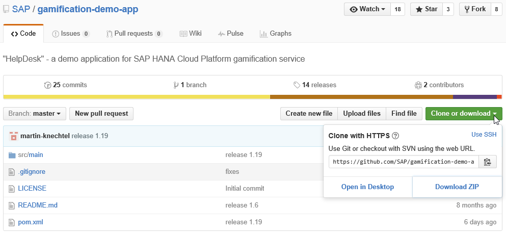
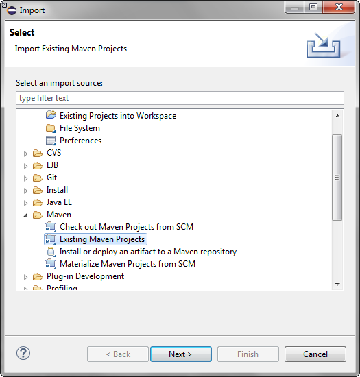
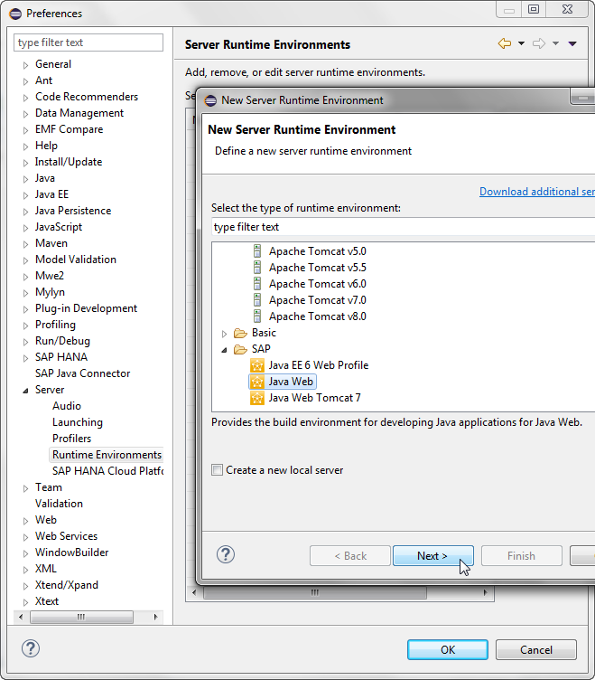
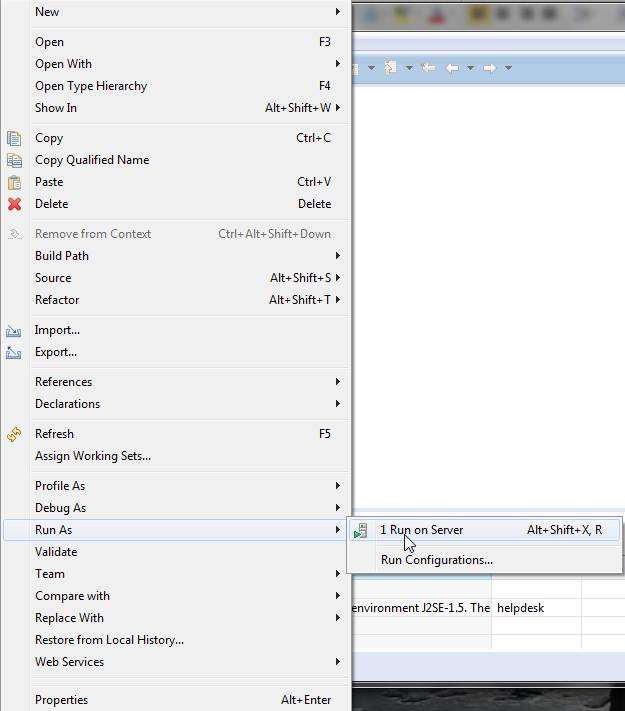
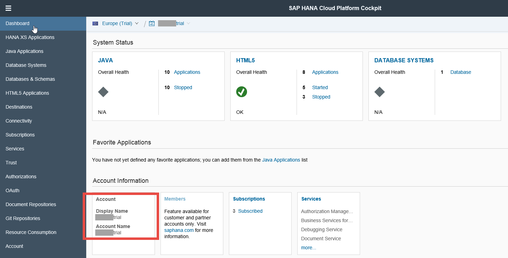
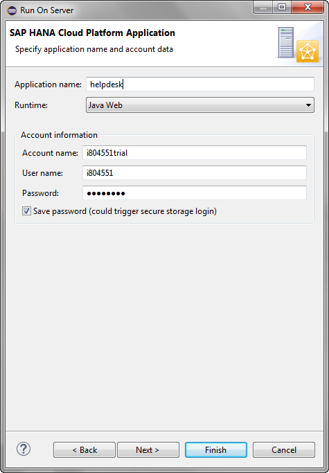
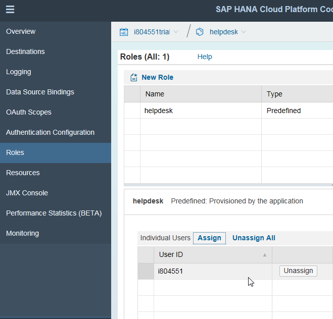
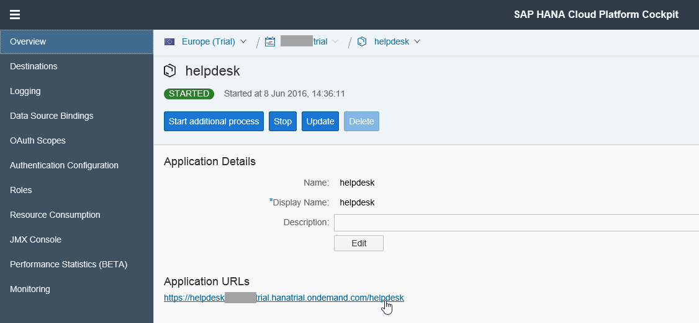
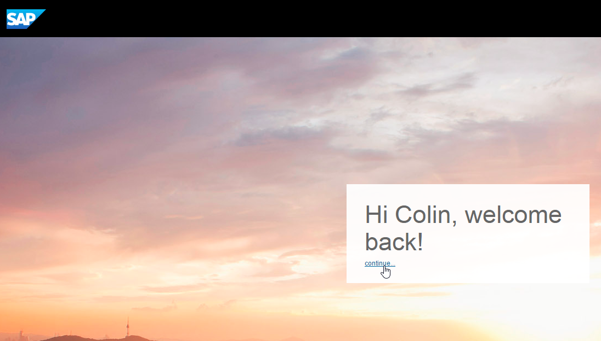

## Prerequisites  
- **Proficiency:** Beginner
- **Tutorials:**
 - [Create the gamified HelpDesk application](https://www.sap.com/developer/tutorials/hcp-gamification-sample-application.html)
 - Configure Eclipse environment for Maven projects (Coming soon)

## Next Steps
- [Customize game mechanics of HelpDesk application in SAP Cloud Platform](https://www.sap.com/developer/tutorials/hcp-customize-gamified-application.html)

## Details
### You will learn  
In this tutorial, you will retrieve the gamified HelpDesk application from GitHub, import it to Eclipse and deploy it to the SAP Cloud Platform. From within the cloud platform, you will then configure the authorization settings for your gamified application by assigning appropriate roles.

### Time to Complete
**15 Min**.

---

[ACCORDION-BEGIN [Step 1: ](Download the gamified HelpDesk app)]

Download the [ZIP file of the sources](https://github.com/SAP/gamification-demo-app/archive/master.zip) of the gamified HelpDesk application from [GitHub](https://github.com/SAP/gamification-demo-app).

Extract the archive to your local drive.

[ACCORDION-END]

[ACCORDION-BEGIN [Step 2: ](Import project)]

In Eclipse, switch to the **Java EE** perspective.

Choose **File** > **Import** > **Maven** > **Existing Maven Projects**

Navigate to the folder in which you extracted the GitHub archive, and choose **Finish**.

[ACCORDION-END]

[ACCORDION-BEGIN [Step 3: ](Set up the Java Web runtime)]

Set up the Java Web runtime environment in Eclipse:

- Choose **Window** > **Preferences**
- Scroll to **Server**, select **Runtime Environments** and click **Add**
- In the **New Server Runtime Environment** dialogue box, select **SAP** > **Java Web** and choose **Next**

    

- Select **Use Java Web SDK from the following location**, confirm or browse to the location of the SAP Cloud Platform SDK, and choose **Finish**
- In the **Preferences** window, choose **OK**

    

[ACCORDION-END]

[ACCORDION-BEGIN [Step 4: ](Run on server)]

Back in the Project Explorer, right-click on the **`helpdesk`** project and from the context menu choose **Run As** > **Run on Server**.

Select **SAP** > **SAP Cloud Platform** as the server, verify `hanatrial.ondemand.com` as the **Landscape host**, and choose **Next**.

[ACCORDION-END]

[ACCORDION-BEGIN [Step 5: ](Name your application)]

Name your application `helpdesk`, select the **Java Web** from the **Runtime** menu and verify that the values in the **Account name**, **User name**, and **Password** fields are accurate. Choose **Finish**.

[ACCORDION-END]

[ACCORDION-BEGIN [Step 6: ](Select the HelpDesk application)]

In your Web browser, open the cockpit of the [SAP Cloud Platform](https://account.hanatrial.ondemand.com/cockpit). Select **Java Applications** from the left-hand navigation and you should see the **`helpdesk`** application listed. Once the application is fully started, click on the name of the application.

[ACCORDION-END]

[ACCORDION-BEGIN [Step 7: ](Assign role)]

Select **Roles** from the left-hand navigation, select the **`helpdesk`** role, and assign your user to it.

[ACCORDION-END]

[ACCORDION-BEGIN [Step 8: ](Launch the app)]

Select **Overview** from the left-hand navigation and click on the URL provided under **Application URLs** to launch the application in a new browser window.

> If configured correctly, your browser should open the following page:

[ACCORDION-END]

