## Prerequisites  
- **Proficiency:** Beginner
- **Tutorials:** [Getting started with the SAP Fiori, Demo Cloud Edition](https://www.sap.com/developer/tutorials/hcp-fiori-cloud-edition-start.html)

## Next Steps
- [Hide view element from a standard SAP Fiori app](https://www.sap.com/developer/tutorials/hcp-fiori-cloud-edition-hide-element.html)

## Details
### You will learn  
In this tutorial you will learn how to add a view element with custom fields to a standard SAP Fiori app. The app that you will extended in this tutorial is "My Opportunities". The key steps are:

- Find data in the OData service to be displayed
- Start the extension using the extension pane in SAP Web IDE
- Implement extension coding in SAP Web IDE
- Test the app

### Time to Complete
**10 Min**.

---

[ACCORDION-BEGIN [Step 1: ](Log into the SAP Fiori Demo Cloud Edition)]

Please make sure that you have worked through the tutorial Getting started with the SAP Fiori, Demo Cloud Edition. Log into the SAP Fiori Demo Cloud Edition and locate the group CRM. Click on the **My Opportunities** tile.

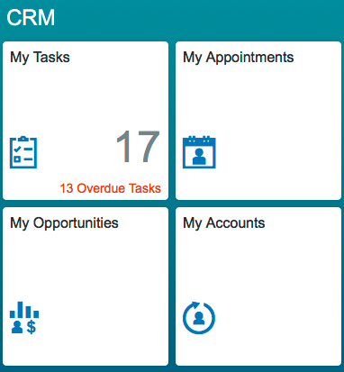


[ACCORDION-END]

[ACCORDION-BEGIN [Step 2: ](View the Standard app)]

Open the Standard app and familiarize yourself with how it appears.


[ACCORDION-END]

[ACCORDION-BEGIN [Step 3: ](See data provided by the My Opportunities OData service)]

Open your browser's developer tools (Instructions for [Chrome](https://developers.google.com/web/tools/chrome-devtools/), [Firefox](https://developer.mozilla.org/en-US/docs/Tools/Network_Monitor#Opening_the_Network_Monitor), Safari (https://developer.apple.com/safari/tools/) and [Internet Explorer](https://msdn.microsoft.com/en-us/library/gg589507.aspx). In the developer tool switch to the network tab.

To determine which data is provided by the My Opportunities OData service, you can view the network traffic. In the My Opportunities app, touch on the next opportunity from the list on the left which will send a request. Then check the response in the developer tools network tab. The example below is from Firefox:

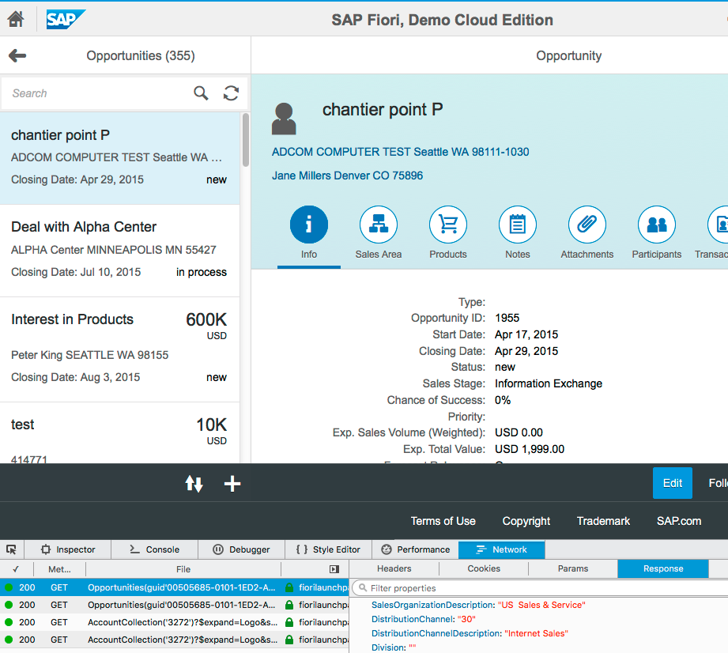


[ACCORDION-END]

[ACCORDION-BEGIN [Step 4: ](View JSON as XML)]

As Chrome does not display the data in a JSON format, you can right click and then choose **Open Link in New Tab**

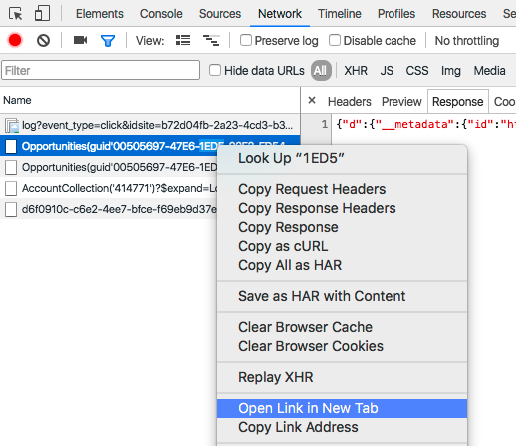

You will see a nice display of the XML returned by the OData service and you can determine the data which is not yet displayed:

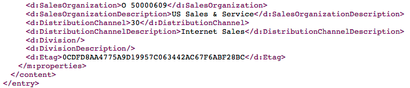


[ACCORDION-END]

[ACCORDION-BEGIN [Step 5: ](Compare the XML with the app view)]

Comparing the XML with the app view, you will see that there are two fields not yet displayed in the "Info" tab of the application:

- `SalesOrganizationDescription`
- `DistributionChannelDescription`

You will add these two fields to your application.


[ACCORDION-END]

[ACCORDION-BEGIN [Step 6: ](Start the extension)]

To start this extension click on the gear wheel icon on the top right beside your name and choose **Develop Apps**:


[ACCORDION-END]

[ACCORDION-BEGIN [Step 7: ](Launch SAP Web IDE)]

You will be forwarded to a screen called "Create App Extension" where you find instructions for the next steps. Click the **Launch SAP Web IDE** button. You may have to click this button twice as the new tab may remain empty on the first attempt.

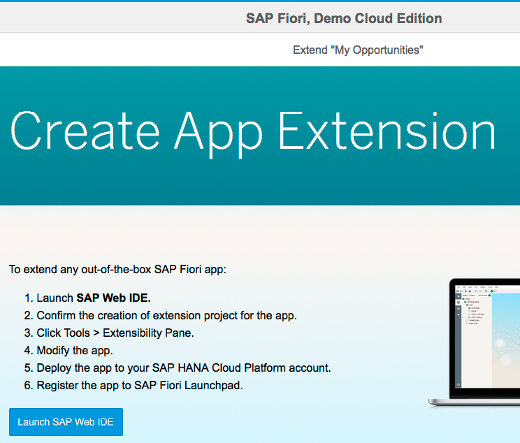

Log in when prompted.

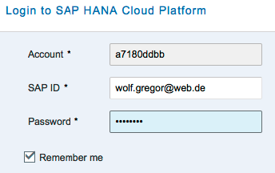


[ACCORDION-END]
[ACCORDION-BEGIN [Step 8: ](Specify project name)]

On the next screen specify a Project Name, you can use the default name provided.

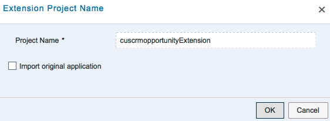


[ACCORDION-END]

[ACCORDION-BEGIN [Step 9: ](Open the Extensibility Pane)]

Open the "Extensibility Pane" via **Tools > Extensibility Pane**.

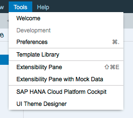

Open the node `opportunityInfoTabContentTopExtension` in the **Outline** pane on the right.

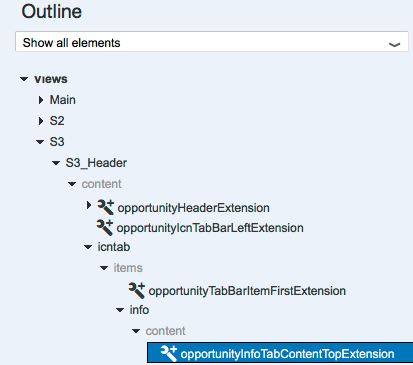


[ACCORDION-END]

[ACCORDION-BEGIN [Step 10: ](Extend view)]

After the selection click on **Extend > Extend View/Fragment**:

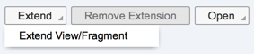

A confirmation dialog box will appear. Please confirm that by clicking on **Open Extension Code**:


[ACCORDION-END]

[ACCORDION-BEGIN [Step 11: ](Replace generated code)]

Replace the generated code with:

```xml
<core:FragmentDefinition
xmlns:core="sap.ui.core"
xmlns:ui="sap.ui.layout"
xmlns:layout="sap.ui.layout"
xmlns:ca="sap.ca.ui"
xmlns="sap.m"
  xmlns:form="sap.ui.layout.form"
  xmlns:crm="sap.cus.crm.lib.reuse.controls">
<ui:form.SimpleForm xmlns:ui="sap.ui.layout" id="opportunityID_form_clone">
<ui:content>
	<Label xmlns="sap.m"
		id="opportunitySalesOrganization_label"
		text="{i18n>SalesOrganization}">
	</Label>
	<Text xmlns="sap.m"
		id="opportunitySalesOrganization_Text"
		text="{json>/SalesOrganizationDescription}"/>
</ui:content>
<ui:content>
	<Label xmlns="sap.m"
		id="opportunityDistributionChannel_label"
		text="{i18n>DistributionChannel}">
	</Label>
	<Text xmlns="sap.m"
		id="opportunityDistributionChannel_Text"
		text="{json>/DistributionChannelDescription}"/>
</ui:content>
</ui:form.SimpleForm>
</core:FragmentDefinition>
```

Save your edits.


[ACCORDION-END]

[ACCORDION-BEGIN [Step 12: ](Run the app)]

To test the application, right-click on the project name and choose **Run > Run as > Web Application**:

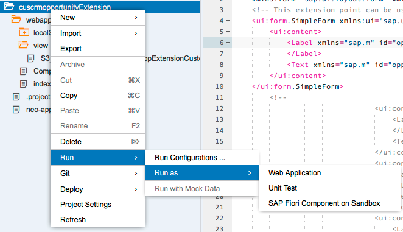


[ACCORDION-END]

[ACCORDION-BEGIN [Step 13: ](View Sales Organization and Distribution Channel details)]

In the Info tab of the Opportunity detail screen you should now directly see the information about Sales Organization and Distribution Channel:

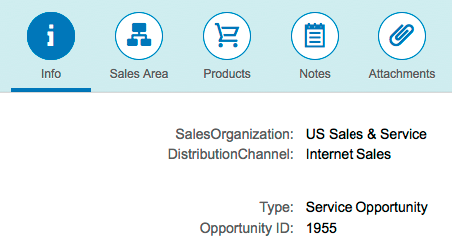

Congratulations, you've successfully extended an SAP standard Fiori app.


[ACCORDION-END]


