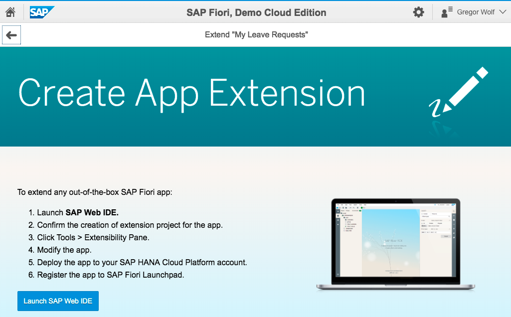
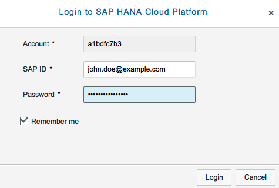
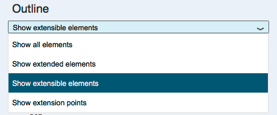
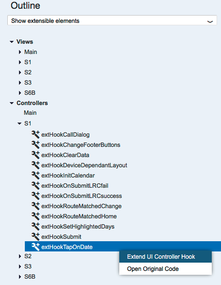
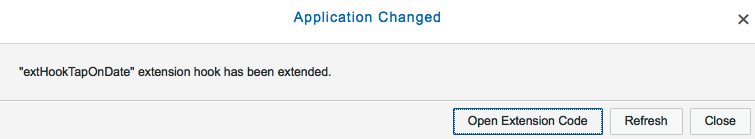
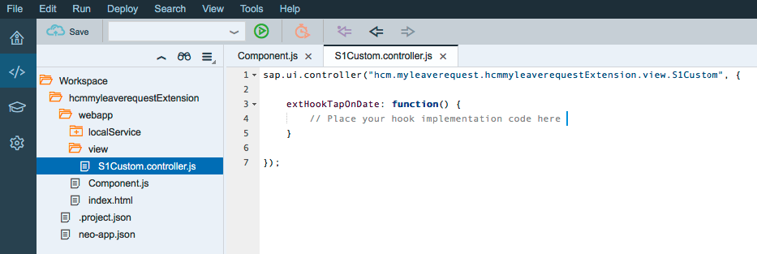
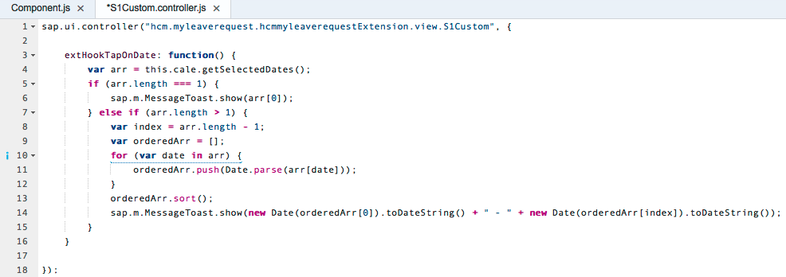
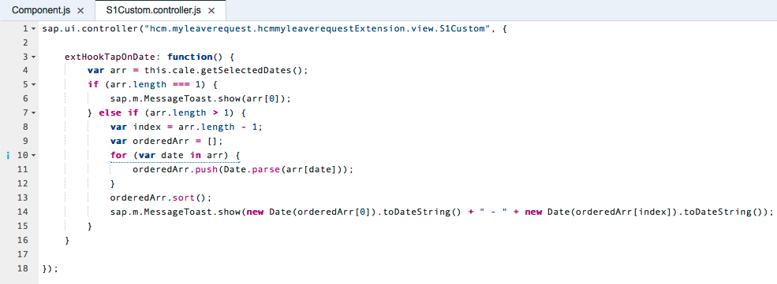
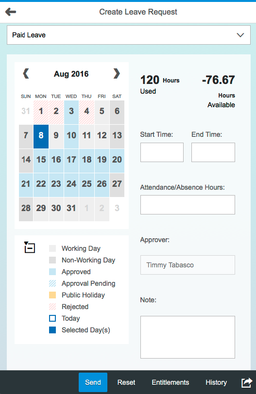
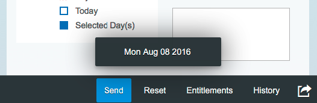

## Prerequisites  
 - **Proficiency:** Beginner
 - **Tutorials:** [Getting started with the SAP Fiori, Demo Cloud Edition](http://www.sap.com/developer/tutorials/hcp-fiori-cloud-edition-start.html)

## Next Steps
 - [Add extended app to SAP Fiori launchpad](http://www.sap.com/developer/tutorials/hcp-fiori-cloud-edition-launchpad.html)

## Details
### You will learn  
In this tutorial you will learn how to extend the controller of a standard SAP Fiori app. The app that you will extended in this tutorial is "My Leave Requests". The key steps are:

- Start the extension using the extension pane in SAP Web IDE 
- Locate the controller to extend	
- Test the app

### Time to Complete
**10 Min**.

---

1. If you've already worked through the tutorial **Hide view element from a standard SAP Fiori app** you can skip the steps 1 to 8. Please make sure that you have worked through the tutorial [Getting started with the SAP Fiori, Demo Cloud Edition](http://www.sap.com/developer/tutorials/hcp-fiori-cloud-edition-start.html). Log into the SAP Fiori Demo Cloud Edition and locate the group **Human Capital Management**. Click on the **My Leave Requests** tile.

    

2. Open the Standard app and familiarize yourself with how it appears. To start extending the app click on the gear wheel icon on the top right beside your name and choose **Develop Apps**:

    

3. You will be forwarded to a screen called "Create App Extension" where you find instructions for the next steps. Click the **Launch SAP Web IDE** button. You may have to click this button twice as the new tab may remain empty on the first attempt.

    

4. You have to login to the SAP HANA Cloud Platform. Please provide your credentials and then click **Login**.

    


5. Click **OK** to accept the project name.

    

6. The SAP Web IDE is launched with your extension project created.

    

7. With your extension project folder selected, the graphical extensibility pane is the easiest way to preview the app and extend it. Start it via **Tools > Extensibility Pane**. 

    

8. In order to select the view/control to extend, change from **Preview Mode** to **Extensibility Mode**.

    

9. The first step is to find the extension point for the user selecting a date. In the **Outline pane** filter for **Show extensible elements**.

    

10. Drill-down to **Controllers > S1** and select **`extHookTapOnDate`**. Right-click on it and select **Extend UI Controller Hook**.

    

11. A notification that the extension code stub was generated appears. This time open the extension code directly by clicking on **Open Extension Code**.

    

12. The extension code is displayed in the Editor panel.

    
 
13. In **`S1Custom.controller.js`**, replace the hook implementation comment **// Place your hook implementation code here** with the code below. 

    ```bash
		var arr = this.cale.getSelectedDates();
		if (arr.length === 1) {
			sap.m.MessageToast.show(arr[0]);
		} else if (arr.length > 1) {
			var index = arr.length - 1;
			var orderedArr = [];
			for (var date in arr) {
				orderedArr.push(Date.parse(arr[date]));
			}
			orderedArr.sort();
			sap.m.MessageToast.show(new Date(orderedArr[0]).toDateString() + " - " + new Date(orderedArr[index]).toDateString());
		}
    ```
 
14. Then, right-click somewhere in the white space of the editor pane and select **Beautify**.

    

15. **Save** your edits and again note that the asterisk "*" on the filename goes away after you click Save.

    

16. Test out your changes by selecting the **`index.html`** file and clicking the **Run** icon.

    

17. A new browser tab is opened with the application running.

    

18. Test it with one date, by clicking on a single day and notice the **toast** displayed at the bottom of the screen.

    

19. Test it with a date range by clicking on another day (the second date can be before or after the first date selected). 

    

Congratulations, you've successfully extended a controller of a SAP Standard Fiori app.

## Next Steps
 - [Add extended app to SAP Fiori launchpad](http://www.sap.com/developer/tutorials/hcp-fiori-cloud-edition-launchpad.html)
