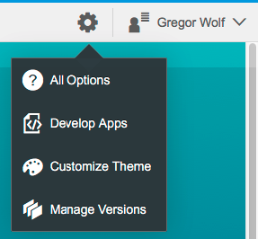
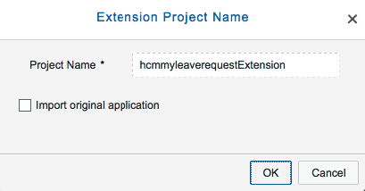
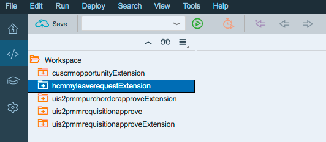
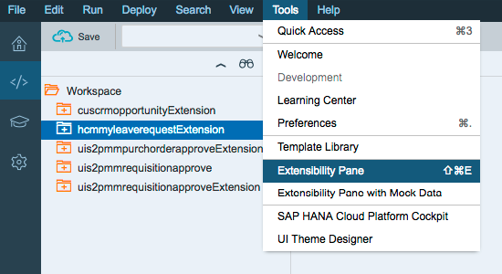
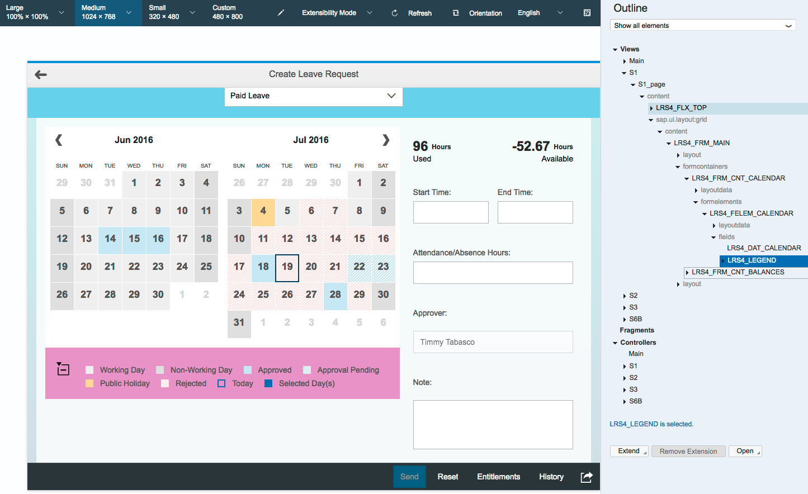
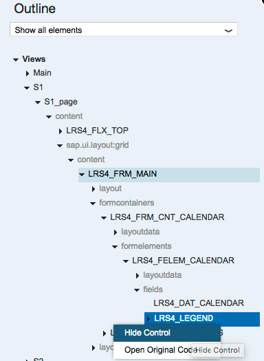
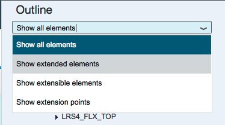
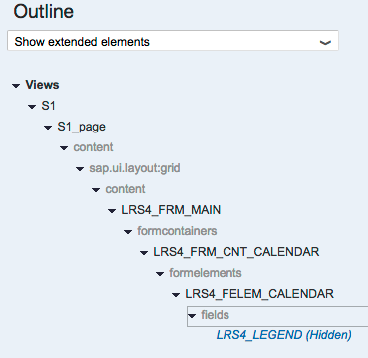

## Prerequisites  
- **Proficiency:** Beginner
- **Tutorials:** [Add custom fields to a standard SAP Fiori app](http://www.sap.com/developer/tutorials/hcp-fiori-cloud-edition-add-fields.html)

## Next Steps
- [Extend controller of a standard SAP Fiori app](http://www.sap.com/developer/tutorials/hcp-fiori-cloud-edition-extend-controller.html)

## Details
### You will learn  
In this tutorial you will learn how to hide a view element from a standard SAP Fiori app. The app that you will extended in this tutorial is "My Leave Requests". The key steps are:

- Start the extension using the extension pane in SAP Web IDE
- Locate the view element to hide
- Test the app

### Time to Complete
**10 Min**.

---

[ACCORDION-BEGIN [Step 1: ](Log into the SAP Fiori Demo Cloud Edition)]

Please make sure that you have worked through the tutorial [Getting started with the SAP Fiori, Demo Cloud Edition](http://www.sap.com/developer/tutorials/hcp-fiori-cloud-edition-start.html). Log into the SAP Fiori Demo Cloud Edition and locate the group **Human Capital Management**. Click on the **My Leave Requests** tile.

[ACCORDION-END]

[ACCORDION-BEGIN [Step 2: ](Open the Standard app)]

Open the Standard app and familiarize yourself with how it appears. To start extending the app click on the gear wheel icon on the top right beside your name and choose **Develop Apps**:

[ACCORDION-END]

[ACCORDION-BEGIN [Step 3: ](Launch SAP Web IDE)]

You will be forwarded to a screen called "Create App Extension" where you find instructions for the next steps. Click the **Launch SAP Web IDE** button. You may have to click this button twice as the new tab may remain empty on the first attempt.

[ACCORDION-END]

[ACCORDION-BEGIN [Step 4: ](Log into SAP Cloud Platform)]

You have to log into the SAP Cloud Platform. Please provide your credentials and then click **Login**.

[ACCORDION-END]

[ACCORDION-BEGIN [Step 5: ](Accept the project name)]

Click **OK** to accept the project name.

The SAP Web IDE is launched with your extension project created.

[ACCORDION-END]

[ACCORDION-BEGIN [Step 6: ](Open the graphical extensibility pane)]

With your extension project folder selected, the graphical extensibility pane is the easiest way to preview the app and extend it. Start it via **Tools > Extensibility Pane**.

[ACCORDION-END]

[ACCORDION-BEGIN [Step 7: ](Switch to extensibility mode)]

In order to select the view/control to extend, change from **Preview Mode** to **Extensibility Mode**.

You'll see that hovering over the views/controls on the left highlights them in sync in the Outline pane on the right.

[ACCORDION-END]

[ACCORDION-BEGIN [Step 8: ](Explore the graphical pane)]

Clicking a control in the graphical pane or in the Outline pane will change its color in the graphical pane to pink and highlights it in the Outline pane in blue. You can continue to hover over the graphical pane.

[ACCORDION-END]

[ACCORDION-BEGIN [Step 9: ](Hide control)]

There are several ways to extend a control. You will use the Outline pane to make the change. Select the **Legend** either in the graphical pane or the Outline pane. Go to the Outline pane, **right click** the blue highlighted item `LRS4_LEGEN` and select **Hide Control**

[ACCORDION-END]

[ACCORDION-BEGIN [Step 10: ](Refresh the view)]

You receive a notification that the change was implemented. Click **Refresh** to view the change.

Note that the legend is now gone from the graphical pane, but still present (listed as hidden) in the outline pane.

[ACCORDION-END]

[ACCORDION-BEGIN [Step 11: ](Show extended elements)]

An interesting feature of the Web IDE is to view a list of controls that are extended. Select **Show extended elements** in the Outline Pane filter pulldown menu.

You will see that the legend you just hid is the only control shown.

Congratulations, you've successfully hid a view element from a SAP Standard Fiori app.

[ACCORDION-END]

## Next Steps
- [Extend controller of a standard SAP Fiori app](http://www.sap.com/developer/tutorials/hcp-fiori-cloud-edition-extend-controller.html)
