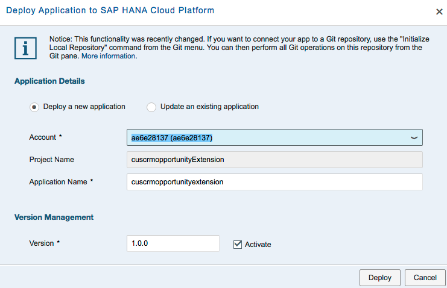
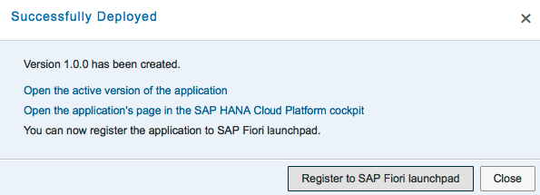
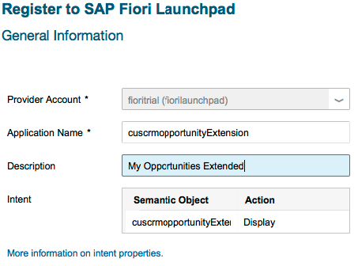
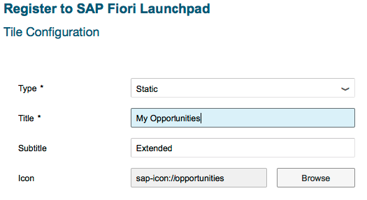
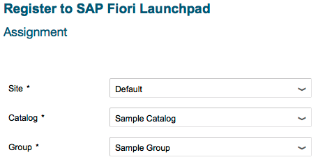
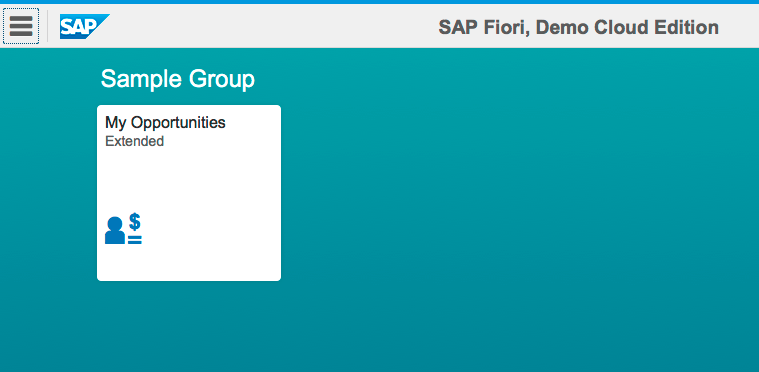

## Prerequisites  
 - **Proficiency:** Beginner
 - **Tutorials:** [Add custom fields to a standard SAP Fiori app](http://go.sap.com/developer/tutorials/hcp-fiori-cloud-edition-add-fields.html)

## Details
### You will learn  
In this tutorial you will learn how to deploy an extended app to the SAP Fiori launchpad. The key steps are:

- Deploy the app to the SAP HANA Cloud Platform
- Deploy the app to the SAP Fiori launchpad

### Time to Complete
**5 Min**.

---
You successful tested the app you've extended in the [Add custom fields to a standard SAP Fiori app] tutorial? Now it is time to deploy it the SAP HANA Cloud Platform. 

1. Right click on the project and choose **Deploy > Deploy to SAP HANA Cloud Platform**:

    

2. You should get the following pop-up. Keep the default settings. Confirm the screen by clicking **deploy**:

    

3. When the deploy was successful you can directly continue to register your extended app to the SAP Fiori launchpad. Click on the **Register to SAP Fiori launchpad** button to do so:

    

4. When the wizard starts, change the **Description** to `My Opportunities Extended`:

    

5. On the next screen keep the **Title** as `My Opportunities` and the **Subtitle** with `Extended`:

    

6. Click the **Browse** button and enter `opp` to search for `opportunity` related icons. Select the icon for `opportunities` and click **Done**.

    

7. On the next screen select the items shown in the screenshot below. If you haven’t used the SAP Fiori Launchpad yet there will be no other options available.

    

8. Click **Next** and **Finish**. You should get this confirmation:

    

9. Click the link **Open SAP Fiori launchpad**. On the button you find the new tile “My Opportunities Extended” in the Sample Group:

    

Congratulations, you’ve successfully added your extended app to the standard SAP Fiori launchpad.