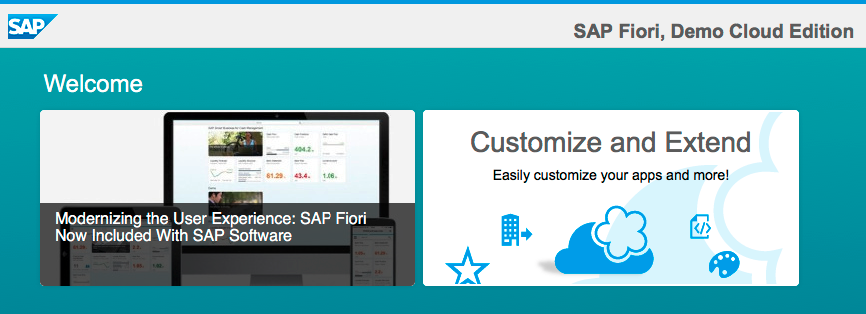
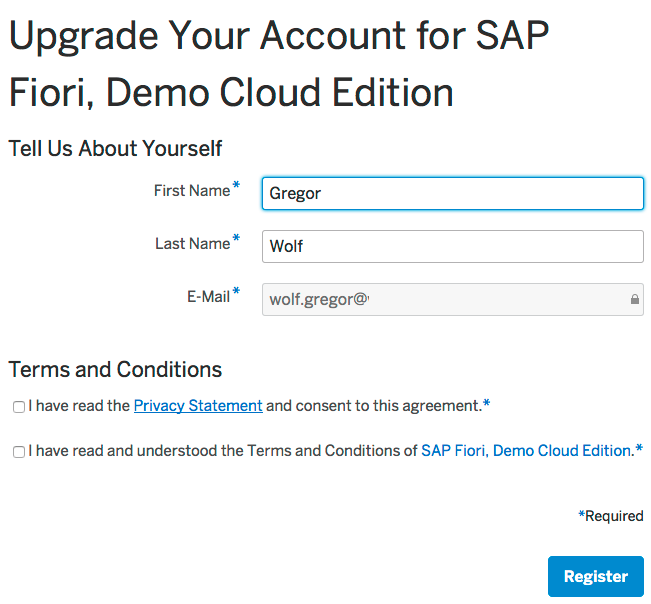
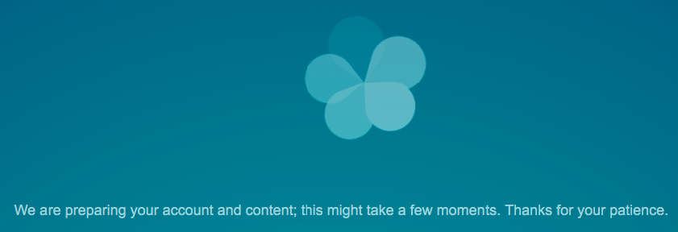

## Prerequisites  
 - **Proficiency:** Beginner
 - **Tutorials:** [Sign up for an account on SAP Cloud Platform](http://www.sap.com/developer/tutorials/hcp-create-trial-account.html)

## Next Steps
 - [Add custom fields to a standard SAP Fiori app](http://www.sap.com/developer/tutorials/hcp-fiori-cloud-edition-add-fields.html)

## Details
### You will learn  
In this tutorial you will learn how to get started with the SAP Fiori, Demo Cloud Edition. 

### Time to Complete
**5 Min**.

---

1. You can access the SAP Fiori, Demo Cloud Edition by following this link:

    <https://www.sapfioritrial.com/>
    
2. You continue by clicking the **See it in action** Button.

    

3. At your first access you also will have to accept the "SAP Fiori, Demo Cloud Edition Terms of Use". Do that by clicking **I agree**. After that you will be able to try out all the apps. You can i.e. try the Inbox and approve some workflows.

    In the following tutorials you can learn how to extend the standard apps. You have to activate the "Customize and Extend" mode of the SAP Fiori, Demo Cloud Edition. Go back to the home screen by clicking the **Home** icon. In the group "Welcome" you will find the "Customize and Extend" tile. Click on the tile.
    
    
    
    You can also reach the "Customize and Extend" mode by clicking the Cloud icon in the upper right corner.

    

4. Now click the **Get started!** button
    
    
    
    You will be asked to log on or register. If you already have a user for the SAP Community Network (SCN) or the SAP Service Marketplace you can use that user. Otherwise check out this tutorial on how to [create your SAP Cloud Platform Trial account](http://www.sap.com/developer/tutorials/hcp-create-trial-account.html). Then Log On with your credentials.
    
    

5. After the login it can happen that you have to complete another registration form. Also accept the terms and conditions there:
    
    

6. The first start of the launchpad takes a moment
    
    

7. The app you want to extend in the next tutorials is "My Opportunities" in the Group "CRM":
    
    
	
Congratulations, you're ready to go and start extending the SAP standard Fiori apps.

## Next Steps
 - [Add custom fields to a standard SAP Fiori app](http://www.sap.com/developer/tutorials/hcp-fiori-cloud-edition-add-fields.html)

