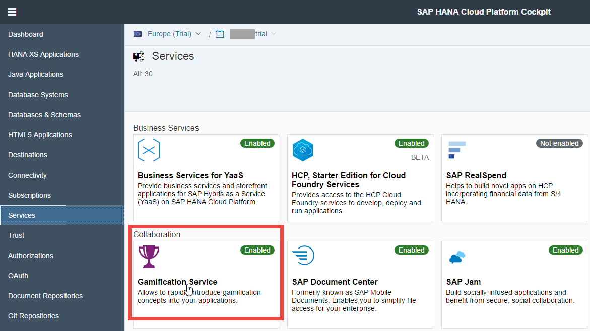
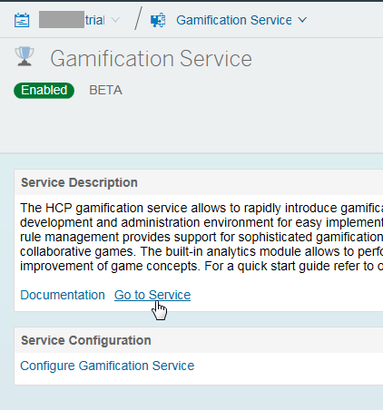
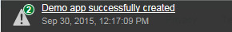
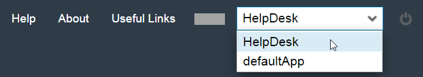
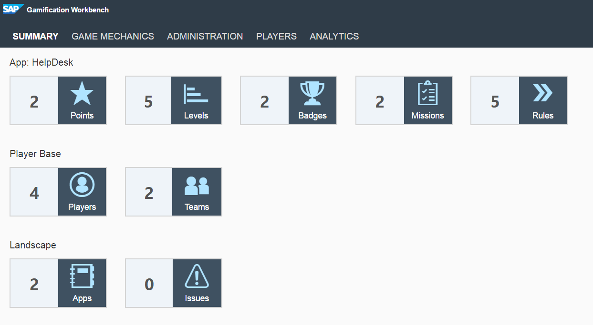
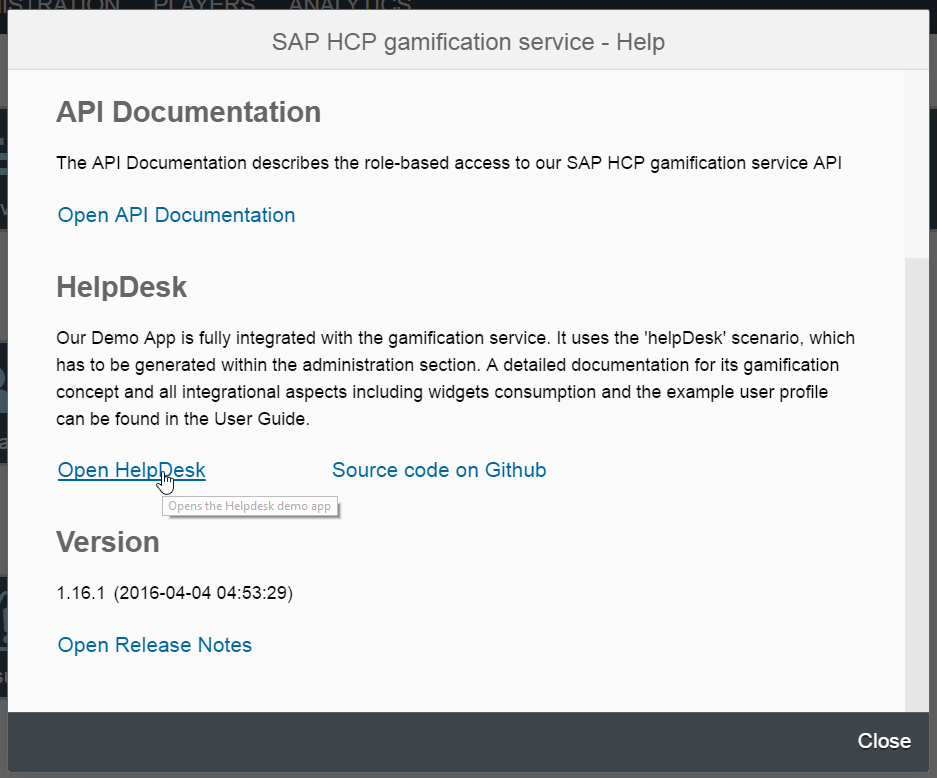
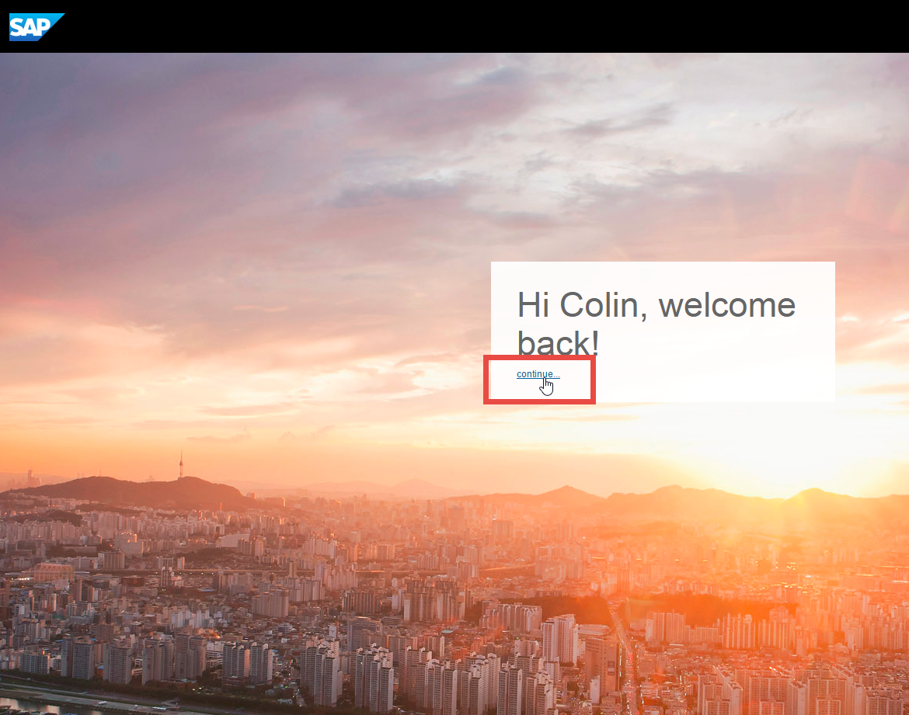
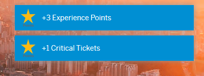

## Prerequisites  
 - **Proficiency:** Beginner
 - **Tutorials:** [Enable and configure the SAP Cloud Platform, gamification service](http://www.sap.com/developer/tutorials/hcp-gamification-service-enable.html)
## Next Steps
 - [Deploy gamified HelpDesk application to the SAP Cloud Platform](http://www.sap.com/developer/tutorials/hcp-deploy-gamified-application.html)

## Details
### You will learn  
In this tutorial, you will see what gamification on the SAP Cloud Platform looks like through interacting with the gamified HelpDesk application that was automatically assigned to your account when you activated the gamification service.

### Time to Complete
**10 Min**.

---

1. In your Web browser, open the cockpit of the [SAP Cloud Platform](https://account.hanatrial.ondemand.com/cockpit). Then select **Services** from the left-hand navigation.

    

2. Select the **Gamification Service**.

    

3. Click **Go to Service** to open the **Gamification Workbench**.

    

    

4. Go to the **Administration** tab and scroll to the **Demo Content Generation** section. Select **`HelpDesk`** from the **Demo App** drop-down menu and click **Create**. When the confirmation pop-up window appears, click **OK**.

    

    > When generation of the application is complete, you will see the following message:

    

5. Switch to the gamified HelpDesk application by choosing **`HelpDesk`** from the drop-down menu in the upper-right corner of the **Gamification Workbench**.

    

6. Go to the **Summary** tab and verify that the game mechanics of the HelpDesk application appear.

    

7. Still in the **Gamification Workbench**, select the **Help** link in the upper right corner.

    

8. Select **Open HelpDesk** in the Help screen.

    

9. Select **continue** when the home screen of the gamified HelpDesk application appears.

    

    > The gamified HelpDesk application will appear pre-populated with questions in your queue.

10. Customize a response in the **Your Response** field and click **Send Answer**.

    

11. Respond to each message in your queue and verify that points and badges are awarded accordingly.

    
    

## Next Steps
 - [Deploy gamified HelpDesk application to the SAP Cloud Platform](http://www.sap.com/developer/tutorials/hcp-deploy-gamified-application.html)
