## Prerequisites  
- **Tutorials:** [Get a Free Trial Account on SAP Cloud Platform](hcp-create-trial-account)

## Details
### You will learn  
  - How to set up your Eclipse to build Java apps

> ### DEPRECATED
>This tutorial, which deals with writing Java in the Neo environment of SAP Cloud Platform, is deprecated.

>If you are interested in building Java applications using the SAP Cloud Platform's Cloud Foundry Environment, please see [Build a Business Application Using CAP for Java](mission.cap-java-app).

In this tutorial, you'll learn everything you need to know to set up your local development environment based on Eclipse. The main steps are:

  - Download Eclipse

  - Install SAP Cloud Platform Tools for Java in your Eclipse IDE

  - Install the SAP Cloud Platform Software Development Kit

When you are done, you can do [Develop a Basic Java App on SAP Cloud Platform](https://developers.sap.com/tutorials/hcp-java-basic-app.html) tutorial.

---

[ACCORDION-BEGIN [Step 1: ](Download Eclipse)]

To make use of the SAP Cloud Platform Tools for Java you first need to have a supported version of Eclipse installed on your computer. The Eclipse Neon version is recommended.

[Open the Download site for Eclipse](http://www.eclipse.org/downloads/eclipse-packages/) and click on the **Eclipse IDE for Java EE Developers** link

[DONE]
[ACCORDION-END]

[ACCORDION-BEGIN [Step 2: ](Choose operating system)]

Choose the operating system that you will use to run Eclipse and choose the download site:

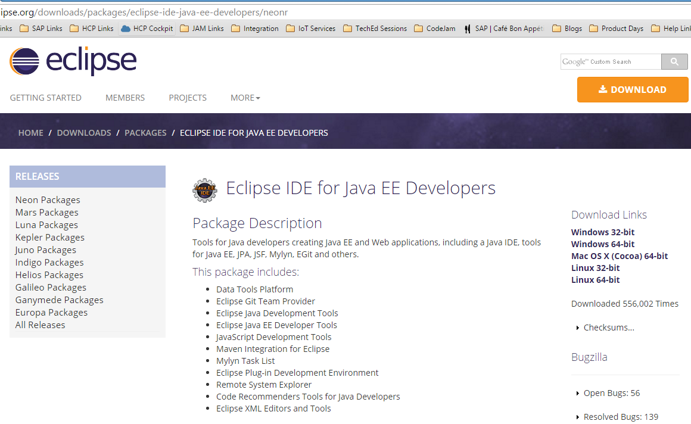

[DONE]
[ACCORDION-END]

[ACCORDION-BEGIN [Step 3: ](Choose download site)]

Choose the preferred download site and start the download.

[DONE]
[ACCORDION-END]

[ACCORDION-BEGIN [Step 4: ](Extract the archive)]

Once the download has finished extract the archive to a local folder of your choice (e.g. `c:\dev\eclipse`).

[DONE]
[ACCORDION-END]

[ACCORDION-BEGIN [Step 5: ](Start the Eclipse IDE)]

Click on the **eclipse** executable file to start the Eclipse IDE.

[DONE]
[ACCORDION-END]

[ACCORDION-BEGIN [Step 6: ](Choose your workspace)]

Eclipse will first show you a **Workspace Launcher** dialog to choose your workspace. Replace the suggested workspace path with `c:\dev\eclipse_workspace`. Confirm with **OK**.

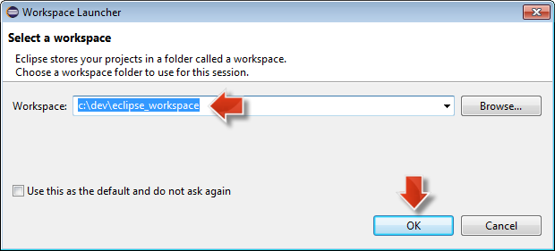

[DONE]
[ACCORDION-END]

[ACCORDION-BEGIN [Step 7: ](Close the Eclipse Welcome Page)]

Close the Eclipse **Welcome Page**.

[DONE]
[ACCORDION-END]

[ACCORDION-BEGIN [Step 8: ](Install the SAP Cloud Platform tools for Java)]

Now that you have installed Eclipse, you need to install the SAP Cloud Platform tools for Java. This is done following the standard approach of Eclipse to install plugins.

From the Eclipse menu, choose **Help > Install New Software...**

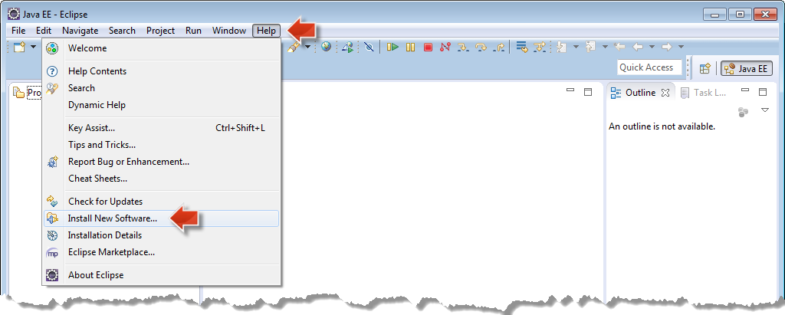

[DONE]
[ACCORDION-END]

[ACCORDION-BEGIN [Step 9: ](Add URL)]

Copy the URL `https://tools.hana.ondemand.com/neon` and paste it in the **Work with **field and then press the **Enter** (or **Return**) key.

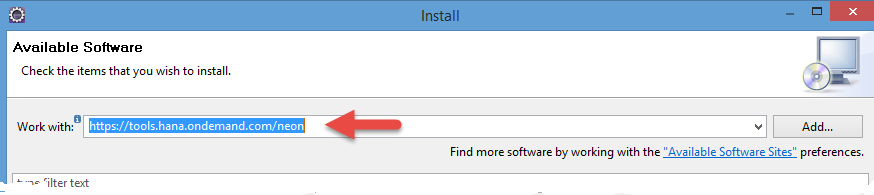

[DONE]
[ACCORDION-END]

[ACCORDION-BEGIN [Step 10: ](Select SAP Cloud Platform Tools)]

Select **SAP Cloud Platform Tools** and click **Next**.

> Note: If Eclipse is not able to find the tools then please check your network settings. You might need to configure a proxy, in particular if you are working from a corporate network. How-to setup a proxy in Eclipse is explained in the [Installing SAP Development Tools for Eclipse](https://help.hana.ondemand.com/help/frameset.htm?76137a37711e1014839a8273b0e91070.html) section of the official online documentation.

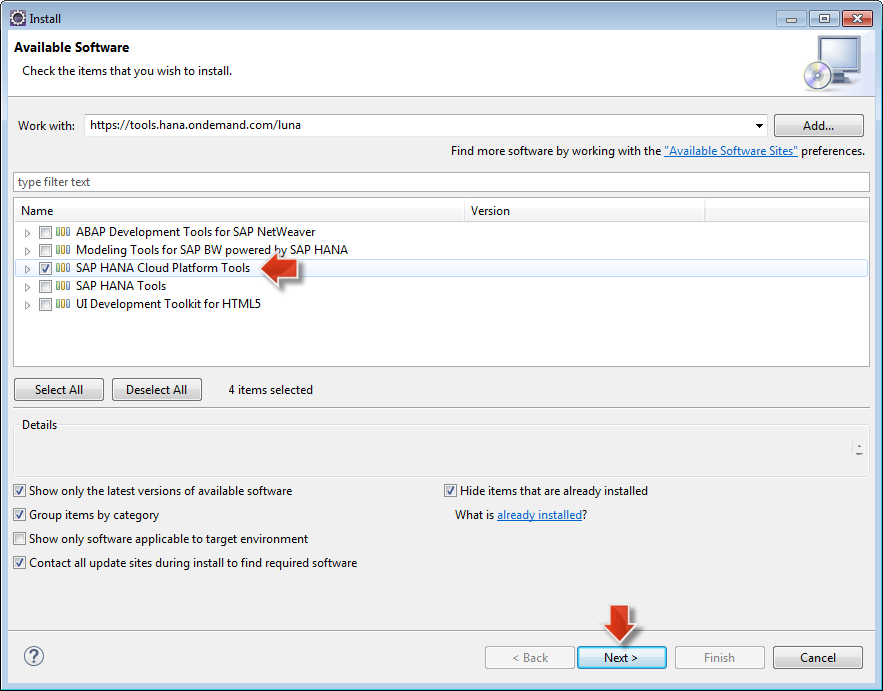

[DONE]
[ACCORDION-END]

[ACCORDION-BEGIN [Step 11: ](Accept the license agreement)]

On the **Install Details** page click **Next**.

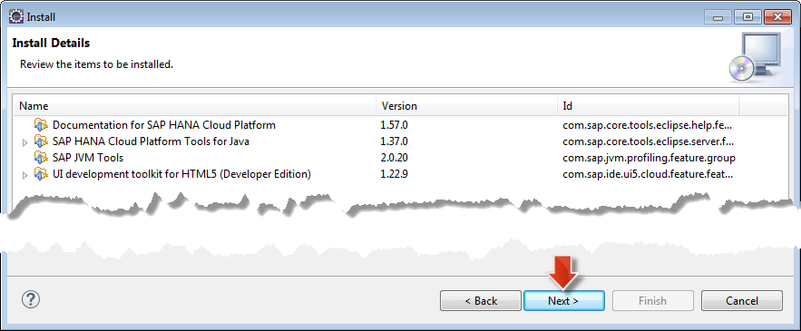

Read and accept the license agreement and choose **Finish**. The installation will now start.

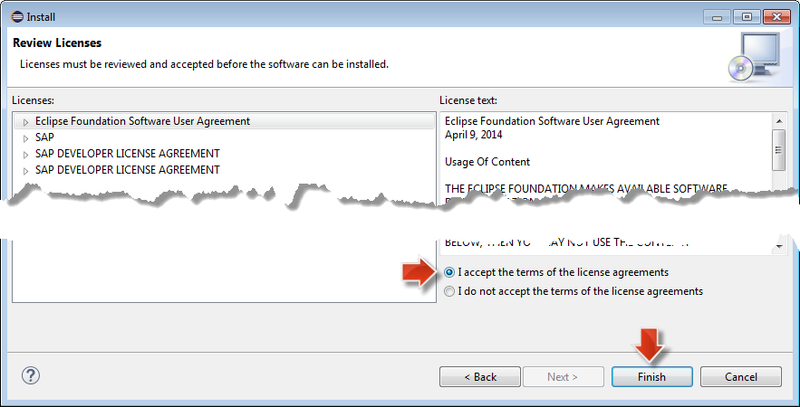

[DONE]
[ACCORDION-END]

[ACCORDION-BEGIN [Step 12: ](Restart Eclipse)]

At the end of the installation, you will be asked to restart Eclipse. Confirm the dialog with **Yes** to restart Eclipse immediately.

[DONE]
[ACCORDION-END]

[ACCORDION-BEGIN [Step 13: ](SAP Cloud Platform Tools for Java is installed)]

After Eclipse restarts, close the Eclipse **Welcome Page**. You now have the SAP Cloud Platform Tools for Java installed in Eclipse.

[DONE]
[ACCORDION-END]

[ACCORDION-BEGIN [Step 14: ](Download and install the SAP Cloud Platform SDK)]

The next step is to download and install the SAP Cloud Platform SDK, which contains all the required artifacts to setup a local development environment as well as the [console client](https://help.hana.ondemand.com/help/frameset.htm?76132306711e1014839a8273b0e91070.html) used to interact with your cloud account.

The SDK comes in different flavors:

- Java Web: Provides a lightweight runtime supporting a subset of the standard Java EE APIs (Servlet, JSP, JSTL, EL). Currently there is a `1.x` version of this runtime available
- Java EE 6 Web Profile: Provides certified support for the whole Java EE 6 Web Profile APIs. Currently there is a `2.x` version of this runtime available
- Java Web Tomcat 7: Provides support for some of the standard Java EE APIs (Servlet, JSTL, EL). Currently there is a `2.x` version of this runtime available
- Java Web Tomcat 8: Provides support for some of the standard Java EE APIs (Servlet, JSTL, EL). Currently there is a `3.x` version of this runtime available

For this tutorial you will use the `Java Web SDK 1.x` version of the SDK. To install it on your system do the following:

Open <https://tools.hana.ondemand.com#cloud>. Make sure you are on the Cloud tab of the page.

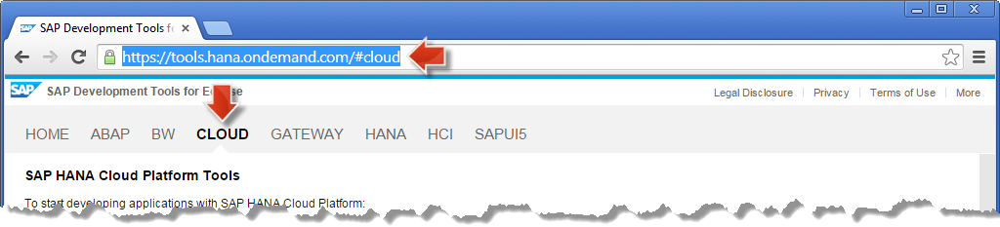

[DONE]
[ACCORDION-END]

[ACCORDION-BEGIN [Step 15: ](Choose download version)]

Choose the `Java Web (neo-java-web-sdk.X.X.X)` (use the latest version) for download.

> Note: The version of the Java Web SDK shown on this screenshot might be lower than the one that you will actually download. This is OK. The procedure should work with any higher version as well. Just make sure that you always use the SDK version that you actually downloaded in the following steps.

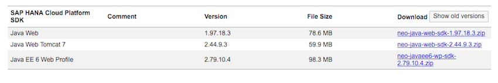

[DONE]
[ACCORDION-END]

[ACCORDION-BEGIN [Step 16: ](Agree to the SAP Developer License agreement)]

Before you are allowed to download the SDK you have to read and agree to the SAP Developer License agreement. After accepting the license by clicking **I Have Read and Agree** the download of the SDK will start.

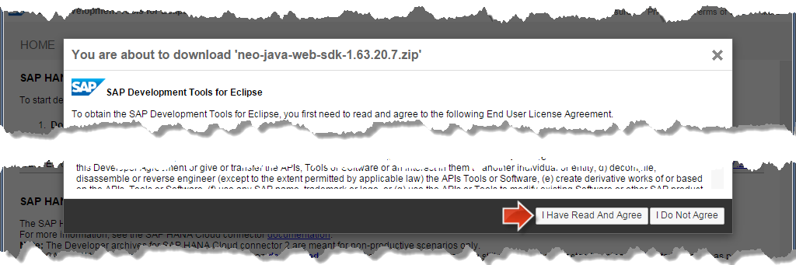  

[DONE]
[ACCORDION-END]

[ACCORDION-BEGIN [Step 17: ](Extract the archive)]

Once the download has finished extract the archive to a local folder of your choice. It is recommended to place the folder in `c:\dev` and to name it like the just downloaded file, e.g. `c:\dev\neo-java-web-sdk-1.109.9`

> Note: To familiarize yourself further with the content of the SDK, especially note the location of the [console client](https://help.hana.ondemand.com/help/frameset.htm?76132306711e1014839a8273b0e91070.html) within the tools directory and the provided samples in a respective samples directory. Also, you might be interested to learn about the [supported APIs](https://help.hana.ondemand.com/help/frameset.htm?e836a95cbb571014b3c4c422837fcde4.html).

[DONE]
[ACCORDION-END]

[ACCORDION-BEGIN [Step 18: ](Configure the SAP Cloud Platform Tools for Java)]

The next thing to do is to configure the SAP Cloud Platform Tools for Java so they make use of the just downloaded SDK. From the Eclipse IDE main menu, choose **Window > Preferences**.

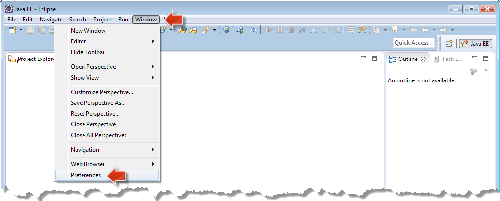

Choose **Server > Runtime Environment**. Click the **Add...** button to open the **New Server Runtime** dialog.

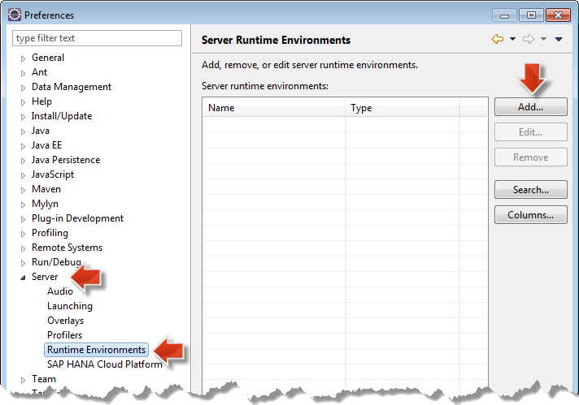

Select **SAP > Java Web** as the Server Runtime Environment and click **Next**.

[DONE]
[ACCORDION-END]

[ACCORDION-BEGIN [Step 19: ](Choose folder and finish)]

Provide the folder to which you have extracted the SDK by clicking the **Browse...** button and choosing the respective folder, e.g. `c:\dev\neo-java-web-sdk-1.63.20.7`. Click on **Finish**.

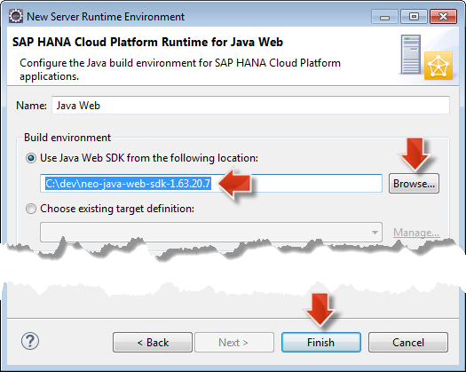

[DONE]
[ACCORDION-END]

[ACCORDION-BEGIN [Step 20: ](New Java Web runtime is available)]

With this a new Java Web runtime is now available that will be used for your SAP Cloud Platform projects. You can now close the dialog by clicking **OK**

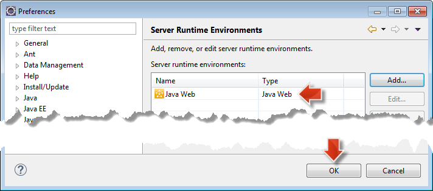

Congratulations: You have now installed the SAP Cloud Platform Tools for Java and are ready to start with your Java project on SAP Cloud Platform.

[DONE]
[ACCORDION-END]

### Related Information
- [Eclipse Downloads](http://www.eclipse.org/downloads)
- (Tools) [Installing the SDK](https://tools.hana.ondemand.com/#cloud)
- (Online documentation) [Installing Eclipse](https://help.hana.ondemand.com/help/frameset.htm?761374e5711e1014839a8273b0e91070.html)
- (Online documentation) [Installing the SDK](https://help.hana.ondemand.com/help/frameset.htm?7613843c711e1014839a8273b0e91070.html)
- (Online documentation) [Installing SAP Development Tools for Eclipse](https://help.hana.ondemand.com/help/frameset.htm?76137a37711e1014839a8273b0e91070.html)
- (Online documentation) [Setting Up the Runtime Environment](https://help.hana.ondemand.com/help/frameset.htm?7613f000711e1014839a8273b0e91070.html)
