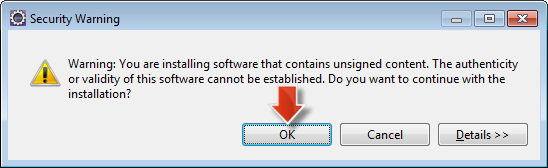

## Prerequisites  
 - **Proficiency:** Beginner | Intermediate | Advanced
 - **Tutorials:** [Sign up for an account on HANA Cloud Platform](http://go.sap.com/developer/tutorials/hcp-create-trial-account.html)

## Next Steps
 - Developing and Deploying a basic Java application on SAP HANA Cloud Platform (coming soon)

## Details
### You will learn  
In this tutorial you'll learn everything you need to know to setup your local development environment based on Eclipse. The main steps are:

 - Downloading Eclipse
 - Installing SAP HANA Cloud Platform Tools for Java in your Eclipse IDE
 - Installing the SAP HANA Cloud Platform Software Development Kit

### Time to Complete
**15 Min**.

---

1. To make use of the SAP HANA Cloud Platform Tools for Java you first need to have a supported version of Eclipse installed on your computer. The Eclipse Mars version is recommended. 

    [Open the Download site for Eclipse](http://eclipse.org/downloads) and click on the **Eclipse IDE for Java EE Developers** link

     

2. Choose the operating system that you will use to run Eclipse and choose the download site:

     

 
3. Choose the preferred download site and start the download.

4. Once the download has finished extract the archive to a local folder of your choice (e.g. `c:\dev\eclipse`).

 

5. Click on the **eclipse** executable file to start the Eclipse IDE.

    

6. Eclipse will first show you a **Workspace Launcher** dialog to choose your workspace. Replace the suggested workspace path with `c:\dev\eclipse_workspace`. Confirm with **OK**.

    

7. Close the Eclipse **Welcome Page**.

    

8. Now that you have installed Eclipse, you need to install the SAP HANA Cloud Platform tools for Java. This is done following the standard approach of Eclipse to install plugins. 

    From the Eclipse menu, choose **Help > Install New Software...**
    
    
    
9. Copy the URL `https://tools.hana.ondemand.com/mars` and paste it in the **Work with **field and then press the **Enter** (or **Return**) key.

    
    
10. Select **SAP HANA Cloud Platform Tools** and click **Next**.

    > Note: If Eclipse is not able to find the tools then please check your network settings. You might need to configure a proxy, in particular if you are working from a corporate network. How-to setup a proxy in Eclipse is explained in the [Installing SAP Development Tools for Eclipse](https://help.hana.ondemand.com/help/frameset.htm?76137a37711e1014839a8273b0e91070.html) section of the official online documentation.

    

11. On the **Install Details** page click **Next**.

    

12. Read and accept the license agreement and choose **Finish**. The installation will now start.

    

13. During the installation, a **Security Warning** dialog box will appear stating that you are installing software which contains unsigned content. Confirm with **OK** to continue the installation.

    
    
14. At the end of the installation, you will be asked to restart Eclipse. Confirm the dialog with **Yes** to restart Eclipse immediately.

    

15. After Eclipse restarts, make sure to close the Eclipse **Welcome Page**. You now have the SAP HANA Cloud Platform Tools for Java installed in Eclipse.

    

16. The next step is to download and install the SAP HANA Cloud Platform SDK, which contains all the required artifacts to setup a local development environment as well as the [console client](https://help.hana.ondemand.com/help/frameset.htm?76132306711e1014839a8273b0e91070.html) used to interact with your cloud account.

    The SDK comes in different flavors:

    - Java Web: Provides a lightweight runtime supporting a subset of the standard Java EE APIs (Servlet, JSP, JSTL, EL). Currently there is a `1.x` and a `2.x` version of this runtime available
    - Java EE 6 Web Profile: Provides certified support for the whole Java EE 6 Web Profile APIs
 
    For this tutorial you will use the `Java Web SDK 1.x` version of the SDK. To install it on your system do the following:

    Open <https://tools.hana.ondemand.com#cloud>. Make sure you are on the Cloud tab of the page.
    
    

17. Choose the `Java Web (neo-java-web-sdk.X.X.X)` (use the latest version) for download.

    > Note: The version of the Java Web SDK shown on this screenshot might be lower than the one that you will actually download. This is OK. The procedure should work with any higher version as well. Just make sure that you always use the SDK version that you actually downloaded in the following steps.

     

18. Before you are allowed to download the SDK you have to read and agree to the SAP Developer License agreement. After accepting the license by clicking **I Have Read and Agree** the download of the SDK will start.

      

19. Once the download has finished extract the archive to a local folder of your choice. It is recommended to place the folder in `c:\dev` and to name it like the just downloaded file, e.g. `c:\dev\neo-java-web-sdk-1.63.20.7`

    > Note: To familiarize yourself further with the content of the SDK, especially note the location of the [console client](https://help.hana.ondemand.com/help/frameset.htm?76132306711e1014839a8273b0e91070.html) within the tools directory and the provided samples in a respective samples directory. Also, you might be interested to learn about the [supported APIs](https://help.hana.ondemand.com/help/frameset.htm?e836a95cbb571014b3c4c422837fcde4.html).
    
    
20. The next thing to do is to configure the SAP HANA CLoud Platform Tools for Java so they make use of the just downloaded SDK. From the Eclipse IDE main menu, choose **Window > Preferences**.

     

21. Choose **Server > Runtime Environment**. Click the **Add...** button to open the **New Server Runtime** dialog.

    
    
22. Select **SAP > Java Web** as the Server Runtime Environment and click **Next**.

    

23. Provide the folder to which you have extracted the SDK by clicking the **Browse...** button and choosing the respective folder, e.g. `c:\dev\neo-java-web-sdk-1.63.20.7`. Click on **Finish**.

    
    
24. With this a new Java Web runtime is now available that will be used for your SAP HANA Cloud Platform projects. You can now close the dialog by clicking **OK** 

    
    
Congratulations: You have now installed the SAP HANA Cloud Platform Tools for Java and are ready to start with your Java project on SAP HANA Cloud Platform.

### Related Information
 - [Eclipse Downloads](http://www.eclipse.org/downloads)
 - (Tools) [Installing the SDK](https://tools.hana.ondemand.com/#cloud)
 - (Online documentation) [Installing Eclipse](https://help.hana.ondemand.com/help/frameset.htm?761374e5711e1014839a8273b0e91070.html)
 - (Online documentation) [Installing the SDK](https://help.hana.ondemand.com/help/frameset.htm?7613843c711e1014839a8273b0e91070.html)
 - (Online documentation) [Installing SAP Development Tools for Eclipse](https://help.hana.ondemand.com/help/frameset.htm?76137a37711e1014839a8273b0e91070.html)
 - (Online documentation) [Setting Up the Runtime Environment](https://help.hana.ondemand.com/help/frameset.htm?7613f000711e1014839a8273b0e91070.html)

## Next Steps
 - Developing and Deploying a basic Java application on SAP HANA Cloud Platform (coming soon)
