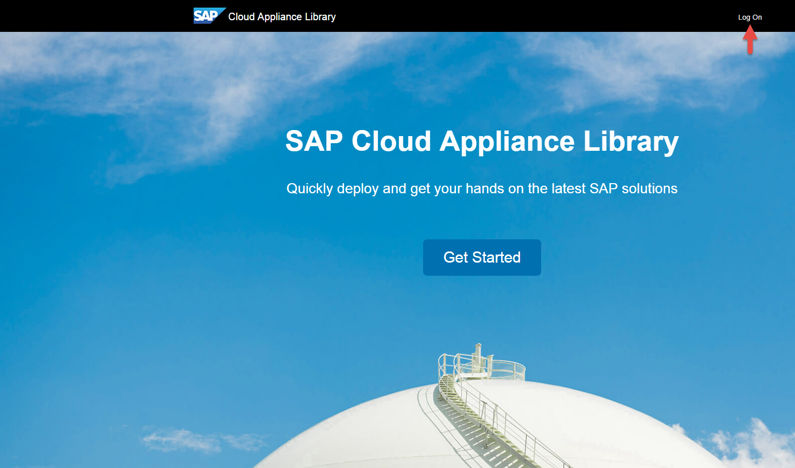
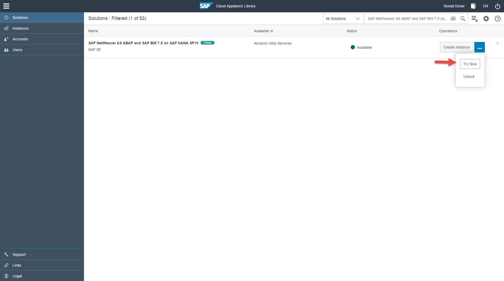
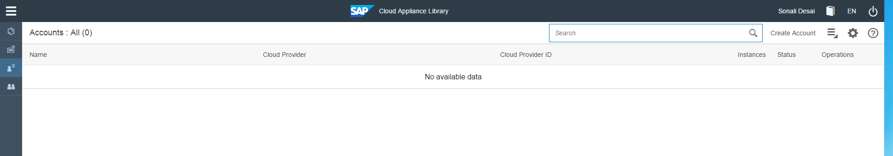
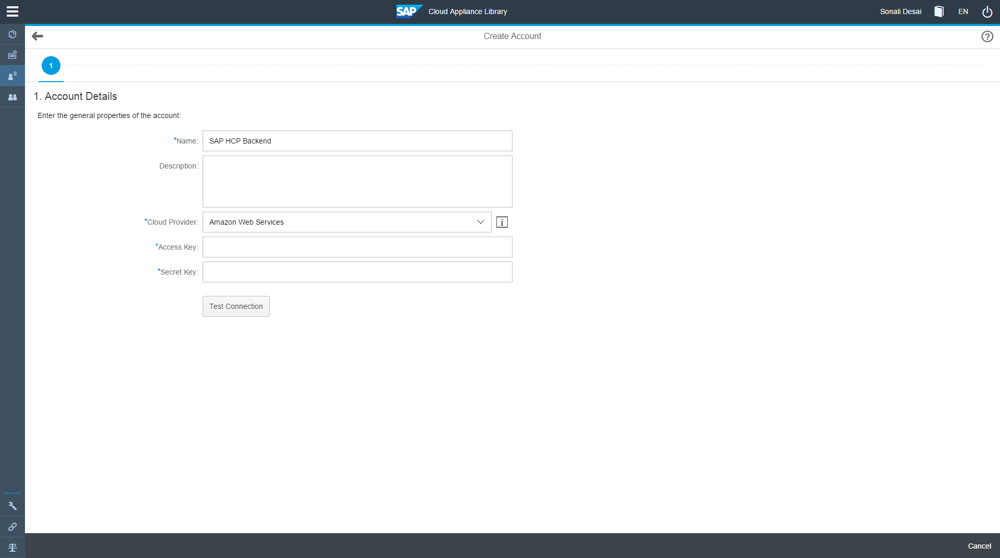
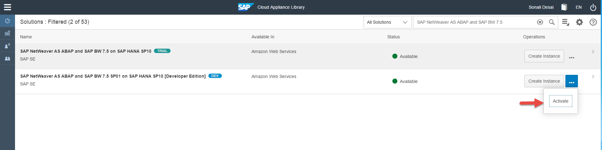
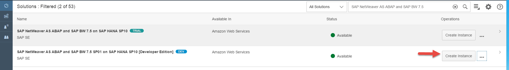
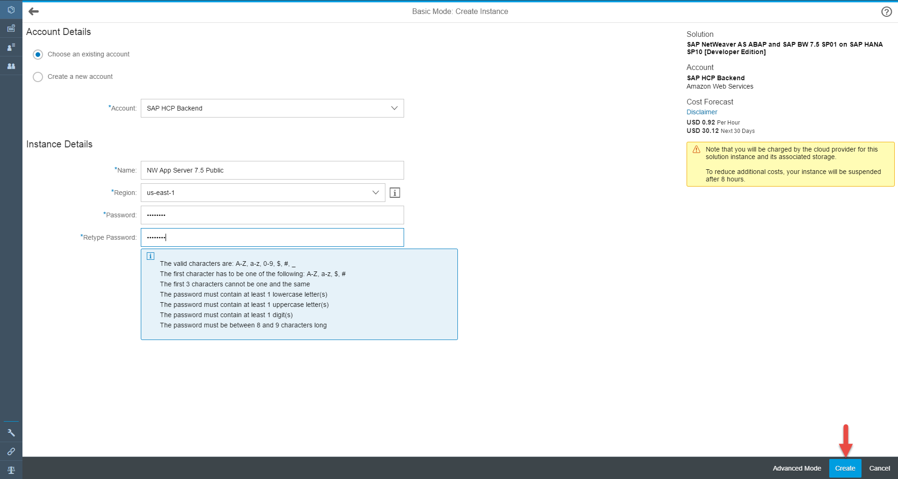

## Prerequisites  
 - **Proficiency:** Beginner
 - **Tutorials:** [Prepare an Amazon Web Services account for setting up ABAP on-premise system](https://www.sap.com/developer/tutorials/hcp-prepare-aws-account.html)

## Next Steps
[Deploy an JCo/RFC based on-premise extension using SAP HANA Cloud Connector](https://www.sap.com/developer/tutorials/hcp-scc-onpremise-extension-jco-rfc.html)

## Details
### You will learn  
How to setup SAP Cloud Appliance Library account and then install preconfigured SAP solution in the cloud.

### Time to Complete
**10 Min**.

---

> In the end of this tutorial you'll install an SAP solution on AWS. This will take some time (about 30 minutes up to 1 hour).

> Although SAP offers trial editions for free you will still have to cover the costs for running these trial editions on AWS!

[ACCORDION-BEGIN [Step 1: ](Preparing the CAL Account)]

1. Navigate to <https://cal.sap.com/> and login using your SCN user. Accept the terms and conditions.
    

2. Switch to the **Solutions** tab and Search for **SAP NetWeaver AS ABAP and SAP BW 7.5 SP01 on SAP HANA SP10 [Developer Edition]** and click the **Try Now** button. Accept the terms and conditions. [Note: If this solution is not available, try the versions closer to this one]
    

3. Navigate to the **Accounts** tab and create a CAL account by clicking on the **Create Account** link in the top-right corner.
    

4. On the first wizard page (Define General Properties) provide a Name for your account (e.g. SAP Cloud Platform Backend). Then, select **Amazon Web Services** as Cloud Provider. Also provide your AWS Access Key and Secret Key in the related input fields. Click on Next.
    

5. On the third wizard page (Select Account Users) you can maintain (additional) users for this account. Your user should be registered by default. Click on Review.

6. Review all the information and then click on **Create**.

[DONE]
[ACCORDION-END]

[ACCORDION-BEGIN [Step 2: ](Creating an instance of a CAL-based solution)]

1. Navigate back to the **Solutions** tab in the CAL cockpit and select again the **SAP NetWeaver AS ABAP and SAP BW 7.5 SP01 on SAP HANA SP10 [Developer Edition]** entry in the list of solutions

2. Click the related **Activate** button, and afterwards the related **Create Instance** button.
    
    

3. On the first page of the Create Instance wizard you are asked to define the general properties of the to be created instance. Provide a Name for your instance (e.g. NW App Server 7.5 Public.) Your Account information should be filled in already as well as the default Region to be used.  Keep everything as Default and enter the Password of your choice

4. Proceed by clicking **Create**.
    

5. Once you confirm the Create instance wizard dialog, the selected solution will be provisioned to your AWS account and from that moment on you are generating costs!. When you do this for the first time it may take up to 35 min to setup the solution. Note: **AWS account generates costs**

6. You'll be prompted to store and/or download the generated license key (PEM file).
    

7. Once the instance is up and running it will be listed under the Instances tab of the CAL cockpit. If you click on the link in the Instance Name column you can open up a pop-up window to take a look at (and edit) the individual settings. You can select **Public Static IP Address** if you want one. One of the most important information being displayed is the IP address of your instance.

[DONE]
[ACCORDION-END]

[ACCORDION-BEGIN [Step 3: ](Using the AWS instance)]

Once the AWS instance has been started, you can connect to it and use the installed SAP NetWeaver Application Server for ABAP. There is also a SAP HANA Cloud Connector installed and running on the AWS instance. You can use it for your on-premise extension scenarios in which you connect SAP Cloud Platform applications to the ABAP system on AWS. <!-- How to do this is also described in tutorial [Deploy an JCo/RFC based on-premise extension using SAP HANA Cloud Connector] (https://www.sap.com/developer/tutorials/hcp-scc-onpremise-extension-jco-rfc.html) -->

Details how to connect and use the AWS image are described in [this PDF document](https://caldocs.hana.ondemand.com/caldocs/help/Getting%20started%20guide%20NetWeaver%207.5%20on%20SAP%20HANA_v2.pdf). We briefly summarize the most important points:

- Connect to the AWS instance using a Remote Desktop Client (on Windows start e.g. `mstsc.exe`). You can find the of your AWS front end instance by clicking on the instance name in your SAP Cloud Appliance Library account. Take the External IP of the front end instance and use the OS user Administrator with the master password you have specified before to log in with your remote desktop client.

- Connect to the ABAP system on the AWS instance with SAP GUI, you can use the already installed SAP GUI on the AWS front end instance. Start the SAP Logon and logon to the preconfigured system with Username as DEVELOPER and your master password. (Server name:`abapci`, System ID: `A4H`)  add an ABAP system with following properties:

|Field Name         | Value                 |
|-------------------|-----------------------|
|Application Server | `abapci`              |
|Instance Number    | `00`                  |
|System ID          | `A4H`                 |
|Client             | `001`                 |
|User name          | `DEVELOPER`           |
|Password           | your master password  |

- To use the SAP HANA Cloud Connector, enter the URL https://abapci.dummy.nodomain:8443/ and log on with user Administrator with the master password.

- On the AWS front end instance, there is also an Eclipse Luna version installed and available on the desktop. The Eclipse instance is already prepared for SAP Cloud Platform and you can use it to develop SAP Cloud Platform applications.

[DONE]
[ACCORDION-END]

## Next Steps
[Deploy an JCo/RFC based on-premise extension using SAP HANA Cloud Connector](https://www.sap.com/developer/tutorials/hcp-scc-onpremise-extension-jco-rfc.html)

## Related Information

1. [Amazon Web Services](https://aws.amazon.com/)
2. [SAP Cloud Appliance Library (CAL)](https://scn.sap.com/community/cloud-appliance-library)
3. [Alternative AWS Deployment for SAP Trials provided as Virtual Appliance](https://scn.sap.com/docs/DOC-46908)
4. [Virtual Private Cloud with VPN Access for SAP Trials provided as Virtual Appliance](https://scn.sap.com/docs/DOC-46629)
5. [Getting Started with SAP NetWeaver 7.50 SP1 AS ABAP and SAP BW on SAP HANA SPS10 Developer Edition](https://scn.sap.com/docs/DOC-69777)
