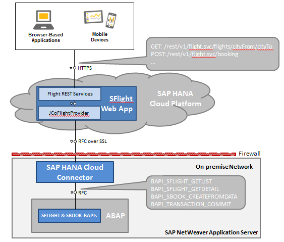
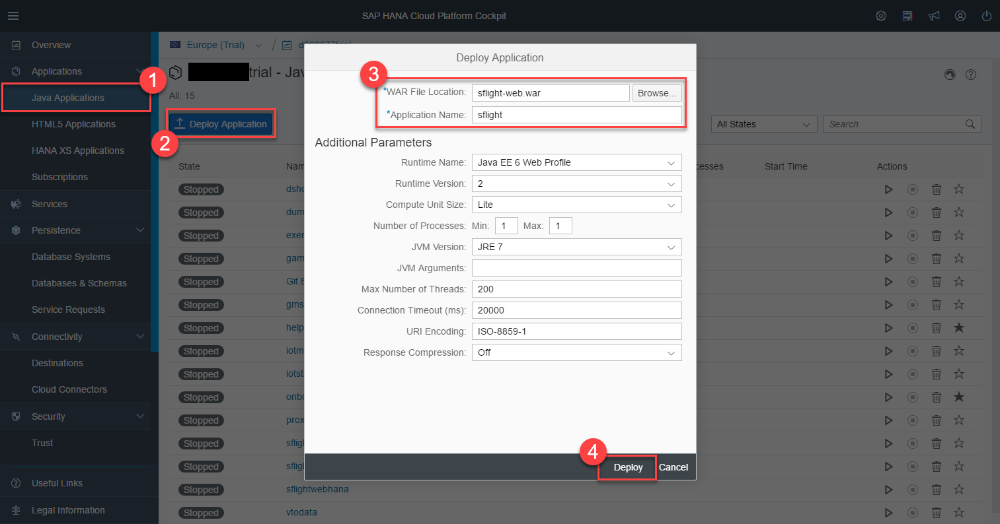
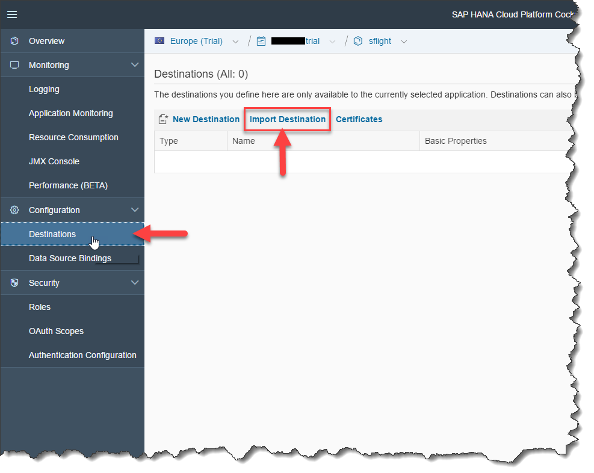
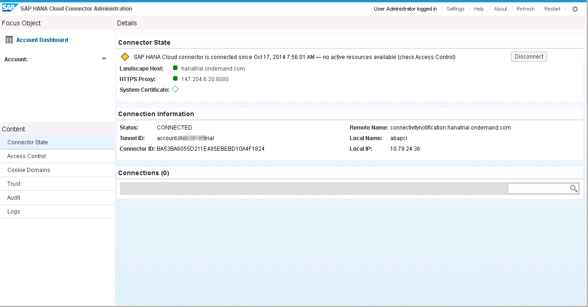
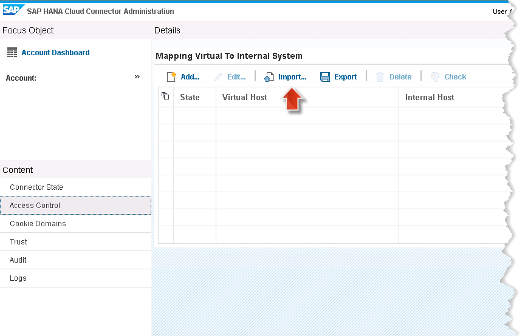

## Prerequisites  
- **Proficiency:** Beginner
- **Tutorials:**
  - [Sign up for a free trial account on SAP Cloud Platform](http://www.sap.com/developer/tutorials/hcp-create-trial-account.html)
  - [Setup SAP Cloud Appliance Library account and install preconfigured SAP solution in cloud](http://www.sap.com/developer/tutorials/hcp-prepare-cal-account.html)


## Next Steps
  - Select a tutorial from the [Tutorial Navigator](http://www.sap.com/developer/tutorial-navigator.html) or the [Tutorial Catalog](http://www.sap.com/developer/tutorials.html)

## Details

### You will learn  
In this tutorial, you will deploy an on-premise extension which uses RFC via JCo. This includes the setup of an SAP HANA Cloud Connector instance. The scenario used in this tutorial is based on the well-known `SFLIGHT` model available as default sample content in all ABAP systems.

It is assumed that you are using the SAP Cloud Appliance Library to get an ABAP test system plus pre-installed SAP HANA Cloud Connector, as described in the tutorial [Setup SAP Cloud Appliance Library account and install preconfigured SAP solution in cloud](http://www.sap.com/developer/tutorials/hcp-prepare-cal-account.html). The overall landscape of this on-premise extension scenario is then looking like in the figure below:



The components are explained in greater detail at the end of this tutorial.

### Time to Complete
**20 Min**

---
[ACCORDION-BEGIN [Step 1: ](Log on to the AWS instance)]

On Windows, press the **Windows-Key** and **R**. This should open the **Run**-Dialog. Type in `mstsc.exe` and hit **Enter**. Logon to your AWS instance with user `Administrator` and the master password you have specified when configuring the AWS instance in the SAP Cloud Appliance Library.

You should then have access to the Windows instance related to the AWS instance. On the desktop, you find shortcuts for SAP Development Tools for Eclipse and Mozilla Firefox.

[DONE]
[ACCORDION-END]


[ACCORDION-BEGIN [Step 2: ](Deploying and running the sample project)]

Download the [compiled version of the sample project](https://github.com/SAP/cloud-personslist-scenario/blob/Extensions-005/sflight-web/sflight-web.war?raw=true).

> If you want to take a look at the code clone our Git repository or explore it directly online using the GitHub webpage: https://github.com/SAP/cloud-personslist-scenario/tree/Extensions-005

Open the [cloud cockpit](https://account.hanatrial.ondemand.com/cockpit) and logon with your SAP Cloud Platform user.

Navigate to **Applications > Java Applications** and select **Deploy Application**. A Dialog will open. Select the `war` file you just downloaded and choose a name for the application. Now click on **Deploy**.

> It is recommended to use `sflight` as application name, but it's up to you.



The application is now deployed to your SAP Cloud Platform account. This will take some time.

[DONE]
[ACCORDION-END]

[ACCORDION-BEGIN [Step 3: ](Configuring the connectivity destination in the cloud)]
Now you need to configure the destination used by the application to access the ABAP system.

Go to **`D:/sap_hcp_scc/`** using the Windows Explorer and rename file `dest_sflight.jcoDestination` to `dest_sflight`.

Open the [SAP Cloud Platform cloud cockpit](https://account.hanatrial.ondemand.com/cockpit) in the browser and log on to your SAP Cloud Platform account.

Navigate into **Java Applications** and select the application you just deployed then navigate into **Destinations**.

Click on the **Import Destination** button and select the file `D:/sap_hcp_scc/dest_sflight`



[DONE]
[ACCORDION-END]

[ACCORDION-BEGIN [Step 4: ](Configuring the SAP HANA Cloud connector)]
Now you will connect the SAP HANA Cloud connector to your free developer account and configure the ABAP system and BAPIs used by the `sflight` application.

Start the cloud connector administration UI using the Firefox browser provided on the desktop of the AWS instance with URL `https://abapci.dummy.nodomain:8443`, and logon with user `Administrator` and password as `manage`. Later it asks you to change the password

To connect the cloud connector to your account, follow the steps described in the tutorial [How-to setup the SAP HANA Cloud Connector for secure on-premise connectivity](http://www.sap.com/developer/tutorials/hcp-cloud-connector-setup.html). Shortly summarized, you need to:

- choose **`Master (Primary Installation)`**
- select **`hanatrial.hana.ondemand.com`** as landscape host
- specify your account name, your SAP Cloud Platform user and password
- don't specify an HTTPS proxy.

Now the Cloud Connector should be connected to your SAP Cloud Platform account and you should see a screen similar to the one in the screenshot below.
    

Navigate to the **Access Control** view of the cloud connector and click the **Import...** button.




In the upcoming window, click the **Browse** button and select the file **`D:/sap_hcp_scc/access_control.zip`** and click **Save**.

Now you have imported the configuration of the ABAP system and the RFC resources needed by the `SFLIGHT` application and your Cloud Connector should look like shown below.


[DONE]
[ACCORDION-END]

[ACCORDION-BEGIN [Step 5: ](Testing the application)]
Now the SFLIGHT application has been deployed to your SAP Cloud Platform account, the needed destination has been configured, and the cloud connector has been connected and configured as well. The application can now be used. Test it by starting it in the browser:

  - Open the [cloud cockpit](https://account.hanatrial.ondemand.com/cockpit) and log on again with your SAP Cloud Platform user.
  - Navigate into **Java Applications** and drill into your application.
  - Start the `SFLIGHT` application by clicking the URL visible under **Application URLs**. This should bring up the application. You can now select a flight departure and arrival airport, e.g. `Frankfurt` and `New York`, then click the **Search** button. This should then list the available flights.

[DONE]
[ACCORDION-END]

[ACCORDION-BEGIN [Step 6: ](Explaining the UI layer)]

The `SFLIGHT` application uses SAPUI5 as the UI technology. In line with the Model-View-Controller paradigm, the main components comprising the UI layer are two JavaScript files **`sflight.view.js`** and **`sflight.controller.js`**, which are located in the **`/src/main/webapp/sflight-web`** folder of the project.

The screenshot below shows the UI with the function names of the `sflight.view.js` file, which implement the respective panel: `ui_java_script`


The individual panels interact with the `sflight.controller.js` file in following ways:

  - `createFlightSearchPanel(...)`: calls the `searchFlights(...)` function of the controller to retrieve a list of flights from specified departure and arrival airports.
  - `createFlightListPanel(...)`: calls the `getFlightDetails(...)` function of the controller to retrieve the details of the selected flight.
  - `createFlightDetailsPanel(...)`: calls the `bookFlight(...)` function of the controller to book the selected flight. It also calls the `searchFlights(...)` function of the controller again to retrieve an updated flight list.

The UI controller interacts with the server using REST services. All REST services return a JSON response. Consequently, both the controller and view components are using the `sap.ui.model.json.JSONModel` to bind the UI to the JSON data. The REST services called in the `sflight.controller.js` file are the following:

  - **GET `/rest/v1/flight.svc/cities`**: Returns a JSON array of cities, in which airports are located.
  - **GET: `/rest/v1/flight.svc/flights/{cityFrom}/{cityTo}`**: Returns a JSON array of flights with departure airport `{cityFrom}` and arrival airport `{cityTo}`.
  - **GET: `/rest/v1/flight.svc/flight/{carrier}/{connNumber}/{dateOfFlight}`**: Returns a JSON array with the details of the specified flight.
  - **POST: `/rest/v1/flight.svc/booking`**:  Books a flight as specified in the response body and returns a JSON object with the booking ID. (The `xmlhttprequest` object is used directly to trigger the POST request to the server.)

[ACCORDION-END]

[ACCORDION-BEGIN [Step 7: ](Explaining the REST services)]

The application is using [Apache CXF](https://cxf.apache.org/) and the [Spring Framework](http://projects.spring.io/spring-framework/) to provide the necessary REST services. In order to use these libraries, the needed dependencies must be defined in the [`pom.xml`](https://github.com/SAP/cloud-personslist-scenario/blob/Extensions-005/sflight-web/pom.xml):

```xml
<!-- Apache CXF -->
<dependency>
  <groupId>org.apache.cxf</groupId>
  <artifactId>cxf-rt-frontend-jaxws</artifactId>
  <version>${org.apache.cxf.version}</version>
</dependency>
<dependency>
  <groupId>org.apache.cxf</groupId>
  <artifactId>cxf-rt-transports-http</artifactId>
  <version>${org.apache.cxf.version}</version>
</dependency>
<dependency>
  <groupId>org.apache.cxf</groupId>
  <artifactId>cxf-rt-rs-extension-providers</artifactId>
  <version>${org.apache.cxf.version}</version>
</dependency>
<dependency>
  <groupId>org.apache.cxf</groupId>
  <artifactId>cxf-bundle-jaxrs</artifactId>
  <version>${org.apache.cxf.version}</version>
</dependency>

<!-- Spring framework -->
<dependency>
  <groupId>org.springframework</groupId>
  <artifactId>spring-context</artifactId>
  <version>${org.springframework.version}</version>
</dependency>
<dependency>
  <groupId>org.springframework</groupId>
  <artifactId>spring-web</artifactId>
  <version>${org.springframework.version}</version>
</dependency>
```

How to use CXF in combination with Spring is described in more detail on [the Apache Website](https://cxf.apache.org/docs/jaxrs-services-configuration.html). In short, these two libraries combined provide a simple-to-use framework to define REST services in POJOs, taking care for all the boilerplate code of receiving and sending HTTP requests for you. It thus allows you to focus on the business logic and makes development of REST services easy as 1-2-3.

To understand how the REST services of the sample application are implemented, you need to look into the [`springrest-context.xml`](https://github.com/SAP/cloud-personslist-scenario/blob/Extensions-005/sflight-web/src/main/webapp/WEB-INF/springrest-context.xml) file located under the [`/src/main/webapp/WEB-INF`](https://github.com/SAP/cloud-personslist-scenario/tree/Extensions-005/sflight-web/src/main/webapp/WEB-INF) folder of the project. There, a Spring bean is defined with the name **`flightService`**. This bean is implemented by the Java class [`com.sap.cloudlabs.connectivity.sflight.FlightService`](https://github.com/SAP/cloud-personslist-scenario/blob/Extensions-005/sflight-web/src/main/java/com/sap/cloudlabs/connectivity/sflight/FlightService.java). Using CXF and Spring annotations, the `FlightService` class is a simple POJO which provides the GET and POST service endpoints listed above. A small code fragment that shows how the definition of the REST service is done is shown here:

```java
@Service("flightService")
@Path("/flight.svc")
@Produces({ "application/json" })
public class FlightService {

    @GET
    @Path("/flights/{cityFrom}/{cityTo}")
    @Produces("application/json")
    public String getFlightList(@Context HttpServletRequest req, @PathParam("cityFrom") String cityFrom, @PathParam("cityTo") String cityTo)
    {
        // ...
    }
}
```

[ACCORDION-END]

[ACCORDION-BEGIN [Step 8: ](Explaining the connectivity layer)]

The `FlightService` class delegates all calls to a `FlightProvider` object which then, in turn, does the actual call to the on-premise system. For this, an interface [`com.sap.cloudlabs.connectivity.sflight.FlightProvider`](https://github.com/SAP/cloud-personslist-scenario/blob/Extensions-005/sflight-web/src/main/java/com/sap/cloudlabs/connectivity/sflight/FlightProvider.java) is used that defines the Java methods which shall be performed against the on-premise system.

Right now, there is only one implementation of the `FlightProvider` interface: [`com.sap.cloudlabs.connectivity.sflight.jco.JCoFlightProvider`](https://github.com/SAP/cloud-personslist-scenario/blob/Extensions-005/sflight-web/src/main/java/com/sap/cloudlabs/connectivity/sflight/jco/JCoFlightProvider.java). The `JCoFlightProvider` class uses the Java Connector (JCo) API to make RFC calls directly against the ABAP system. Of course, all the communication is encrypted and secured via the cloud connector. You can use JCo in exactly the same way as you might know it from SAP NetWeaver Application Server Java. A tutorial how to work with JCo can be found [in the SAP Business Objects Documentation](https://help.sap.com/businessobject/product_guides/hci1/en/SAPJCo_Doku_3.0_EN.pdf). The `JCoFlightProvider` class requires an RFC destination called `dest_sflight`.

Note that the `JCoFlightProvider` class not only fetches data from the ABAP system, but also writes back a flight booking transaction to the ABAP system. The BAPIs called by the application on the ABAP system are:

  - `BAPI_SFLIGHT_GETLIST`
  - `BAPI_SFLIGHT_GETDETAIL`
  - `BAPI_SBOOK_CREATEFROMDATA`
  - `BAPI_TRANSACTION_COMMIT`


[ACCORDION-END]

---

## Next Steps
Select a tutorial from the [Tutorial Navigator](http://www.sap.com/developer/tutorial-navigator.html) or the [Tutorial Catalog](http://www.sap.com/developer/tutorials.html)

---

## Related Information
  - [`SFLIGHT` Official documentation](https://help.sap.com/saphelp_erp60_sp/helpdata/en/48/1a323c3980a57be10000000a11402f/content.htm?frameset=/en/db/7c623cf568896be10000000a11405a/frameset.htm)
  - [GitHub project repository](https://github.com/SAP/cloud-personslist-scenario)
