## Prerequisites
- **Proficiency:** Intermediate
- **Tutorials:** [Calculate and display a new field in an SAPUI5 app](https://developers.sap.com/tutorials/hcp-webide-calculate-new-field.html)

## Next Steps
- [Localizing your SAPUI5 app](https://developers.sap.com/tutorials/hcp-webide-localizing-app.html)

## Details

### You will learn
[Git](https://git-scm.com/) is a widely used source code management system for software development, and is built into your SAP Cloud Platform account, and integrated with SAP Web IDE.

There are many reasons why you might want to use a source code management tool. Some obvious ones are:

- You made a mistake during development and want to return to a previous version of a file (or all)
- Capture the state of code for a deployed application
- Work in a development team and need to merge changes from individual "branches" of the code into the "main line" of the code stream

In this tutorial, you will learn how to commit and "push" your project files to your Git repository. In addition to being a good idea, your project files will need to be in Git for the next tutorial where you will [Localize your SAPUI5 app](https://developers.sap.com/tutorials/hcp-webide-localizing-app.html)

As you work through this tutorial (and afterwards) you will notice some Git "decorations" or icons indicating Git status starting to appear next to your files and folders. There are six different states which are indicated as shown in the table below. Watch for the decorations to change from New file > Modified and Staged > Committed. After a commit, any changes in a file will be indicated with one asterisk (indicating that the file is out of sync with the version in Git).

Decoration                                                   | Meaning
:--------------------------------------------------------:   | :-------------
                     | Committed file (version in your project matches that in Git)
      | Modified file that has not been staged
              | Modified file that has been staged
                      | New file
 | Folder containing deleted files
          | File with merge conflicts

### Time to Complete
**5 min**

---

[ACCORDION-BEGIN [Step 1: ](Create new repository)]

Open your SAP Cloud Platform Cockpit view, click on **Repositories > Git Repositories**.

Click on New Repository, and enter the following:

Field             | Value
:---------------- | :----------------
Name              | `northwind`
Description       | `Repository for northwind app`

Make sure the **Create empty commit** box is checked, click **OK** and your repository will be created.

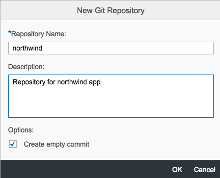

[ACCORDION-END]

[ACCORDION-BEGIN [Step 2: ](Get repository URL)]

Click on the **northwind** repository link to open the repository overview page.

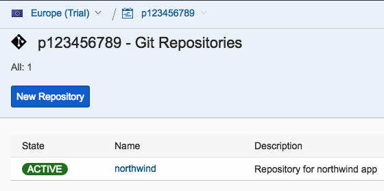

On the repository overview page, copy the **Git Repository URL**:

[ACCORDION-END]

[ACCORDION-BEGIN [Step 3: ](Open project in Web IDE)]

Open SAP Web IDE in a browser window, and open your project folder (`northwind`). Note that there are no decorations next to your files.

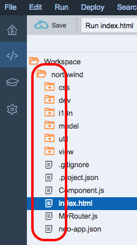

[ACCORDION-END]

[ACCORDION-BEGIN [Step 4: ](Initialize repository)]

Right-click on your **northwind** project folder and select **Git > Initialize Local Repository**.

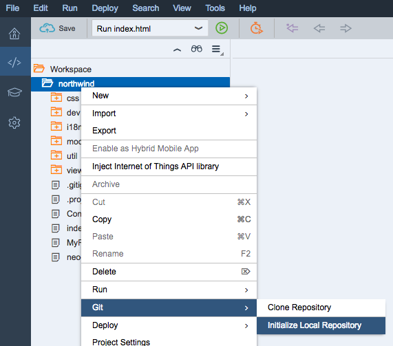

Paste in the **Git Repository URL** you copied earlier and click **OK**. This will initialize your local repository and link it to the Git repository in SAP Cloud Platform.

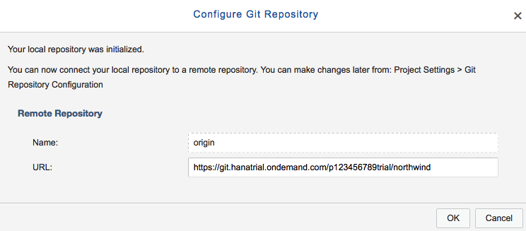

[ACCORDION-END]

[ACCORDION-BEGIN [Step 5: ](Open repository)]

Click on the **Git pane** icon on the right hand side of the SAP Web IDE window.

If your project does not appear in the **Git pane**, keep the Git pane open and click on the project folder.

[ACCORDION-END]

[ACCORDION-BEGIN [Step 6: ](Fetch changes from remote)]

So you can see remote branches in the SAP Cloud Platform Git repository, click the **Fetch** button on the Git pane and log in with your SAP Cloud Platform account credentials if prompted. When the **Changes Fetched** dialog box opens, click **OK**.

[ACCORDION-END]

[ACCORDION-BEGIN [Step 7: ](Merge branches)]

Click the **Merge** button on the Git pane to merge your local branch to the remote origin/master branch. When the **Merge "master"** dialog box opens, make sure the **origin/master** remote branch is selected and click **OK**.

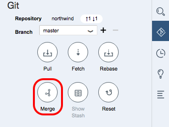

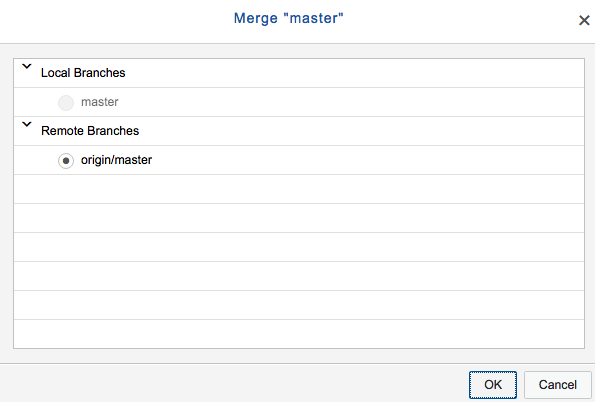

[ACCORDION-END]

[ACCORDION-BEGIN [Step 8: ](View repository)]

You will now notice that the new file decorations are visible on your project files.

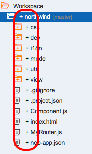

At this point your Git repository is set up. The next steps will commit and push your project files to the repository.

[ACCORDION-END]

[ACCORDION-BEGIN [Step 9: ](Stage your files)]

You may select individual files to commit, but to commit all project files, click the **Stage All** checkbox.

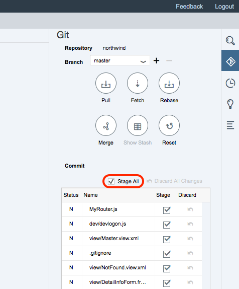

Notice the change in the decorations for your files and folders.

[ACCORDION-END]

[ACCORDION-BEGIN [Step 10: ](Enter commit message)]

Scroll down in the **Git pane** and enter a description (required for any commits). A description like `Initial commit of northwind app` would work well.

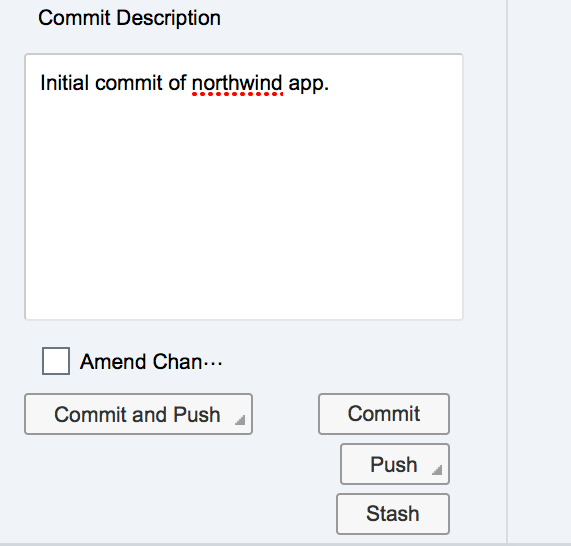

[ACCORDION-END]

[ACCORDION-BEGIN [Step 11: ](Commit and push your files)]

Click on the **Commit and Push** button, and select **Remote Branch**, from the pop up menu. This will add your files to the master branch (in other source control systems this is sometimes referred to as the "trunk").

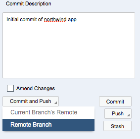

[ACCORDION-END]

[ACCORDION-BEGIN [Step 12: ](Select remote to push to)]

In the **Push Changes to a remote branch** dialog box, select **origin/master**, click **OK** and log in with your SAP Cloud Platform credentials if prompted.

[ACCORDION-END]

[ACCORDION-BEGIN [Step 13: ](Check your commit)]

You will see a confirmation alert appear briefly in the top-right corner of the Web IDE window (just below **Logout**), and you will see the decorations change to the **green circles** indicating that the files have been committed (and the version in your project matches the version in the Git repository).

[ACCORDION-END]

