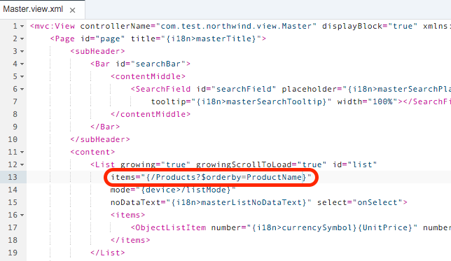
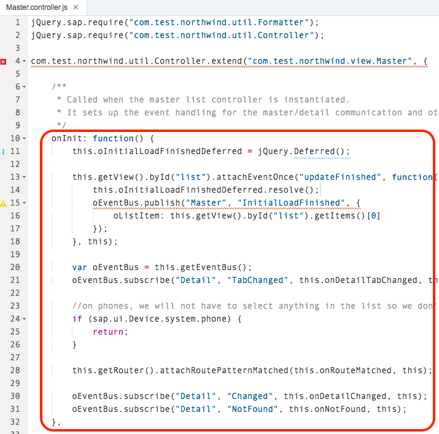
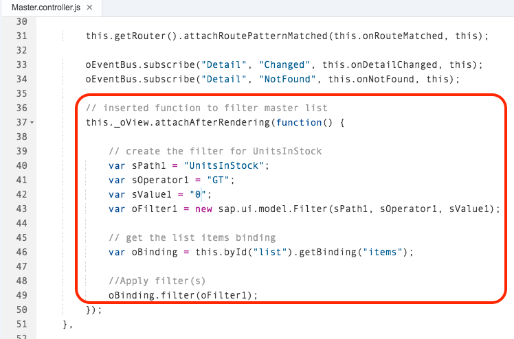
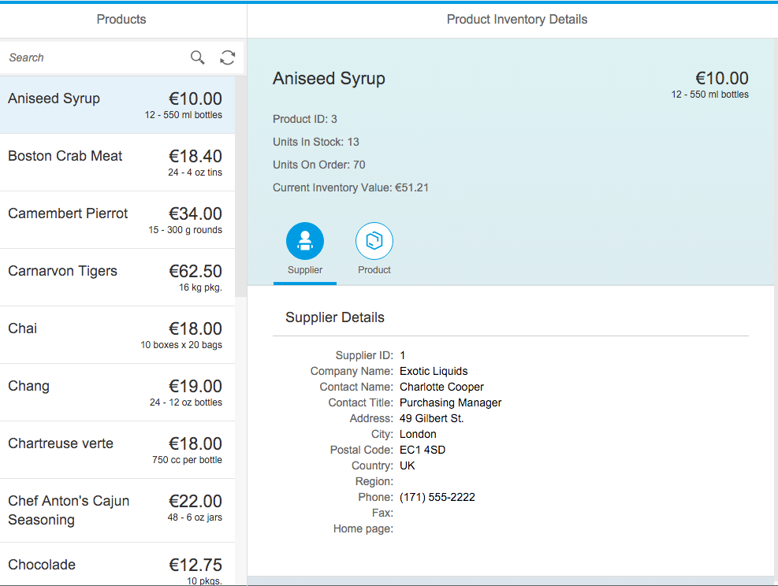
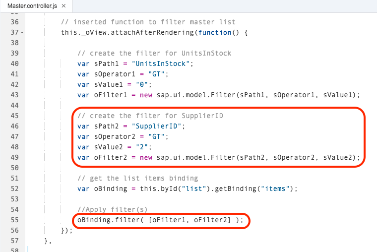
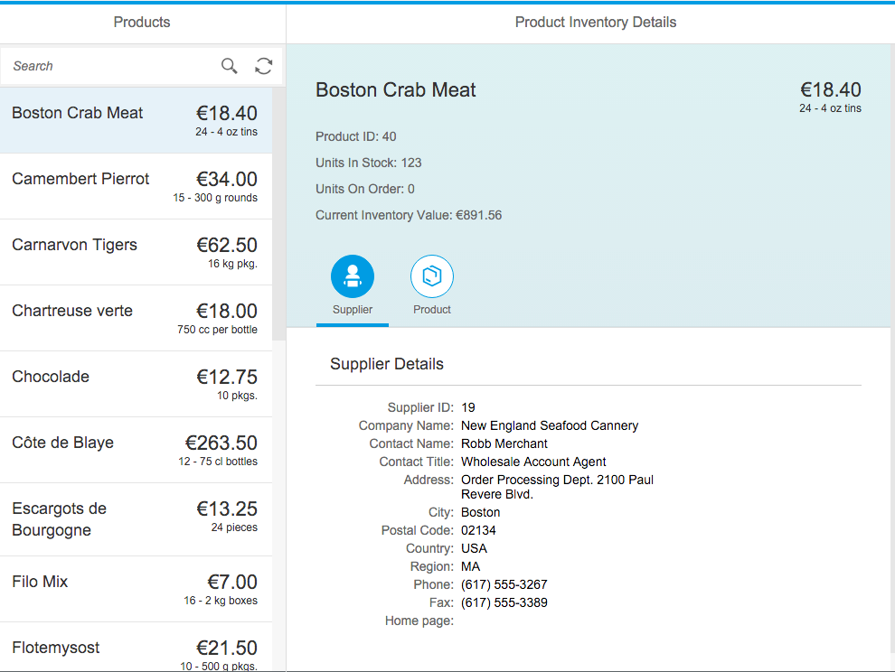
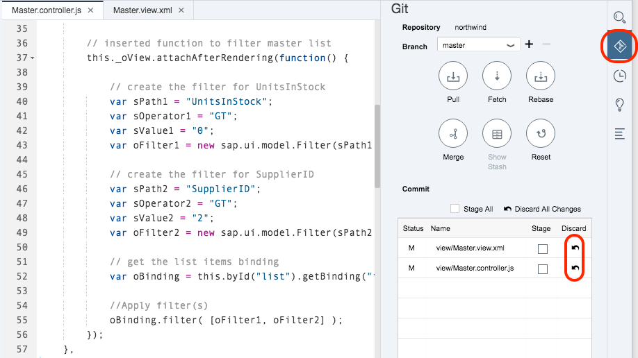

## Prerequisites  
 - **Proficiency:** Intermediate
 - **Tutorials:** [An Open Data Protocol (OData) primer for developers](http://go.sap.com/developer/tutorials/hcp-webide-odata-primer.html)

## Next Steps
 - [Manually creating a data model to use in SAP Web IDE's Mock Data server](http://go.sap.com/developer/tutorials/hcp-webide-create-odata-model.html)

## Details
### You will learn  
The previous tutorial introduced a number of OData query options that developers can use to offload logic from the client to the OData service. In this tutorial, you will learn how to incorporate one or more query options into your SAPUI5 application.

### Time to Complete
**10 Min**.

---

1. Log into your [HCP account](https://account.hanatrial.ondemand.com) and open SAP Web IDE tab in a Google Chrome browser. Ensure that your latest code has been committed to your git repository. If so, you should have green dots next to the folders and files in your project (as shown below). If not, [commit your files to Git now](http://go.sap.com/developer/tutorials/hcp-webide-commit-git.html).

     

2. Open the **northwind** project folder and then the **view** folder. Double-click on `Master.view.xml`. Locate the `items` attribute in the `List` element.

     The `items` attribute points to the primary collection (Products) of the Northwind OData service which is displayed in the “master” list of the app. Since this is the last part of the OData query, you will insert any query options in this attribute.

     You may want to add some line breaks in your code to match the image below. It will make it simpler to change the `items` attribute in the steps below.

     

3. If you run your app, you will notice that the OData results are returned sorted by the `ProductID` field. This default behaviour is driven by the `PropertyRef` in the `Key` element of the data model (`ProductID` in this case). You can see the key in the Northwind [metadata document](http://services.odata.org/V2/Northwind/Northwind.svc/$metadata) or your `northwind/model/metadata.xml` file.

    

4. It is easier for a user to find a given product by name if the list is in alphabetical order. To implement this through a query option, you could append the `items` attribute in `Main.view.xml` with `?$orderby=ProductName`. 

    However, the proper way to make the change is to use the [UI5 Sorter](https://openui5.hana.ondemand.com/docs/api/symbols/sap.ui.model.Sorter.html) for list bindings. In `Master.view.xml`, modify the `items` attribute of the `List` element as shown below.

    The items attribute should be:

    ```xml
    items="{
        path :'/Products',
        sorter : {
        path : 'ProductName', descending : false
        }
    }"
    ```

    

5. Save your change and run the app ( remember to empty the cache and reload if necessary). You will see that the master list is now sorted by product name.

    

6. To add additional query options as a filter requires a different approach because the `List` element doesn't support the a Filter value as a binding path. The way to add one or more filter query options is add a function in the view controller (`Master.controller.js`). In the Web IDE, open `northwind/view/Master.controller.js` and locate the `onInit: function()`.
 
    

7. To sort by the product name *and* exclude products that are out of stock, insert the lines below to create a variable with a reference to the view.

    ```xml
    // get the view for filtering
    this._oView = this.getView();
    ```

    

8. At the bottom on the `onInit` function, insert the code snippet below which adds an `attachAfterRendering` function which defines the parameters for the [UI5 Filter](https://openui5.hana.ondemand.com/docs/api/symbols/sap.ui.model.Filter.html), creates a new `Filter` object, gets the list binding and applies the filter:

    ```javascript
    // inserted function to filter master list
    this._oView.attachAfterRendering(function() {
		    
        // create the filter for UnitsInStock
        var sPath1 = "UnitsInStock";
        var sOperator1 = "GT";
        var sValue1 = "0";
        var oFilter1 = new sap.ui.model.Filter(sPath1, sOperator1, sValue1);
            
        // get the list items binding
        var oBinding = this.byId("list").getBinding("items");
            
        //Apply filter(s)
        oBinding.filter(oFilter1);
    });
    ```

    

    Save your change, switch to the app preview tab and select Hard Reload or Empty Cache and Hard Reload. Your app should now look like this:
    
    
    
9. Suppose there is a need to support a particular sales team in operating unit that only sells products from specific suppliers, you can add in a second logical test. To add an additional filter to exclude products from Supplier IDs 1 and 2, modify the `attachAfterRendering` function to create a second filter, then apply both to the list binding:

    ```javascript
    // inserted function to filter master list
    this._oView.attachAfterRendering(function() {
		    
        // create the filter for UnitsInStock
        var sPath1 = "UnitsInStock";
        var sOperator1 = "GT";
        var sValue1 = "0";
        var oFilter1 = new sap.ui.model.Filter(sPath1, sOperator1, sValue1);
            
        // create the filter for SupplierID
        var sPath2 = "SupplierID";
        var sOperator2 = "GT";
        var sValue2 = "2";
        var oFilter2 = new sap.ui.model.Filter(sPath2, sOperator2, sValue2);
            
        // get the list items binding
        var oBinding = this.byId("list").getBinding("items");
            
        //Apply filter(s)
        oBinding.filter( [oFilter1, oFilter2] );
    });
    ```
    
    > Note the addition of the square brackets in the when applying the second filter.

    
    
    Save your change, switch to the app preview tab and select Hard Reload or Empty Cache and Hard Reload. Your view file and app should now look like this:


    


10. You can keep these edits if you would like, or to rollback to the previous state by using Git. To use Git, click on the **Git** icon in Web IDE, click the arrow under **Discard** in the **Git pane** and click **OK** on the Git confirmation dialog box. After clicking the discard arrow, the green dot (indicating the version in your project folder is the same as that in Git) will reappear next to `Master.view.xml` and `Master.controller.js` (as well as the **view** and **northwind** folders).


    


## Next Steps
 - [Manually creating a data model to use in SAP Web IDE's Mock Data server](http://go.sap.com/developer/tutorials/hcp-webide-create-odata-model.html)
