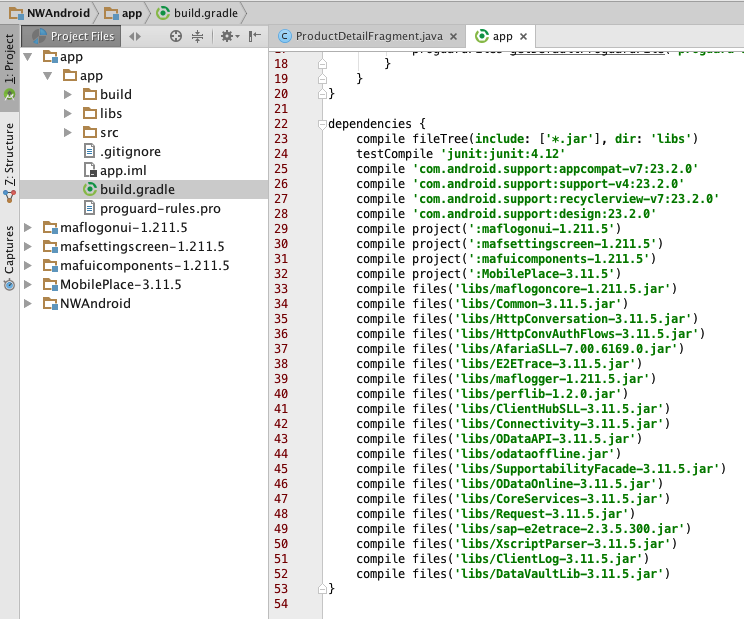

## Prerequisites  
- **Proficiency:** Intermediate
- **Tutorials:** [Create a basic native Android master-detail app](http://www.sap.com/developer/tutorials/hcpdo-basic-android-app.html)
- Download and install the [SAP Mobile SDK](https://store.sap.com/sap/cpa/ui/resources/store/html/SolutionDetails.html?pid=0000013098)

## Next Steps
- [Compile and run a native Android app on SAP Cloud Platform](http://www.sap.com/developer/tutorials/hcpdo-run-native-android-app.html)

## Details
### You will learn  
You will modify an Android Studio project to include a number of resources from the SAP Mobile Platform SDK to provide secure login functionality (along with the accompanying UI components) as well as support for OData services. You must have already downloaded and installed the SAP Mobile Platform SDK and the latest patch release (if applicable) to continue.

After running the SDK installer you will find the native SDK files in the installation folder: `<install_path>/MobileSDK3/NativeSDK/`

To use the MAF Login Component you must import a number of Libraries and Resources. MAF Libraries were installed with the SMP SDK installer into the folder specified by you when you executed the installer. MAF is shipped with various resources including Android, iOS and Windows specific files like: images, layouts, localization, XML documents etc.

The procedure shown in this tutorial can be used for any of the Android activity types – including a "no activity" empty project. In this tutorial, we will use an application name, and UI activity titles that match the Android native app tutorial for the Northwind OData service.

### Time to Complete
**15 Min**.

---

[ACCORDION-BEGIN [Step 1: ](Open your Android project)]

Open the `NWAndroid` project you created in the [previous tutorial](http://www.sap.com/developer/tutorials/hcpdo-basic-android-app.html).

[DONE]
[ACCORDION-END]

[ACCORDION-BEGIN [Step 2: ](Start new module)]

Right click on `app` and select **New > Module** from the context menu.

[DONE]
[ACCORDION-END]

[ACCORDION-BEGIN [Step 3: ](Import package)]

Select Import **.JAR/.AAR Package** and click **Next**.

[DONE]
[ACCORDION-END]

[ACCORDION-BEGIN [Step 4: ](Find resource folder)]

Click on the Browse button (`...`) and navigate to the SDK installation directory and find the `mafsettingscreen-res-xxx` resource folder. Click **Finish**.

The path should be: `<install_path>/MobileSDK3/NativeSDK/MAFReuse/Android/libraries/mafsettingscreen-xxx.aar`

[DONE]
[ACCORDION-END]

[ACCORDION-BEGIN [Step 5: ](Import first library)]

Repeat steps 2-4 to import `mafuicomponents-xxx.aar`

The path should be: `<install_path>/MobileSDK3/NativeSDK/MAFReuse/Android/libraries/mafuicomponents-xxx.aar`

[DONE]
[ACCORDION-END]

[ACCORDION-BEGIN [Step 6: ](Import second library)]

Repeat steps 2-4 to import `maflogonui-xxx.aar`

The path should be: `<install_path>/MobileSDK3/NativeSDK/ODataFramework/Android/libraries/maflogonui-xxx.aar`

> Note `maflogonui-xxx.aar` is under the `ODataFramework` directory, not `MAFReuse`

[DONE]
[ACCORDION-END]

[ACCORDION-BEGIN [Step 7: ](Import third library)]

Repeat steps 2-4 to import `MobilePlace-xxx.aar`. The `MobilePlace.jar` was replaced by the `.aar` package, so it needs to be included in the same way as the MAF packages.

The path should be: `<install_path>/MobileSDK3/NativeSDK/ODataFramework/Android/libraries/MobilePlace-3.11.5.aar`

> Note `MobilePlace-xxx.aar` is under the `ODataFramework` directory, not `MAFReuse`

[DONE]
[ACCORDION-END]

[ACCORDION-BEGIN [Step 8: ](View your project)]

Your project should look like this now:

[DONE]
[ACCORDION-END]

[ACCORDION-BEGIN [Step 9: ](Add dependencies)]

Right-click the the `app` module and select **Open Module Settings** then click on the **Dependencies** tab.

Click on the **+** icon to add a new dependency and select **Module dependency**.

Select them all and click **OK** and Android Studio will initiate a `gradle` build.

[DONE]
[ACCORDION-END]

[ACCORDION-BEGIN [Step 10: ](Import remaining libraries)]

To import the remaining libraries, select the `AfariaSLL.jar` file in your SDK installation directory and right-click to copy the file.

The directory should be: `<install_path>/MobileSDK3/NativeSDK/ODataFramework/Android/libraries/AfariaSLL-x.xxx.jar`

[DONE]
[ACCORDION-END]

[ACCORDION-BEGIN [Step 11: ](Set libraries location)]

In Android Studio in the **Project** and **Project Files** view, right-click on `app` and select paste. In the copy dialog box, add `libs` to the end of the **To directory** path and click **OK**. This will add the `AfariaSLL` library to the project as well as create the `libs` directory.

[DONE]
[ACCORDION-END]

[ACCORDION-BEGIN [Step 12: ](Copy remaining libraries)]

In your file system, copy the remaining libraries below from the `<install_path>/MobileSDK3/NativeSDK/ODataFramework/Android/libraries/` directory, right-click on the new `libs` folder in Android Studio and select paste.

Using the Android Studio project view, copy the following jar libraries from the SDK installation folders and paste it into the libs folder in Android Studio.  

- `ClientHubSLL`
- `ClientLog.jar`
- `Common.jar`
- `Connectivity.jar`
- `CoreServices.jar`
- `DataVaultLib.jar`
- `E2ETrace.jar`
- `HttpConvAuthFlows.jar`
- `HttpConversation.jar`
- `maflogger.jar`
- `maflogoncore.jar`
- `ODataAPI.jar`
- `odataoffline.jar (offline store)`
- `ODataOnline.jar (online store)`
- `perflib.jar`
- `Request.jar`
- `sap-e2etrace.jar`
- `SupportabilityFacade.jar`
- `XscriptParser.jar`

[DONE]
[ACCORDION-END]

[ACCORDION-BEGIN [Step 13: ](Add all libraries)]

In Android Studio, open the libs folder, select all the libraries you have added, right-click and select **Add As Library...**.

In the **Create Library** dialog box, select the `app` module and click **OK**.

[DONE]
[ACCORDION-END]

[ACCORDION-BEGIN [Step 14: ](Check that libraries were added)]

You can check the libraries were added in the `build.gradle` file located in the app module.

[DONE]
[ACCORDION-END]

## Next Steps
- [Compile and run a native Android app on SAP Cloud Platform](http://www.sap.com/developer/tutorials/hcpdo-run-native-android-app.html)
