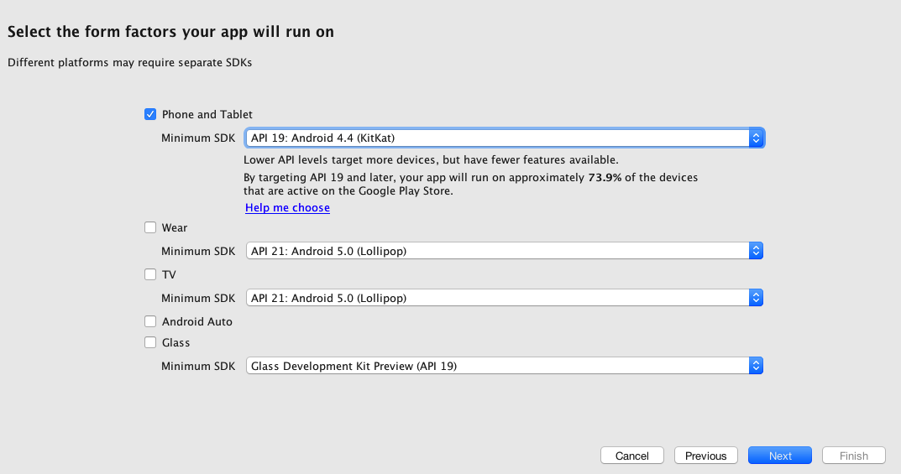

## Prerequisites  
- **Proficiency:** Intermediate
- **Tutorials:**
- [Create a native app in SAP Cloud Platform mobile service for development and operations](http://www.sap.com/developer/tutorials/hcpdo-create-native-app.html)
- Download and install [Android Studio](https://developer.android.com/studio/index.html)

## Next Steps
- [Configure Android Studio for mobile development](http://www.sap.com/developer/tutorials/hcpdo-android-sdk-setup.html)

## Details
### You will learn  
In this example, you will create a skeleton of an app using the Android Studio Master-Detail Flow activity template. In the next tutorial, you will add the SAP Mobile SDK resources to it.

### Time to Complete
**5 Min**.

---

[ACCORDION-BEGIN [Step 1: ](Start a new Android Studio project)]

Open Android Studio and click on **Start a new Android Studio project**.

[DONE]
[ACCORDION-END]

[ACCORDION-BEGIN [Step 2: ](Configure your project)]

In the **Configure your new project** screen, enter the values below. The package name will be created for you. Lastly, select the directory for your project files and click **Next**.

Field Name        | Value
:---------------- | :-------------
Application name  | `NWAndroid`
Company Domain    | `northwind.com`

[DONE]
[ACCORDION-END]

[ACCORDION-BEGIN [Step 3: ](Select format)]

In the **Select the form factors your app will run on** screen:

- Select the **Phone and Tablet** checkbox
- Select the **Minimum SDK level** to `API 19`
- Leave the **TV**, **Wear** and **Glass** boxes unchecked
- Click **Next**

[DONE]
[ACCORDION-END]

[ACCORDION-BEGIN [Step 4: ](Add activity)]

In the **Add an Activity to Mobile** screen, select the `Master/Detail Flow` activity and click **Next**.

[DONE]
[ACCORDION-END]

[ACCORDION-BEGIN [Step 5: ](Customize activity)]

In the **Customize the Activity** screen, enter the values below. The Title field will be populated for you. Click **Finish** and Android Studio will create the project and master-detail app framework for you.

Field Name         | Value
:----------------- | :-------------
Object Kind        | `Product`
Object Kind Plural | `Products`
Title              | `Products` (filled out for you)

[DONE]
[ACCORDION-END]

[ACCORDION-BEGIN [Step 6: ](View your project)]

Your project window should look like this:

[DONE]
[ACCORDION-END]

[ACCORDION-BEGIN [Step 7: ](Run the project)]

To make sure the Android Studio environment is working properly, you can run the app by clicking the **run** button, and the app will compile.

[DONE]
[ACCORDION-END]

[ACCORDION-BEGIN [Step 8: ](Choose device)]

You will be prompted to choose a device for your app. You can select a connected Android device (if you have one it will appear in the window, or you can run in the Android Emulator. If you select the emulator, it is normal for it to take a few minutes to start up.

If you select the emulator, your app will look like this:

[DONE]
[ACCORDION-END]

[ACCORDION-BEGIN [Step 9: ](View detail screen)]

Selecting one of the items in the list will show the detail screen:

[DONE]
[ACCORDION-END]

## Next Steps
- [Configure Android Studio for mobile development](http://www.sap.com/developer/tutorials/hcpdo-android-sdk-setup.html)
