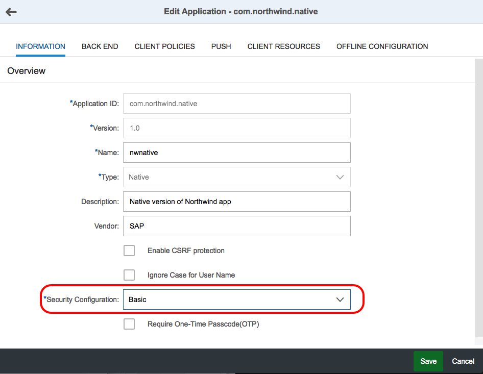

## Prerequisites  
 - **Proficiency:** Intermediate
 - **Tutorials:** 
   - [Sign up for an account on HANA Cloud Platform](http://go.sap.com/developer/tutorials/hcp-create-trial-account.html)
   - [Enable SAP HANA Cloud Platform mobile services for development and operations](http://go.sap.com/developer/tutorials/hcpms-enable-mobile-services.html)

## Next Steps
 - [Create a basic native Android master-detail app](http://go.sap.com/developer/tutorials/hcpdo-basic-android-app.html)

## Details
### You will learn  
Creating an app in SAP HANA Cloud Platform mobile service for development and operations will provide a server URL that a native mobile app will use for logon, registration and data access.

### Time to Complete
**5 Min**.

---

1. Log on to your [HANA Cloud Platform account](https://account.hanatrial.ondemand.com/cockpit), click on the **Services** tab, click on  the **Development & Operations** tile. On the **Development & Operations** status page, click the **Go to Service** link to open the Development & Operations cockpit.

2. Click on the **Applications** tile or on **Applications** in the left navigation bar.

    

3. The Click the **Create Application** icon to open the create app dialog box. 

    

4. Enter the following and click **Save**.

    Field Name              | Value
    :---------------------- | :-------------    
    App ID                  | `com.northwind.native`
    Version                 | `1.0` (populated for you)
    Name                    | `nwnative`
    Type                    | ` Native`
    Description             | `Native version of Northwind app`
    Vendor                  | `SAP`
    Enable CSRF protection  | (leave unchecked)

    

5. The Edit Application screen is displayed with the **INFORMATION** tab displayed. In the Security Configuration pull-down, select `Basic` (for username and password authentication). 

    

6. Click on the **BACK END** tab and enter the following and click **Save**. 

    Field Name              | Value
    :---------------------- | :-------------    
    Backend URL             | `http://services.odata.org/V2/Northwind/Northwind.svc`
    Proxy Type              | `Internet`
    Authentication Type     | `No Authentication` (from drop-down)
    Maximum Connections     | `100`
    Rewrite Mode            | `Rewrite URL on HCPms`
    Relative Paths          | (leave blank)

    
    
7. Once the application is created, click the **Home** navigation bar and you will see the number of Applications has increased. 

    

## Next Steps
 - [Create a basic native Android master-detail app](http://go.sap.com/developer/tutorials/hcpdo-basic-android-app.html)
