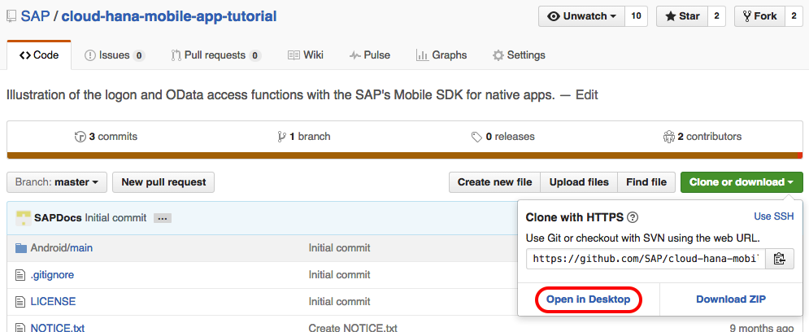
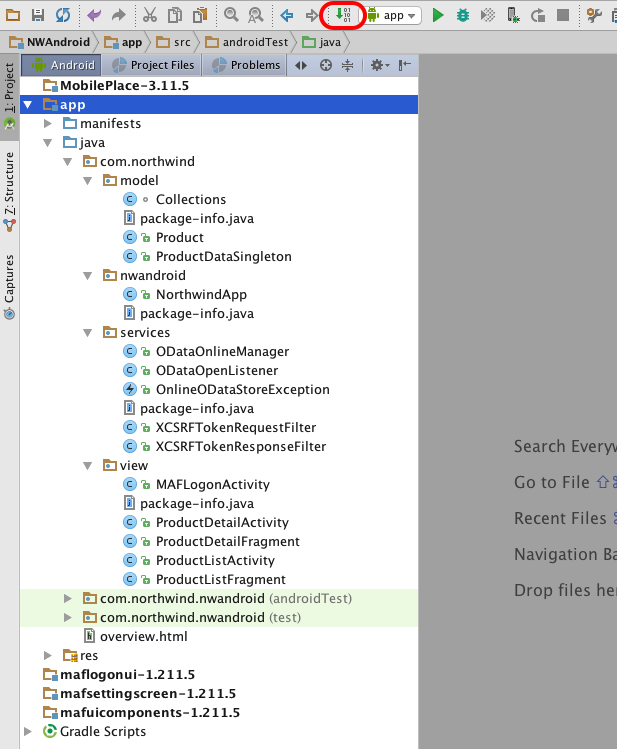
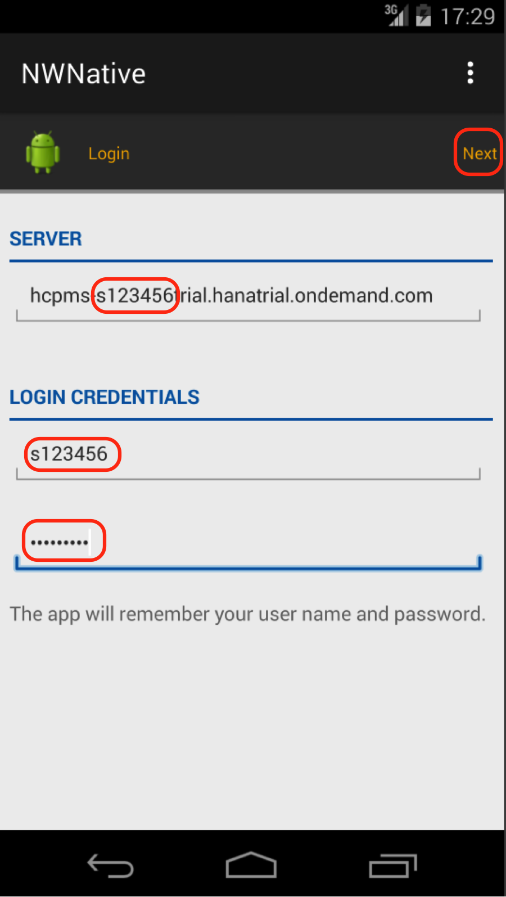
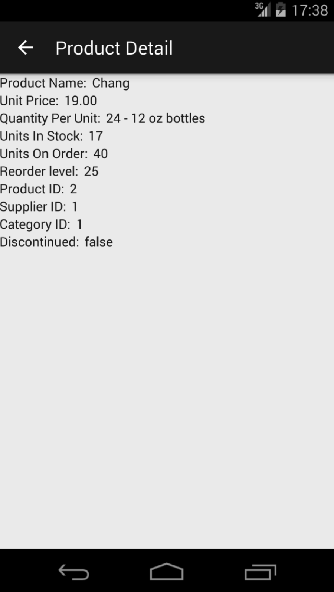
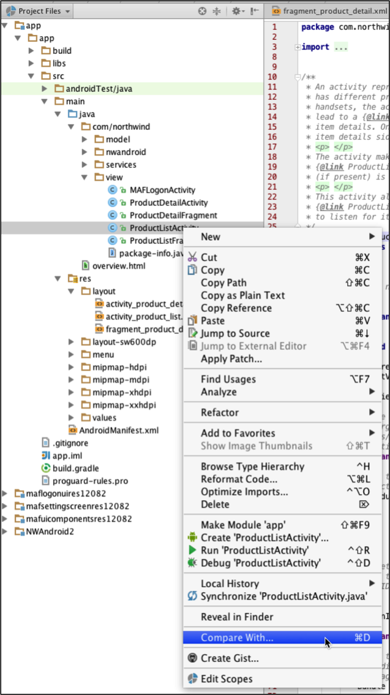

## Prerequisites  
- **Proficiency:** Intermediate
- **Tutorials:** [Configure Android Studio for mobile development](http://www.sap.com/developer/tutorials/hcpdo-android-sdk-setup.html)
- Download and install the [GitHub Desktop Client](https://desktop.github.com/)
- Android device or Android Emulator on your development machine

## Next Steps
- Select a tutorial from the [Tutorial Navigator](http://www.sap.com/developer/tutorial-navigator.html) or the [Tutorial Catalog](http://www.sap.com/developer/tutorials.html)

## Details
### You will learn  

In this tutorial you will review and run a native Android version of the Northwind hybrid app (from [Mobile Groups 1-3](http://www.sap.com/developer/tutorial-navigator.beginner.html)) and run it on SAP Cloud Platform mobile services for development and operations. You will use Android Studio and elements of the SAP Mobile Platform SDK to build the app, and access the same Northwind OData service used in the mobile web and hybrid tutorials.

If you have not completed the tutorials in [Mobile Groups 1-3](http://www.sap.com/developer/tutorial-navigator.beginner.html) – it would be best to work through those first to become familiar with the OData service used.

The final version of the app will look like this:


The source code is available in GitHub, and after a walk-through of the code in this tutorial, you will have the opportunity to make some changes and see their effect.

### Time to Complete
**20 Min**.

---


[ACCORDION-BEGIN [Step 1: ](Get sample code)]

The sample code used in this tutorial is available in the following GitHub repository: <https://github.com/SAP/cloud-hana-mobile-app-tutorial>. Open the repository link in a browser, click the **Clone or download** button.

If you have the GitHub Desktop Client installed, you can click the **Open in Desktop** link and follow the prompts to clone the repository to your development machine.



[DONE]
[ACCORDION-END]

[ACCORDION-BEGIN [Step 2: ](Replace generated files)]

Since you have already completed the [Configure Android Studio for mobile development](http://www.sap.com/developer/tutorials/hcpdo-android-sdk-setup.html) tutorial you already have the basic app framework in place. For these instructions, we will assume the path to your project is: `~/devel/Northwind_Android`. Please substitute your real path accordingly.

What you will do next is replace the generated source files with those you just cloned from GitHub.

Navigate to the project folder created in the [Create a basic native Android master-detail app](http://www.sap.com/developer/tutorials/hcpdo-basic-android-app.html) tutorial, and move and rename the `~/devel/Northwind_Android/NWAndroid/app/src/main` directory back up the directory tree to `~/devel/Northwind_Android/NWAndroid/main_old`. This will preserve the generated files in case you want to refer to them later or do a `diff` to examine the changes made in the cloned source.

[DONE]
[ACCORDION-END]

[ACCORDION-BEGIN [Step 3: ](Copy main directory)]

Copy the main directory from the cloned directory (e.g. `~/devel/Git_Source/NWAndroid/main` to your project folder (`~/devel/Northwind_Android/NWAndroid/app/src/main`) so it takes the place of the directory you just moved.

[DONE]
[ACCORDION-END]

[ACCORDION-BEGIN [Step 4: ](Build and run)]

Open Android Studio and confirm the source file structure looks the same as below. With the `app` configuration selected, click the **Make Project** button to build the app.



After the build completes, click the **Run** button to launch the app.


[DONE]
[ACCORDION-END]

[ACCORDION-BEGIN [Step 5: ](Choose device)]

8. When prompted to choose a device, select a virtual device based on the ARM architecture and click **OK**.

The emulator will start, you need to unlock the device, and then the app will appear.


[DONE]
[ACCORDION-END]

[ACCORDION-BEGIN [Step 6: ](Edit details)]

When the app launches, the Logon screen will appear. You need to edit the three fields shown on the screen:

Field Name         | Value
:----------------- | :-------------
Server URL         | replace `s123456` with your SAP Cloud Platform trial account ID
Login Credentials  | Change `s123456` to your account ID
Password           | enter your SAP Cloud Platform trial account password


Click **Next**



[DONE]
[ACCORDION-END]

[ACCORDION-BEGIN [Step 7: ](Finish deployment)]

After the **In Progress** alert is shown, the **Set App Passcode** screen is displayed. Uncheck **Use application passcode**, then click **Done**.


When you click **Done**, the app will register with the Development & Operations server, send the data requests and display the results.


Selecting one of the products in the list will display the product details.



[DONE]
[ACCORDION-END]

[ACCORDION-BEGIN [Step 8: ](Examine code modifications)]

Now that the app is running, you will take a closer look at the MAF Logon implementation and the modifications to the Android Studio generated code to handle the data.

The default MAF Logon screen sequence looks like this:


As you can tell from running the app, a number of customizations have already been made.  These can be found in the `MAFLogonActivity.onCreate()` method, along with a few strings extracted to the `strings.xml` file in `app/res/values`. The key methods that are implemented in the `MAFLogonActivity` are detailed in the [SAP online docs](https://help.sap.com/saphelp_smp3012sdk/helpdata/en/7c/09250170061014bb05d2c9cd16418c/content.htm).

[DONE]
[ACCORDION-END]

[ACCORDION-BEGIN [Step 9: ](Log-in screen changes)]

The first obvious changes are that the splash screen and SAP Mobile Place on-boarding screen have been suppressed. There are a number of fields that can be shown or hidden on the Login details screen. In the tutorial, we show only the Server URL, Username and Password fields.

There is a great [blog by Claudia Pacheco](http://scn.sap.com/community/developer-center/mobility-platform/blog/2015/04/28/customizing-maf-logon-component-in-android) available on SCN that provides details on the customizations. Please take a few minutes to review it now.

For more information on the `LogonUIFacade` class and the `setDefaultValue()`, `isFieldHidden()` methods as well as the `LogonCore.SharedPreferenceKeys enum` used in the `onCreate()` method , you can review the Javadocs downloaded with the SDK.

- See the `maflogoncore-<version #>-javadoc` folder:
- `LogonCore.SharedPreferenceKeys`
- `LogonCore`
- See the `maflogonui-<version #>-javadoc` folder:
- `LogonUIFacade`

In the tutorial code, the `onLogonFinished()` method is also used to create an instance of the `NorthwindApp` class and initialize the `ProductDataSingleton` before setting the `Intent` to display the list view. There is a discussion of those two classes below.

[DONE]
[ACCORDION-END]

[ACCORDION-BEGIN [Step 10: ](View package details)]

The Master-Detail flow template in Android Studio generates the directory structure shown below.


In the `com.northwind.nwandroid` package, there are two `Activity` classes (`ProductListActivity` and `ProductDetailActivity`). These are the `Activities` that manage the display of the master (list) view and detail views. The two `Fragment` classes (`ProductListFragment` and `ProductDetailFragment`) are modular UI components attached to an `Activity`, and make use of an XML layout. `Fragments` make it possible for the UI to be displayed differently depending on the device screen size. In the tutorial code – the three layouts used are in the `res/layout` directory are (`activity_product_list.xml`, `activity_product_detail.xml` and `fragment_product_detail.xml`).

The `com.northwind.nwandroid.dummy` package is not used in the tutorial – it is created by Android Studio to generate the placeholder data.

[DONE]
[ACCORDION-END]

[ACCORDION-BEGIN [Step 11: ](Compare project to generated code)]

To compare the files in your tutorial project with those generated by Android Studio initially (and moved to your `~/devel/Northwind_Android/NWAndroid/main_old` directory) select the `ProductListActivity` class, right-click on it
and select **Compare With…**




Navigate to the `main_old` directory and select the `java/com/northwind/nwandroid/ProductListActivity.java` file.

> Note: if the `main_old` directory does not show up in your tree – follow the directions in the dialog box to drag and drop it into the window from your file system.

As you will see in the side-by-side comparison, the `ProductListActivity` class is unchanged (other than some comment changes).

[DONE]
[ACCORDION-END]

[ACCORDION-BEGIN [Step 12: ](Compare product detail activity)]

Repeat the comparison process above for `ProductDetailActivity.java`. Here, the class is also mostly unchanged – except for the class declaration where the `extends` statement has been changed to `AppCompatActivity`. The `ActionBarActivity` class has been deprecated.

<!--this line will not work to create copy code button if "java" is used for the language. i do not know why-->
```javascript
public class ProductDetailActivity extends AppCompatActivity
```
[DONE]
[ACCORDION-END]

[ACCORDION-BEGIN [Step 13: ](Compare product list fragment)]

Comparing the `ProductListFragment` files, a few changes are noted:

- The name of the callbacks were changed:

```java
private Callbacks mCallbacks = callbacks;
```

- The `onCreate()` method was changed to use a String array in a Singleton class (populated from the OData service) to display the list items.

```java
@Override
public void onCreate(Bundle savedInstanceState)
{
super.onCreate(savedInstanceState);

NorthwindApp app = (NorthwindApp) getActivity().getApplication();

//Use the ProductDataSingleton.listItems array to display list data
setListAdapter(new ArrayAdapter<String>(
  getActivity(),
  android.R.layout.simple_list_item_activated_1,
  android.R.id.text1,
  app.northwindData.listItems));
}
```

[DONE]
[ACCORDION-END]

[ACCORDION-BEGIN [Step 14: ](Further product detail class changes)]

In the `ProductDetailFragment` class a few more changes were made:

- For the detail view, some `TextView` variables were added:

```java
private TextView productID, productName, supplierID, categoryID, qtyPerUnit;
private TextView unitPrice, unitsInStock, unitsOnOrder, reorderLevel, discontinued;
```

[DONE]
[ACCORDION-END]

[ACCORDION-BEGIN [Step 15: ](Product selection)]

- In the `onCreate()` method, the product selected by the user is retrieved from a `HashMap` in the same manner as the generated code. The only difference is that the tutorial code stores all the data in the `ProductDataSingleton` class – not the `DummyContent` class.

```java
mItem = ProductDataSingleton.ITEM_MAP.get(getArguments().getString(ARG_ITEM_ID));
```

[DONE]
[ACCORDION-END]

[ACCORDION-BEGIN [Step 16: ](Text view variables assignment)]

- In the `onCreateView()` method, the `TextView` variables are assigned to the appropriate fields in the `fragment_product_detail` file following the same pattern used in the generated code.

```java
if (mItem != null)
{
productID = (TextView) rootView.findViewById(R.id.product_id);
productName = (TextView) rootView.findViewById(R.id.product_name);
supplierID = (TextView) rootView.findViewById(R.id.supplier_id);
categoryID = (TextView) rootView.findViewById(R.id.category_id);
qtyPerUnit = (TextView) rootView.findViewById(R.id.qty_per_unit);
unitPrice = (TextView) rootView.findViewById(R.id.unit_price);
unitsInStock = (TextView) rootView.findViewById(R.id.units_in_stock);
unitsOnOrder = (TextView) rootView.findViewById(R.id.units_on_order);
reorderLevel = (TextView) rootView.findViewById(R.id.reorder);
discontinued = (TextView) rootView.findViewById(R.id.discontinued);

// Update the TextView items with data from the selected Product Object
initializeViews();
}
```
[DONE]
[ACCORDION-END]

[ACCORDION-BEGIN [Step 17: ](Initialize views method added)]

Lastly, a new method – `initializeViews()` was added to set the value of the `TextView` elements to the `Product` selected by the
user.

```java
/**
* Set the value of the TextView elements to the selected Product Object
*/
private void initializeViews()
{
if (mItem != null)
{
  productID.setText(mItem.getProductID());
  productName.setText(mItem.getProductName());
  supplierID.setText(mItem.getSupplierID());
  categoryID.setText(mItem.getCategoryID());
  qtyPerUnit.setText(mItem.getQtyPerUnit());
  unitPrice.setText(mItem.getUnitPrice());
  unitsInStock.setText(mItem.getUnitsInStock());
  unitsOnOrder.setText(mItem.getUnitsOnOrder());
  reorderLevel.setText(mItem.getReorderLevel());
  discontinued.setText(mItem.getDiscontinued());
}
}
```

[DONE]
[ACCORDION-END]

[ACCORDION-BEGIN [Step 18: ](Android layout directives)]

In the `fragment_product_detail.xml` file, a few `android:layout` directives are used to control where the labels and values are shown on the page.

- The first two `TextView` blocks below make up the first "row" of data shown on the details page. The `android:layout_toRightOf` line ensures the "value" is to the right of the label.
- To control the position of each successive row, `android:layout_below` is used in the label `TextView` block and is set to the label `TextView` field above it. The corresponding value `TextView` block again uses `android:layout_toRightOf` directive.

See the XML snippet below showing the layout controlling the position of the product name (first row) and unit price (second row).

```xml
<TextView
android:id="@+id/lbl_product_name"
android:layout_width="wrap_content"
android:layout_height="wrap_content"
android:text="@string/ui_detail_product_name"
android:layout_alignParentLeft="true"
android:layout_alignParentTop="true"
android:paddingRight="6dp"/>
<TextView
android:id="@+id/product_name"
android:layout_width="wrap_content"
android:layout_height="wrap_content"
android:layout_toRightOf="@+id/lbl_product_name"
android:layout_alignParentTop="true"/>
<TextView
android:id="@+id/lbl_unit_price"
android:layout_width="wrap_content"
android:layout_height="wrap_content"
android:text="@string/ui_detail_unit_price"
android:layout_alignParentLeft="true"
android:layout_below="@id/lbl_product_name"
android:paddingRight="6dp"/>
<TextView
android:id="@+id/unit_price"
android:hint="@string/ui_detail_hint_unit_price"
android:layout_width="wrap_content"
android:layout_height="wrap_content"
android:layout_toRightOf="@+id/lbl_unit_price"
android:layout_below="@id/product_name"/>
```

With the `view` classes covered, we will inspect the remaining packages.

[DONE]
[ACCORDION-END]

[ACCORDION-BEGIN [Step 19: ](The Nortwind App class)]

There is one class in the `com.northwind.nwandroid` package: `NorthwindApp`. The `NorthwindApp` class is a sub-class of the Android `Application` class, and its only purpose is to store the `ProductDataSingleton` as a "global" variable.

[DONE]
[ACCORDION-END]

[ACCORDION-BEGIN [Step 20: ](OData communication classes)]

In the `com.northwind.services` package there are five classes used to handle the OData communication with Development & Operations and are application independent (they have no knowledge of the data being passed through). The only class in the app that uses them is the `ProductDataSingleton`.

[DONE]
[ACCORDION-END]

[ACCORDION-BEGIN [Step 21: ](Northwind model classes)]

The `com.northwind.model` package has three classes that are tied to the data service being used.

The `Collections` class is a simple helper class to map the OData field names to string constants that are used by the `ProductDataSingleton`.

If you would like to review the fields in the OData server used in the app, open the following URL in a browser window and search for`EntityType Name="Product"`:  <http://services.odata.org/V2/Northwind/Northwind.svc/$metadata>

The `Product` class encapsulates all the details for a given product entity received from the OData service. It declares the private members, constructor and getter/setter methods.

A `Singleton` is a standard design pattern to ensure that there is only once instance of a given class. In this tutorial, the `ProductDataSingleton` class is used to hold all the data received from the OData source in one place and make it available for the master (list) and detail views. References to the `ProductDataSingleton` object can be retrieved through the `NorthwindApp` class.

The Android Studio generated code used two variables to hold data for the two views:

- `ITEMS` – a `ListArray` used for the list view
- `ITEM_MAP` – a `HashMap` used to retrieve detail view information quickly for a selected item.


The `ProductDataSingleton` keeps the same two variable names and simply replaces the `Dummy` class with the `Product` class. Most of the methods in the `ProductDataSingleton` class are self-explanatory (and have comments inserted). Most of the heavy lifting occurs in the `getProducts()` method.

[DONE]
[ACCORDION-END]

[ACCORDION-BEGIN [Step 22: ](The get products method)]

In the `getProducts()` method the OData resource path is built from three parts:

- The Collection ID or `EntitySet` name (`Collections.PRODUCT_COLLECTION`)
- The query option: this is not required, but used in our case to set the order for the returned data set. In the code, we leave the string to make it easier to read
- The last part of the sort key for the `$orderby` directive (`Collections.PRODUCT_ID`. Note that you can change the sort key to any other field in the collection. For instance, using `Collections.PRODUCT_NAME` will return the records so they are displayed in alphabetical order.

[DONE]
[ACCORDION-END]

[ACCORDION-BEGIN [Step 23: ](Build list array)]

The next three lines, request the data, get the response payload and build a `List Array` of the entities.

```java
ODataResponseSingle resp = store.executeReadEntitySet(resourcePath, null);
ODataEntitySet feed = (ODataEntitySet) resp.getPayload();
List entities = feed.getEntities();
```

[DONE]
[ACCORDION-END]

[ACCORDION-BEGIN [Step 24: ](Populating the Product object)]

In the `getProducts()` method, a `for` loop steps through each entity received from an OData request, and stores the value in the appropriate field in a `Product` object. As was done in the [Round the currency field using JavaScript](http://www.sap.com/developer/tutorials/hcp-webide-round-currency.html) tutorial for the SAPUI5 app, the unit price is rounded to two decimal places, and the `Product` object is added to the `ITEMS ArrayList`.

The last method called in the `try` block is `storeData()`, which adds each `Product` object in the `ArrayList` to the `ITEM_MAP HashMap`. Note that storing the data in the `ArrayList` *and* the `HashMap` is not ideal for large datasets – the approach used in the Android Studio template was preserved for consistency.

[DONE]
[ACCORDION-END]

[ACCORDION-BEGIN [Step 25: ](Paging)]

Also in the `getProducts()` method, a `do-while` loop wraps the `for` loop to iterate through all entities exposed by the Northwind OData service. This is required because the Northwind service enforces server-side paging which limits each request to 20 entities. If you want to see the value in the OData response, enter the following URL in your browser, go to the bottom of the response and look for `$skiptoken=`: <http://services.odata.org/V2/Northwind/Northwind.svc/Products?$orderby=ProductID>

The SDK will handle any paging size for you (`$skiptoken` value), so you don't need to know what it is when developing the app. After sending the first request, the `ODataEntitySet.getNextResourcePath()` method will generate any subsequent resource paths based on the received `skiptoken` value. The string returned by `getNextResourcePath()` will be null if all entities have been received.

[DONE]
[ACCORDION-END]

[ACCORDION-BEGIN [Step 26: ](Get products pseudocode)]

The full logic of `getProducts()` in pseudo code looks like this:

```
method getProducts():
Get the open online store
Build initial resource path and query options string
Start the do loop
Send and receive the OData request
Process all received entities in the for loop
Get the next resource path
Test if the resource path is null
Save the data in the String array for the master view
Store the data in the HashMap for the detail view
```

[DONE]
[ACCORDION-END]

[ACCORDION-BEGIN [Step 27: ](Customizing the code)]

To simplify the log on process, change the default server URL and username to match your account. Open the `app/src/main/res/values/strings.xml` file.  

- Replace `s123456` in the `SERVER_URL` line to match your SAP Cloud Platform trial account number:

`<string name="SERVER_URL">hcpms-s123456trial.hanatrial.ondemand.com</string>`

- Replace `s123456` in the `USERNAME` line to match your SAP Cloud Platform trial account number:

`<string name="SERVER_URL">s123456</string>`


Since your account info will be populated correctly, there is no need to show those two fields when the app starts (only the password field will be required). To hide the `SERVER_URL` and `USERNAME` fields in the log on screen, open the `MAFLogonActivity` class and navigate to the `onCreate()` method.

- Set the second parameter in the `mLogonUIFacade.isFieldHidden` call below to `true`

`mLogonUIFacade.isFieldHidden(LogonCore.SharedPreferenceKeys.PREFERENCE_ID_SUPSERVERURL, true);`

- To hide the username field, add the following line below the line you just modified.

`mLogonUIFacade.isFieldHidden(LogonCore.SharedPreferenceKeys.PREFERENCE_ID_USERNAME, true);`

[DONE]
[ACCORDION-END]

[ACCORDION-BEGIN [Step 28: ](Logging Product data)]

When working with a new OData service, it is sometimes useful to see the field data received in the log. To log all Product data, insert a call to `logItems()` in the `ProductDataSingleton.storeData()` method as shown below.

```java
private static void storeData()
{
listItems = new String[ITEMS.size()];
int i = 0;

for (Product element : ITEMS)
{
  //Store Product objects in a HashMap
  ITEM_MAP.put(element.getProductID(), element);

  //Store product name in a String array
  listItems[i] = element.getProductName();
  i++;
}
logItems();
Log.i(TAG, String.format("Stored %d items in HashMap", i) );

}
```

Next time you run the app, watch the `logcat` tab for the logged output.

[DONE]
[ACCORDION-END]

[ACCORDION-BEGIN [Step 29: ](Changing the sort key)]

As discussed earlier, it is possible to change the sort order of the entities returned by the OData service. The current order (Product ID) is the same used in the early Mobile Group tutorials. Since it would be easier to find a product by name rather than ID, change the sort key to `Collections.PRODUCT_NAME`.

In the `ProductDataSingleton.getProducts()` method, change the `resourcePath` line to match the following:

```java
resourcePath = Collections.PRODUCT_COLLECTION + "?$orderby=" + Collections.PRODUCT_NAME;
```

[DONE]
[ACCORDION-END]


### Optional

A few key online help documents:

- MAF Logon ([Android](https://help.sap.com/saphelp_smp3012sdk/helpdata/en/7c/091bd970061014ac2acc7e572c5d59/content.htm?frameset=/en/dc/74ea98916d4baf9780bbcd929c1a9f/frameset.htm&current_toc=/en/7c/01cda6700610149b10c2f2a86d335b/plain.htm&node_id=239&show_children=false)), ([iOS](https://help.sap.com/saphelp_smp3012sdk/helpdata/en/7c/05845970061014a4fba37e8d86fdfb/content.htm?frameset=/en/7c/091bd970061014ac2acc7e572c5d59/frameset.htm&current_toc=/en/7c/01cda6700610149b10c2f2a86d335b/plain.htm&node_id=12&show_children=false))
- OData consumption: ([Android](https://help.sap.com/saphelp_smp3012sdk/helpdata/en/41/1d6619789c4b138069588bb13d3abb/content.htm?frameset=/en/dd/00cdc8192c40f2bcddd6374ec1f4e6/frameset.htm&current_toc=/en/7c/01cda6700610149b10c2f2a86d335b/plain.htm&node_id=279&show_children=false)), ([iOS](https://help.sap.com/saphelp_smp3012sdk/helpdata/en/dd/00cdc8192c40f2bcddd6374ec1f4e6/content.htm?frameset=/en/7c/05845970061014a4fba37e8d86fdfb/frameset.htm&current_toc=/en/7c/01cda6700610149b10c2f2a86d335b/plain.htm&node_id=59&show_children=false))


## Next Steps
- Select a tutorial from the [Tutorial Navigator](http://www.sap.com/developer/tutorial-navigator.html) or the [Tutorial Catalog](http://www.sap.com/developer/tutorials.html)
