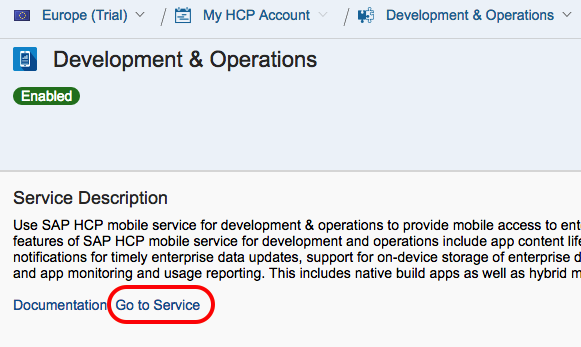
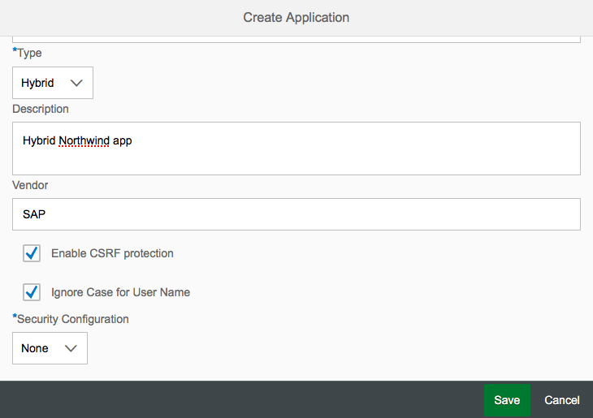
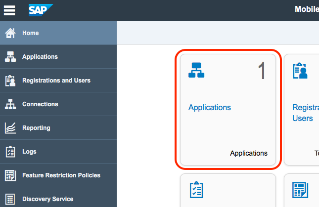

## Prerequisites  
 - **Proficiency:** Intermediate
 - **Tutorials:**
   - [Enable SAP Cloud Platform mobile services for development and operations](http://www.sap.com/developer/tutorials/hcpms-enable-mobile-services.html)
   - You must have completed at least the three tutorials below in the Web IDE series:  
     - [Create a Destination on SAP Cloud Platform](http://www.sap.com/developer/tutorials/hcp-create-destination.html)
     - [Build an app from an SAP Web IDE template](http://www.sap.com/developer/tutorials/hcp-template-mobile-web-app.html)
     - [Deploy your mobile web app to SAP Cloud Platform](http://www.sap.com/developer/tutorials/hcp-deploy-mobile-web-app.html)

## Next Steps
 - [Configure an SAP Web IDE project for hybrid builds](http://www.sap.com/developer/tutorials/hcpms-webide-hybrid-config.html)

## Details
### You will learn  
In this tutorial, you will learn how to create (or define) an app in SAP Cloud Platform mobile services for development and operations. This process is very similar to to the creation of a Destination in SAP Cloud Platform, and allows your Development & Operations instance know how to handle incoming application requests (registration, authentication and data).

### Time to Complete
**5 Min**.

---

1. Go to your [SAP Cloud Platform Cockpit](https://account.hanatrial.ondemand.com) and log on.

2. From the SAP Cloud Platform Cockpit page, click **Services** in the navigation bar, scroll down until you see the Mobile Services group then click on the **Development & Operations** tile.

    

3. Click on the **Go to Service** link to launch the Development & Operations Cockpit application.

    

4. The Development & Operations Cockpit will be displayed, click on the **Applications** tile.

    

5. Click on the **Create Application** icon to add a new application definition.

    

6. Edit the fields as shown below (make sure you scroll down in the **Create Application** dialog box to fill in all fields) and click **Save**.

    Field Name                | Value
    :------------------------ | :-------------
    Application ID            | `com.northwind.hybrid`
    Version                   | `1.0` (default)
    Name                      | `Northwind`
    Type                      | `Hybrid` (from drop-down)
    Description               | `Hybrid Northwind app`
    Vendor                    | `SAP`
    Enable CSRF protection    | (leave unchecked)
    Ignore Case for User Name | (leave unchecked)
    Security Configuration    | `None` (from drop-down)

    

7. When the page updates, click on the **BACK END** tab.

    

8. Fill in the connection information as shown below, click **Save** and after your edits are saved, click the **back** arrow to return to the list of applications.

    The Backend URL will point to an external OData service, and will be proxied through Development and Operations. You can copy and paste the information below.

    Field Name                | Value
    :------------------------ | :-------------
    Backend URL         | `http://services.odata.org/V2/Northwind/Northwind.svc`
    Proxy Type          | `Internet` (from drop-down) 
    Authentication Type | `No Authentication` (from drop-down)
    Maximum Connections | `100`
    Rewrite mode        | `Rewrite URL on HCPms` (from drop-down)
    Relative Paths      | (leave blank)

    

9. You have successfully created the application in Development & Operations. Click on the Home icon (in the upper left corner of window) to return to the Development & Operations Cockpit. Note that the application and connection numbers have incremented.

    

## Next Steps
 - [Configure an SAP Web IDE project for hybrid builds](http://www.sap.com/developer/tutorials/hcpms-webide-hybrid-config.html)
