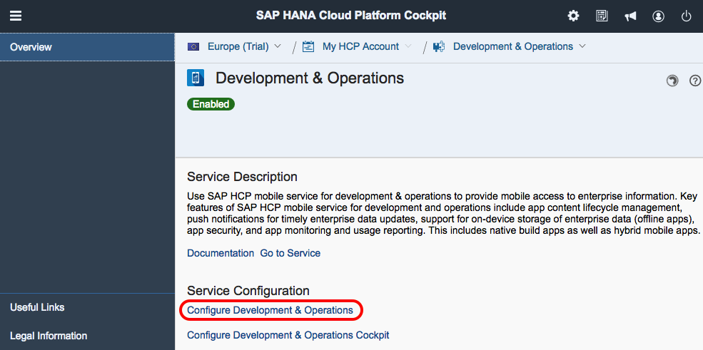
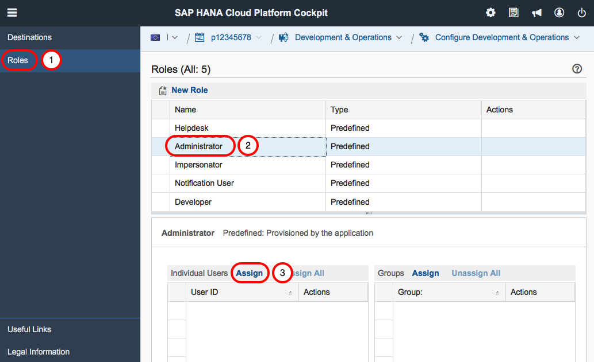
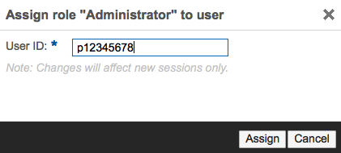
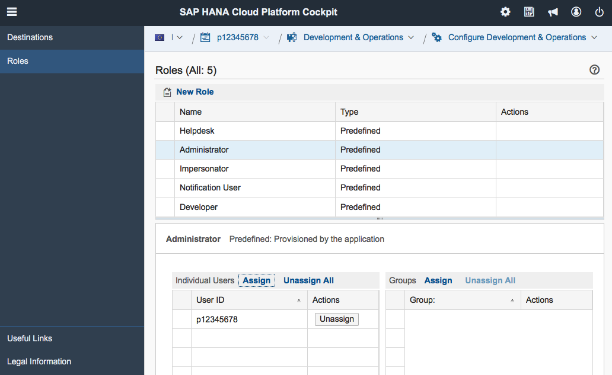
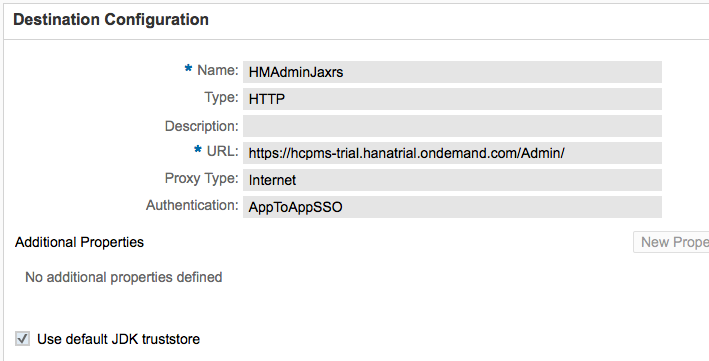
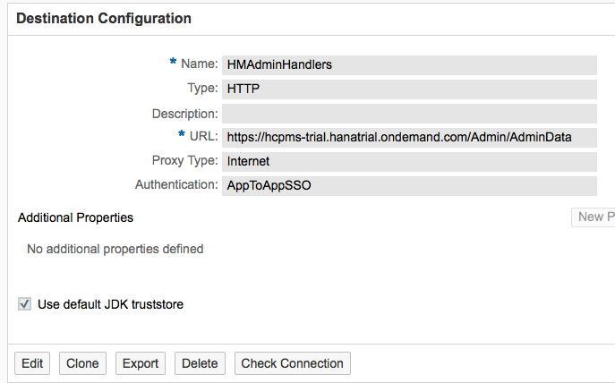

## Prerequisites  
 - **Proficiency:** Intermediate

## Next Steps
 - [Create an app in SAP HANA Cloud Platform mobile services](http://www.sap.com/developer/tutorials/hcpms-create-hybrid-app.html)

## Details
### You will learn  
In this tutorial, you will enable and configure SAP HANA Cloud Platform mobile services for development and operations in your trial account.  Once configured, you can use mobile services to run hybrid and native apps on SAP HANA Cloud Platform

### Time to Complete
**5 Min**.

---

1. Go to your [HCP Cockpit](https://account.hanatrial.ondemand.com) and log on.

2. From the SAP HANA Cloud Platform Cockpit page, click **Services** in the navigation bar, scroll down until you see the Mobile Services group then click on the **Development & Operations** tile.

    

3. If Development & Operations is not enabled, click on the blue **Enable** button and wait a few seconds until the green **Enabled** badge appears. Return to the cockpit by clicking on your User ID "breadcrumb" link near the top left of the browser window.

    

4. You will need to add an `Admin` role to Development & Operations. To do so, click on the **Configure Development & Operations** link.

    

5. Click on the **Roles** tab, select **Administrator** under **New Role** then click on **Assign** next to **Individual Users**.

    

6. Enter your User ID (e.g. `p12345678`) then click **Assign**. Notice that the dialog box shows the role name you are assigning.

    

7. Your Roles page should look similar to this now:

    

9. The next step is to create two HCP Destinations. To display the navigation bar, click on your **User ID** link again (near the top left of the window), click on the **Destinations** tab, then click on **New Destination**.

10. For the first Destination, complete the form with the info below, and click Save.

    Field Name                | Value
    :------------------------ | :-------------
    Name                      | `HMAdminJaxrs`
    Type                      | `HTTP`
    Description               |`<you can leave this blank>`
    URL                       | `https://hcpms-trial.hanatrial.ondemand.com/Admin/`
    Proxy Type                | `Internet`
    Authentication            | `AppToAppSSO`

    Make sure the “Use default JDK truststore is checked.

    

11. For the second Destination, complete the form with the info below, and click Save.

    Field Name                | Value
    :------------------------ | :-------------
    Name                      | `HMAdminHandlers`
    Type                      | `HTTP`
    Description               |`<you can leave this blank>`
    URL                       | `https://hcpms-trial.hanatrial.ondemand.com/Admin/AdminData`
    Proxy Type                | `Internet`
    Authentication            | `AppToAppSSO`

    Make sure the “Use default JDK truststore is checked.

    

## Next Steps
 - [Create an app in SAP HANA Cloud Platform mobile services](http://www.sap.com/developer/tutorials/hcpms-create-hybrid-app.html)
