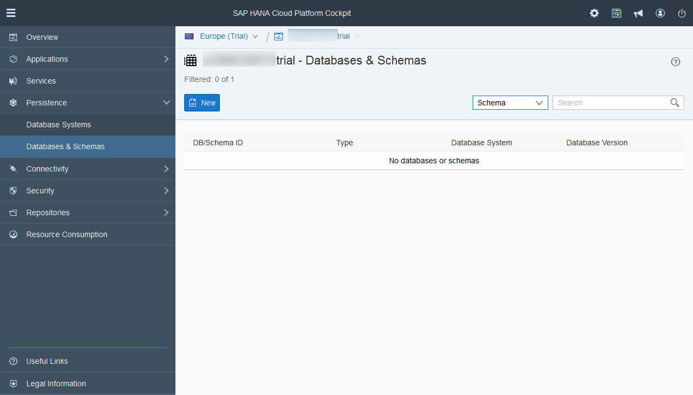
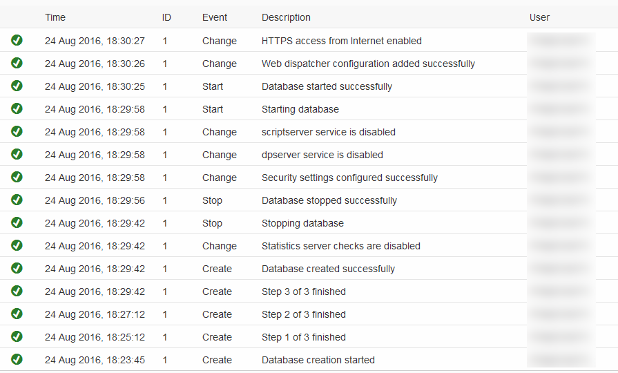
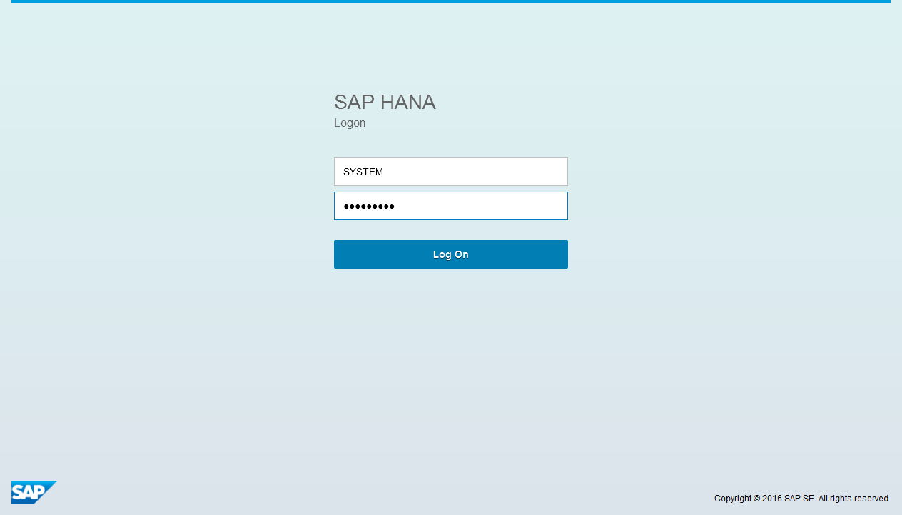
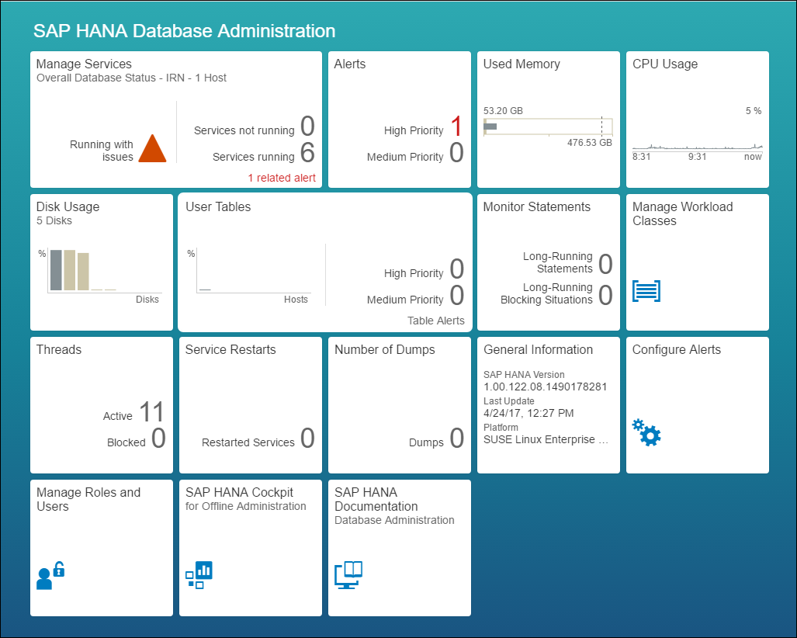

## Prerequisites
  - **Proficiency:** Beginner
  - [Sign up for an free trial account on SAP HANA Cloud Platform](http://go.sap.com/developer/tutorials/hcp-create-trial-account.html)

## Next Steps
  - [Setup a HANA user account for the HCP predictive services](http://go.sap.com/developer/tutorials/hcpps-hana-create-user.html)

## Details
### You will learn
  - How to setup a SAP HANA instance on SAP HANA Cloud Platform

### Time to Complete
  **10 minutes**

---

1. Log into the [***SAP HANA Cloud Platform Cockpit***](http://account.hanatrial.ondemand.com/cockpit) with your free trial account and access "Your Personal Developer Account".

    Click on your ***HCP Account*** identifier (which ends with *trial*) as highlighted on the below screenshot.

    

1. On the left side bar, you can navigate in **Persistence** > **Databases & Schemas**.

    

1. On the ***Databases & Schemas*** overview page, click on **New**

    

1. Select **HANA MDC (< trial >)** as the **Database System**, then complete the form following details information:

    Field Name           | Value
    -------------------- | --------------
    Database ID          | `trial`
    System User Password | `Welcome16`

    You can choose other values for theses properties. We will make reference to the *System User Password* as the ***HANA System Account Password***.

    Click on **Save**

    

    It will take about 5 to 10 minutes for the creation process to complete.

1. You can move the next step once the *Database started successfully* event appears in the list.

    

1. Once the HANA MDC instance is created, you will need to connect with the *HANA System User* in order to complete the system account setup and add all the necessary roles.

    Click on **SAP HANA Cockpit**.

    

1. You will get prompted to login.

    Enter `SYSTEM` as user name and the ***HANA System Account*** password provided during the instance creation as password.

    Click on **Log On**.

    

1. You will receive an information message stating that your ***HANA System Account*** is not authorized to access the ***SAP HANA Cockpit***, but next you will be granted the necessary roles.

    Click on **OK**.

    

    Then click on **Continue**

    

1. Next you will gain access to the ***SAP HANA Cockpit***.

    

## Next Steps
  - [Setup a HANA user account for the HCP predictive services](http://go.sap.com/developer/tutorials/hcpps-hana-create-user.html)

