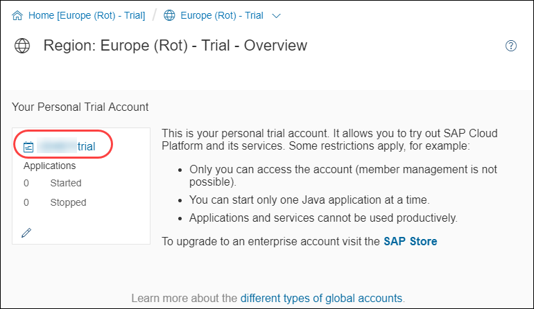
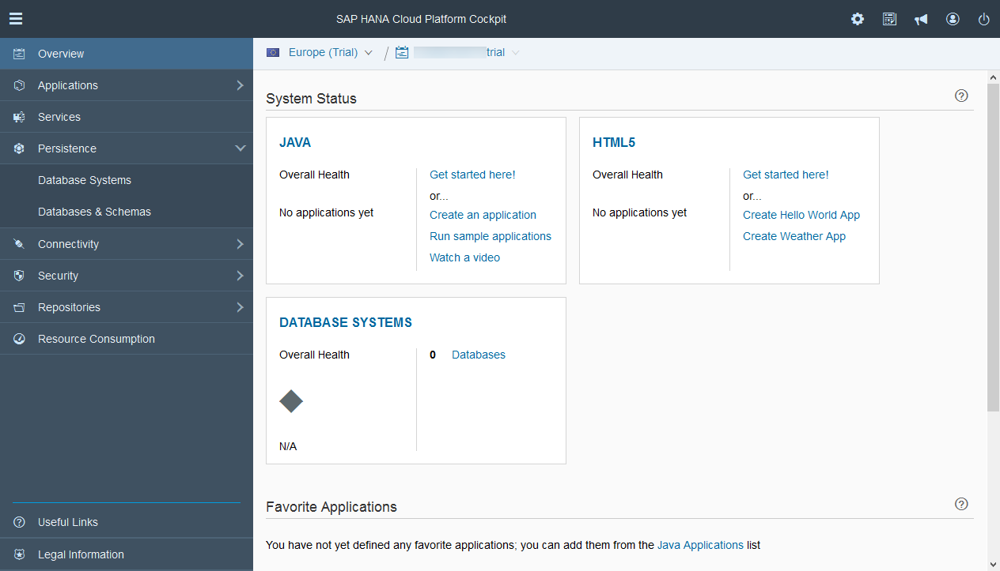
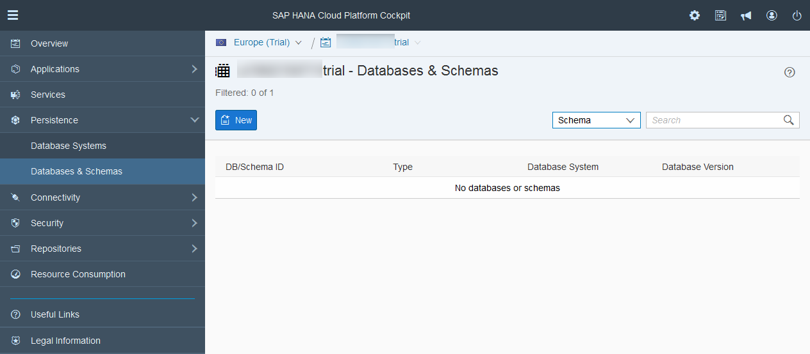
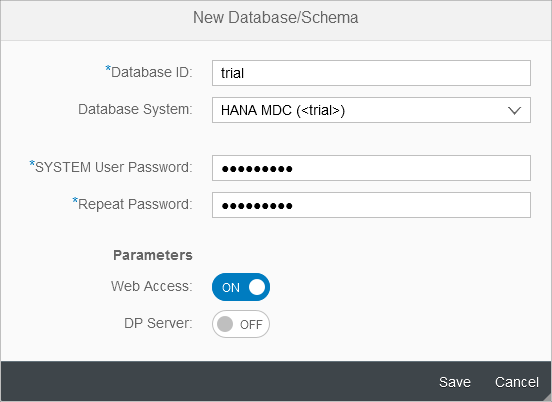
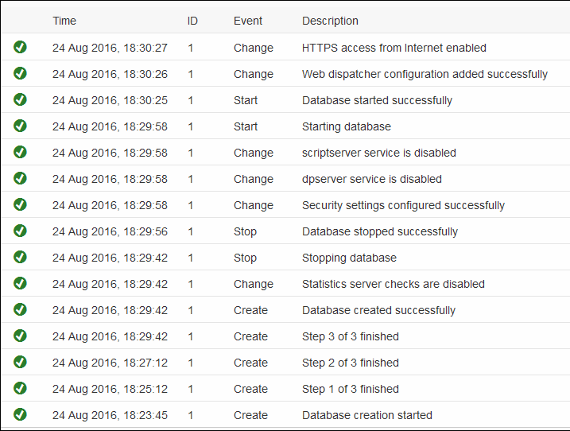
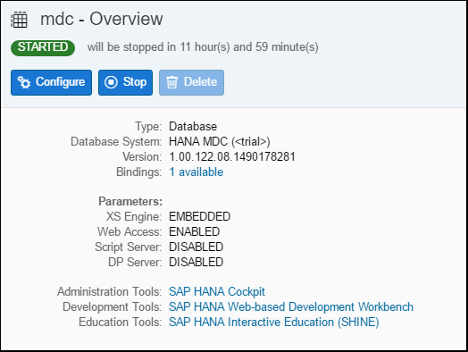
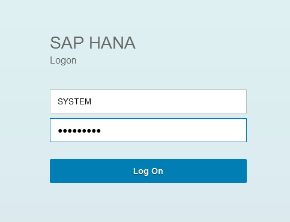
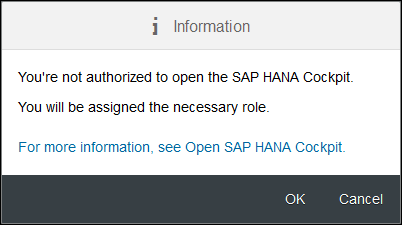

## Prerequisites
  - **Proficiency:** Beginner
  - **Tutorials:** [Sign up for an free trial account on SAP Cloud Platform](https://www.sap.com/developer/tutorials/hcp-create-trial-account.html)

## Next Steps
  - [Enable, deploy and configure the SAP Predictive services](https://www.sap.com/developer/tutorials/hcpps-ps-configure.html)

## Details
### You will learn
  - How to setup a SAP HANA MDC (Multi-Database Container) instance on the SAP Cloud Platform. This instance will be used to store the datasets to be used with the predictive services.

### Time to Complete
  **10 minutes**

[ACCORDION-BEGIN [Step 1: ](Access your SAP Cloud Platform account)]
Log into the [***SAP Cloud Platform Cockpit Neo Trial***](https://account.hanatrial.ondemand.com/cockpit#/region/neo-eu1-trial/overview) with your free trial account on **Europe (Rot) - Trial** and access ***Your Personal Developer Account***.

Click on the ***SAP Cloud Platform developer Account*** link as highlighted on the below screenshot. By default, it ends with *trial* in fact is your account display name and can be changed using the pen icon)

[DONE]
[ACCORDION-END]

[ACCORDION-BEGIN [Step 2: ](Create your HANA MDC instance)]

On the left side bar, you can navigate in **SAP HANA / SAP ASE** > **Databases & Schemas**.

Click on **New**.

Complete the form following details information:

Field Name           | Value
:------------------- | :--------------
Database ID          | `mdc`
Database System      | HANA MDC (< trial >)
System User Password | `Welcome18Welcome18`

>Note: Password policy was changed recently and now requires a 15 characters password that includes a digit.

You can choose other values for theses properties. As reference them across several tutorials, you should remember the **System User Password** as your ***HANA System Account Password***.

Click on **Save**

[DONE]
[ACCORDION-END]

[ACCORDION-BEGIN [Step 3: ](Wait for the creation to finish)]
It will take about 5 to 10 minutes for the creation process to complete. So, now is a good time to get a coffee refill!

You can refresh the page by hitting F5.

Once you see the ***Database started successfully*** event appears in the list, you can proceed with the next step.

[DONE]
[ACCORDION-END]

[ACCORDION-BEGIN [Step 4: ](Restart the database)]
Now that you have our HANA MDC instance, you will simply need to restart it to clear some cache and free up some resources.

Click on **Stop**.

Once the database is stopped, Click on **Start**.

> ### **Note**:
>**If you don't see your HANA MDC stopping right away in the Events log, it is probably because the initial backup is still pending.**
>
>The initial backup may take up to an hour to execute, and your HANA MDC will not restart until it is completed.
>
>Therefore you can proceed with the next steps. However, at some point, the backup will complete, and your instance will be shutdown, therefore you will need to start it.

[DONE]
[ACCORDION-END]

[ACCORDION-BEGIN [Step 5: ](Finalize your SYSTEM user setup)]

Now, you will need to connect to the ***SAP HANA Cockpit*** at least once using the *HANA System User* in order to finalize the system account setup and add all the necessary roles.

Click on **SAP HANA Cockpit**.

You will be prompted to login.

Enter `SYSTEM` as user name and the ***HANA System Account*** password that was provided during the instance creation as password (`Welcome18Welcome18`).

Click on **Log On**.

You will receive an information message stating that your ***HANA System Account*** is not authorized to access the ***SAP HANA Cockpit***, but next you will be granted the necessary roles.

Click on **OK**.

Before clicking on **Continue**, provide an answer to the question below then click on **Validate**.

[VALIDATE_1]
[ACCORDION-END]

## Next Steps
  - [Setup a HANA user account](https://www.sap.com/developer/tutorials/hcpps-hana-create-user.html)
