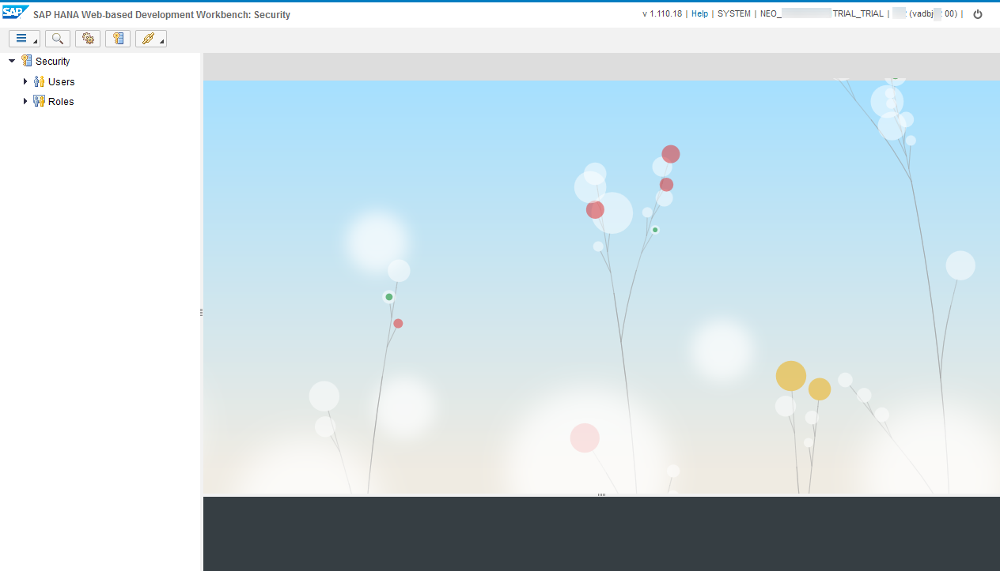
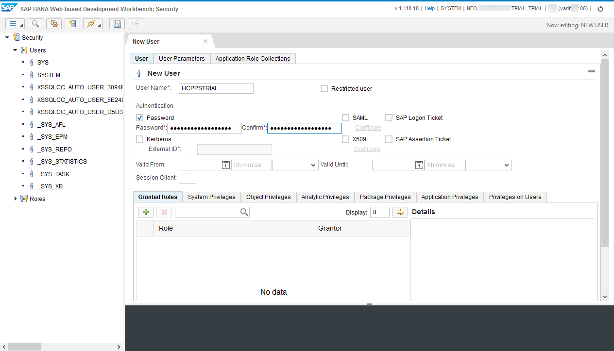
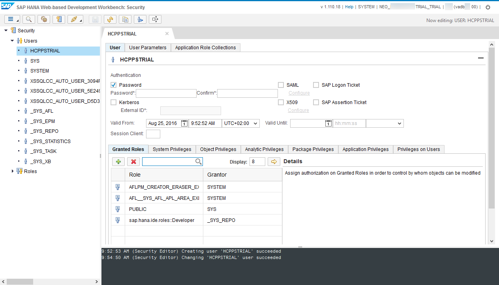
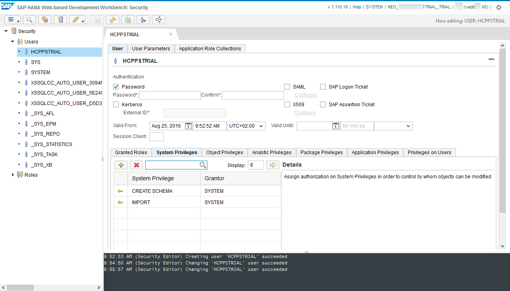
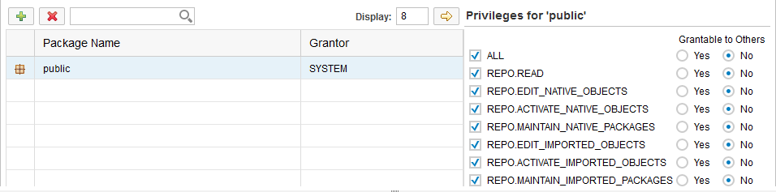
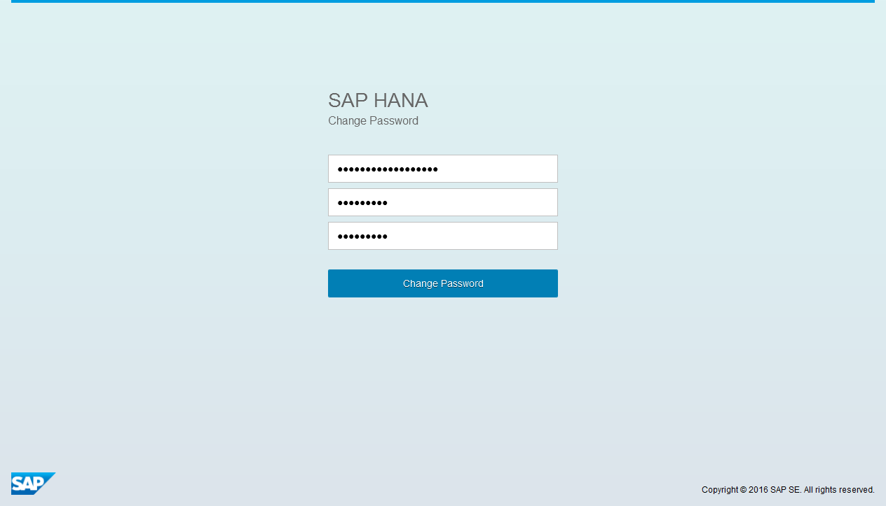
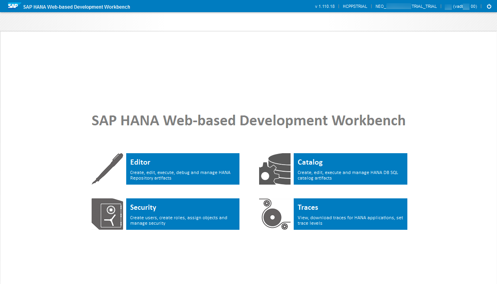

## Prerequisites
  - **Proficiency:** Beginner
  - **Tutorials:** [Create a new HANA MDC instance](http://go.sap.com/developer/tutorials/hcpps-hana-create-mdc-instance.html)

## Next Steps
  - [Import a predictive demo dataset in your SAP HANA  instance](http://go.sap.com/developer/tutorials/hcpps-hana-dataset-import.html)

## Details
### You will learn
  - How to create a new user account on your HANA MDC instance using the ***SAP HANA Cockpit***
  - What are the roles and privileges required to use the SAP HCP predictive services

### Time to Complete
  **5 minutes**

### Why create new user account?
Each Trial HANA MDC instance comes with a ***HANA System Account***. This user account shall be used only to execute "System" related activities.
In the "real world", it is uncommon to use this user account to develop an "end-user" application.

---

1. From the ***SAP HANA Cockpit*** and connected with the ***HANA System Account***, click on **Manage Roles and Users**. This will open the ***SAP HANA Web-based Development Workbench***.

    

1. Using the top menu  icon, go to **New** > **User**. Alternatively, you can "right-click" on **Users** then click on **New User**.

    

1. Complete the form following properties:

    Field Name | Value
    ---------- | --------------
    User Name  | `HCPPSTRIAL`
    Password   | `TemporaryPassword1`

    The values listed above are provided as example, you can choose other values for theses properties.

    We will use a temporary password here, as HANA will require this one to be changed on the first connection.

    HANA enforces a password policy which requires at least an upper case character and a digit.

    Click on the  button in the top menu bar

    

1. In order to user the SAP HCP predictive, we will need to grant the following roles to the created user account:
    - `AFLPM_CREATOR_ERASER_EXECUTE`
    - `AFL__SYS_AFL_APL_AREA_EXECUTE`
    - `sap.hana.ide.roles::Developer`

    Select the **Granted Roles** tab, then click on the  icon, then add the roles listed above.

    Click on the  button in the top menu bar

    

1. This user account will also be used to import data and create a schema, we will need to grant the following system privileges to the created user account:
    - `CREATE SCHEMA`

    Select the **System Privileges** tab, then click on the  icon, then add the privileges listed above.

    Click on the  button in the top menu bar

    

1. And last but not least, in order to build our HTML5 application we will need to create a package.

    There are multiple options here. You can either use the `public` package or create a new package. We will use the `public` package during this tutorial.

    Select the **Package Privileges** tab, then click on the  icon, then add the `public` package.

    Check **ALL** to assign all ***Package Privileges***.

    

    Click on the  button in the top menu bar

1. Click on the  **Logout** icon located in the top right corner of the screen.

1. Now, switch back to the ***SAP HANA Cloud Platform Cockpit***.

    Click on **SAP HANA Web-based Development Workbench**

    

1. Now, you need to connect with your new user account.

    Enter the ***HANA User Account*** user name and password, click on **Logon**.

    You will be prompted to change your password with a new one.

    Click on **Change Password**

    

1. Your ***HANA User Account*** is now configured.

    

## Next Steps
  - [Import a predictive demo dataset in your SAP HANA  instance](http://go.sap.com/developer/tutorials/hcpps-hana-dataset-import.html)

