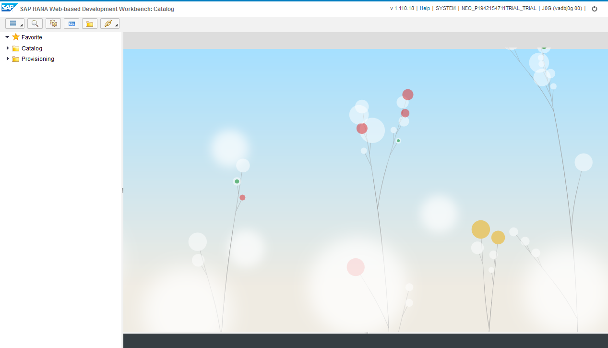
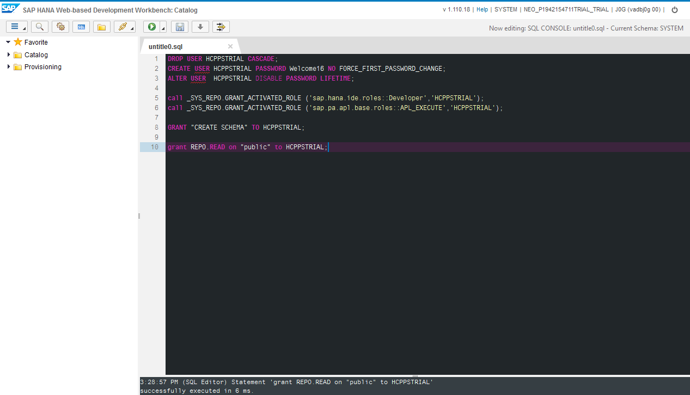
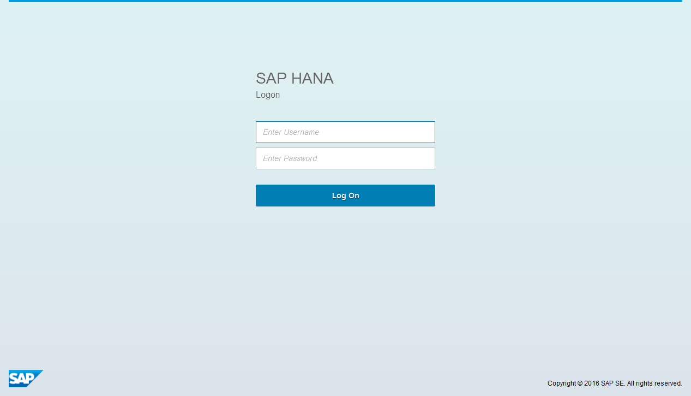

## Prerequisites
  - **Proficiency:** Beginner
  - **Tutorials:** [Create a new HANA MDC instance](http://www.sap.com/developer/tutorials/hcpps-hana-create-mdc-instance.html)

## Next Steps
  - [Import a predictive demo dataset in your SAP HANA  instance](http://www.sap.com/developer/tutorials/hcpps-hana-dataset-import.html)

## Details
### You will learn
  - How to create a new user account on your HANA MDC instance using the ***SAP HANA Cockpit***
  - What are the roles and privileges required to use the SAP HCP predictive services

### Time to Complete
  **5 minutes**

### Why create new user account?
Each Trial HANA MDC instance comes with a ***HANA System Account***. This user account shall be used only to execute "System" related activities.
In the "real world", it is uncommon to use this user account to develop an "end-user" application.

---

1. From the ***SAP HANA Cockpit*** and connected with the ***HANA System Account***, click on **Manage Roles and Users**. This will open the ***SAP HANA Web-based Development Workbench***.

    

1. Under **Security**, expand **Users**, then double click on **SYSTEM**.

    

1. In order to allow the **SYSTEM** user to run any SQL statement, you will need to grant him the following role:

    - `sap.hana.ide.roles::Developer`

    Select the **Granted Roles** tab, then click on the  icon, then add the roles listed above.

    Click on the  button in the top menu bar

    

1. Using the  menu bar icon, select **Catalog**.

    The following screen should appear:

    

1. Click on the  button in the top menu bar, and paste the following SQL code:

    ```sql
    DROP USER HCPPSTRIAL CASCADE;
    CREATE USER HCPPSTRIAL PASSWORD Welcome16 NO FORCE_FIRST_PASSWORD_CHANGE;
    ALTER USER  HCPPSTRIAL DISABLE PASSWORD LIFETIME;

    call _SYS_REPO.GRANT_ACTIVATED_ROLE ('sap.hana.ide.roles::Developer','HCPPSTRIAL');
    call _SYS_REPO.GRANT_ACTIVATED_ROLE ('sap.pa.apl.base.roles::APL_EXECUTE','HCPPSTRIAL');

    GRANT "CREATE SCHEMA" TO HCPPSTRIAL;

    GRANT REPO.READ on "public" TO HCPPSTRIAL;
    GRANT REPO.MAINTAIN_IMPORTED_PACKAGES on "public" TO HCPPSTRIAL;
    GRANT REPO.MAINTAIN_NATIVE_PACKAGES   on "public" TO HCPPSTRIAL;

    GRANT REPO.EDIT_NATIVE_OBJECTS   on "public" TO HCPPSTRIAL;
    GRANT REPO.EDIT_IMPORTED_OBJECTS on "public" TO HCPPSTRIAL;

    GRANT REPO.ACTIVATE_NATIVE_OBJECTS   on "public" TO HCPPSTRIAL;
    GRANT REPO.ACTIVATE_IMPORTED_OBJECTS on "public" TO HCPPSTRIAL;
    ```

    **This script will delete any existing `HCPPSTRIAL` user including its related object and tables.**

    Click on the  **Run** button or press **F8**.

    

1. Click on the  **Logout** icon located in the top right corner of the screen.

    

1. Now, you need to connect with your **`HCPPSTRIAL`** ***HANA User Account***.

    Enter **`HCPPSTRIAL`** as ***Username*** user name and **`Welcome16`** as ***Password***, click on **Logon**.

1. Your ***HANA User Account*** is now configured.

    

## Next Steps
  - [Import a predictive demo dataset in your SAP HANA  instance](http://www.sap.com/developer/tutorials/hcpps-hana-dataset-import.html)
