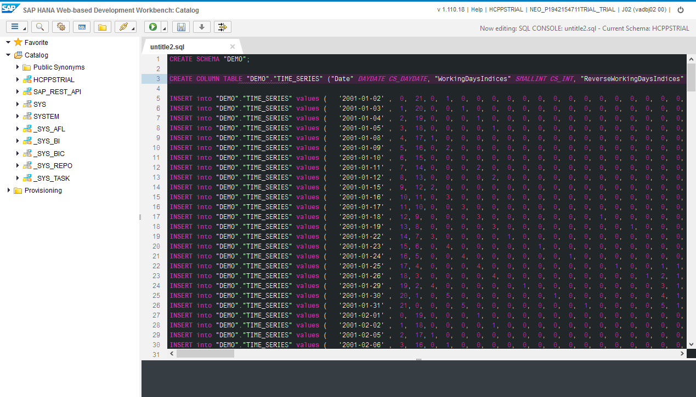
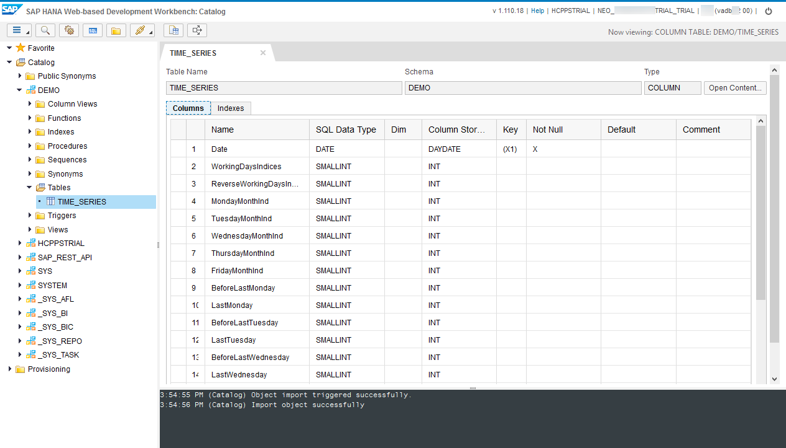

## Prerequisites
  - **Proficiency:** Beginner
  - **Tutorials:** [Setup a HANA user account for the HCP predictive services](http://go.sap.com/developer/tutorials/hcpps-hana-create-user.html)

## Next Steps
  - [Expose your predictive demo dataset as an OData service](http://go.sap.com/developer/tutorials/hcpps-hana-dataset-odata.html)

## Details
### You will learn
  - How to use the ***Import*** feature from the ***SAP HANA Web-based Development Workbench***

### Time to Complete
It should take around **5 minutes** to complete this tutorial.

---

1. Open the ***SAP HANA Web-based Development Workbench*** on your trial HANA instance connected ***HANA User Account***, click on **Catalog**.

    

1. Click on the **Open SQL Console**  icon or press CTRL+ALT+C.

    

1. Download the following SQL file locally [`create table and data SQL file`](demo.timeseries.sql.txt). It contains the SQL statement to create the required table and data set we will be using later on.

1. Copy and paste the content of the file in the SQL console.

    Click on the **Run**  button or press F8

    

1. Right click on **Catalog**, then click on **Refresh**. A `DEMO` schema was created with a `TIME_SERIES` table.

    

## Next Steps
  - [Expose your predictive demo dataset as an OData service](http://go.sap.com/developer/tutorials/hcpps-hana-dataset-odata.html)
