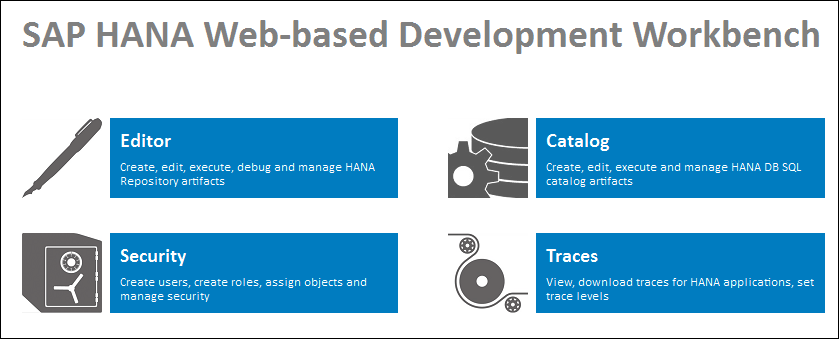
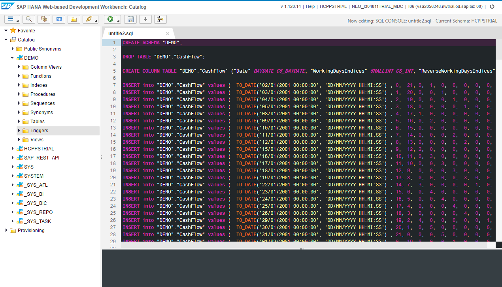
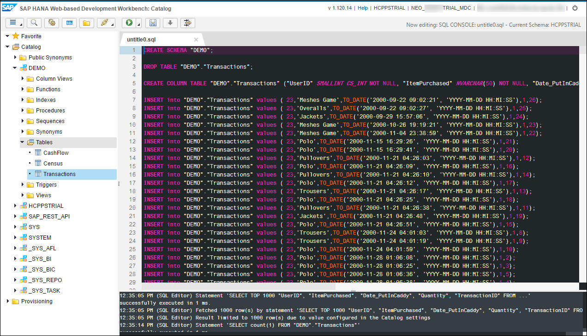

## Prerequisites
  - **Proficiency:** Beginner
  - **Tutorials:** [Setup a HANA user account](http://www.sap.com/developer/tutorials/hcpps-hana-create-user.html)

## Next Steps
  - [Expose your predictive demo datasets as HANA XS OData services](http://www.sap.com/developer/tutorials/hcpps-hana-dataset-odata.html)

## Details
### You will learn
  - How to import the scenarios datasets in your SAP Cloud Platform HANA MDC instance.

### Time to Complete
  **5 minutes**

[ACCORDION-BEGIN [Step 1: ](Download the dataset files locally)]

During this tutorial series, you will be able to address multiple services using different datasets.

We could have used the HANA Studio import feature, but this would assume that you have it installed.  

Due to restrictions related to the resources format and size that can be made available on the tutorial platform, it was required to split some of the dataset into several chunks.  

This is why we choose to have the dataset as "insert" statement files.

Depending on your area of interest you can pick those of interest and download the files locally.

  - **Cash Flow**: contains historical cash flow data and date related indicators
    - [`link`](https://raw.githubusercontent.com/SAPDocuments/Tutorials/master/tutorials/hcpps-hana-dataset-import/demo.cashflow.sql.txt)
  - **Census**: contains 14 characteristics of an individual extracted from a census dataset associated to an indicator equal to 1 when the individual earned more than fifty thousand dollars the previous year, else 0 (excerpt from the American Census Bureau database, completed in 1994 by Barry Becker, source: http://www.census.gov/)
    - [`link 1`](https://raw.githubusercontent.com/SAPDocuments/Tutorials/master/tutorials/hcpps-hana-dataset-import/demo.census.sql.1.txt)
    - [`link 2`](https://raw.githubusercontent.com/SAPDocuments/Tutorials/master/tutorials/hcpps-hana-dataset-import/demo.census.sql.2.txt)
    - [`link 3`](https://raw.githubusercontent.com/SAPDocuments/Tutorials/master/tutorials/hcpps-hana-dataset-import/demo.census.sql.3.txt)
    - [`link 4`](https://raw.githubusercontent.com/SAPDocuments/Tutorials/master/tutorials/hcpps-hana-dataset-import/demo.census.sql.4.txt)
    - [`link 5`](https://raw.githubusercontent.com/SAPDocuments/Tutorials/master/tutorials/hcpps-hana-dataset-import/demo.census.sql.5.txt)
  - **E-Commerce**: contains a single day of Web traffic from an E-commerce site in December 1999.
    - [`link`](https://raw.githubusercontent.com/SAPDocuments/Tutorials/master/tutorials/hcpps-hana-dataset-import/demo.transaction.sql.txt).

[DONE]
[ACCORDION-END]

[ACCORDION-BEGIN [Step 2: ](Open a SQL Console)]
Open the ***SAP HANA Web-based Development Workbench*** on your trial HANA instance connected as **`HCPPSTRIAL`**, click on **Catalog**.

Click on the **Open SQL Console**  icon or press CTRL+ALT+C.

[DONE]
[ACCORDION-END]

[ACCORDION-BEGIN [Step 3: ](Run the SQL files to import the data)]
Copy and paste the content of the files in the SQL console (and for those using chunks, please make sure you respect the name order/sequence).

You can alternatively open the file using the  icon in the menu bar.

Click on the **Run**  button or press F8.

Each files may take a few seconds to process (up to a minute each sometime I noticed), so if Google Chrome tells you that your page is "unresponsive", just ask him to wait.

Right click on **Catalog**, then click on **Refresh**. A `DEMO` schema was created with the relevant tables.

[DONE]
[ACCORDION-END]

## Next Steps
  - [Expose your predictive demo datasets as HANA XS OData services](http://www.sap.com/developer/tutorials/hcpps-hana-dataset-odata.html)
